# Astroid

*Curves · pages 1–3 of the book · 4 figures.* [Back to the index](README.md)

**History.** The cycloidal curves, the astroid among them, were found by Roemer in 1674 while he looked for the best shape for gear teeth. Daniel Bernoulli noticed the double generation in 1725.

The astroid is a hypocycloid of four cusps: the path of a point $P$ on a circle that rolls inside a fixed circle of four times its radius (Fig. 1a). It is also traced by a point on a circle of radius $\tfrac{3a}{4}$ rolling inside the fixed circle of radius $a$ (Fig. 1b, the *double generation*; see [Epi- and Hypo-Cycloids](epi-hypo-cycloids.md)).

## Figures

### Fig. 1(a) — The astroid as a hypocycloid of four cusps {#fig-001a}

*Page 1 of the book.*

The construction:

1. **Given** — The fixed circle of radius a with centre O, and the axes OX, OY.
2. **Compass** — Draw the rolling circle: radius a/4, centre on the circle of radius 3a/4 (here at the angle t), so that it touches the fixed circle at T.
3. **Rolling** — P is the point of the rolling circle that started at the cusp (a, 0): the arc TP of the small circle equals the arc of the big circle from (a, 0) to T.
4. **Straightedge** — The tangent at P: through P and the point of the rolling circle opposite T (T is the instantaneous centre, so TP is the normal). It meets OX below T at the angle π − t.
5. **Pencil** — The astroid: the whole path of P, with its four cusps on the axes.

### Fig. 1(b) — Double generation of the astroid: a circle of radius 3a/4 {#fig-001b}

*Page 1 of the book.*

The construction:

1. **Given** — The fixed circle of radius a with centre O, and the axes.
2. **Compass** — Draw the rolling circle of radius 3a/4: its centre is a/4 from O, in the direction t, and it touches the fixed circle at T.
3. **Rolling** — The tracing point P: the angle TCP at the centre of the rolling circle is 4t/3 (its arc from T equals the arc of the fixed circle from (a, 0) to T).
4. **Pencil** — The same astroid as in Fig. 1(a).

### Fig. 2(a) — The astroid as the envelope of a sliding rod {#fig-002a}

*Page 2 of the book.* The book draws the rod in about a dozen positions per quadrant, equally spaced in the angle θ; the axes run a little past the cusps.

The construction:

1. **Given** — The two perpendicular axes through O, and the length a of the rod.
2. **Compass** — Mark a point A on OX. With the compass opened to a and the needle at A, cut the other axis OY at B: the segment AB has the length a.
3. **Straightedge** — Draw AB: the rod in its first position. It will touch the astroid at one point.
4. **Straightedge** — Slide the rod: repeat with other points A, about a dozen in each quadrant (equal steps of the angle OAB make them evenly spread), and do the same in the other three quadrants. Every line is a segment of length a with one end on each axis.
5. **Pencil** — The astroid: the curve that touches every position of the rod. Its four cusps lie on the axes at distance a from O.

### Fig. 2(b) — The astroid as the envelope of ellipses of constant axis sum {#fig-002b}

*Page 2 of the book.* Five ellipses, p = 0.3a, 0.4a, 0.5a, 0.6a, 0.7a: the first two are the others turned through 90°.

The construction:

1. **Given** — The axes through O, and the constant a, the sum of the two semi-axes of every ellipse.
2. **Ruler** — For each ellipse choose a semi-axis p on OX and take q = a − p on OY (p + q = a). Mark the four vertices ±p on OX and ±q on OY.
3. **Pencil** — Through the four vertices of each pair draw the ellipse with its axes on OX and OY. Their sizes change by steps, from long and flat to tall and narrow.
4. **Pencil** — The astroid touches every ellipse of the family: it is their envelope.

## Equations

- $x^{2/3} + y^{2/3} = a^{2/3}$ — rectangular
- $x = a\cos^3 t = \tfrac{a}{4}(3\cos t + \cos 3t), \qquad y = a\sin^3 t = \tfrac{a}{4}(3\sin t - \sin 3t)$ — parametric
- $r^2 = a^2 - 3p^2$ — pedal equation
- $s = \tfrac{3a}{4}\cos 2\varphi$ — Whewell intrinsic equation
- $R^2 + 4s^2 = \tfrac{9a^2}{4}$ — Cesàro intrinsic equation

## Metrical properties

- $L = 6a$ — length
- $A = \tfrac{3}{8}\pi a^2$ — area
- $V_x = \tfrac{32}{105}\pi a^3$ — volume of revolution about OX
- $\Sigma_x = \tfrac{12}{5}\pi a^2$ — surface of revolution about OX
- $\varphi = \pi - t$ — inclination of the tangent
- $R = \tfrac{3a}{2}\sin 2t = 3\sqrt[3]{axy}$ — radius of curvature

## General items

- **(a)** Its evolute is another astroid, twice as large and turned through 45° (see [Evolutes](evolutes.md), Fig. 83).
- **(b)** It is the envelope of a family of ellipses whose semi-axes have a constant sum (Fig. 2b).
- **(c)** The piece of any tangent cut off between the cusp tangents (the axes) has the constant length $a$. So the astroid is the envelope of a trammel of Archimedes: a rod of fixed length sliding with its ends on two perpendicular lines (Fig. 2a; see [Glissettes](glissettes.md)).
- **(d)** Its orthoptic with respect to its centre is the curve $r^2 = \tfrac{a^2}{2}\cos^2 2\theta$ (see [Isoptic Curves](isoptic.md)).
- **(e)** Tangent construction (Fig. 1a): through $P$ draw the circle whose centre lies on the circle of radius $\tfrac{3a}{4}$ and which touches the fixed circle, say at $T$. $T$ is the instantaneous centre of rotation of $P$, so $TP$ is the normal at $P$ and the tangent is the line through $P$ and the point of the rolling circle opposite $T$.

## To practise

- [The astroid by a rolling circle, with its tangent](#fig-001a) — Fig. 1(a), level 2
- [Double generation](#fig-001b) — Fig. 1(b), level 2
- [The astroid as the envelope of a sliding rod](#fig-002a) — Fig. 2(a), level 1
- [The astroid as the envelope of ellipses](#fig-002b) — Fig. 2(b), level 2

## Bibliography

- Edwards, J.: Calculus, Macmillan (1892) 337.
- Salmon, G.: Higher Plane Curves, Dublin (1879) 278.
- Wieleitner, H.: Spezielle ebene Kurven, Leipzig (1908).
- Williamson, B.: Differential Calculus, Longmans, Green (1895) 339.

## See also

[Epi- and Hypo-Cycloids](epi-hypo-cycloids.md) · [Evolutes](evolutes.md) · [Glissettes](glissettes.md) · [Envelopes](envelopes.md)
