# Cardioid

*Curves · pages 4–7 of the book · 4 figures.* [Back to the index](README.md)

**History.** The cardioid belongs to the family of cycloidal curves that Roemer studied in 1674 while looking for the best profile for gear teeth.

The cardioid is an epicycloid with a single cusp: the path of a point $P$ on a circle that rolls on the outside of a fixed circle of the same size (Fig. 3a; see [Epi- and Hypo-Cycloids](epi-hypo-cycloids.md)). It has a second description, the *double generation*: the same curve is traced by a point of a circle of radius $2a$ that rolls round the fixed circle of radius $a$ and encloses it (Fig. 3b). The proof uses the line $OT'F$ through the contact point $T'$ and the line $FP$, which meets the line through the centre at $D$: the circle through $T$, $P$, $D$ has $DT$ as diameter (the angle $DPT$ is a right angle), $PD$ is parallel to $T'E$, and by similar triangles $DE = 2a$. Because the arcs $TT'$, $T'P$ and $T'X$ are equal, the arc $TP$ is twice the arc $TT'$, and a point of either circle describes the same curve.

## Figures

### Fig. 3(a) — The cardioid as an epicycloid of one cusp {#fig-003a}

*Page 4 of the book.* The book draws one position of the rolling circle (t ≈ 63°) and leaves out the stretch of the curve that lies inside it.

The construction:

1. **Given** — The fixed circle of radius a about O, with the axes OX and OY. The radius a is marked on OX.
2. **Protractor** — Draw the line OQ at the angle t to OX (here t ≈ 63°).
3. **Dividers** — Step off a three times along OQ: T on the fixed circle, C (the centre of the rolling circle) and Q, the point of the rolling circle opposite T.
4. **Compass** — The rolling circle: centre C, radius a, equal to the fixed circle. It touches the fixed circle at T.
5. **Protractor** — The tracing point P is the point that touched the fixed circle at (a, 0). Rolling without slipping makes the arc TP of the small circle equal to the arc of the fixed circle from (a, 0) to T, and the radii are equal, so the angle OCP is also t.
6. **Straightedge** — The tangent at P: T is the instantaneous centre of rotation, so TP is the normal, and QP (the angle TPQ is inscribed in a half circle, hence a right angle) is the tangent. Extend QP down to OX; it meets it at φ = 3t/2. The angle at Q is t/2.
7. **Pencil** — The cardioid: the path of P, with its cusp at (a, 0), reaching x = −3a on the far side. The stretch inside the rolling circle is left blank, as in the book.

### Fig. 3(b) — Double generation of the cardioid: a circle of radius 2a {#fig-003b}

*Page 4 of the book.* The book prints arc TT' = aθ; the construction makes the angle TOT' equal to 2θ. The curve is left out inside the two rolling circles.

The construction:

1. **Given** — The fixed circle of radius a about O, with its vertical diameter ET (E at the top, T at the bottom).
2. **Dividers** — Draw the ray from O through T' on the fixed circle and step off a three times along it: T' (on the fixed circle), C (the centre of the rolling circle) and F, the point of the rolling circle opposite T'.
3. **Compass** — The rolling circle of radius a about C. It touches the fixed circle at T'.
4. **Rolling** — The tracing point P: the arc T'P of the small circle equals the arc of the fixed circle from the cusp to T'. Here P comes out straight above C.
5. **Straightedge** — Draw ET' and the line FP; extended it meets the line ET at D, with DE = 2a. (Also PT' extended passes through T.) PD is parallel to T'E.
6. **Compass** — The circle through T, P and D. The angle DPT is a right angle, so DT is its diameter: its centre is E and its radius is 2a. This circle, rolling round the fixed one, generates the same cardioid.
7. **Note** — The equal angles: the isosceles triangle OET' has equal base angles at E and T'; PD ∥ T'E makes the angle at F equal to them, and the angle θ at D is half the angle TEP at the centre of the larger circle.
8. **Pencil** — The cardioid: the path of P, with its cusp on the fixed circle at the upper left. It passes through P tangent to the line DF.

### Fig. 4 — A cardioid cam moving a pin with simple harmonic motion {#fig-004}

*Page 6 of the book.*

The construction:

1. **Given** — The line along which the pin is held (vertical, through the cusp O of the cam) and the axis of the cam (the direction r = 2a), turned from the pin line by the angle θ.
2. **Pencil** — The cam: the cardioid r = a(1 + cos θ) about its cusp O, drawn as a groove (a band of constant width on both sides of the curve). The cusp is the pole of the polar coordinates and the axis of the cam is the line θ = 0.
3. **Linkage** — The pin: a roller in the groove at the distance r from O on the fixed line, carried by a rod that slides through a fixed block (hatched).
4. **Ruler** — The distance r from the pole O to the centre of the pin is r = a(1 + cos θ).
5. **Note** — The cam turns with constant angular velocity θ̇ = k; the angle between the pin line and the axis of the cam is θ.

### Fig. 5 — The cardioid traced by two crossed parallelograms {#fig-005}

*Page 6 of the book.*

The construction:

1. **Given** — The two fixed pivots A and O on the line OX, AO = a, and the dashed circle of radius a about O: the fixed circle of the cardioid, which will pass through the cusp at (a, 0).
2. **Linkage** — The first crossed parallelogram A, B, D, O: AB = OD = b and AO = BD = a. The bar OD (continued to C) turns about O, the bar AB about A.
3. **Linkage** — The second, similar parallelogram B, P, C, D: BP = DC = c and CP = BD = a, with a² = bc. D, O, C lie on one line, so C is the end of the bar DC that passes through the pivot O.
4. **Note** — The angles: at all times the angle PCO = θ = the angle COX (and the angle PBD = θ). The dashed circle about C of radius a (the rolling circle) touches the fixed circle on the line OC.
5. **Pencil** — The path of P is the cardioid with its cusp at (a, 0). It is drawn from the cusp upward to P, and below the axis (the arrow shows the sense of motion).

## Equations

- $(x^2 + y^2 \mp 2ax)^2 = 4a^2(x^2 + y^2)$ — rectangular, origin at the cusp
- $r = 2a(1 \pm \cos\theta), \qquad r = 2a(1 \pm \sin\theta)$ — polar, origin at the cusp
- $9(r^2 - a^2) = 8p^2$ — pedal equation, origin at the centre of the fixed circle
- $x = a(2\cos t - \cos 2t), \qquad y = a(2\sin t - \sin 2t)$ — parametric
- $z = a(2e^{it} - e^{2it})$ — complex form
- $r^3 = 4ap^2$ — pedal equation, origin at the cusp
- $s = 8a\cos\tfrac{\varphi}{3}$ — Whewell intrinsic equation
- $9R^2 + s^2 = 64a^2$ — Cesàro intrinsic equation

## Metrical properties

- $L = 16a$ — length
- $A = 6\pi a^2$ — area
- $\varphi = \tfrac{3}{2}\,t$ — inclination of the tangent
- $\Sigma_x = \tfrac{128}{5}\pi a^2$ — surface of revolution about OX
- $R = \tfrac{2}{3}\sqrt{2ar} \quad\text{for } r = a(1 - \cos\theta)$ — radius of curvature

## General items

- **(a)** It is the inverse of a parabola with respect to the parabola's focus (see [Inversion](inversion.md)).
- **(b)** Its evolute is another cardioid (see [Evolutes](evolutes.md)).
- **(c)** It is the pedal of a circle with respect to a point on the circle (see [Pedal Curves](pedal-curves.md)).
- **(d)** It is the limaçon $r = a + b\cos\theta$ in the special case $a = b$ (see [Limacon of Pascal](limacon.md)).
- **(e)** It is the caustic of a circle for a radiant point on the circle (see [Caustics](caustics.md)).
- **(f)** The tangents at two points whose angles, measured at the cusp, differ by $\tfrac{2\pi}{3}$ are parallel.
- **(g)** The four distances from the cusp to the four points where any line meets the curve add up to a constant.
- **(h)** Cam (Fig. 4). Pivot a cam of this shape at its cusp and turn it at constant angular velocity $\dot\theta = k$. A pin that is held on a fixed straight line through the cusp and bears on the cam moves with simple harmonic motion: from $r = a(1+\cos\theta)$ one gets $\dot r = -(a\sin\theta)\dot\theta$ and $\ddot r = -(a\cos\theta)\dot\theta^2 - (a\sin\theta)\ddot\theta$, and with $\dot\theta = k$ this is $\ddot r = -k^2 (r - a)$, that is $\tfrac{d^2}{dt^2}(r-a) = -k^2(r-a)$.
- **(i)** Linkage (Fig. 5). The curve is the path of the point $P$ of two similar crossed parallelograms joined as in the figure, with the points $O$ and $A$ fixed. The bars satisfy $AB = OD = b$, $AO = BD = CP = a$, $BP = DC = c$ and $a^2 = bc$; at every moment the angle $PCO$ equals the angle $COX$ ($=\theta$). A point rigidly fixed to the bar $CP$ describes a limaçon.

## To practise

- [The cardioid by a rolling circle, with its tangent](#fig-003a) — Fig. 3(a), level 2
- [Double generation: the circle of radius 2a](#fig-003b) — Fig. 3(b), level 3
- [The cardioid traced by two crossed parallelograms](#fig-005) — Fig. 5, level 3

## Bibliography

- Keown and Faires: Mechanism, McGraw Hill (1931).
- Morley and Morley: Inversive Geometry, Ginn (1933) 239.
- Yates, R. C.: Tools, A Mathematical Sketch and Model Book, L. S. U. Press (1941) 182.

## See also

[Epi- and Hypo-Cycloids](epi-hypo-cycloids.md) · [Limacon of Pascal](limacon.md) · [Evolutes](evolutes.md) · [Nephroid](nephroid.md) · [Pedal Curves](pedal-curves.md) · [Caustics](caustics.md) · [Inversion](inversion.md)
