# Cassinian Curves

*Curves · pages 8–11 of the book · 4 figures.* [Back to the index](README.md)

**History.** Giovanni Domenico Cassini introduced these curves in 1680 when he was studying the relative motion of the earth and the sun.

A Cassinian curve is the locus of a point $P$ for which the *product* of the distances to two fixed points $F_1$ and $F_2$ (the foci) is constant, $PF_1\cdot PF_2 = k^2$ (compare the ellipse, where the sum is constant). Put the foci at $(\mp a, 0)$. Then the shape depends on $k$ (Fig. 6): for $k < a$ the curve falls into two separate ovals, one around each focus; for $k = a$ it is the figure eight called the lemniscate of Bernoulli, with a double point at the midpoint of $F_1F_2$; for $k > a$ it is a single curve around both foci, with a waist while $k$ stays below $\sqrt2\,a$ and convex beyond. The metrical properties are those of the lemniscate (see [Lemniscate of Bernoulli](lemniscate.md)).

## Figures

### Fig. 6 — A family of confocal Cassinian curves {#fig-006}

*Page 8 of the book.* k = 0.95a, a, 1.115a, 1.23a. The book's dashed locus is a freehand curve; the true locus of the inflection points, the lemniscate r² = −a² cos 2θ, is drawn here.

The construction:

1. **Given** — The axes and the two foci F1 and F2 on the X axis, at the distances ±a from O. Every curve of the family has the same foci; they differ in the constant k of the product PF1 · PF2 = k².
2. **Pencil** — For k a little larger than a (here k = 1.23a) the curve is one oval around both foci with a waist at the Y axis (at the height √(k² − a²)). Compute points as in Fig. 9 and join them.
3. **Pencil** — For a smaller k (here 1.115a) the waist is deeper.
4. **Pencil** — For k = a the waist closes at O: the curve is the lemniscate of Bernoulli, a figure eight with its double point at O.
5. **Pencil** — For k < a (here 0.95a) the curve splits into two ovals, one around each focus.
6. **Note** — The inflection points of the two waisted curves (small circles) and the curve through all such points: the lemniscate r² = −a² cos 2θ, with its loops along the Y axis.

### Fig. 7 — A torus cut by a plane parallel to its axis {#fig-007}

*Page 9 of the book.* A free sketch in the book; here the torus is projected from its equations. The distance a runs from the axis to the cutting plane, b is the inner radius of the generating circle.

The construction:

1. **Given** — The axis of the torus (the arrow) and the cutting plane, parallel to the axis: its edges are the two long lines on the left.
2. **Pencil** — The torus: the tube of circle radius ρ swept round the axis. Its outline in this view is the outer curve and the inner curve (the edge of the hole); the tube is shown cut open on the left.
3. **Note** — Cross sections of the tube (circles of the generating circle): the front half in a full line, the half behind the tube dashed.
4. **Note** — The distance a from the axis to the plane, the inner radius b of the generating circle, and the curve in which the plane cuts the torus (the arc on the left): a Cassinian curve; if b = a it is a lemniscate.

### Fig. 8 — A Peaucellier-cell linkage that draws a Cassinian curve {#fig-008}

*Page 9 of the book.*

The construction:

1. **Given** — The two fixed pivots A and O, AO = a, and the axis OX.
2. **Linkage** — The crank AD: a bar of length a turning about A; since AD = AO, the point D moves on a circle through O. In the position drawn the angle DAO is 2θ.
3. **Linkage** — The bars DC and OC, both of length c/2, meet at C.
4. **Linkage** — The bar CQ of length c/2, in line with DC, and the bars QE and EO of length c/2: O, C, Q, E form a rhombus, D is on the line CQ and the angle DOQ is a right angle, since O, D, Q lie on a circle with centre C and diameter DQ.
5. **Linkage** — The Peaucellier cell: four bars of length d joining C and E to P and P'. It inverts Q in O (OP · OP' = d² − c²/4), P and P' lie on the line OQ.
6. **Note** — The dashed lines: OD (perpendicular to OQ) and the line O–Q–P, which makes the angle θ with OX. With d² = a² − c²/4 the points P and P' describe a Cassinian curve.

### Fig. 9 — Pointwise construction of a Cassinian curve {#fig-009}

*Page 10 of the book.*

The construction:

1. **Given** — The foci F1, F2 on the axis, their midpoint M, and the constant product k² — the length k is given (drawn at the top left, to be taken with the dividers).
2. **Set square** — At F1 raise the perpendicular to the axis.
3. **Dividers** — Take the length k with the dividers and lay it off from F1 along the perpendicular: the point C.
4. **Compass** — The circle about M through C cuts the axis at A and B: the two vertices of the curve.
5. **Compass** — Choose any point X on the axis and draw the circle about F1 through X.
6. **Straightedge** — Draw CX, and at C the perpendicular to it, meeting the axis at Y. In the right triangle XCY the altitude gives F1X · F1Y = F1C² = k².
7. **Compass** — With the radius F1Y, draw the circle about F2. It cuts the first circle at P: F1P · F2P = k², so P is on the curve. Repeat from other points X; by symmetry each X gives four points.
8. **Note** — The book also marks the normal at P (it bisects the angle between PF1 and PF2 as seen from the curve) and the line PM.

## Equations

- $\bigl[(x-a)^2 + y^2\bigr]\cdot\bigl[(x+a)^2 + y^2\bigr] = k^4$ — rectangular, foci F_1 = (-a, 0), F_2 = (a, 0)
- $r^4 + a^4 - 2r^2a^2\cos 2\theta = k^4$ — polar
- $\rho^2 = c^2 - 4a^2\sin^2\theta$ — the linkage of Fig. 8: the polar radius \rho of Q
- $r(r - \rho) = d^2 - \tfrac{c^2}{4}$ — the Peaucellier cell of Fig. 8 inverts Q to P
- $\bigl(d^2 - \tfrac{c^2}{4} - r^2\bigr)^2 = r^2c^2 - 4r^2a^2\sin^2\theta$ — polar equation of the path of P
- $(x^2+y^2)^2 + Ax^2 + By^2 + C = 0, \qquad d = \sqrt{a^2 - \tfrac{c^2}{4}}$ — rectangular form; it is a Cassinian curve when d has this value

## General items

- **(a)** Let $b$ be the inner radius of the generating circle of a torus. A plane parallel to the axis of the torus, at the distance $a$ from it, cuts the torus in a Cassinian curve (Fig. 7); when $b = a$ the section is a lemniscate.
- **(b)** The set of curves $(x^2+y^2)^2 + A(y^2 - x^2) + B = 0$ with $B \ne 0$ inverts into itself (see [Inversion](inversion.md)).
- **(c)** For $k = a$ the curve is the lemniscate of Bernoulli, $r^2 = 2a^2\cos 2\theta$, which is also the inverse and the pedal, with respect to its centre, of a rectangular hyperbola.
- **(d)** Linkage (Fig. 8): the points $P$ and $P'$ trace the curve. The bars are $AD = AO = OB = a$, $DC = CQ = EO = OC = \tfrac{c}{2}$ and $CP = PE = EP' = P'C = d$ (the points $A$ and $B$ at the distance $a$ from $O$ are the foci). Since $O$, $D$, $Q$ lie on a circle with centre $C$, the lines $DO$ and $OQ$ are always at right angles, so $\rho^2 = (DQ)^2 - (DO)^2 = c^2 - 4a^2\sin^2\theta$ for $Q = (\rho,\theta)$. The Peaucellier cell inverts $Q$ to $P = (r, \theta)$ with $r(r-\rho) = d^2 - \tfrac{c^2}{4}$; eliminating $\rho$ gives the equation of the path, which is a Cassinian curve exactly when $d^2 = a^2 - \tfrac{c^2}{4}$.
- **(e)** The inflection points of the curves of a confocal family lie on a lemniscate of Bernoulli (the dashed curve of Fig. 6).
- **(f)** Pointwise construction (Fig. 9). Raise $F_1C = k$ perpendicular to the axis at $F_1$. Draw the circle about $F_1$ with any radius $F_1X$, then $CX$ and the perpendicular to it at $C$, which meets the axis at $Y$. Since $CF_1$ is the altitude of the right triangle $XCY$, $F_1X\cdot F_1Y = k^2$, so $F_1X$ and $F_1Y$ are the two focal radii of a point $P$ of the curve: it is where the circle about $F_1$ of radius $F_1X$ meets the circle about $F_2$ of radius $F_1Y$. By symmetry each pair of radii gives four points. If $M$ is the midpoint of $F_1F_2$, the circle about $M$ through $C$ cuts the axis at the extreme points $A$ and $B$ of the curve.

## To practise

- [A Cassinian curve point by point with compass and straightedge](#fig-009) — Fig. 9, level 2
- [A Peaucellier-cell linkage that draws a Cassinian curve](#fig-008) — Fig. 8, level 3

## Bibliography

- Salmon, G.: Higher Plane Curves, Dublin (1879) 44, 126.
- Willson, F. N.: Graphics, Graphics Press (1909) 74.
- Williamson, B.: Calculus, Longmans, Green (1895) 233, 333.
- Yates, R. C.: Tools, A Mathematical Sketch and Model Book, L. S. U. Press (1941) 186.

## See also

[Lemniscate of Bernoulli](lemniscate.md) · [Inversion](inversion.md) · [Conics](conics.md) · [Limacon of Pascal](limacon.md)
