# Catenary

*Curves · pages 12–14 of the book · 3 figures.* [Back to the index](README.md)

**History.** Galileo was the first to study the hanging chain and took its shape for a parabola. James Bernoulli found the true curve in 1691 and worked out several of its properties.

The catenary is the curve in which a perfectly flexible, inextensible chain of uniform density hangs when it is held at two supports that are not on the same vertical (Fig. 10). Take the origin below the lowest point $V$, at the distance $a$. The horizontal pull at $V$ is $ka$, where $k$ is the weight of the chain per unit length; the weight of an arc of length $s$ is $ks$; so the tension $T$ at a point $P$, along the tangent at the angle $\varphi$ to the horizontal, has components $T\cos\varphi = ka$ and $T\sin\varphi = ks$, and hence $s = a\tan\varphi$. Integrating this gives the hyperbolic cosine.

## Figures

### Fig. 10 — The catenary, its tension, its tangent and the circle of radius a {#fig-010}

*Page 12 of the book.* The book prints T sin φ = ka in the equations on page 12; the figure shows the vertical force ks, so T sin φ = ks.

The construction:

1. **Given** — The axes OX and OY, the vertex V of the catenary at the height a on OY, and its foot O.
2. **Pencil** — The catenary y = a cosh(x/a), through V with its lowest point at V. Compute points from the formula and join them. The heavy arc from V to P has the length s.
3. **Set square** — Choose P on the curve, here at x = 1.8a, and drop the perpendicular PC to OX (C is the foot).
4. **Compass** — The circle about C with radius a.
5. **Straightedge** — The tangent to the catenary at P is also the tangent from P to this circle (item a of the general items). It touches the circle at B; CB is perpendicular to it, and its length from P to B equals the arc s. It cuts OX at the angle φ.
6. **Note** — The forces on the arc VP of the chain (k = weight per unit length): the horizontal pull ka at V, the weight ks of the arc (a downward arrow) and the tension T at P along the tangent, with T cos φ = ka and T sin φ = ks.
7. **Pencil** — The path of B as the taut line PB unwinds from the catenary: an involute of the catenary, which is the tractrix (its cusp is at V, the axis OX is its asymptote). The line BC is its tangent.

### Fig. 11(a) — The catenoid: a soap film spanning two rings {#fig-011a}

*Page 13 of the book.* The book's neck is only a sketch; here the meridians are true catenaries r = c cosh(s/c).

The construction:

1. **Given** — The two coaxial rings, drawn as ellipses: the large one on the left, the smaller one on the right, and the horizontal axis through their centres.
2. **Pencil** — The soap film between the rings is the catenoid: its outline is a catenary r = c cosh(s/c), which is wide at the rings and narrow at the neck. The two meridians start at the top and bottom of the large ring.
3. **Note** — Where the meridians pass behind the right ring they are dashed, up to the top and bottom of that ring.

### Fig. 11(b) — A sail in the wind: another catenary {#fig-011b}

*Page 13 of the book.*

The construction:

1. **Given** — The two rods LT and RB, held apart, with the wind blowing perpendicular to their plane (the three arrows).
2. **Pencil** — The free edges of the sail: each is a catenary whose axis points along the wind, because the pressure on a piece of the cloth is normal to it and proportional to the square of the velocity. Fit it through the end points of the rods.
3. **Note** — A few lines show the cloth between the rods: the pressure is normal to them.

## Equations

- $T\cos\varphi = ka, \qquad T\sin\varphi = ks$ — tension T at P (the book prints ka in the second equation, but the figure shows the weight ks)
- $s = a y' = a\tan\varphi, \qquad aR = a^2 + s^2$ — arc from the vertex and radius of curvature
- $y = a\cosh\tfrac{x}{a} = \tfrac{a}{2}\left(e^{x/a} + e^{-x/a}\right), \qquad y^2 = a^2 + s^2$ — Cartesian

## Metrical properties

- $A = a\cdot s = 2\,(\text{area of the triangle } PCB)$ — area under the curve from the vertex
- $\Sigma_x = \pi(ys + ax)$ — surface of revolution about OX
- $R = \tfrac{y^2}{a}$ — radius of curvature
- $V_x = \tfrac{a}{2}\cdot\Sigma_x$ — volume of revolution about OX
- $N = -R$ — length of the normal

## General items

- **(a)** The tangent at any point $(x, y)$ is also a tangent to the circle of radius $a$ with centre $(x, 0)$: $y' = \sinh\tfrac{x}{a} = \pm\tfrac{\sqrt{y^2 - a^2}}{a}$ (Fig. 10).
- **(b)** The tangents at points with the same abscissa to the curves $y = e^{x/a}$, $y = e^{-x/a}$ and $y = a\cosh\tfrac{x}{a}$ pass through one point (the first two curves taken with the factor $a$, $y = a e^{\pm x/a}$, or with $a = 1$).
- **(c)** The point $B$ where the tangent touches the circle describes, as the point $P$ moves, a curve of which the catenary is the evolute: an involute of the catenary. It is the tractrix (see [Tractrix](tractrix.md), [Involutes](involutes.md)), because $\tan\theta = \tfrac{s}{a}$ and $PB = s$.
- **(d)** As a roulette, the catenary is the path of the focus of a parabola that rolls along a straight line (see [Roulettes](roulettes.md)).
- **(e)** It is a plane section of the surface of least area, the soap-film catenoid, stretched between two circular disks (Fig. 11a). The catenoid is the only minimal surface of revolution.
- **(f)** It is a plane section of a sail stretched between two rods, when the wind is perpendicular to the plane of the rods and the pressure on each element of the sail is normal to the element and proportional to the square of the velocity (Fig. 11b; see Routh).

## To practise

- [The tangent to the catenary from the circle of radius a, and the tractrix](#fig-010) — Fig. 10, level 2

## Bibliography

- Encyclopaedia Britannica, 14th Ed. under "Curves, Special".
- Routh, E. J.: Analytical Statics, 2nd Ed. (1896) I, p. 458, p. 310.
- Salmon, G.: Higher Plane Curves, Dublin (1879) 287.
- Wallis: Edinburgh Trans. XIV, 625.

## See also

[Tractrix](tractrix.md) · [Involutes](involutes.md) · [Roulettes](roulettes.md) · [Hyperbolic Functions](hyperbolic.md) · [Curvature](curvature.md)
