# Caustics

*Analysis and systems · pages 15–20 of the book · 13 figures.* [Back to the index](README.md)

**History.** Caustics were first studied by Tschirnhausen in 1682. Huygens, Quetelet and Lagrange added to the theory, and Cayley's long memoir of 1856 gathered most of what is known about them.

A *caustic* is the envelope of the light rays that leave a radiant point $S$ and are changed in direction by a given curve $f = 0$ (Fig. 12): by reflection, giving the *catacaustic*, or by refraction, giving the *diacaustic*. Wherever the rays crowd together on this envelope they paint a bright curve, like the bright curve on the surface of coffee in a cup. The book works out the reflection at a circle for every position of the radiant point (Figs. 13 and 14) and the refraction at a straight line (Figs. 15 to 17).

## Figures

### Fig. 12 — Reflection at a curve: the reflected point S̄ and the foot P {#fig-012}

*Page 15 of the book.* The book draws f = 0 freehand; here it is a parabola with its vertex at T. The curve itself does not matter for the construction, only its tangent at T.


The construction:

1. **Given** — A reflecting curve f = 0, a point T on it with its tangent (the horizontal line), and the radiant point S.
2. **Straightedge** — Draw the incident ray ST, the light going from S to the point T of the curve.
3. **Set square** — Drop the perpendicular from S to the tangent; its foot is P. As T runs along the curve, P describes the pedal of f = 0 with respect to S.
4. **Compass** — Mark S̄ on the perpendicular beyond P with PS̄ = PS: S̄ is the reflection of S in the tangent. As T runs along the curve, S̄ describes the orthotomic, the pedal enlarged twice from S.
5. **Straightedge** — Join S̄ to T and carry the line on beyond T: the line S̄TQ is the reflected ray (the mirror image of ST in the tangent). T is the instantaneous centre of S̄, so TQ is the normal of the orthotomic.
6. **Note** — As T moves, the reflected rays TQ envelope the caustic, which is therefore the evolute of the orthotomic.

### Fig. 13(a) — Catacaustic of a circle: the radiant point at infinity {#fig-013a}

*Page 16 of the book.*


The construction:

1. **Given** — The reflecting circle of radius a about O with the diameter AB and the perpendicular diameter. The radiant point is at infinity: the rays are parallel to AB.
2. **Pencil** — The caustic is a nephroid, the epicycloid traced by a point of a circle of radius a/4 rolling outside the circle of radius a/2 about O (see Fig. 14a). Its two cusps are on AB at a/2 from O, and its loops touch the circle at the ends of the perpendicular diameter.

### Fig. 13(b) — Catacaustic of a circle: the radiant point outside the circle {#fig-013b}

*Page 16 of the book.* Drawn for c = 2a. The caustic touches the circle at the points of contact of the tangents from C.


The construction:

1. **Given** — The reflecting circle of radius a about O and the radiant point C outside it, on the axis BA.
2. **Compass** — Describe the circle on OC as diameter (only the arcs near the points of contact are needed); it cuts the given circle at the points of contact of the two tangents from C.
3. **Straightedge** — Draw the two tangents from C and the chord of contact, which is perpendicular to the axis. The caustic touches the circle at these two points.
4. **Pencil** — The caustic: the envelope of the reflected rays, the evolute of the limaçon of the radiant point.

### Fig. 13(c) — Catacaustic of a circle: the radiant point on the circle {#fig-013c}

*Page 16 of the book.*


The construction:

1. **Given** — The reflecting circle of radius a about O with the diameter BC; the radiant point is C itself, on the circle.
2. **Pencil** — The caustic is a cardioid, the epicycloid of two equal circles of radius a/3 (Fig. 14b). Its cusp is on the axis at a/3 from O on the side away from C, and it touches the circle at C.

### Fig. 13(d) — Catacaustic of a circle: the radiant point inside, near the circle {#fig-013d}

*Page 16 of the book.* Drawn for c = 0.75a. The book prints C at the centre as well; that letter is the centre O. Its cusps on the axis and its branches are a little different from the true caustic (the book sketches them); the drawing here is computed.


The construction:

1. **Given** — The reflecting circle of radius a about O, the diameter BA and the radiant point C inside the circle on the axis.
2. **Compass** — Draw the circle about O through C. The cusps of the caustic lie on it.
3. **Set square** — At C raise the perpendicular to the axis; it cuts the given circle at T and T′. These are the points where the incident ray CT is perpendicular to OC.
4. **Compass** — With centre T and radius TC cut the circle about O again at K: K is the mirror image of C in the radius OT, so TK is the reflected ray and K is a cusp of the caustic. The same on the other side gives K′.
5. **Straightedge** — Draw TK and carry it on beyond K: the reflected ray at T. The caustic is tangent to it at the cusp K. Do the same at T′.
6. **Pencil** — The caustic has four cusps: one on the axis between B and O, the two cusps K and K′, and one on the axis beyond A. Its branches run off to infinity along straight-looking arms.

### Fig. 13(e) — Catacaustic of a circle: the radiant point half way to the circle {#fig-013e}

*Page 16 of the book.* Drawn for c = a/2. Then the three cusps K, K′ and the one on the axis lie on one line perpendicular to the axis, at a/4 from O, and the two branches of the caustic run off to infinity along the axis.


The construction:

1. **Given** — The reflecting circle of radius a about O, the diameter BA and the radiant point C inside the circle on the axis.
2. **Compass** — Draw the circle about O through C. The cusps of the caustic lie on it.
3. **Set square** — At C raise the perpendicular to the axis; it cuts the given circle at T and T′. These are the points where the incident ray CT is perpendicular to OC.
4. **Compass** — With centre T and radius TC cut the circle about O again at K: K is the mirror image of C in the radius OT, so TK is the reflected ray and K is a cusp of the caustic. The same on the other side gives K′.
5. **Straightedge** — Draw TK and T′K′ (the reflected rays), and the chord KK′ perpendicular to the axis: it passes through the third cusp on the axis.
6. **Pencil** — The caustic: a small arc between the cusps K and K′ with a cusp on the axis, and two long branches running to the left, closer and closer to the axis.

### Fig. 13(f) — Catacaustic of a circle: the radiant point near the centre {#fig-013f}

*Page 16 of the book.* Drawn for c = 0.3a. As C approaches O the caustic shrinks to the point O (a circle reflects its centre back onto itself).


The construction:

1. **Given** — The reflecting circle of radius a about O, the diameter BA and the radiant point C inside the circle on the axis.
2. **Compass** — Draw the circle about O through C. The cusps of the caustic lie on it.
3. **Set square** — At C raise the perpendicular to the axis; it cuts the given circle at T and T′. These are the points where the incident ray CT is perpendicular to OC.
4. **Compass** — With centre T and radius TC cut the circle about O again at K: K is the mirror image of C in the radius OT, so TK is the reflected ray and K is a cusp of the caustic. The same on the other side gives K′.
5. **Straightedge** — Draw the reflected rays TK and T′K′ and the chord KK′ perpendicular to the axis.
6. **Pencil** — The caustic: from each cusp K a branch runs towards B and the two meet in a cusp near B on the axis; a short arc closes the curve on the right.

### Fig. 14(a) — Catacaustic of a circle for parallel rays: the nephroid {#fig-014a}

*Page 17 of the book.*


The construction:

1. **Given** — The reflecting circle of radius a about O with its axes. The radiant point S is at infinity on the left: the incident rays are all parallel to OB; one of them meets the circle at T.
2. **Compass** — Draw the circle about O of radius a/2. It cuts the axis at B and will be the fixed circle of the rolling construction.
3. **Straightedge** — Join O to T, the normal at T; it cuts the circle of radius a/2 at A. The incident and the reflected ray make the same angle θ with this normal.
4. **Compass** — Draw the circle on AT as diameter: radius a/4, the rolling circle of the nephroid. Its arc AP will equal the arc AB of the fixed circle.
5. **Straightedge** — Draw the reflected ray TQ, the mirror image of the incident ray in the normal OT. It meets the rolling circle again at P; since AT is a diameter, AP is perpendicular to TP.
6. **Pencil** — The point P describes the nephroid; the reflected ray TPQ is its tangent. The cusps are on AB at a/2 from O.
7. **Note** — Angles: the incident and the reflected ray make θ with the normal at T; the reflected ray makes 2θ with the axis. The arcs AB (on the circle of radius a/2) and AP (on the circle of radius a/4) are equal.

### Fig. 14(b) — Catacaustic of a circle for a source on the circle: the cardioid {#fig-014b}

*Page 17 of the book.*


The construction:

1. **Given** — The reflecting circle of radius a about O with its axes. The radiant point S is on the circle, at the end of the diameter through B.
2. **Compass** — Draw the circle about O of radius a/3. It cuts the axis at B and is the fixed circle of the rolling construction.
3. **Straightedge** — Choose a point T on the circle. Draw the incident ray ST and the normal OT; OT cuts the circle of radius a/3 at A. Angle SOT is θ and each of the equal angles at S and T of the isosceles triangle OST is θ/2.
4. **Compass** — Draw the circle on AT as diameter, radius a/3: the rolling circle, equal to the fixed one.
5. **Straightedge** — Draw the reflected ray TQ (angle θ/2 with the normal, on the other side). It meets the rolling circle again at P, where AP is perpendicular to TP.
6. **Pencil** — The point P describes a cardioid, with its cusp at B; the reflected ray TPQ is its tangent. The arcs AB and AP of the two equal circles are equal.
7. **Note** — Angles of the book: θ at O, θ/2 at S, and the two equal angles θ/2 between the normal and the incident and reflected rays.

### Fig. 15(a) — Refraction at a line, dense to rare medium (μ < 1) {#fig-015a}

*Page 18 of the book.* The book prints "θ₁ > θ₂, μ < 1" in this drawing; with the ray going from the dense to the rare medium the ray is bent away from the normal, so θ₁ < θ₂ (as its text says). The drawing shows the correct relation.


The construction:

1. **Given** — The line L between a dense medium (above) and a rare one (below); the radiant point S in the dense medium; the incident ray SQ and the refracted ray QT, which obey sin θ1 = μ sin θ2 with μ < 1.
2. **Set square** — Drop the perpendicular from S to L and carry it as far again below L: this gives S̄, the reflection of S in L, with SS̄ perpendicular to L.
3. **Compass** — Draw the circle through S, Q and S̄. Its centre is on L, because L is the perpendicular bisector of SS̄.
4. **Straightedge** — Produce TQ backwards until it meets the circle again at P and the line SS̄ at A. Join PS and PS̄. Q is the middle of the arc SS̄, so PQ bisects the angle at P of triangle SPS̄.
5. **Note** — The marked angles: θ1 at S, θ1 twice at P (PQ bisects SPS̄), θ2 twice at A. The triangles SAP and S̄AP give μ = sin θ1 / sin θ2 = AS / PS = AS̄ / PS̄.

### Fig. 15(b) — Refraction at a line, rare to dense medium (μ > 1) {#fig-015b}

*Page 18 of the book.*


The construction:

1. **Given** — The line L between a rare medium (above) and a dense one (below); the radiant point S in the rare medium; the incident ray SQ and the refracted ray QT, which obey sin θ1 = μ sin θ2 with μ > 1.
2. **Set square** — Drop the perpendicular from S to L and carry it as far again below L: this gives S̄, the reflection of S in L, with SS̄ perpendicular to L.
3. **Compass** — Draw the circle through S, Q and S̄. Its centre is on L, because L is the perpendicular bisector of SS̄.
4. **Straightedge** — Produce TQ backwards until it meets the circle again at P and the line SS̄ at A. Join PS and PS̄. Q is the middle of the arc SS̄, so PQ bisects the angle at P of triangle SPS̄.
5. **Note** — The marked angles: θ1 at S, θ1 at P (exterior angle APS and angle S̄PQ), θ2 at A. Again μ = sin θ1 / sin θ2 = AS / PS = AS̄ / PS̄.

### Fig. 16 — The diacaustic for μ < 1: the evolute of an ellipse {#fig-016}

*Page 19 of the book.* Drawn for μ = 0.67 (foci at ±0.67 of the semi-major axis). The book sketches the caustic more drawn out than the true evolute of this ellipse; the drawing here is computed from the ellipse.


The construction:

1. **Given** — The source S in the dense medium (left) at distance SS̄/2 from the line L; S̄ is its reflection in L. The refractive index μ = ½SS̄ / (semi-major axis) fixes the ellipse.
2. **Compass** — Points of the ellipse with foci S and S̄: for a chosen length r, the arcs of radius r about S and of radius SS̄/μ − r about S̄ meet at P, with PS + PS̄ = SS̄/μ. Repeat for several r (and use the symmetry).
3. **Pencil** — The ellipse with foci S, S̄, major axis SS̄/μ and eccentricity μ: the locus of the point P of Fig. 15.
4. **Straightedge** — Draw the normals of the ellipse, the lines PQT, which are the refracted rays: each bisects the angle SPS̄. Each normal touches the caustic.
5. **Pencil** — The caustic is the envelope of these normals: the evolute of the ellipse, a curve of four cusps, two on the axis SS̄ and two on L.

### Fig. 17 — The diacaustic for μ > 1: the evolute of a hyperbola {#fig-017}

*Page 19 of the book.* Drawn for μ = 1.4. The cusps of the evolute of a hyperbola lie beyond the foci; the book places them close to the foci.


The construction:

1. **Given** — The source S in the rare medium (right) and S̄, its reflection in the line L, which here separates a rare medium (right) from a dense one (left). The index μ = ½SS̄ / (semi-transverse axis) > 1 fixes the hyperbola.
2. **Compass** — Points of the hyperbola with foci S, S̄: for a chosen length r, the arcs of radius r about S̄ and of radius r − SS̄/μ about S meet at P, with PS̄ − PS = SS̄/μ. Repeat for several r.
3. **Pencil** — The hyperbola with foci S, S̄, real axis SS̄/μ and eccentricity μ: the locus of the point P of Fig. 15.
4. **Straightedge** — Draw the normals of the hyperbola, the lines PQT, which are the refracted rays: each bisects the angle SPS̄. Each normal touches the caustic.
5. **Pencil** — The caustic is the envelope of these normals: the evolute of the hyperbola. Each branch has a cusp on the axis SS̄ (beyond the foci) and runs off to infinity in two arms.

## Equations

- $[(4c^2 - a^2)(x^2 + y^2) - 2a^2 c x - a^2 c^2]^3 - 27 a^4 c^2 y^2 (x^2 + y^2 - c^2)^2 = 0$ — catacaustic of a circle of radius $a$ about $O$, radiant point $(c, 0)$
- $\mu = \dfrac{\sin\theta_1}{\sin\theta_2} = \dfrac{AS}{PS} = \dfrac{A\bar S}{P\bar S}$ — refraction at a line $L$, index $\mu$ (Fig. 15)
- $PS + P\bar S = \dfrac{S\bar S}{\mu} \quad (\mu < 1)$ — dense to rare medium: $P$ is on an ellipse with foci $S$ and $\bar S$ (Fig. 16)
- $P\bar S - PS = \dfrac{S\bar S}{\mu} \quad (\mu > 1)$ — rare to dense medium: $P$ is on a hyperbola with foci $S$ and $\bar S$ (Fig. 17)

## General items

- **(2)** The *orthotomic* (or secondary caustic) is the locus of the point $\bar S$, the reflection of $S$ in the tangent at $T$ (Fig. 12). See also [Pedal Curves](pedal-curves.md).
- **(3)** The instantaneous centre of motion of $\bar S$ is $T$, so the normal of the orthotomic at $\bar S$ is the line $\bar S T$, the reflected ray $TQ$. Hence the caustic, the envelope of these rays, is the *evolute of the orthotomic* (see [Evolutes](evolutes.md)).
- **(4)** The foot $P$ of the perpendicular from $S$ to the tangent describes the pedal of the reflecting curve with respect to $S$. Since $S\bar S = 2\,SP$, the orthotomic is similar to the pedal, with double its linear dimensions.
- **(5)** The catacaustic of a circle is the evolute of a limaçon whose pole is the radiant point (see [Limacon of Pascal](limacon.md)). Its equation is the first one above. Fig. 13 shows its forms: (a) radiant point at infinity, the nephroid; (b) outside the circle, a closed curve with two cusps on the axis that touches the circle at the points of contact of the tangents from the radiant point; (c) on the circle, the cardioid; (d), (e), (f) inside the circle, four cusps, two of them (K and K′) off the axis. For (d) the branches run off to infinity; in (e) the radiant point is half way to the circle and the three cusps K, K′ and the one on the axis lie on one line perpendicular to the axis; in (f) the radiant point is near the centre and the caustic is small.
- **(6)** Two cases of the circle can be settled by an elementary rolling argument. With the source at infinity (Fig. 14a) the incident and the reflected ray make the same angle $\theta$ with the normal $OT$. The arc $AB$ of the circle of radius $a/2$ about $O$ equals the arc $AP$ of the circle of radius $a/4$ through $A$, $P$, $T$, so $P$ describes a nephroid and the reflected ray $TPQ$, which is perpendicular to $AP$, is its tangent. With the source on the circle (Fig. 14b) the two angles at $T$ are $\theta/2$: the fixed circle (radius $a/3$) and the equal rolling circle have equal arcs $AB$ and $AP$, $P$ describes a cardioid, and $TPQ$ is its tangent (see [Nephroid](nephroid.md) and [Cardioid](cardioid.md)). These are the bright curves seen on the coffee in a cup, or on a table inside a napkin ring.
- **(7)** Refraction at a line $L$ (Fig. 15). $ST$ is the incident ray, $QT$ the refracted ray, and $\bar S$ the reflection of $S$ in $L$. Produce $TQ$ backwards to meet in $P$ the circle through $S$, $Q$, $\bar S$; $A$ is where it meets $S\bar S$. Because $Q$ is the middle of the arc $S\bar S$, $SP$ and $\bar S P$ make equal angles with $PQ$, and the sine rule gives $\mu = \sin\theta_1/\sin\theta_2 = AS/PS = A\bar S/P\bar S$ (with $A$ between $S$ and $\bar S$, add numerators and denominators to get $S\bar S/(PS + P\bar S)$; with $A$ outside, subtract them to get $S\bar S/(P\bar S - PS)$). So for a ray passing from a dense to a rare medium ($\theta_1 < \theta_2$, $\mu < 1$) $P$ describes the ellipse with foci $S$, $\bar S$, major axis $S\bar S/\mu$ and eccentricity $\mu$; in the other direction ($\theta_1 > \theta_2$, $\mu > 1$) it describes the hyperbola with the same foci. $PQT$ is the normal of the conic, so the refracted rays envelope its evolute, which is the diacaustic (Fig. 16 for the ellipse, Fig. 17 for the hyperbola; see [Evolutes](evolutes.md) and [Conics](conics.md)).
- **(8a)** If the radiant point is the focus of a parabola, the caustic of the evolute of that parabola is the evolute of another parabola.
- **(8b)** If the radiant point is at the vertex of a reflecting parabola, the caustic is the evolute of a cissoid (see [Cissoid](cissoid.md)).
- **(8c)** If the radiant point is the centre of a circle, the caustic of the involute of that circle is the evolute of the spiral of Archimedes (see [Involutes](involutes.md) and [Spirals](spirals.md)).
- **(8d)** If the radiant point is the centre of a conic, the reflected rays are all normal to the quartic $r^2 = A\cos 2\theta + B$, which has the radiant point as a double point.
- **(8e)** If the radiant point moves along a fixed diameter of a reflecting circle of radius $a$, the two cusps of the caustic that are not on that diameter move on the curve $r = a\cos\tfrac{\theta}{2}$.
- **(8f)** If the radiant point is the pole of the reflecting spiral $r = a e^{\theta\cot\alpha}$, the caustic is a similar spiral.
- **(8g)** If light rays parallel to the $y$-axis fall on the reflecting curve $y = e^x$, the caustic is a catenary (see [Catenary](catenary.md)).
- **(8h)** The orthotomic of a parabola, for rays perpendicular to its axis, is the sinusoidal spiral $r = a\sec^3\tfrac{\theta}{3}$.

## To practise

- [The reflection of a point in the tangent: the orthotomic point](#fig-012) — Fig. 12, level 1
- [Catacaustic of a circle for parallel rays (the nephroid)](#fig-013a) — Fig. 13(a), level 1
- [Catacaustic of a circle for a source on it (the cardioid)](#fig-013c) — Fig. 13(c), level 1
- [Radiant point outside the circle: tangents and chord of contact](#fig-013b) — Fig. 13(b), level 2
- [The cardioid as a caustic, by the rolling circle](#fig-014b) — Fig. 14(b), level 2
- [The nephroid as a caustic, by the rolling circle](#fig-014a) — Fig. 14(a), level 2
- [Refraction at a line, dense to rare: the circle through S, Q, S̄](#fig-015a) — Fig. 15(a), level 2
- [Refraction at a line, rare to dense](#fig-015b) — Fig. 15(b), level 2
- [Radiant point inside, near the circle: the cusps K and K′](#fig-013d) — Fig. 13(d), level 3
- [Radiant point half way from the centre to the circle](#fig-013e) — Fig. 13(e), level 3
- [Radiant point near the centre](#fig-013f) — Fig. 13(f), level 3
- [The diacaustic for μ < 1: the evolute of an ellipse](#fig-016) — Fig. 16, level 3
- [The diacaustic for μ > 1: the evolute of a hyperbola](#fig-017) — Fig. 17, level 3

## Bibliography

- American Mathematical Monthly: 28 (1921) 182, 187.
- Cayley, A.: "Memoir on Caustics", Philosophical Transactions (1856).
- Heath, R. S.: Geometrical Optics (1895) 105.
- Salmon, G.: Higher Plane Curves, Dublin (1879) 98.

## See also

[Evolutes](evolutes.md) · [Pedal Curves](pedal-curves.md) · [Envelopes](envelopes.md) · [Nephroid](nephroid.md) · [Cardioid](cardioid.md) · [Limacon of Pascal](limacon.md) · [Conics](conics.md)
