# Circle

*Curves · pages 21–25 of the book · 7 figures.* [Back to the index](README.md)

**History.** The circle is the oldest curve of geometry. The properties collected here come from classical sources: Archimedes studied the arbelos, Apollonius set the problem of the circle tangent to three circles, Pappus found the chain of circles inside the arbelos, and Jakob Steiner studied the chains of tangent circles that close up and bear his name.

A circle is a plane curve whose points are all at the same distance, the radius $a$, from a fixed point of the plane, the centre. It is the simplest curve of constant curvature, and the starting point of most of the roulettes and envelopes of this book (see [Epi- and Hypo-Cycloids](epi-hypo-cycloids.md) and [Roulettes](roulettes.md)).

## Figures

### Fig. 18(a) — The secant property of a circle {#fig-018a}

*Page 22 of the book.*

The construction:

1. **Given** — A circle with centre O and a point P outside it.
2. **Straightedge** — Through P draw any two lines cutting the circle: one at A and B (A nearer to P), the other at D and C (D nearer to P).
3. **Straightedge** — Join A to D and B to C.
4. **Note** — The angle PAD is equal to the angle BCD (the exterior angle of the cyclic quadrilateral ABCD equals the interior angle opposite). So the triangles PAD and PCB are similar and PA : PC = PD : PB, that is PA · PB = PD · PC.

### Fig. 18(b) — The radical axis of two circles by a third circle {#fig-018b}

*Page 22 of the book.* The book draws only the two common chords meeting at the radical centre; the dashed line, the radical axis itself, is added as the last note.

The construction:

1. **Given** — Two circles that do not meet. The radical axis is the line of the points of equal power with respect to both.
2. **Compass** — Draw a third circle, arbitrary, cutting both of the given circles.
3. **Straightedge** — Draw the common chord of the third circle and each of the given circles (each is the radical axis of that pair). The two chords meet at R, the radical centre of the three circles.
4. **Note** — R has equal power with respect to all three circles, so it is on the radical axis of the first two: the line through R perpendicular to the line of the centres (dashed).

### Fig. 19 — The centres of similitude of two circles {#fig-019}

*Page 23 of the book.* I is the internal and E the external centre of similitude; I, E and the two centres are on one line (not drawn in the book).

The construction:

1. **Given** — Two circles with centres O1 and O2.
2. **Straightedge** — Draw a diameter of the large circle; its ends are U and L.
3. **Set square** — Through O2 draw the diameter of the small circle parallel to it; its ends are U′ (on the same side as U) and L′.
4. **Straightedge** — Join the ends of the parallel diameters that point the same way: UU′ and LL′. They meet at E, the external centre of similitude.
5. **Straightedge** — Join the ends that point opposite ways: UL′ and LU′. They meet at I, the internal centre of similitude. The four points O1, I, O2, E lie on one line.

### Fig. 20 — The problem of Apollonius: a circle tangent to three circles {#fig-020}

*Page 23 of the book.* One of the (generally) eight circles tangent to the three given ones: the one touching all three from outside.

The construction:

1. **Given** — Three given circles, no two of them touching and with no common circle of their pencil.
2. **Compass** — Shrink the smallest circle to a point: about the other two centres draw the circles of radii r1 − ρ and r3 − ρ (ρ = the radius of the smallest circle). A circle touching all three given circles from outside becomes, with its radius lessened by ρ, a circle through the centre of the smallest one that touches these two reduced circles.
3. **Compass** — Find that circle: inversion about the centre of the smallest circle turns it into a common tangent of two circles (see Inversion); inverting back gives the circle through the three points. Its centre is X, and the radius we need is XC2 − ρ.
4. **Compass** — Draw the circle about X of radius XC2 − ρ: it touches the three given circles.
5. **Note** — The solution circle is shaded. The three signs of the tangency (outside or inside each given circle) give the eight solutions.

### Fig. 21(a) — A train of circles between two circles that do not meet {#fig-021a}

*Page 24 of the book.* A train generally does not close: this one stops in the narrow gap on the right.

The construction:

1. **Given** — Two circles, one inside the other, not concentric.
2. **Compass** — Start where the gap between the circles is widest: the circle that touches both on the axis, with its diameter the width of the gap.
3. **Compass** — Each next circle touches the two given circles and the one before it; going round above the axis the circles grow smaller as the gap narrows.
4. **Compass** — The same below the axis (the figure is symmetrical). The train does not close: a gap is left in the narrow part on the right.
5. **Note** — The circles of the train are shaded with horizontal lines.

### Fig. 21(b) — A Steiner chain between two concentric circles {#fig-021b}

*Page 24 of the book.*

The construction:

1. **Given** — Two concentric circles of radii R and r, with sin(π/8) = (R − r) / (R + r).
2. **Compass** — The circle that touches both: its diameter is the width R − r of the ring, its centre is at (R + r)/2 from O.
3. **Dividers** — Step the centre round the ring: each circle subtends the angle 2·asin((R − r)/(R + r)) = 45° at O, so eight circles close the chain after one turn about the centre.
4. **Note** — The circles of the chain are shaded with horizontal lines.

### Fig. 22 — The arbelos and the train of Pappus {#fig-022}

*Page 25 of the book.*

The construction:

1. **Given** — Three collinear points A, B, C. The arbelos is the figure bounded by the three semicircles on AB, BC and AC.
2. **Compass** — Describe the semicircles on AB, BC and AC as diameters, all on the same side of the line.
3. **Set square** — At B raise the perpendicular to AC; it meets the large semicircle at Z. The area of the arbelos equals the area of the circle on BZ as diameter.
4. **Compass** — The train of Pappus: c0 is the circle on BC, and each next circle touches the circles on AB and AC and the one before it. The centre of the n-th circle is at the height 2n times its radius above AC, h_n = 2n·r_n. Draw c1, c2 … towards A.
5. **Note** — The half-disc on BC and the circles of the train are shaded.

## Equations

- $(x - h)^2 + (y - k)^2 = a^2$ — rectangular, centre $(h, k)$, radius $a$
- $x^2 + y^2 + Ax + By + C = 0$ — general form
- $\begin{vmatrix} x^2 + y^2 & x & y & 1 \\ x_1^2 + y_1^2 & x_1 & y_1 & 1 \\ x_2^2 + y_2^2 & x_2 & y_2 & 1 \\ x_3^2 + y_3^2 & x_3 & y_3 & 1 \end{vmatrix} = 0$ — the circle through three points $(x_1, y_1)$, $(x_2, y_2)$, $(x_3, y_3)$
- $x = h + a\cos\theta, \qquad y = k + a\sin\theta$ — parametric
- $s = a\varphi$ — Whewell intrinsic equation (arc length against inclination of the tangent)
- $R = a$ — radius of curvature
- $p\,a = r^2$ — pedal equation for a pole on the circle ($a$ is then the diameter; with $a$ the radius it reads $r^2 = 2ap$)

## Metrical properties

- $L = 2\pi a$ — circumference
- $A = \pi a^2$ — area
- $\Sigma = 4\pi a^2$ — surface of revolution (the sphere)
- $V = \dfrac{4\pi a^3}{3}$ — volume of revolution (the sphere)
- $R = a$ — radius of curvature

## General items

- **(a)** *The secant property* (Fig. 18a). Lines drawn from a fixed point $P$ to cut a fixed circle give a constant product of the two parts of each line: $PA\cdot PB = PD\cdot PC$. The reason is that the triangles $PAD$ and $PCB$ are similar (the two arcs subtended by the angles at $C$ and $A$ together make the whole circumference). To find the constant $p$, take the line through $P$ and the centre $O$: $(PO - a)(PO + a) = p = PO^2 - a^2$. This $p$ is the *power of the point* $P$ with respect to the circle; it is negative, zero or positive according as $P$ is inside, on or outside the circle.
- **(a2)** *The radical axis* (Fig. 18b). The locus of the points of equal power with respect to two fixed circles is a straight line, their *radical axis*; when the circles cut, it is their common chord. The three radical axes of three circles meet in one point, the *radical centre*, which has equal power for all three circles. To construct the radical axis of two circles, draw an arbitrary third circle cutting both: the two common chords meet on the required axis.
- **(b)** *Similitude* (Fig. 19). Any two coplanar circles have two centres of similitude: the points $I$ and $E$ where the lines joining the ends of parallel diameters meet; they lie on the line of centres. The six centres of similitude of three circles lie three by three on four straight lines. The external centre of similitude of the circumcircle and the nine-point circle of a triangle is its orthocentre.
- **(c)** *The problem of Apollonius* (Fig. 20) asks for a circle tangent to three given circles that do not belong to one coaxal pencil; in general there are eight solutions. By inversion (see [Inversion](inversion.md)) the problem is reduced to drawing a circle through three given points.
- **(d)** *Trains* (Fig. 21). A series of circles, each tangent to two given non-intersecting circles and to another member of the series, is a *train*. A train does not in general close up on itself; when it does, it is a *Steiner chain*. Any Steiner chain can be inverted into one tangent to two concentric circles. Two concentric circles admit a Steiner chain of $n$ circles going $k$ times round the common centre when the angle each circle subtends at the centre is commensurable with $360^\circ$, namely $\tfrac{k}{n}\cdot 360^\circ$. If two circles admit one Steiner chain, they admit infinitely many.
- **(e1)** *The arbelos* (Fig. 22), or shoemaker's knife, is the figure bounded by the three semicircles $AXB$, $BYC$ and $AZC$ on the collinear points $A$, $B$, $C$. It was studied by Archimedes. First, the arcs satisfy $\text{arc } AXB + \text{arc } BYC = \text{arc } AZC$ in length.
- **(e2)** The area of the arbelos equals the area of the circle on $BZ$ as diameter, where $BZ$ is the perpendicular to $AC$ at $B$ meeting the large semicircle at $Z$.
- **(e3)** The circles inscribed in the two three-sided figures $ABZ$ and $CBZ$ are equal (Archimedes' twin circles), each with diameter $\dfrac{AB\cdot BC}{AC}$.
- **(e4)** *Pappus.* Take the train of circles $c_0, c_1, c_2, \ldots$ all tangent to the circles on $AC$ and $AB$, with $c_0$ the circle on $BC$. If $r_n$ is the radius of $c_n$ and $h_n$ the distance of its centre from the line $ABC$, then $h_n = 2n\,r_n$. (Invert with $A$ as centre: the circles on $AB$ and $AC$ become parallel lines and the train becomes a stack of equal circles between them.)

## To practise

- [The secant property: two secants and the similar triangles](#fig-018a) — Fig. 18(a), level 1
- [The radical axis of two circles by a third circle](#fig-018b) — Fig. 18(b), level 2
- [The centres of similitude I and E](#fig-019) — Fig. 19, level 2
- [A Steiner chain between two concentric circles](#fig-021b) — Fig. 21(b), level 2
- [The arbelos and the train of Pappus](#fig-022) — Fig. 22, level 2
- [A train between two circles that are not concentric](#fig-021a) — Fig. 21(a), level 3
- [The problem of Apollonius: a circle tangent to three circles](#fig-020) — Fig. 20, level 3

## Bibliography

- Daus, P. H.: College Geometry, Prentice-Hall (1941).
- Johnson, R. A.: Modern Geometry, Houghton Mifflin (1929) 113.
- Mackay, J. S.: Proc. Ed. Math. Soc. III (1884) 2.
- Shively, L. S.: Modern Geometry, John Wiley (1939) 151.

## See also

[Inversion](inversion.md) · [Conics](conics.md) · [Curvature](curvature.md) · [Intrinsic Equations](intrinsic.md) · [Epi- and Hypo-Cycloids](epi-hypo-cycloids.md)
