# Cissoid

*Curves · pages 26–30 of the book · 4 figures.* [Back to the index](README.md)

**History.** Diocles, working somewhere between 250 and 100 BC, used the ordinary cissoid (the Greek word means "ivy") to find two mean proportionals between two given lengths, which is the same as extracting a cube root. In 1689 J. C. Sturm described in his Mathesis Enucleata a linkage that draws the cissoid of Diocles.

Take two curves and a fixed point $O$. A secant through $O$ meets the first curve at $Q$ and the second at $R$ (Fig. 23). The point $P$ of the secant with $OP = QR$ describes the *cissoid* of the two curves with respect to $O$. When the curves are a line and a circle the *ordinary* family of cissoids appears, and it is the only one studied here. The circle has radius $a$, its centre $K$ lies on $OX$ and it passes through $O$; the line $L$ is perpendicular to $OX$ at the distance $2(a+b)$ from $O$. The cissoid is the locus of $P$ on the secant with $OP = r = QR$ (Fig. 24). Equivalently, $P$ is the second intersection of the secant $OR$ with a circle of radius $a$ that rolls along $L$ and touches it at $R$. The curve has a cusp at $O$ when $b = 0$ (the *cissoid of Diocles*) and a double point when the rolling circle passes between $O$ and $K$. The line $L$ is its asymptote.

## Figures

### Fig. 23 — The cissoid of two curves with respect to O {#fig-023}

*Page 26 of the book.* The book draws the two given curves freehand and one secant only; here they are smooth arcs of the same shape, and the pencil step adds the locus of P.

The construction:

1. **Given** — The fixed point O and the two given curves.
2. **Straightedge** — Draw a secant through O. It meets the first curve at Q and the second at R.
3. **Dividers** — Take the distance QR with the dividers and lay it off from O along the secant: OP = QR. P is a point of the cissoid.
4. **Pencil** — Repeat with other secants through O. The locus of P is the cissoid of the two curves with respect to O.

### Fig. 24 — The cissoid generated by a circle rolling on the line L {#fig-024}

*Page 27 of the book.* The book draws one position (θ about 20°) with b about 0.57a, so the curve has no cusp. With b = 0 the line L moves to 2a and the curve is the cissoid of Diocles.

The construction:

1. **Given** — The fixed circle of radius a with centre K through O, the axis OX, and the line L perpendicular to it at distance 2(a + b) from O.
2. **Compass** — Choose a point R on L and draw the circle of radius a that touches L at R: its centre lies a to the left of R, on the horizontal through R.
3. **Straightedge** — Draw OR. It cuts the fixed circle again at Q and the circle of radius a again at P. The chord RP of the moving circle equals 2a cos θ = OQ, so OP = QR: P is on the cissoid.
4. **Note** — The angle θ of the secant and its length r = OP.
5. **Pencil** — Move R along L. P traces the cissoid r = 2(a + b) sec θ − 2a cos θ, with L as its asymptote.

### Fig. 25 — The Peaucellier cell that draws a cissoid {#fig-025}

*Page 28 of the book.* The book draws the cell with k² = 1 and the angle θ at O; here the lengths are chosen so that the cell closes. The book does not draw the curve; the pencil step adds the path of P.

The construction:

1. **Given** — The two fixed pivots O and C on a line, at the distance c. C is the centre of a bar of length c.
2. **Linkage** — Hinge a bar CQ of length c at C. Its free end Q can only move on the circle of radius c about C, and that circle passes through O.
3. **Linkage** — Hinge two long bars of length L at Q. Their other ends A and B are joined to O by two short bars of length s, and to P by two more short bars of length s: O, A, P, B is a rhombus.
4. **Note** — Q, O and P are always on one line (the rhombus is symmetric about it), and (OQ)(QP) = L² − s² = k². With OQ = 2c cos θ and QP = 2c cos θ + r this gives the polar equation of the path of P.
5. **Pencil** — Turn the cell. P draws the cissoid r = (k² / 2c) sec θ − 2c cos θ, which has no loop, a cusp or a loop as k² / 2c is greater than, equal to or less than 2c.

### Fig. 26 — Newton's carpenter's square generating a cissoid {#fig-026}

*Page 28 of the book.* In the book the edge AQ is drawn a little shorter than BC = 2a; here the square is drawn to the stated lengths (AQ = BC = 2a, AP = OB = b). The book does not draw the curve; the pencil step adds the path of P.

The construction:

1. **Given** — The line BC with the fixed point B, the origin O (OB = b) and C (BC = 2a), and the line CA perpendicular to BC at C. The square will slide with its corner A on CA.
2. **Compass** — Choose A on CA. Then Q is the point at distance 2a from A on the circle that has AB as diameter, so that the angle AQB is a right angle.
3. **Set square** — Place the carpenter's square with its corner at Q: one edge runs from Q to A, the other passes through B. The right angle is at Q; AQ = 2a.
4. **Dividers** — On AQ mark P with AP = b (the same distance as OB). P is the tracing point.
5. **Straightedge** — Draw OP. It is parallel to AB and its direction θ is the angle ABC, so AB = 2a sec θ and OP = r = 2a sec θ − 2b cos θ.
6. **Set square** — The centre of rotation H: the normal to CA at A (horizontal) meets the normal to BQ at B. HP is then the normal to the path of P.
7. **Pencil** — As the square slides, P draws the cissoid r = 2a sec θ − 2b cos θ (asymptote x = 2a). The point Q describes a strophoid.

## Equations

- $r = 2(a+b)\sec\theta - 2a\cos\theta$ — polar, pole at $O$
- $y^2 = \dfrac{x^2\,(2b - x)}{x - 2(a+b)}$ — rectangular
- $x = \dfrac{2\left[b + (a+b)t^2\right]}{1+t^2}, \qquad y = \dfrac{2\left[bt + (a+b)t^3\right]}{1+t^2}$ — parametric
- $r = 2a\sin\theta\tan\theta, \qquad y^2 = \dfrac{x^3}{2a - x}$ — cissoid of Diocles ($b = 0$)

## Metrical properties

- $V = 2\pi^2 a^3$ — cissoid of Diocles: volume of revolution about the asymptote
- $\bar{x} = \tfrac{5a}{3}$ — cissoid of Diocles: centroid of the area between curve and asymptote
- $A = 3\pi a^2$ — cissoid of Diocles: area between curve and asymptote, three times the generating circle (the book prints $\pi a^2$, which is a misprint)

## General items

- **(a)** The Peaucellier cell (Fig. 25) draws a whole family of these cissoids. Let the fixed pivots be $O$ and $C$ with $OC = c$, let the bar $CQ$ also have length $c$, and let $Q$, $O$, $P$ stay on one line with $(OQ)(QP) = k^2 = 1$. Then $2c\cos\theta\,(2c\cos\theta + r) = 1$, that is $r = \tfrac{1}{2c}\sec\theta - 2c\cos\theta$. For $c < \tfrac12$, $c = \tfrac12$, $c > \tfrac12$ the curve has no loop, a cusp, a loop respectively.
- **(b)** The inverse of the family in (a) with respect to $O$ (with $r\rho = 1$) is $y^2 + x^2(1 - 4c^2) = 2cx$: an ellipse, a parabola or a hyperbola as $c$ is less than, equal to or greater than $\tfrac12$ (see [Conics](conics.md)).
- **(c)** Newton's carpenter's square (Fig. 26) draws cissoids. The right angle of the square is at $Q$; the corner end $A$ of the edge $AQ$ slides along the line $CA$ while the other edge passes through the fixed point $B$ of the line $BC$ perpendicular to $AC$. With $AP = OB = b$ and $BC = AQ = 2a$, $O$ the origin and $P$ a fixed point of $AQ$, we have $AB = 2a\sec\theta$ and the path of $P$ is $r = 2a\sec\theta - 2b\cos\theta$. The point $Q$ itself describes a strophoid (see [Strophoid](strophoid.md)).
- **(d)** Tangent construction (Fig. 26): $A$ moves along the direction $CA$ while the point of the square at $B$ moves along $BQ$. The normals to $AC$ at $A$ and to $BQ$ at $B$ meet in $H$, the centre of rotation, so $HP$ is the normal to the path of $P$.
- **(e)** The cissoid $y^2 = \dfrac{x^3}{a - x}$ is the pedal of the parabola $y^2 = -4ax$ with respect to its vertex (see [Pedal Curves](pedal-curves.md)).
- **(f)** It is a special kieroid (see [Kieroid](kieroid.md)).
- **(g)** The cissoid as a roulette: it is the locus of the vertex of a parabola that rolls on an equal fixed parabola. The common tangent always reflects the fixed vertex into the moving vertex, so the locus is a curve similar to the pedal with respect to the vertex (see [Roulettes](roulettes.md)).
- **(h)** The cissoid of an algebraic curve and a line is itself algebraic.
- **(i)** The cissoid of a line and a circle with respect to the centre of the circle is the conchoid of Nicomedes (see [Conchoid](conchoid.md)).
- **(j)** The strophoid is the cissoid of a circle and a line through its centre, taken with respect to a point of the circle. The cissoid of Diocles is used in the design of planing hulls (Lord).
- **(k)** The cissoid of two concentric circles with respect to their common centre is a circle.
- **(l)** The cissoid of a pair of parallel lines is a line.

## To practise

- [The cissoid of two curves: lay off QR from O on the secant](#fig-023) — Fig. 23, level 1
- [The cissoid of a circle and a line, with the rolling circle](#fig-024) — Fig. 24, level 2
- [The carpenter's square, and the centre of rotation H](#fig-026) — Fig. 26, level 3
- [The Peaucellier cell](#fig-025) — Fig. 25, level 3

## Bibliography

- Hilton, H.: Plane Algebraic Curves, Oxford (1932) 175, 203.
- Wieleitner, H.: Spezielle ebene Kurven, Leipzig (1908) 37ff.
- Salmon, G.: Higher Plane Curves, Dublin (1879) 182ff.
- Niewenglowski, B.: Cours de Géométrie Analytique, Paris (1895) II, 115.
- Lord, Lindsay: The Naval Architecture of Planing Hulls, Cornell Maritime Press (1946) 77.

## See also

[Conchoid](conchoid.md) · [Strophoid](strophoid.md) · [Kieroid](kieroid.md) · [Conics](conics.md) · [Pedal Curves](pedal-curves.md) · [Roulettes](roulettes.md) · [Inversion](inversion.md)
