# Conchoid

*Curves · pages 31–33 of the book · 3 figures.* [Back to the index](README.md)

**History.** Nicomedes, about 225 BC, used the conchoid (the name means "shell-like") to find two mean proportionals between two given lengths, which amounts to extracting a cube root.

Take a curve and a fixed point $O$. A variable line through $O$ meets the curve at $A$. On the line, at the distances $+k$ and $-k$ from $A$, mark the points $P_1$ and $P_2$ (Fig. 27). The locus of $P_1$ and $P_2$ is the *conchoid* of the given curve with respect to $O$. The conchoid of a straight line is the *conchoid of Nicomedes* (Fig. 28), and the conchoid of a circle with the fixed point on the circle is the limaçon of Pascal (see [Limacon of Pascal](limacon.md)). The pole $O$ is a singular point of the conchoid of Nicomedes: a double point (the inner branch makes a loop) if $a < k$, a cusp if $a = k$, and an isolated point if $a > k$.

## Figures

### Fig. 27 — The conchoid of a curve with respect to O {#fig-027}

*Page 31 of the book.* The book draws one secant and no locus; the pencil step adds the two branches of the conchoid of the (freehand) given curve.

The construction:

1. **Given** — The given curve and the fixed point O, with the constant length k.
2. **Straightedge** — Draw a line through O. It meets the given curve at A.
3. **Dividers** — With the dividers take the length k and lay it off from A along the line in both directions: P1 beyond A (+k), P2 on the side of O (−k). Both lie on the conchoid.
4. **Pencil** — Repeat with other lines through O. P1 and P2 together trace the conchoid of the curve with respect to O.

### Fig. 28 — The conchoid of Nicomedes with both branches and the tangent construction {#fig-028}

*Page 31 of the book.* Drawn with k = 2a, so the inner branch has a loop (the book draws about the same proportions). The book does not draw the normals HP1 and HP2; the tangent step adds them as dashed lines.

The construction:

1. **Given** — The fixed point O, the line AX at the distance a from O (with the foot F of the perpendicular from O), and the constant length k.
2. **Straightedge** — Draw a line through O. It meets AX at A, at the angle θ.
3. **Dividers** — Lay off k from A along the line in both directions: P1 beyond A and P2 towards O (it falls on the far side of O when k is larger than OA). Both lie on the conchoid.
4. **Straightedge** — Tangent: draw the perpendicular to AX at A and the perpendicular to OA at O. They meet at H, the centre of rotation of the points of OA, so HP1 and HP2 are the normals to the curve at P1 and P2.
5. **Pencil** — The conchoid of Nicomedes r = a csc θ ± k: the outer branch (r = a csc θ + k, through P1, with AX as asymptote) and the inner branch (r = a csc θ − k, through P2, which makes a loop through O).

### Fig. 29 — Trisection of an angle with the marked ruler {#fig-029}

*Page 33 of the book.* Drawn for XOY = 67.5° (θ = 22.5°), where the dashed line BM is exactly perpendicular to OY, as in the book.

The construction:

1. **Given** — The angle XOY to be trisected, with its vertex O.
2. **Dividers** — Choose a length k with the dividers and mark B on OY with OB = k.
3. **Straightedge** — Through B draw BC parallel to OX, and the perpendicular BA to OX (A is its foot on OX).
4. **Ruler** — The ruler carries two marks P and Q, 2k apart. Lay it with its edge through O and the mark P on the line AB; slide it about O until the mark Q falls on BC. The edge OPQ then makes the angle θ with OX.
5. **Note** — Why it works: M, the middle of PQ, is the centre of the circle through P, B and Q (the angle PBQ is right), so MB = MP = MQ = k = OB. Then the angles at Q and at O are θ and 2θ, and XOY = 3θ.
6. **Pencil** — The mark Q describes a conchoid of Nicomedes (the conchoid of the line AB with respect to O, constant 2k); where it meets BC the angle is trisected.

## Equations

- $r = f(\theta) \pm k$ — general: conchoid of the curve $r = f(\theta)$ with respect to the origin $O$
- $r = a\csc\theta \pm k$ — conchoid of Nicomedes (Fig. 28), $O$ at the distance $a$ from the line
- $(x^2 + y^2)(y - a)^2 = k^2 y^2$ — conchoid of Nicomedes, rectangular

## General items

- **(a)** Tangent construction (Fig. 28): draw the perpendicular to $AX$ at $A$ and the perpendicular to $OA$ at $O$. They meet at $H$, the centre of rotation of every point of $OA$. So $HP_1$ and $HP_2$ are the normals to the curve at $P_1$ and $P_2$.
- **(b)** Trisection of an angle $XOY$ with a marked ruler (Fig. 29), which uses the conchoid of Nicomedes. The two marks $P$ and $Q$ of the ruler are $2k$ apart. Take $OB = k$ on $OY$, draw $BC$ parallel to $OX$ and $BA$ perpendicular to $OX$. Slide the ruler with its edge through $O$ and the mark $P$ on $AB$; the mark $Q$ traces a conchoid, and when $Q$ falls on $BC$ the edge makes the angle $\tfrac13 XOY$ with $OX$.
- **(c)** The conchoid of Nicomedes is a special kieroid (see [Kieroid](kieroid.md)).

## To practise

- [The conchoid of a curve: lay off $\pm k$ along each secant](#fig-027) — Fig. 27, level 1
- [The conchoid of Nicomedes and its tangent](#fig-028) — Fig. 28, level 2
- [Trisecting an angle with the marked ruler](#fig-029) — Fig. 29, level 3

## Bibliography

- Mortiz, R. E.: Univ. of Washington Publications, (1923) [for conchoids of r = cos(p/q)θ].
- Hilton, H.: Plane Algebraic Curves, Oxford (1932).

## See also

[Cissoid](cissoid.md) · [Kieroid](kieroid.md) · [Limacon of Pascal](limacon.md) · [Strophoid](strophoid.md) · [Instantaneous Center of Rotation and the Construction of Some Tangents](instantaneous-center.md)
