# Cones

*Curves · pages 34–35 of the book · 1 figure.* [Back to the index](README.md)

**History.** The cone is as old as the conic sections: the Greek geometers, Apollonius above all, produced the ellipse, the parabola and the hyperbola by cutting a cone with a plane.

A cone is a ruled surface all of whose straight lines (its generators) pass through one fixed point, the vertex. It is fixed by its vertex and a curve it passes through (Fig. 30); the section on [Conics](conics.md) studies the plane curves cut from a cone.

## Figures

### Fig. 30 — A cone through a plane curve, with vertex V = (a, b, c) {#fig-030}

*Page 34 of the book.* The closed curve of the book is a freehand rounded shape; here it is the curve ρ = 190.3 + 1.5 cos θ + 2.9 sin θ − 7.6 cos 2θ − 28.0 sin 2θ − 3.9 cos 3θ − 3.9 sin 3θ − 17.6 cos 4θ + 5.1 sin 4θ about the point (542, 546) of the plane x = 0, a similar rounded square with a slight dent. The oblique projection takes (x, y, z) to (y − 0.404x, z − 0.25x).

The construction:

1. **Given** — The axes in oblique projection: OZ up, OY to the right, OX towards the viewer (drawn foreshortened), with the origin O.
2. **Given** — The given plane curve, the common curve of the two surfaces f(x, y, z) = 0 and g(x, y, z) = 0 (here a closed curve in the plane x = 0).
3. **Straightedge** — Mark the vertex V = (a, b, c). The two straight lines from V that just touch the curve outline the cone; a third line from V cuts the curve at P1 = (x1, y1, z1).
4. **Dividers** — Mark P on the line VP1 with VP = k · VP1, so that x − a = k(x1 − a), y − b = k(y1 − b), z − c = k(z1 − c). For every value of k, P is a point of the cone.

## Equations

- $x - a = k(x_1 - a), \qquad y - b = k(y_1 - b), \qquad z - c = k(z_1 - c)$ — a point $P(x, y, z)$ of the cone on the line through the vertex $V(a, b, c)$ and a point $P_1(x_1, y_1, z_1)$ of the given curve; $k$ takes all values
- $\begin{cases} f(x_1, y_1, z_1) = 0 \\ g(x_1, y_1, z_1) = 0 \end{cases}$ — the given curve, the intersection of the surfaces $f = 0$ and $g = 0$
- $\begin{cases} f\left[\dfrac{x-a}{k} + a,\ \dfrac{y-b}{k} + b,\ \dfrac{z-c}{k} + c\right] = 0 \\ g\left[\dfrac{x-a}{k} + a,\ \dfrac{y-b}{k} + b,\ \dfrac{z-c}{k} + c\right] = 0 \end{cases}$ — the cone; these two conditions must hold for every $k$, so eliminating $k$ gives the rectangular equation of the cone

## General items

- **(Note)** Any equation homogeneous in $x, y, z$ is a cone with its vertex at the origin.
- **(Ex. 1)** The cone with vertex at the origin through the curve $x^2 + y^2 - 2z = 0,\ z - 1 = 0$: the substitution gives $x^2 + y^2 - 2kz = 0,\ z - k = 0$, and eliminating $k$ leaves $x^2 + y^2 - 2z^2 = 0$.
- **(Ex. 2)** The cone with vertex at the origin through the curve $x^2 - 2x + y^2 - 4y = 0,\ z^2 - 4y = 0$ (the book prints the first equation with a slip, $x^2 - y^2 + y^2$; its result shows what is meant): the substitution gives $x^2 - 2kx + y^2 - 4ky = 0,\ z^2 - 4ky = 0$, and eliminating $k = z^2/4y$ leaves $2x^2 y - x z^2 + 2y^3 - 2y z^2 = 0$.
- **(Ex. 3)** The cone with vertex $(1, 2, 3)$ through the curve $x^2 + y^2 - 2z = 0,\ z - 4 = 0$: the substitution gives $\dfrac{(x-1)^2 + (y-2)^2}{k^2} + \dfrac{2(x-1) + 4(y-2)}{k} - \dfrac{2(z-3)}{k} - 1 = 0,\ \dfrac{z-3}{k} - 1 = 0$, so $k = z - 3$ and the cone is $(x-1)^2 + (y-2)^2 + 2(x-1)(z-3) + 4(y-2)(z-3) - 3(z-3)^2 = 0$.

## To practise

- [A cone through a plane curve, with vertex V](#fig-030) — Fig. 30, level 1

## Bibliography

- Smith, Gale, Neelley: Analytic Geometry, Ginn (1938) 284.

## See also

[Conics](conics.md)
