# Conics

*Curves · pages 36–55 of the book · 41 figures.* [Back to the index](README.md)

**History.** Menaechmus, a Greek of about 375–325 BC and tutor of Alexander the Great, is credited with finding the conics, probably while hunting for solutions of the three famous problems of antiquity: trisecting an angle, doubling the cube and squaring the circle. He did not cut one fixed cone with a moving plane; he kept the plane fixed and changed the vertex angle of the cone, and cones with an angle below, at and above 90° gave him the ellipse, the parabola and the hyperbola. Apollonius is credited with the focus–directrix definition used below, and the young Pascal announced his theorem on inscribed hexagons in 1639, before he was sixteen.

A conic is the locus of a point $P$ that moves in a plane so that its distance from a fixed point $F$, the *focus*, is a constant multiple $e$, the *eccentricity*, of its distance from a fixed line, the *directrix*. It is an ellipse when $e<1$, a parabola when $e=1$ and a hyperbola when $e>1$ (Fig. 31). The same curves are the plane sections of a right circular cone (Figs. 32 and 33): a sphere inscribed in the cone and touching the cutting plane touches it at a focus, and the plane of the circle in which the sphere touches the cone meets the cutting plane in the directrix. With $\beta$ the base angle of the cone and $\alpha$ the angle of the plane with the base, the section is an ellipse if $\alpha<\beta$, a parabola if $\alpha=\beta$ and a hyperbola if $\alpha>\beta$. Besides the definitions the section treats the discriminant, poles and polars, the harmonic section, Pascal's theorem and its many uses, several ways of drawing a conic (string, point by point, two envelopes, Newton's pencils, a linkage) and the radius and centre of curvature.

## Figures

### Fig. 31(a) — Focus and directrix: the ellipse (e < 1), Cartesian form {#fig-031a}

*Page 36 of the book.* The book draws all three sketches freehand; here e = 0.7, 1 and 1.5 so that the three kinds are visible.

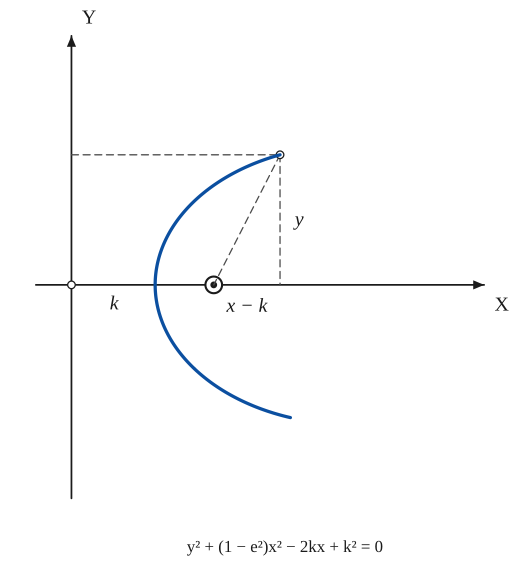

The construction:

1. **Given** — The directrix is the Y axis; the focus F lies on the X axis at the distance k from it. The ratio e = PF : (distance of P from the directrix) is fixed (here e < 1).
2. **Straightedge** — Take a point P of the locus. Its distance from the directrix is x, its height above the axis is y, and its distance from the focus is PF = e · x. So (x − k)² + y² = e²x².
3. **Pencil** — The locus of all such P is the conic y² + (1 − e²)x² − 2kx + k² = 0; for e < 1 it is an ellipse.

### Fig. 31(b) — Focus and directrix: the parabola (e = 1), polar form with a horizontal directrix {#fig-031b}

*Page 36 of the book.* The book draws all three sketches freehand; here e = 0.7, 1 and 1.5 so that the three kinds are visible.

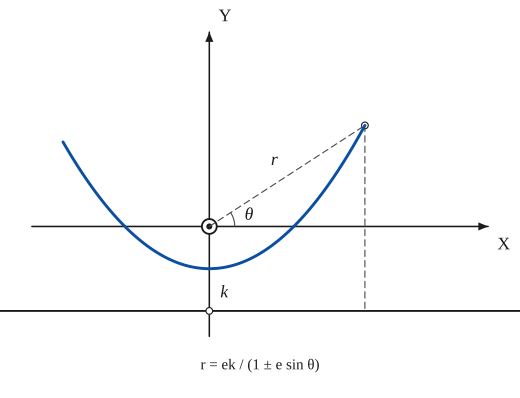

The construction:

1. **Given** — The focus F is the origin; the directrix is the horizontal line at the distance k below it. The ratio e = PF : (distance of P from the directrix) is fixed (here e = 1).
2. **Straightedge** — Take a point P of the locus, at the distance r = PF from the focus and the angle θ from the X axis; its distance from the directrix is k + r sin θ, and r = e (k + r sin θ).
3. **Pencil** — The locus is r = ek / (1 − e sin θ); for e = 1 it is a parabola with its vertex midway between focus and directrix.

### Fig. 31(c) — Focus and directrix: the hyperbola (e > 1), polar form with a vertical directrix {#fig-031c}

*Page 36 of the book.* The book draws all three sketches freehand; here e = 0.7, 1 and 1.5 so that the three kinds are visible.

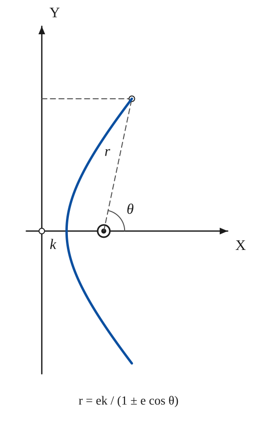

The construction:

1. **Given** — The directrix is the Y axis; the focus F lies on the X axis at the distance k from it. The ratio e = PF : (distance of P from the directrix) is fixed (here e > 1).
2. **Straightedge** — Take a point P of the locus, at the distance r = PF from the focus and the angle θ from the X axis; its distance from the directrix is k + r cos θ, and r = e (k + r cos θ).
3. **Pencil** — The locus is r = ek / (1 − e cos θ); for e > 1 it is the branch of a hyperbola that wraps around the focus.

### Fig. 32 — The section of a cone: the sphere touching the plane at the focus F, and the directrix AD {#fig-032}

*Page 37 of the book.* The book draws the cone, the sphere and the plane freehand; here the cone, the sphere and the plane are exact and drawn in orthographic projection (yaw −20°, looking down 16°).

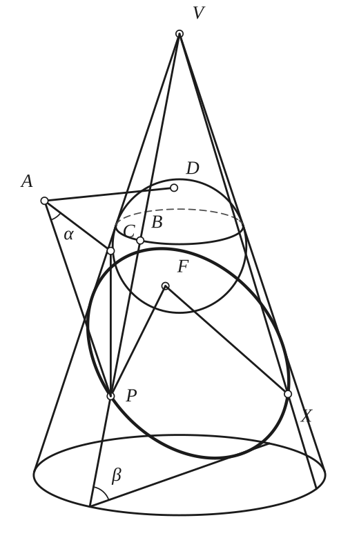

The construction:

1. **Given** — The right circular cone with vertex V and base angle β, cut by the plane APFD (it makes the angle α with the base): the curve of intersection.
2. **Compass** — Inscribe a sphere in the cone so that it touches the cutting plane at F. It touches the cone along a circle.
3. **Straightedge** — Let P be any point of the curve of intersection. The generator VP touches the sphere at B; join P to F. The two tangents from P to the sphere are equal: PF = PB.
4. **Straightedge** — The plane ACBD of the circle of contact meets the cutting plane in the line AD. From P drop PC perpendicular to this plane, and PA perpendicular to AD; AC is then perpendicular to AD as well.
5. **Straightedge** — A second generator, through the point X of the curve, and the line FX; the chord and the generator through P at the base give the base angle β.
6. **Note** — The angle α at A between AP and AC is the angle of the cutting plane with the base; β is the angle of the generator with the base. PC = PA sin α = PB sin β = PF sin β, so PF / PA = sin α / sin β = e, a constant: the curve is a conic with focus F and directrix AD.

### Fig. 33(a) — The parabola as a section of a cone: one sphere, PF = PA = BC = PD {#fig-033a}

*Page 38 of the book.* Drawn in true projection (yaw 18°, looking down 12°); the book draws the same configuration freehand and also marks the points E and G, which its text does not define, so they are left out here.

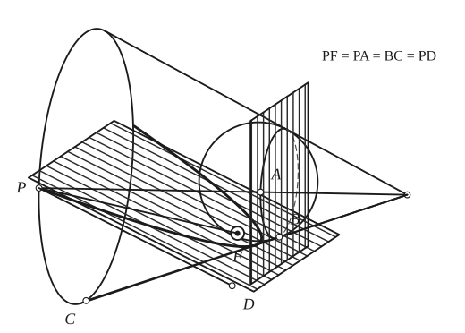

The construction:

1. **Given** — The right circular cone with vertex V, cut by a plane parallel to one generator: the curve of intersection is a parabola.
2. **Compass** — Inscribe a sphere in the cone so that it touches the cutting plane at F; it touches the cone along a circle. The plane of that circle (hatched) meets the cutting plane in the directrix.
3. **Straightedge** — Take P on the curve. The generator VP touches the sphere at A, so PF = PA (tangents from P). Draw VP, PA and PF.
4. **Straightedge** — The opposite generator VC touches the sphere at B; BC = PA (P and C are on the base circle). From P drop the perpendicular PD to the directrix: for the parabola PD = PF.
5. **Note** — PF = PA = BC = PD: the distance of P from the focus equals its distance from the directrix, so e = 1.

### Fig. 33(b) — The ellipse as a section of a cone: two spheres, PF1 + PF2 = AB {#fig-033b}

*Page 38 of the book.* Drawn in true projection (yaw −22°, looking down 10°).

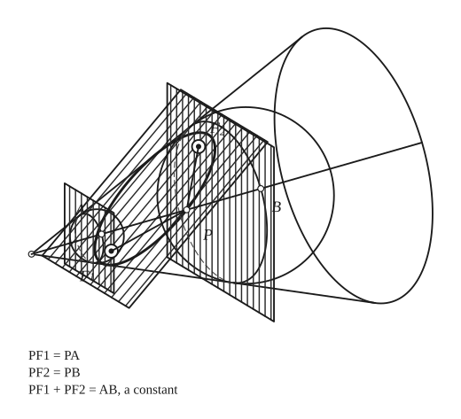

The construction:

1. **Given** — The right circular cone with vertex V, cut by a plane that meets all its generators on one side of V: the curve of intersection is an ellipse.
2. **Compass** — Inscribe two spheres in the cone, one on each side of the cutting plane, both touching it: at F1 (small sphere) and F2 (large sphere). Their circles of contact with the cone lie in two parallel planes (hatched).
3. **Straightedge** — Take P on the curve and draw the generator VP. It touches the small sphere at A and the large sphere at B. The tangents from P to a sphere are equal: PF1 = PA and PF2 = PB.
4. **Note** — PF1 = PA, PF2 = PB, so PF1 + PF2 = AB: the distance between the two circles of contact measured along a generator. It is a constant (the same for every P), so the curve is an ellipse with foci F1, F2.

### Fig. 33(c) — The hyperbola as a section of a cone: two spheres in the two nappes, PF1 − PF2 = AB {#fig-033c}

*Page 38 of the book.* Drawn in true projection (yaw −18°, looking down 8°).

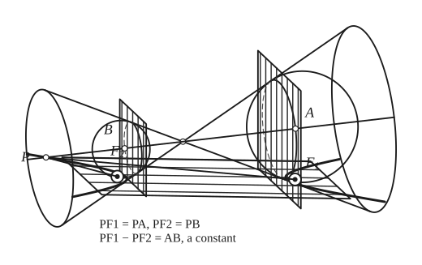

The construction:

1. **Given** — The double cone with vertex V, cut by a plane that meets both nappes: the curve of intersection is a hyperbola of two branches.
2. **Compass** — Inscribe a sphere in each nappe, both touching the cutting plane: at F1 (right, large) and F2 (left, small). Their circles of contact lie in two parallel planes (hatched).
3. **Straightedge** — Take P on the left branch and draw the generator through P and V. It touches the small sphere at B and the large sphere at A. Then PF1 = PA and PF2 = PB.
4. **Note** — PF1 = PA and PF2 = PB, so PF1 − PF2 = AB: the distance between the two circles of contact measured along a generator through V. It is a constant, so the curve is a hyperbola with foci F1, F2.

### Fig. 34 — The family of lines y = mx cutting a conic: the discriminant B² − AC {#fig-034}

*Page 39 of the book.* The book shows an ellipse and two hyperbolas. The heavy rays through O are parallel to the asymptotes (dashed): each cuts its hyperbola in exactly one point (open dot). The book marks only one such ray for the upper hyperbola; the other is drawn here too. The upper hyperbola is the one of the book, a very wide U whose centre lies far below the page, so its asymptotes are not drawn.

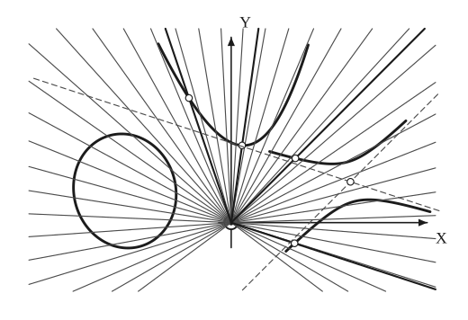

The construction:

1. **Given** — The conic and the family of lines y = mx through the origin O. Each line meets the curve where (A + 2Bm + Cm²)x² + 2(D + Em)x + F = 0.
2. **Straightedge** — Draw the lines of the family: a fan of rays y = mx through O at many slopes m. Most of them cut a curve twice or not at all.
3. **Straightedge** — The lines that cut a curve in one point only are those with A + 2Bm + Cm² = 0, that is, the lines through O parallel to an asymptote. Draw them heavy and mark where each meets its hyperbola.
4. **Note** — The asymptotes of the right-hand hyperbola (dashed) meet at its centre; the heavy rays are parallel to them. For the ellipse no line cuts the curve once: B² − AC < 0; for a hyperbola there are two such lines: B² − AC > 0.

### Fig. 35 — The optical property of the ellipse: the tangent bisects the angle of the focal radii {#fig-035}

*Page 40 of the book.*

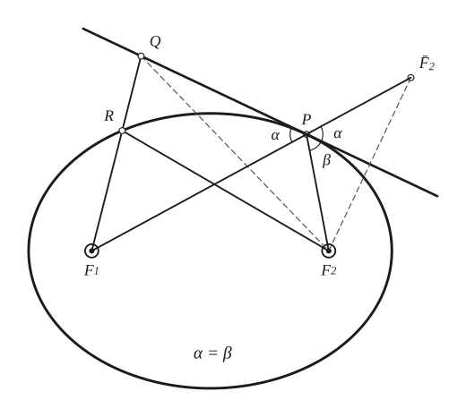

The construction:

1. **Given** — The ellipse with foci F1 and F2: F1P + F2P = 2a for every point P of it. P is a point of the curve.
2. **Straightedge** — Draw the tangent at P (heavy). All its other points lie outside the ellipse.
3. **Straightedge** — Take another point Q on the tangent. F1Q cuts the ellipse at R; join R and Q to F2. Since R is on the ellipse and Q outside it, F1Q + F2Q > F1R + F2R = 2a.
4. **Set square** — From F2 drop the perpendicular to the tangent, and carry the same distance beyond the tangent: this gives F̄2, the reflection of F2 in the tangent. Then F2Q = F̄2Q for every Q of the tangent.
5. **Straightedge** — Join F1 to F̄2: this straight line is the shortest path from F1 to the tangent and on to F̄2. It cuts the tangent at P, because F1P + F2P = 2a is the least possible sum on the tangent. Also draw PF2.
6. **Note** — The angle between the tangent and PF1 equals the angle between the tangent and PF̄2 (vertically opposite), and PF̄2 is the mirror image of PF2. So the tangent makes equal angles α = β with the two focal radii.

### Fig. 36 — Poles and polars: the polar of P is the chord of contact of the tangents from P {#fig-036}

*Page 41 of the book.*

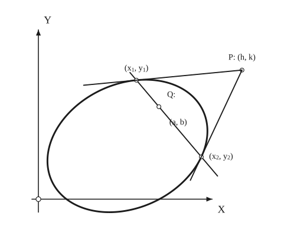

The construction:

1. **Given** — The conic Ax² + 2Bxy + Cy² + 2Dx + 2Ey + F = 0 with its axes, and the point P: (h, k) from which tangents can be drawn.
2. **Straightedge** — The polar of P, the line Ahx + B(hy + kx) + Cky + D(x + h) + E(y + k) + F = 0 (the tangent equation with (h, k) put in): it meets the conic at the two points of contact (x1, y1) and (x2, y2).
3. **Straightedge** — The tangents from P: the lines from P through the two points of contact.
4. **Note** — Any point Q: (a, b) of the polar has a polar through P as well. If P lay on the conic, its polar would be the tangent at P.

### Fig. 37 — The harmonic section: Q1 and Q2 divide P1P2 internally and externally in the same ratio {#fig-037}

*Page 42 of the book.*

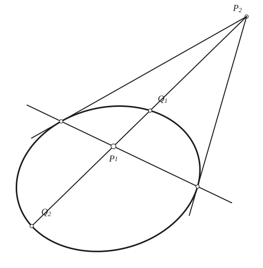

The construction:

1. **Given** — The conic and the point P2 outside it.
2. **Straightedge** — Draw the polar of P2: the chord through the points of contact T1, T2 of the two tangents from P2 (drawn too).
3. **Straightedge** — Draw any line through P2. It meets the conic in Q1 and Q2 and the polar in P1.
4. **Note** — P1, P2, Q1, Q2 are a harmonic set: P1Q1 : Q1P2 = P1Q2 : Q2P2 (internal and external division in the same ratio), so 2 / P2P1 = 1 / P2Q1 + 1 / P2Q2. Q1 and Q2 divide P1P2 internally and externally in the same ratio.

### Fig. 38(a) — The polar of P passes through R and S, the meets of the cross-joins of two secants through P {#fig-038a}

*Page 43 of the book.* The book does not draw the line RS itself (it is the polar); it is added here, dashed, in the last step.

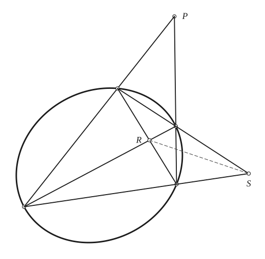

The construction:

1. **Given** — The conic and the point P. Two secants will be drawn through P, meeting the conic in A, B and in C, D.
2. **Straightedge** — Draw two arbitrary secants from P: one meets the conic in B and A, the other in C and D.
3. **Straightedge** — Draw the cross-joins AC and BD; they meet at R. Draw the other cross-joins AD and BC; they meet at S.
4. **Note** — The polar of P passes through R and S (the book proves this with the family of lines through R, Fig. 38b). RS is the polar of P.

### Fig. 38(b) — The two secants as axes of reference: the intercepts a1, a2, b1, b2 and the cross-joins {#fig-038b}

*Page 43 of the book.*

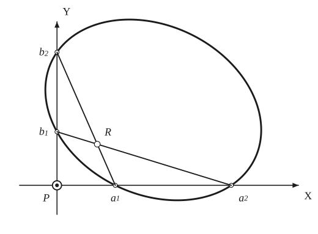

The construction:

1. **Given** — The two secants through P are taken as axes of reference (not necessarily at right angles). The conic Ax² + 2Bxy + Cy² + 2Dx + 2Ey + F = 0 cuts the X axis at a1, a2 and the Y axis at b1, b2.
2. **Straightedge** — Draw the cross-joins a1b2 and a2b1: the lines x/a1 + y/b2 = 1 and x/a2 + y/b1 = 1. They meet at R.
3. **Note** — The intercepts are the roots of Ax² + 2Dx + F = 0 and Cy² + 2Ey + F = 0, so 1/a1 + 1/a2 = −2D/F and 1/b1 + 1/b2 = −2E/F. The polar of P(0, 0), Dx + Ey + F = 0, is x(1/a1 + 1/a2) + y(1/b1 + 1/b2) − 2 = 0; it contains R.

### Fig. 39(a) — Tangents from P to an ellipse with the straightedge alone {#fig-039a}

*Page 44 of the book.*

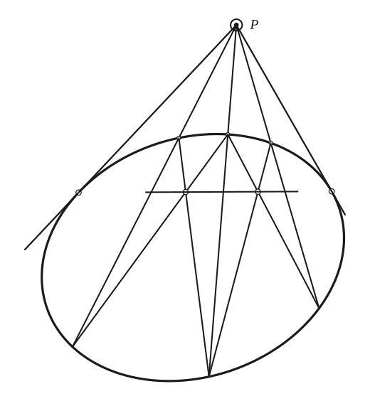

The construction:

1. **Given** — The conic and the point P outside it.
2. **Straightedge** — Draw three arbitrary secants from P; they meet the conic at the pairs (t1, b1), (t2, b2), (t3, b3).
3. **Straightedge** — Draw the cross-joins of the first two secants (t1b2 and t2b1), and of the last two (t2b3 and t3b2). Each pair meets at a point of the polar of P.
4. **Straightedge** — Join the two meets: this is the polar of P. It cuts the conic at T1 and T2, the points of tangency.
5. **Straightedge** — The tangents from P: the lines PT1 and PT2 (heavy).

### Fig. 39(b) — Tangent from P to a hyperbola with the straightedge alone {#fig-039b}

*Page 44 of the book.* Four points of the hyperbola, two on each branch, play the part of the two secants; the polar of P goes through the other two vertices of the complete quadrangle. Only the tangent that touches the left branch lies in the frame of the book.

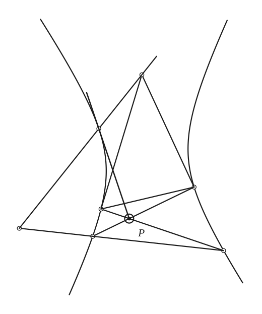

The construction:

1. **Given** — The two branches of a hyperbola and the point P between them.
2. **Straightedge** — Take two points B1, B2 on one branch and two points C1, C2 on the other. Draw the secants B1C1 and B2C2: they meet at P.
3. **Straightedge** — Draw the cross-joins B1C2 and B2C1; they meet at A. Draw the opposite sides B1B2 and C1C2; they meet at T.
4. **Straightedge** — Join A and T: this is the polar of P. It meets the conic at the points of tangency, and the tangent from P is the line to such a point (heavy).

### Fig. 40 — Pascal's theorem: the meets of the three pairs of joins of an inscribed hexagon are collinear {#fig-040}

*Page 45 of the book.* The book labels X = (2,3'; 2',3), Y = (1,3'; 1',3) and Z = (1,2'; 1',2).

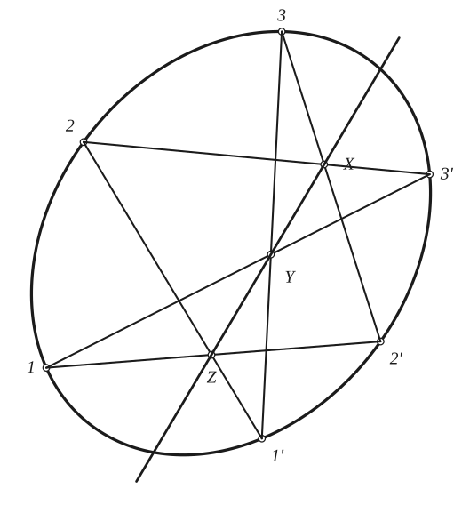

The construction:

1. **Given** — A conic with six points 1, 2, 3, 1', 2', 3' on it, numbered arbitrarily.
2. **Straightedge** — Draw the joins 1,2' and 1',2: they meet at Z.
3. **Straightedge** — Draw the joins 1,3' and 1',3: they meet at Y.
4. **Straightedge** — Draw the joins 2,3' and 2',3: they meet at X.
5. **Straightedge** — X, Y and Z are on one straight line, the Pascal line (heavy). The theorem holds for any six points of a conic, and conversely.

### Fig. 41 — Pointwise construction of a conic through five given points, with the Pascal line {#fig-041}

*Page 46 of the book.* The conic itself is not drawn in the book; the last step adds it (dashed) to show that 3' lies on the conic through the five points.

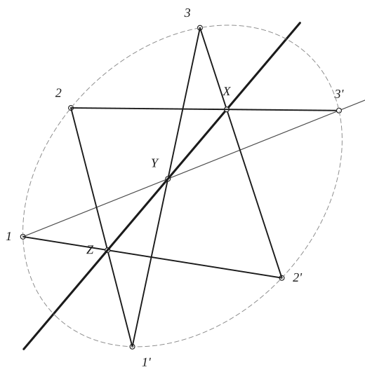

The construction:

1. **Given** — The five points 1, 2, 3, 1', 2', and an arbitrary line through 1 on which the sixth point 3' is to be found.
2. **Straightedge** — Draw 1,2' and 1',2: they meet at Z.
3. **Straightedge** — Draw 1',3: it meets the arbitrary line through 1 at Y (that is, 1,3' and 1',3 meet at Y).
4. **Straightedge** — Draw the Pascal line through Z and Y (heavy).
5. **Straightedge** — The Pascal line meets 2',3 at X. Draw 2'3 up to X.
6. **Straightedge** — Draw 2,X: it meets the line through 1 at 3', a point of the conic. Further points are found in the same way, from other lines through 1.
7. **Note** — The conic through 1, 2, 3, 1', 2' (dashed): it passes through the point 3' that the Pascal line has given.

### Fig. 42 — The tangent at a point of a conic given by five points {#fig-042}

*Page 46 of the book.* The conic is not drawn in the book; the last step adds it (dashed) to show that the line found touches it at 1 = 3′.

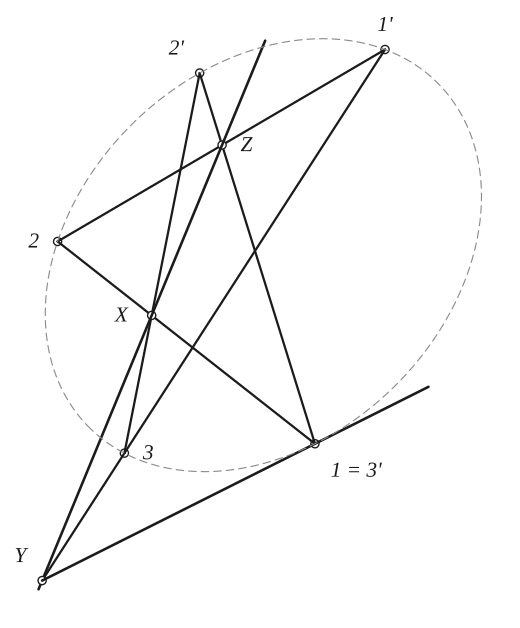

The construction:

1. **Given** — Five points of a conic: 1 and 3' are taken together (1 = 3'), so the line 1,3' is the tangent at 1. The others are 2, 3, 1', 2'.
2. **Straightedge** — Draw 1,2' and 1',2: they meet at Z.
3. **Straightedge** — Draw 2,3' (that is, 2,1) and 2',3: they meet at X.
4. **Straightedge** — Draw the Pascal line through X and Z (heavy); it meets 1',3 at Y.
5. **Straightedge** — The line from Y to the point 1 = 3' is the required tangent (heavy). The tangent at any other of the five points is found in the same way.
6. **Note** — The conic through the five points (dashed): the line just drawn touches it at 1 = 3'.

### Fig. 43 — Inscribed quadrilateral: tangents at opposite vertices and opposite sides meet on a line {#fig-043}

*Page 47 of the book.*

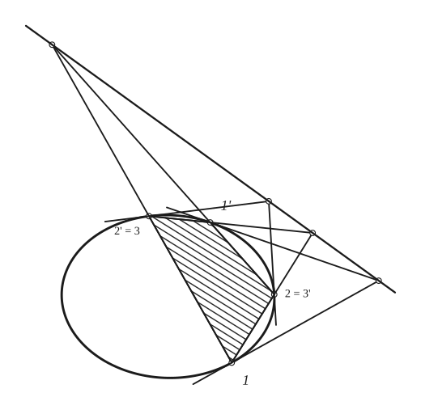

The construction:

1. **Given** — A conic with an inscribed quadrilateral 1, 2 = 3', 1', 2' = 3: the hexagon of Pascal with two pairs of vertices coinciding (2' with 3 and 2 with 3').
2. **Straightedge** — Draw the tangents at the opposite vertices 2' = 3 and 2 = 3' (they meet at one point), and the tangents at 1 and 1' (they meet at another).
3. **Straightedge** — Draw the opposite sides: 1,(2' = 3) with 1',(2 = 3'), and 1',(2' = 3) with 1,(2 = 3'). Each pair meets at one point.
4. **Straightedge** — The four points lie on one line (heavy): the Pascal line of the degenerate hexagon.

### Fig. 44 — Inscribed triangle: the tangents at the vertices meet the opposite sides in three collinear points {#fig-044}

*Page 47 of the book.* The book labels the vertices 1=2′, 2=3′, 3=1′: Pascal's hexagon 1 2 3 1′ 2′ 3′ with each pair of neighbouring vertices run together, so that its sides 12′… become the tangents.

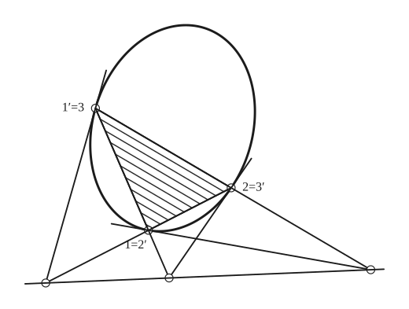

The construction:

1. **Given** — A conic and a triangle inscribed in it. Its vertices are named 1=2′, 2=3′ and 3=1′, because the triangle is Pascal's hexagon with neighbouring vertices run together.
2. **Straightedge** — At the vertex 3=1′ draw the tangent to the conic, and extend the opposite side (1=2′ to 2=3′) until the two lines meet.
3. **Straightedge** — In the same way the tangent at 2=3′ meets the side joining the other two vertices, 3=1′ and 1=2′.
4. **Straightedge** — And the tangent at 1=2′ meets the side from 3=1′ to 2=3′.
5. **Straightedge** — The three points of meeting lie on one straight line (the Pascal line of this degenerate hexagon). Lay the straightedge along any two of them: it passes through the third.

### Fig. 45 — Aeroplane design: a conic through three points with two tangents, by Pascal lines {#fig-045}

*Page 48 of the book.*

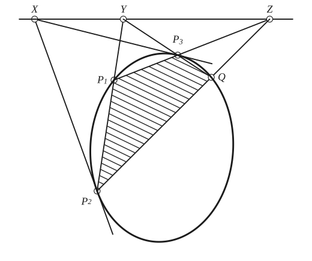

The construction:

1. **Given** — Three points P1, P2, P3 of the conic and the tangents at two of them, P2 and P3; the tangents meet at X.
2. **Straightedge** — To find further points Q, draw any line through X (a Pascal line, here a horizontal).
3. **Straightedge** — Extend P1P2 until it meets this line at Y, and P1P3 until it meets it at Z.
4. **Straightedge** — Draw YP3 and ZP2. They meet at Q, a point of the conic (Pascal's theorem for the hexagon Q P3 P3 P1 P2 P2).
5. **Pencil** — The conic through P1, P2, P3 and Q, touching the given tangents at P2 and P3. Another line through X gives another point Q.
6. **Note** — The book shades the quadrilateral P1 P3 Q P2 inscribed in the conic.

### Fig. 46 — Duality: Brianchon's theorem, the three joins of opposite vertices of a circumscribed hexagon meet in a point {#fig-046}

*Page 48 of the book.*

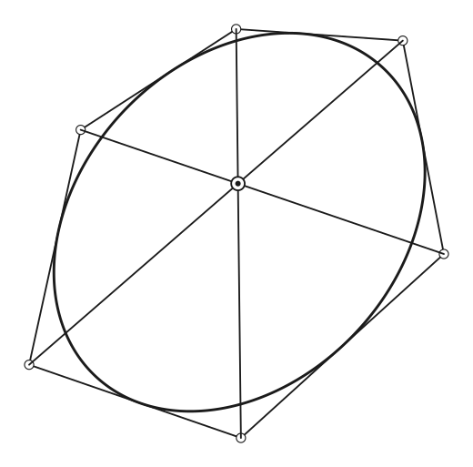

The construction:

1. **Given** — A conic (an ellipse here).
2. **Straightedge** — Draw six tangents to the conic. Neighbouring tangents meet at the six vertices of a hexagon circumscribed about the conic.
3. **Straightedge** — Join the three pairs of opposite vertices. The three joins pass through one point (Brianchon's theorem, the dual of Pascal's).

### Fig. 47(a) — String method: the ellipse with a loop of string about two pins {#fig-047a}

*Page 49 of the book.*

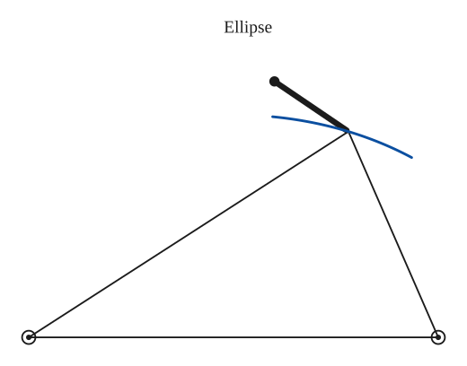

The construction:

1. **Given** — Two pins F1 and F2 pushed into the board; they will be the foci.
2. **Linkage** — Tie a loop of thread and drop it over the pins. Its length is 2a + 2c (c = half of F1F2). Pull it taut with the pencil point at P.
3. **Pencil** — Keeping the thread taut, move the pencil round: PF1 + PF2 is the length of the thread less F1F2, always 2a, so the point traces an ellipse with foci F1 and F2.

### Fig. 47(b) — String method: the parabola with a set square sliding along the directrix {#fig-047b}

*Page 49 of the book.*

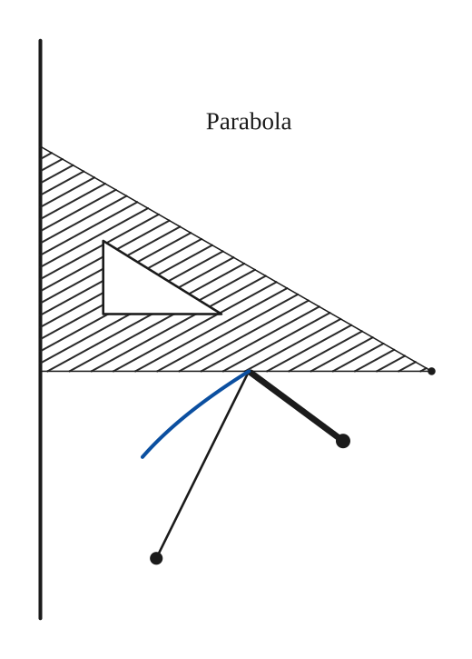

The construction:

1. **Given** — A straight rule fixed to the board (the directrix) and a pin at F (the focus).
2. **Linkage** — Slide the set square along the rule, one leg against it. The thread has the length of the other leg: tie one end to the pin F and the other to the far corner of the leg.
3. **Linkage** — Hold the thread taut against the leg with the pencil at P. Then PF + (the part of the thread along the leg) = the length of the leg, so PF equals the distance of P from the rule.
4. **Pencil** — Sliding the square along the rule and keeping the thread taut, the pencil traces a parabola: its points are as far from F as from the rule.

### Fig. 47(c) — String method: the hyperbola with a ruler pivoting at a focus {#fig-047c}

*Page 49 of the book.*

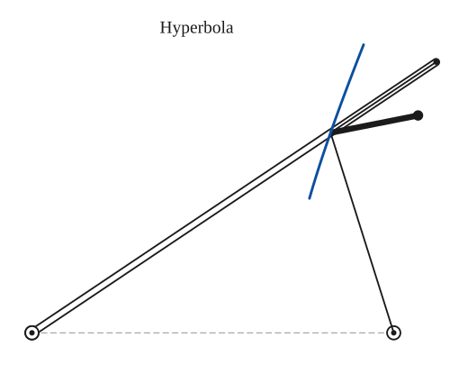

The construction:

1. **Given** — A pin at F2 and a pivot at F1 (the foci), 2c apart.
2. **Linkage** — Fix a ruler to turn about F1, and tie a thread to its free end and to the pin F2. The thread is shorter than the ruler by 2a.
3. **Linkage** — Hold the thread against the ruler with the pencil at P and turn the ruler: PF1 − PF2 = ruler − thread = 2a stays constant.
4. **Pencil** — The pencil traces one branch of the hyperbola with foci F1 and F2 (interchange the pins for the other branch).

### Fig. 48(a) — Pointwise construction of the ellipse from two concentric circles: x = a cos t, y = b sin t {#fig-048a}

*Page 49 of the book.*

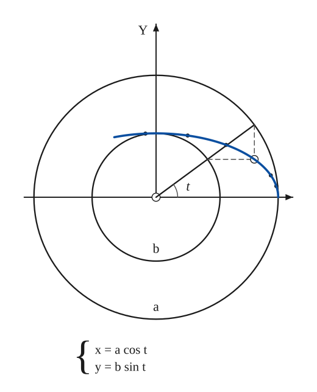

The construction:

1. **Given** — Two concentric circles about O, of radii a and b (a > b), and the axes OX, OY.
2. **Protractor** — Lay off the angle t from OX and draw the ray from O: it cuts the inner circle and the outer circle.
3. **Set square** — From the point where the ray cuts the outer circle draw a vertical, and from the point where it cuts the inner circle a horizontal (dashed). They meet at P, with x = a cos t and y = b sin t.
4. **Pencil** — Repeat for other angles t (mark P each time) and draw the ellipse through the points found.
5. **Note** — The equations of the construction, as printed under the figure.

### Fig. 48(b) — Pointwise construction of the parabola from circles about the focus and vertical lines {#fig-048b}

*Page 49 of the book.*

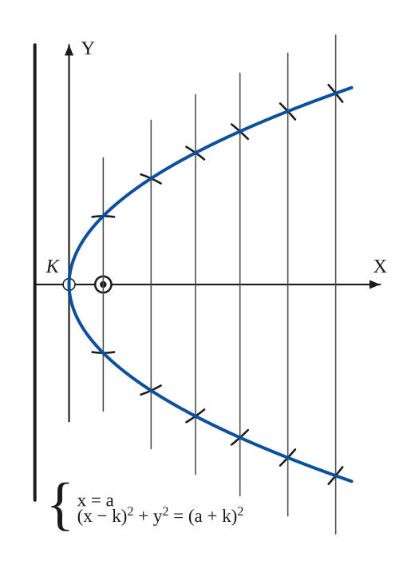

The construction:

1. **Given** — The directrix (heavy line, a distance k to the left of K), the vertex K, and the focus (double circle) a distance k to the right of K. The axes through K.
2. **Straightedge** — Draw the verticals x = a for a series of values a (the first through the focus).
3. **Compass** — About the focus draw an arc of radius a + k (the distance of the line x = a from the directrix). It cuts the line x = a above and below the axis at points of the parabola, since (x − k)² + y² = (a + k)² with x = a.
4. **Compass** — Repeat for each vertical, marking the crossing with a short stroke.
5. **Pencil** — Draw the parabola through the points found: it passes through K.
6. **Note** — The equations of the construction, as printed under the figure.

### Fig. 48(c) — Pointwise construction of the hyperbola from two concentric circles: x = a sec t, y = b tan t {#fig-048c}

*Page 49 of the book.*

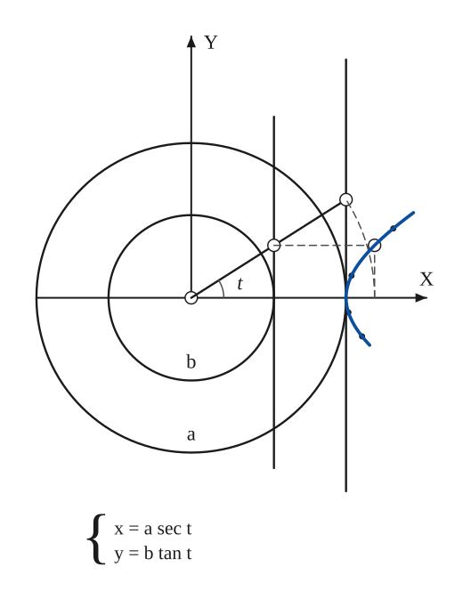

The construction:

1. **Given** — Two concentric circles about O, of radii a and b (a > b), and the axes OX, OY.
2. **Straightedge** — Draw the verticals touching the circles: x = b at the right end of the inner circle, x = a at the right end of the outer circle.
3. **Protractor** — Lay off the angle t from OX and draw the ray from O, to meet the vertical x = a (above the outer circle). It meets x = b on the way.
4. **Compass** — About O draw the arc through the upper meeting point (dashed): it cuts OX at x = a sec t.
5. **Set square** — Raise the vertical from that point of OX, and draw the horizontal from the meeting point on x = b (both dashed). They meet at P: x = a sec t, y = b tan t.
6. **Pencil** — Repeat for other angles t and draw the branch of the hyperbola through the points; it touches the vertical x = a at its vertex.
7. **Note** — The equations of the construction, as printed under the figure.

### Fig. 49(a) — Envelope of the perpendicular to a ray from F at a point of a circle: the ellipse {#fig-049a}

*Page 50 of the book.*

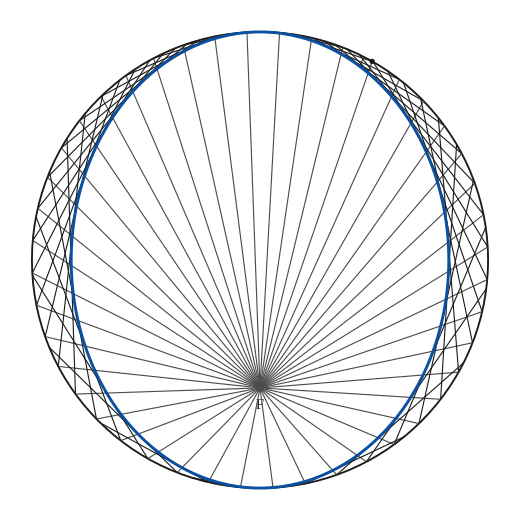

The construction:

1. **Given** — A fixed circle and a fixed point F inside it.
2. **Straightedge** — Draw a ray from F to a point P of the circle.
3. **Set square** — At P draw the perpendicular to the ray, as a chord of the circle. This line is a tangent of the envelope.
4. **Straightedge** — Repeat from 43 further points spaced round the circle: first the rays from F …
5. **Set square** — … then the perpendicular chords. The lines crowd together along a curve, the envelope.
6. **Pencil** — The envelope is an ellipse with foci F and the centre of the circle, and major axis equal to the diameter of the circle (the circle is its auxiliary circle).

### Fig. 49(b) — Envelope of the perpendicular to a ray from F at a point of a line: the parabola {#fig-049b}

*Page 50 of the book.*

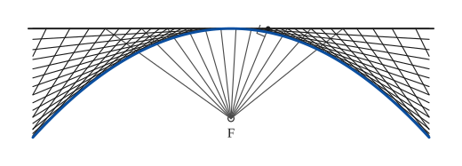

The construction:

1. **Given** — A fixed line and a fixed point F near it.
2. **Straightedge** — Draw a ray from F to a point P of the line.
3. **Set square** — At P draw the perpendicular to the ray. It is a tangent of the envelope.
4. **Straightedge** — Repeat from 40 further points along the line, rays first …
5. **Set square** — … then the perpendiculars, cut off at the edge of the drawing.
6. **Pencil** — The envelope is a parabola with focus F, touching the fixed line at its vertex (the fixed line is the tangent at the vertex).

### Fig. 49(c) — Envelope of the perpendicular to a ray from F at a point of a circle, F outside: the hyperbola {#fig-049c}

*Page 50 of the book.*

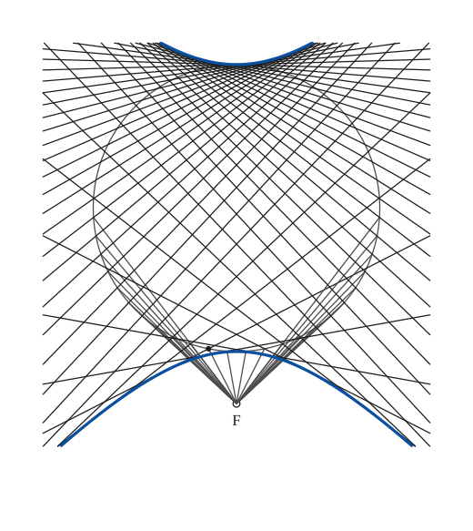

The construction:

1. **Given** — A fixed circle and a fixed point F outside it.
2. **Straightedge** — Draw a ray from F to a point P of the circle.
3. **Set square** — At P draw the perpendicular to the ray, as a long line cut off by the edge of the drawing.
4. **Straightedge** — Repeat from 47 further points round the circle: rays from F to the points on the near side …
5. **Set square** — … and the perpendicular at every point. Two curves appear where the lines crowd together.
6. **Pencil** — The envelope is a hyperbola with one focus at F and the other the mirror image of F in the centre of the circle; the circle is its auxiliary circle (radius a).

### Fig. 50(a) — Paper folding: F folded onto a circle, the creases envelope an ellipse {#fig-050a}

*Page 50 of the book.*

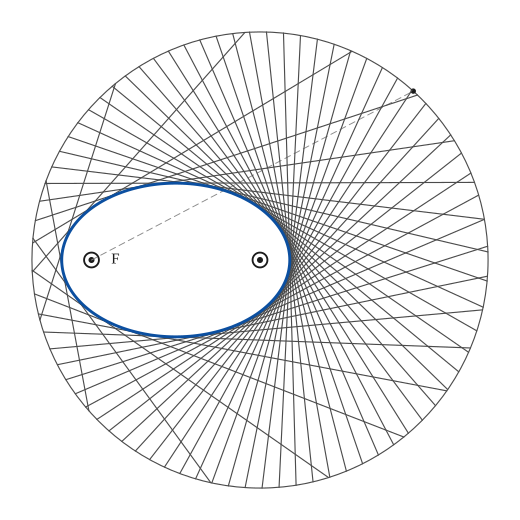

The construction:

1. **Given** — A circle of paper, with the point F marked inside it (the centre of the circle is the other focus).
2. **Paper folding** — Fold F onto a point P of the circle and crease the paper: the crease is the perpendicular bisector of FP.
3. **Paper folding** — Fold F onto 47 more points spaced round the circle, creasing each time.
4. **Pencil** — The creases envelope an ellipse with foci F and the centre of the circle: the distance from a point of it to F plus its distance to the centre is the radius of the circle.

### Fig. 50(b) — Paper folding: F folded onto a line, the creases envelope a parabola {#fig-050b}

*Page 50 of the book.*

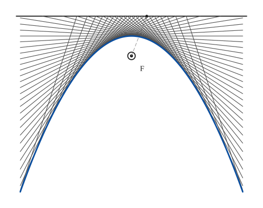

The construction:

1. **Given** — A sheet of paper with a straight edge and the point F marked a little way from it.
2. **Paper folding** — Fold F onto a point P of the edge and crease the paper: the crease is the perpendicular bisector of FP.
3. **Paper folding** — Fold F onto 48 more points of the edge. Points far along the edge give creases that lean steeply.
4. **Pencil** — The creases envelope a parabola with focus F and the edge as its directrix.

### Fig. 50(c) — Paper folding: F outside the circle, the creases envelope a hyperbola {#fig-050c}

*Page 50 of the book.*

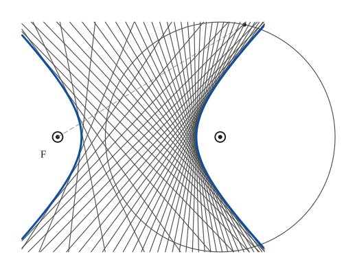

The construction:

1. **Given** — A circle on the paper, with the point F marked outside it (the centre of the circle is the other focus).
2. **Paper folding** — Fold F onto a point P of the circle and crease the paper: the crease is the perpendicular bisector of FP.
3. **Paper folding** — Fold F onto 47 more points spaced round the circle, creasing each time.
4. **Pencil** — The creases envelope a hyperbola with foci F and the centre of the circle: the difference of the distances from a point of it to F and to the centre is the radius.

### Fig. 51 — Newton's method: two angles of constant size turning about A and B, one pair of sides meeting on a line {#fig-051}

*Page 51 of the book.*

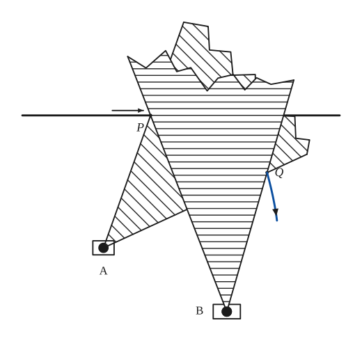

The construction:

1. **Given** — A fixed line, and two fixed points A and B (the vertices of the two angles).
2. **Protractor** — At A draw an angle of fixed size (about 46° here) turning about A. One of its sides passes through the point P of the fixed line; the other side is the one that will meet the second angle.
3. **Protractor** — At B draw a second angle of fixed size (about 37°). Its left side passes through the same point P; its right side meets the second side of the angle at A in the point Q.
4. **Pencil** — Slide P along the fixed line, keeping both angles the same size. The point Q then describes a conic through A and B.

### Fig. 52 — The 3-bar linkage AB = CD = 2a, AC = BD = 2b: a variable trapezoid {#fig-052}

*Page 51 of the book.* The bars AC and BD swing about the fixed pivots A and B and the bar CD joins them; AD and BC stay parallel, and so OP stays parallel to them.

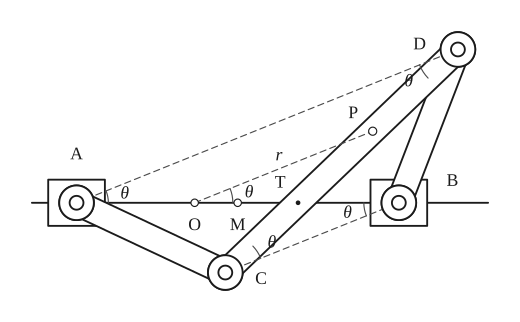

The construction:

1. **Given** — Two fixed pivots A and B on a straight line, AB = 2a, M its midpoint.
2. **Linkage** — Hinge a bar AC of length 2b at A and a bar BD of the same length at B (a > b).
3. **Linkage** — Join their free ends by a bar CD of length 2a. The bars AB and CD cross at T; AD and BC are parallel (dashed).
4. **Set square** — Choose a point P on CD and draw through it OP parallel to AD and BC, meeting AB at O. O is the same whatever the position of the linkage, so OP = r turns about the fixed point O.
5. **Note** — The angle θ: the angle BAD, which AD makes with AB, is repeated at O (between OB and OP), at D (between DA and DC), at C (between CB and CD) and at B (between BA and BC).

### Fig. 53 — The inversor OEPFP′ attached to the 3-bar linkage: P′ describes a conic {#fig-053}

*Page 52 of the book.* In the book the fixed pivot O is taken at M (OM = c = 0); with c ≠ 0 it moves along AB as in Fig. 52.

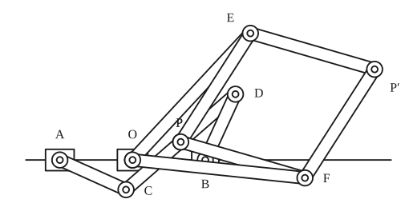

The construction:

1. **Given** — The 3-bar linkage of Fig. 52 (A, B and O on the fixed line, O the midpoint of AB here) with P on the bar CD, OP parallel to AD.
2. **Linkage** — Attach the inversor: bars OE and OF of equal length, and four equal bars EP, PF, FP′ and P′E forming a rhombus. O, P and P′ always lie on a straight line.
3. **Note** — OP · OP′ = OE² − PE² = 2k, so P′ is the inverse of P with respect to the circle of centre O and radius √(2k): when P describes the sextic, P′ describes a conic.

### Fig. 54(a) — Projection of the normal upon a focal radius: the parabola {#fig-054a}

*Page 53 of the book.*

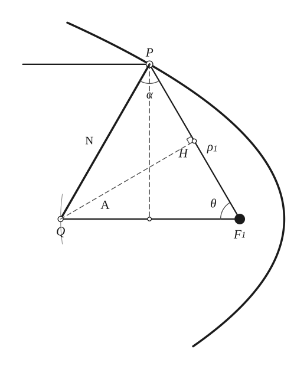

The construction:

1. **Given** — A parabola with focus F1, a point P of it, the focal radius F1P and the line through P parallel to the axis.
2. **Compass** — With centre F1 and radius F1P mark Q on the axis, on the far side of F1: for the parabola F1Q = ρ1, so the triangle F1PQ is isosceles and PQ is the normal.
3. **Straightedge** — Draw PQ, the normal of length N. Its projection on the axis, QM, is the semi-latus rectum A (the subnormal of a parabola is constant); the dashed ordinate PM is perpendicular to the axis.
4. **Set square** — From Q draw the perpendicular QH to the focal radius F1P (dashed). Then PH = N cos α = ρ1 − F1Q cos θ, and with F1Q = e·ρ1 this is the constant A, the semi-latus rectum.
5. **Note** — The angle α at P between the normal and the focal radius, the angle θ at F1 between the axis (towards Q) and the focal radius, and the lengths marked.
6. **Note** — The ordinate PM and the length A = QM.

### Fig. 54(b) — Projection of the normal upon a focal radius: the ellipse {#fig-054b}

*Page 53 of the book.* The book prints F for the left focus here; it is the focus F1 from which ρ1 and θ are measured.

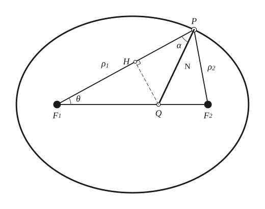

The construction:

1. **Given** — An ellipse with foci F1 and F2, a point P of it and the focal radii ρ1 = F1P and ρ2 = F2P.
2. **Straightedge** — Draw the normal at P: it bisects the angle F1PF2 and meets the axis at Q, so F2Q : F1Q = ρ2 : ρ1. Its length PQ is N.
3. **Set square** — From Q draw the perpendicular QH to the focal radius F1P (dashed). Then PH = N cos α = ρ1 − F1Q cos θ, and with F1Q = e·ρ1 this is the constant A, the semi-latus rectum.
4. **Note** — The angle α at P between the normal and the focal radius, the angle θ at F1 between the axis (towards Q) and the focal radius, and the lengths marked.

### Fig. 54(c) — Projection of the normal upon a focal radius: the hyperbola {#fig-054c}

*Page 53 of the book.*

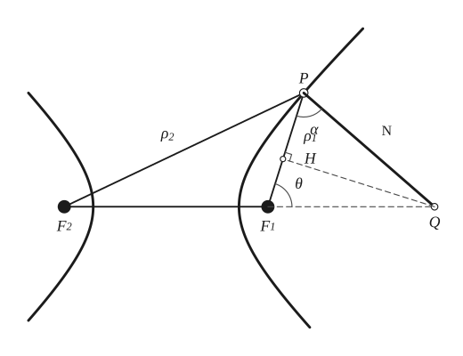

The construction:

1. **Given** — A hyperbola with foci F1 and F2, a point P on the branch round F1, and the focal radii ρ1 = F1P and ρ2 = F2P.
2. **Straightedge** — Draw the normal at P: it bisects the outside angle at P between the focal radii and meets the axis at Q beyond F1, so F2Q : F1Q = ρ2 : ρ1. Its length PQ is N.
3. **Set square** — From Q draw the perpendicular QH to the focal radius F1P (dashed). Then PH = N cos α = ρ1 − F1Q cos θ, and with F1Q = e·ρ1 this is the constant A, the semi-latus rectum.
4. **Note** — The angle α at P between the normal and the focal radius, the angle θ at F1 between the axis (towards Q) and the focal radius, and the lengths marked.
5. **Note** — The axis from F1 to Q is drawn dashed.

### Fig. 55 — The centre of curvature C at a point P of an ellipse {#fig-055}

*Page 55 of the book.*

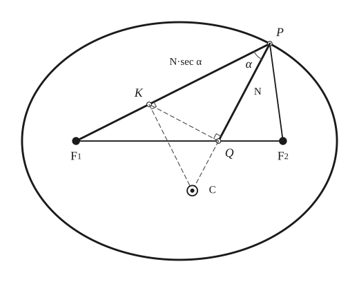

The construction:

1. **Given** — An ellipse with foci F1 and F2, a point P of it, and the focal radii F1P and F2P.
2. **Straightedge** — Draw the normal at P (it bisects the angle F1PF2); it meets the axis F1F2 at Q. Its length PQ is N.
3. **Set square** — At Q draw the perpendicular to the normal; it meets the focal radius F1P at K. In the right triangle PQK, PK = N sec α.
4. **Set square** — At K draw the perpendicular to F1P; it meets the normal in C, the centre of curvature: PC = PK sec α = N sec²α = R.
5. **Note** — The angle α between the focal radius and the normal at P.

## Equations

- $y^2 + (1 - e^2)x^2 - 2kx + k^2 = 0$ — rectangular; the directrix is the Y axis, the focus is $(k, 0)$ (Fig. 31a)
- $r = \frac{ek}{1 \pm e\sin\theta}$ — polar, focus at the origin, directrix parallel to the X axis at the distance $k$ (Fig. 31b)
- $r = \frac{ek}{1 \pm e\cos\theta}$ — polar, focus at the origin, directrix perpendicular to the X axis at the distance $k$ (Fig. 31c)
- $Ax^2 + 2Bxy + Cy^2 + 2Dx + 2Ey + F = 0$ — the general equation of a conic
- $\frac{PF}{PA} = \frac{\sin\alpha}{\sin\beta} = e, \qquad PC = PA\sin\alpha = PB\sin\beta = PF\sin\beta$ — section of a cone (Fig. 32); $PF = PB$ because they are the two tangents from $P$ to the sphere
- $(A + 2Bm + Cm^2)x^2 + 2(D + Em)x + F = 0$ — abscissas of the points where the line $y = mx$ meets the conic (Fig. 34)
- $m = \frac{-B \pm \sqrt{B^2 - AC}}{C}$ — slopes of the lines of the family that cut the conic in one point only: $A + 2Bm + Cm^2 = 0$
- $B^2 - AC < 0, \qquad B^2 - AC = 0, \qquad B^2 - AC > 0$ — the discriminant: ellipse, parabola, hyperbola
- $F_1P + F_2P = 2a$ — the ellipse as the locus of points with a constant sum of focal distances (Fig. 35)
- $Ahx + B(hy + kx) + Cky + D(x + h) + E(y + k) + F = 0$ — the polar of the point $P(h, k)$ (Fig. 36); $P$ is its pole
- $Aha + B(hb + ka) + Ckb + D(h + a) + E(k + b) + F = 0$ — $(a, b)$ lies on the polar of $(h, k)$ exactly when $(h, k)$ lies on the polar of $(a, b)$
- $\frac{P_1Q_1}{Q_1P_2} = \frac{Q_2P_1}{Q_2P_2}, \qquad \frac{2}{P_2P_1} = \frac{1}{P_2Q_1} + \frac{1}{P_2Q_2}$ — the harmonic section (Fig. 37); the second form says that $P_2Q_1$, $P_2P_1$, $P_2Q_2$ are in harmonic progression
- $Ax^2 + 2Dx + F = 0 \ (a_1, a_2), \qquad Cy^2 + 2Ey + F = 0 \ (b_1, b_2)$ — the intercepts on two secants taken as axes of reference (Fig. 38b)
- $\frac{1}{a_1} + \frac{1}{a_2} = -\frac{2D}{F}, \qquad \frac{1}{b_1} + \frac{1}{b_2} = -\frac{2E}{F}$ — so $D = -\frac{F}{2}\left(\frac{1}{a_1} + \frac{1}{a_2}\right)$ and $E = -\frac{F}{2}\left(\frac{1}{b_1} + \frac{1}{b_2}\right)$
- $x\left(\frac{1}{a_1} + \frac{1}{a_2}\right) + y\left(\frac{1}{b_1} + \frac{1}{b_2}\right) - 2 = 0$ — the polar of the origin $P(0, 0)$, which is $Dx + Ey + F = 0$
- $\frac{x}{a_1} + \frac{y}{b_2} = 1, \qquad \frac{x}{a_2} + \frac{y}{b_1} = 1$ — the two cross-joins
- $\left(\frac{x}{a_1} + \frac{y}{b_2} - 1\right) + \lambda\left(\frac{x}{a_2} + \frac{y}{b_1} - 1\right) = 0$ — the lines through their meet $R$; $\lambda = 1$ gives the polar of $P$, so the polar passes through $R$
- $x = a\cos t, \ y = b\sin t; \qquad x = a,\ (x - k)^2 + y^2 = (a + k)^2; \qquad x = a\sec t, \ y = b\tan t$ — the parametrisations printed under the point-by-point constructions of the ellipse, the parabola and the hyperbola (Fig. 48)
- $AB = CD = 2a, \quad AC = BD = 2b, \quad a > b, \qquad (AD)(BC) = 4(a^2 - b^2)$ — the three-bar linkage (Fig. 52): a variable trapezoid
- $AD = 2(AT)\cos\theta = 2(a + z)\cos\theta, \quad BC = 2(BT)\cos\theta = 2(a - z)\cos\theta, \qquad (a^2 - z^2)\cos^2\theta = a^2 - b^2$ — with $OM = c$, $MT = z$, $M$ the midpoint of $AB$ and $T$ the point where $CD$ crosses $AB$ (Fig. 52); the third equation is the product of the first two, using $(AD)(BC) = 4(a^2 - b^2)$
- $r = 2(c + z)\cos\theta, \qquad \left(\frac{r}{2} - c\cos\theta\right)^2 = b^2 - a^2\sin^2\theta$ — polar equation of the path of $P$; in rectangular coordinates a degenerate sextic: a circle together with a curve like the figure $\infty$
- $r\rho = 2k, \qquad (k - c\rho\cos\theta)^2 = b^2\rho^2 - a^2\rho^2\sin^2\theta$ — the inversor $OEPFP'$ (Fig. 53): the locus of $P'$, where $\rho = OP'$. Misprint corrected: the book prints the right side as $b^2 - a^2\rho^2\sin^2\theta$, without $\rho^2$ on $b^2$; putting $r = 2k/\rho$ into the previous equation and multiplying by $\rho^2$ gives the form shown, and only this form leads to the rectangular equation below
- $(a^2 - b^2)y^2 - (b^2 - c^2)x^2 - 2ckx + k^2 = 0$ — the same locus in rectangular coordinates: a conic
- $|R| = \left|\frac{(1 + y'^2)^{3/2}}{y''}\right|, \qquad N^2 = y^2(1 + y'^2), \qquad |R| = \left|\frac{N^3}{y^3 y''}\right|$ — radius of curvature and normal length of any curve in rectangular coordinates
- $y^2 = 2Ax + Bx^2$ — a conic with vertex at the origin and semi-latus rectum $A$: an ellipse if $B < 0$, a parabola if $B = 0$, a hyperbola if $B > 0$
- $\rho_1(1 - e\cos\theta) = A$ — the conic in focal polar coordinates; $A$ is the semi-latus rectum

## Metrical properties

- $|R| = \frac{N^3}{A^2}$ — radius of curvature at a point whose normal has length $N$ (from $y^3y'' = By^2 - (A + Bx)^2 = -A^2$)
- $|R| = N\sec^2\alpha, \qquad \cos\alpha = \frac{A}{N}$ — $\alpha$ is the angle between the normal and the focal radius at the point
- $F_1Q = e\rho_1$ — $Q$ is the foot of the normal on the axis, $\rho_1$ the focal radius $F_1P$ (a central conic: $F_2Q : F_1Q = \rho_2 : \rho_1$, hence $2c / F_1Q = 2a / \rho_1$)
- $F_1H = e\rho_1\cos\theta, \qquad PH = \rho_1 - e\rho_1\cos\theta = A = N\cos\alpha$ — $H$ is the foot of the perpendicular from $Q$ on the focal radius: the projection of the normal length on a focal radius is the constant semi-latus rectum

## General items

- **(1)** Definition. The conic is the locus of $P$ with $PF = e \times$ (distance of $P$ from the directrix). With the directrix as the Y axis and the focus at $(k, 0)$ this gives $y^2 + (1 - e^2)x^2 - 2kx + k^2 = 0$; with the focus at the pole it gives $r = ek / (1 \pm e\sin\theta)$ or $r = ek / (1 \pm e\cos\theta)$, according as the directrix is parallel or perpendicular to the polar axis (Fig. 31).
- **(2)** Sections of a cone (Fig. 32). Cut a right circular cone of base angle $\beta$ by a plane that makes the angle $\alpha$ with the base, and inscribe a sphere touching the plane at $F$. The generator through a point $P$ of the section touches the sphere at $B$, and $PF = PB$. If $ACBD$ is the plane of the circle of contact and $PC$ is perpendicular to it, then $PC = PA\sin\alpha = PB\sin\beta = PF\sin\beta$, so $PF/PA = \sin\alpha/\sin\beta = e$ is constant. Hence the section is a conic with focus $F$ and with the directrix $AD$, the meet of the two planes.
- **(2a)** The three kinds can be had in two ways: fix the cone and tilt the plane ($\beta$ constant, $\alpha$ arbitrary), or fix the plane and vary the cone ($\alpha$ constant, $\beta$ arbitrary). In either case the curve is an ellipse if $\alpha < \beta$, a parabola if $\alpha = \beta$ and a hyperbola if $\alpha > \beta$.
- **(3)** Particular type demonstrations (Fig. 33). Parabola: one sphere, and $PF = PA = BC = PD$, so the distance from the focus equals the distance from the directrix. Ellipse: two spheres on opposite sides of the plane, touching it at $F_1$ and $F_2$ and touching the generator through $P$ at $A$ and $B$; $PF_1 = PA$, $PF_2 = PB$, so $PF_1 + PF_2 = AB$, a constant. Hyperbola: the plane cuts both nappes and the spheres lie in the two nappes; $PF_1 - PF_2 = AB$, a constant. The spheres touch the plane at the foci, and the directrices are the meets of the cutting plane with the planes of the two circles of contact.
- **(4)** The discriminant (Fig. 34). Meet the conic with the family of lines $y = mx$ through the origin. A line of the family cuts the curve in one point only when $A + 2Bm + Cm^2 = 0$ (a point of tangency counts as two points, and the point at infinity is excluded). The parabola is the conic for which exactly one line of the family does this ($B^2 - AC = 0$), the hyperbola the conic for which exactly two do ($B^2 - AC > 0$), and the ellipse the conic for which none does ($B^2 - AC < 0$). The lines that cut once are the parallels to the asymptotes through the origin.
- **(5)** Optical property (Fig. 35), proved for the ellipse; the hyperbola and parabola are treated alike. On the tangent at $P$ the point $P$ is the only one for which $F_1P + F_2P$ is least: for any other point $Q$ of the tangent, $F_1Q + F_2Q > F_1R + F_2R = 2a = F_1P + F_2P$ ($R$ the point where $F_1Q$ meets the ellipse). The shortest route is the straight line from $F_1$ to $\bar F_2$, the reflection of $F_2$ in the tangent, so $P$, $F_1$, $\bar F_2$ are collinear and, since $\alpha = \beta$, the tangent bisects the angle between the focal radii (it makes equal angles with them).
- **(6)** Poles and polars (Fig. 36). For the conic $Ax^2 + 2Bxy + Cy^2 + 2Dx + 2Ey + F = 0$ and the point $P(h, k)$, the line $Ahx + B(hy + kx) + Cky + D(x + h) + E(y + k) + F = 0$ is the polar of $P$, and $P$ its pole. When tangents can be drawn from $P$ their points of contact satisfy it, so the polar is the chord of contact. If $P$ lies on the polar of $Q$ then $Q$ lies on the polar of $P$: a point that moves on a fixed line has a polar through a fixed point, and conversely. The position of $P$ relative to the conic does not affect the polar; if $P$ is on the conic its polar is the tangent at $P$.
- **(7)** Harmonic section (Fig. 37). A line through $P_2$ meets the conic in $Q_1$, $Q_2$ and the polar of $P_2$ in $P_1$. The four points form a harmonic set: $Q_1$ and $Q_2$ divide $P_1P_2$ internally and externally in the same ratio, and conversely. So the locus of the point $P_1$ that, with $P_2$, divides the chord $Q_1Q_2$ harmonically is the polar of $P_2$. Equivalently $P_2Q_1$, $P_2P_1$, $P_2Q_2$ are in harmonic progression: $2/P_2P_1 = 1/P_2Q_1 + 1/P_2Q_2$.
- **(8)** The polar of $P$ passes through $R$ and $S$, the meets of the cross-joins of two secants through $P$ (Fig. 38a). To prove it take the two secants as oblique axes (Fig. 38b); the conic cuts them at $a_1, a_2$ and $b_1, b_2$, the roots of $Ax^2 + 2Dx + F = 0$ and $Cy^2 + 2Ey + F = 0$. The cross-joins are $x/a_1 + y/b_2 = 1$ and $x/a_2 + y/b_1 = 1$; the lines through their meet $R$ form a pencil that contains, for $\lambda = 1$, the polar of $P$. So the polar passes through $R$ and, by the same argument, through $S$.
- **(8a)** A construction with the straightedge alone (Fig. 39). To find the tangents from $P$ to a conic, draw some secants from $P$; the meets of the cross-joins of two of them fix the polar of $P$; the polar meets the conic in the points of contact, and the tangents are the lines from $P$ to them. Fig. 39 shows the same construction on a hyperbola, where each secant from $P$ cuts both branches.
- **(9)** Pascal's theorem (Fig. 40). Mark six points on a conic and number them $1, 2, 3, 1', 2', 3'$ in any order, as the vertices of a hexagon. Cross the joins in pairs: $(1,2';1',2)$, $(1,3';1',3)$ and $(2,3';2',3)$ each give one meet, and these three meets are collinear (in the figure they are lettered $Z$, $Y$, $X$ in that order); the converse holds too. The line is a Pascal line, and renumbering the vertices gives many Pascal lines for one hexagon. The book counts over 400 corollaries of the theorem in the structure of synthetic geometry and gives several below.
- **(10)** A conic by five points (Fig. 41). Number the five given points $1, 2, 3, 1', 2'$. Draw any line through $1$; the point where it meets the conic again is the new point $3'$. Find $Z$, the meet of $12'$ and $1'2$, and $Y$, the meet of the line through $1$ with $1'3$; the line $YZ$ is the Pascal line. It cuts $2'3$ at $X$, and the join $2X$ meets the line through $1$ in $3'$. Further points come from other lines through $1$.
- **(11)** The tangent at a point of a conic given by five points (Fig. 42). Let $1$ and $3'$ merge, so that the line $1,3'$ becomes the tangent at $1$. Find $X$ and $Z$ as before, draw the Pascal line and let it meet $1'3$ in $Y$; then the line from $Y$ to the point $1 = 3'$ is the required tangent. The book adds that the tangent at any other point, found as in 10, is constructed in the same way.
- **(12)** Inscribed quadrilaterals (Fig. 43). Take a quadrilateral inscribed in a conic. The tangents at one pair of opposite vertices meet in a point, so do the tangents at the other pair, and so do each of the two pairs of opposite sides: these four points lie on one line. The book recognises this as a special case of Pascal's theorem, the hexagon whose vertices $2'$ and $3$, and $2$ and $3'$, coincide (the labels of the figure).
- **(13)** Inscribed triangles (Fig. 44). Restricting the hexagon further, so that its vertices coincide in pairs ($1 = 2'$, $2 = 3'$, $3 = 1'$ in the figure), leaves a triangle inscribed in the conic. The tangent at each vertex meets the opposite side, and the three meets are collinear.
- **(14)** Aeroplane design (Fig. 45). The book uses the construction for the elliptical cross sections of a fuselage, taken at right angles to its centre line. Let three points $P_1, P_2, P_3$ of the conic be given, with the tangents at two of them ($P_2$ and $P_3$ in the figure), and let $X$ be the meet of the two tangents. Draw any line through $X$ (an arbitrary Pascal line): it meets $P_1P_2$ in $Y$ and $P_1P_3$ in $Z$. Then $YP_3$ and $ZP_2$ meet in a point $Q$ of the conic, and other lines through $X$ give further points.
- **(15)** Duality (Fig. 46). The principle of duality of projective geometry supplies a companion theorem for each of the foregoing. Pascal's theorem (1639) turns into the theorem of Brianchon (1806): for a hexagon circumscribed about a conic, the joins of the three pairs of opposite vertices meet in one point. The book says the three joins are "collinear"; that is a misprint, since the joins are concurrent, as its Fig. 46 shows. The book remarks that this is evident on taking the polar of the Pascal hexagon.
- **(16a)** String methods (Fig. 47). The book calls the constructions of 16 a few selected from many, explained only where necessary, and for the string methods it gives only the drawing, so what follows is a reading of it (see also item 2 of [Sketching](sketching.md)). Ellipse: a string fastened at the two foci is held taut by the pencil, so $F_1P + F_2P$ is constant. Parabola: a set square slides with one leg along a straightedge (the directrix); a string as long as the other leg is fastened at the focus and at the far end of that leg, and the pencil keeps it taut against that leg, so $PF$ equals the distance from $P$ to the directrix. Hyperbola: a ruler turns about one focus, a string runs from the free end of the ruler to the other focus, and the pencil holds the string against the ruler, so the difference of the focal distances is constant.
- **(16b)** Point-wise constructions (Fig. 48; the book prints only the equations under the drawings). Ellipse: two concentric circles of radii $a$ and $b$; a radius at the angle $t$ cuts them at two points, and the vertical through the point on the circle of radius $a$ and the horizontal through the point on the circle of radius $b$ meet in a point $(a\cos t, b\sin t)$ of the ellipse. Parabola: for each vertical line $x = a$ draw the circle about the focus with the radius equal to the distance $a + k$ of the line from the directrix; the points where they meet lie on the curve. Hyperbola: with the same circles, the point is $(a\sec t, b\tan t)$: $a\sec t$ is the distance, measured along the ray at the angle $t$, from the centre to the vertical tangent line $x = a$ of the outer circle (carried onto the X axis by an arc about the centre), and $b\tan t$ is the height at which the ray cuts the vertical tangent line $x = b$ of the inner circle.
- **(16c)** Two envelopes (Figs. 49 and 50). (i) Join a fixed point $F$ to a point $Q$ that runs over a fixed circle or line, and at $Q$ draw the perpendicular to $FQ$: these lines envelop a conic (the figures show an ellipse for a circle with $F$ inside it, a hyperbola for $F$ outside it, and a parabola for a line; the book refers to [Pedal Curves](pedal-curves.md)). It is a glissette: the envelope of one side of a carpenter's square whose corner moves along a circle while its other leg passes through a fixed point (the book refers to Cissoid 4, see [Cissoid](cissoid.md) and [Glissettes](glissettes.md)). (ii) Fold a sheet of paper so that the marked point $F$ lands on the fixed circle or line, and repeat with $F$ landing elsewhere: the creases envelop a conic (the book recommends wax paper and refers to [Envelopes](envelopes.md)). The book only notes that (i) and (ii) are equivalent. The reason is that the crease taking $F$ to a point $Q$ is the perpendicular to $FQ$ at its midpoint, and these midpoints lie on the circle or line reduced to half size about $F$; so folding onto a figure gives the envelope of (i) for that figure halved about $F$, and (i) for a figure is folding onto the figure doubled about $F$.
- **(16d)** Newton's method (Fig. 51; two projective pencils). Turn two angles of fixed size about their fixed vertices $A$ and $B$ in such a way that the meet $P$ of one side of the first with one side of the second runs along a fixed line. The meet $Q$ of the remaining two sides then traces a conic through $A$ and $B$.
- **(17)** Linkage (Figs. 52 and 53; the book chooses it from a variety of such mechanisms and says "see TOOLS", most likely Yates's own Tools in the bibliography). Three bars $AC$, $CD$, $DB$ are pivoted on the fixed points $A$ and $B$ with $AB = CD = 2a$ and $AC = BD = 2b$ ($a > b$); the figure is a variable trapezoid and $(AD)(BC) = 4(a^2 - b^2)$. On $CD$ take a point $P$ and draw $OP = r$ parallel to $AD$ and $BC$; it stays parallel to them as the linkage moves, so $O$ is a fixed point (on $AB$ in the figure). With $M$ the midpoint of $AB$, $OM = c$, and $T$ the point where $CD$ crosses $AB$, $MT = z$, one finds $AD = 2(a + z)\cos\theta$, $BC = 2(a - z)\cos\theta$ and $r = 2(c + z)\cos\theta$, which give the polar equation $(r/2 - c\cos\theta)^2 = b^2 - a^2\sin^2\theta$ for the path of $P$. An inversor $OEPFP'$ (Fig. 53) with $r\rho = 2k$, $\rho = OP'$, then makes $P'$ describe the conic $(a^2 - b^2)y^2 - (b^2 - c^2)x^2 - 2ckx + k^2 = 0$. Since $a > b$ its type depends on $c$, that is, on where $P$ was chosen: an ellipse if $c > b$, a parabola if $c = b$, a hyperbola if $c < b$. (The book also refers to Cissoid 4 for an alternate linkage.)
- **(18)** Radius of curvature. For a curve in rectangular coordinates $|R| = |(1 + y'^2)^{3/2} / y''|$ and the normal length is $N$ with $N^2 = y^2(1 + y'^2)$, so $|R| = |N^3 / (y^3 y'')|$. For the conic $y^2 = 2Ax + Bx^2$, where $A$ is the semi-latus rectum, one finds $yy' = A + Bx$ and $y^3y'' = By^2 - (A + Bx)^2 = -A^2$, hence $|R| = N^3/A^2$.
- **(19)** Projection of the normal length on a focal radius (Fig. 54). Take the conics $\rho_1(1 - e\cos\theta) = A$, where $A$ is the semi-latus rectum, $\rho_1$ the focal radius $F_1P$ and $Q$ the point where the normal at $P$ meets the axis. The normal at $P$ bisects the angle between the focal radii, so for the central conics $F_2Q/F_1Q = \rho_2/\rho_1$; adding 1 (ellipse) or subtracting 1 (hyperbola) gives $2c/F_1Q = 2a/\rho_1$, that is $F_1Q = e\rho_1$. If $H$ is the foot of the perpendicular from $Q$ on the focal radius $F_1P$ then $F_1H = e\rho_1\cos\theta$ and $PH = \rho_1 - e\rho_1\cos\theta = A = N\cos\alpha$. For the parabola the angles at $P$ and $Q$ are both $\alpha$, $F_1Q = \rho_1$, and again $PH = \rho_1 - \rho_1\cos\theta = A = N\cos\alpha$. So the projection of the normal length on a focal radius is constant and equal to the semi-latus rectum.
- **(20)** Centre of curvature (Fig. 55). From $\cos\alpha = A/N$ and $|R| = N^3/A^2$ we get $|R| = N\sec^2\alpha$. To locate the centre of curvature $C$ at $P$: draw at $Q$ the perpendicular to the normal; it meets a focal radius at $K$; the perpendicular at $K$ to that focal radius meets the normal in $C$. (In Fig. 55 $PK = N\sec\alpha$, and then $PC = PK\sec\alpha = N\sec^2\alpha = |R|$. For the evolutes of the conics the book refers to Evolutes, 4: see [Evolutes](evolutes.md).)

### The three conics side by side

|  | Ellipse | Parabola | Hyperbola |
|---|---|---|---|
| Eccentricity $e$ (distance from $F$ : distance from the directrix) | $e < 1$ | $e = 1$ | $e > 1$ |
| Plane and cone: angle $\alpha$ of the plane with the base, base angle $\beta$ of the cone | $\alpha < \beta$ | $\alpha = \beta$ | $\alpha > \beta$ |
| Discriminant of $Ax^2 + 2Bxy + Cy^2 + 2Dx + 2Ey + F = 0$ | $B^2 - AC < 0$ | $B^2 - AC = 0$ | $B^2 - AC > 0$ |
| Lines of the family $y = mx$ that cut the curve in one point | none | one | two |
| Dandelin spheres | two, on opposite sides of the plane | one | two, in the two nappes |
| Focal distances of $P$ | $F_1P + F_2P = 2a$ | $PF = $ distance from the directrix | $\|F_1P - F_2P\| = 2a$ |
| Linkage of Figs. 52 and 53, with $c = OM$ (it follows the position of $P$) and $a > b$ | $c > b$ | $c = b$ | $c < b$ |
| $y^2 = 2Ax + Bx^2$ | $B < 0$ | $B = 0$ | $B > 0$ |

## To practise

- [Focus and directrix: the Cartesian form](#fig-031a) — Fig. 31(a), level 1
- [Focus and directrix: the polar form with a horizontal directrix](#fig-031b) — Fig. 31(b), level 1
- [Focus and directrix: the polar form with a vertical directrix](#fig-031c) — Fig. 31(c), level 1
- [Ellipse by the string method](#fig-047a) — Fig. 47(a), level 1
- [Parabola by the string method](#fig-047b) — Fig. 47(b), level 1
- [Hyperbola by the string method](#fig-047c) — Fig. 47(c), level 1
- [The ellipse as the envelope of perpendiculars to rays from F](#fig-049a) — Fig. 49(a), level 1
- [The parabola as the envelope of perpendiculars to rays from F](#fig-049b) — Fig. 49(b), level 1
- [The hyperbola as the envelope of perpendiculars to rays from F](#fig-049c) — Fig. 49(c), level 1
- [The ellipse by paper folding](#fig-050a) — Fig. 50(a), level 1
- [The parabola by paper folding](#fig-050b) — Fig. 50(b), level 1
- [The hyperbola by paper folding](#fig-050c) — Fig. 50(c), level 1
- [Pascal's theorem: the Pascal line of a hexagon](#fig-040) — Fig. 40, level 1
- [The ellipse point by point from two circles](#fig-048a) — Fig. 48(a), level 2
- [The parabola point by point from the focus and directrix](#fig-048b) — Fig. 48(b), level 2
- [The hyperbola point by point from two circles](#fig-048c) — Fig. 48(c), level 2
- [The family of lines y = mx: the discriminant](#fig-034) — Fig. 34, level 2
- [The optical property of the ellipse](#fig-035) — Fig. 35, level 2
- [Poles and polars](#fig-036) — Fig. 36, level 2
- [The harmonic section](#fig-037) — Fig. 37, level 2
- [The polar through the meets of the cross-joins](#fig-038a) — Fig. 38(a), level 2
- [The secants as axes of reference](#fig-038b) — Fig. 38(b), level 2
- [Tangents to an ellipse from P with the straightedge alone](#fig-039a) — Fig. 39(a), level 2
- [The tangent to a hyperbola from P with the straightedge alone](#fig-039b) — Fig. 39(b), level 3
- [A conic through five points, point by point](#fig-041) — Fig. 41, level 2
- [The tangent at a point of a conic given by five points](#fig-042) — Fig. 42, level 2
- [Inscribed quadrilaterals](#fig-043) — Fig. 43, level 3
- [Inscribed triangles](#fig-044) — Fig. 44, level 3
- [Elliptical sections of a fuselage](#fig-045) — Fig. 45, level 2
- [Brianchon's theorem](#fig-046) — Fig. 46, level 2
- [Newton's two pencils](#fig-051) — Fig. 51, level 3
- [The three-bar linkage](#fig-052) — Fig. 52, level 3
- [The linkage with an inversor](#fig-053) — Fig. 53, level 3
- [Projection of the normal on a focal radius: the parabola](#fig-054a) — Fig. 54(a), level 2
- [Projection of the normal on a focal radius: the ellipse](#fig-054b) — Fig. 54(b), level 2
- [Projection of the normal on a focal radius: the hyperbola](#fig-054c) — Fig. 54(c), level 2
- [The centre of curvature of a conic](#fig-055) — Fig. 55, level 2
- [The section of a cone: the sphere, the focus and the directrix](#fig-032) — Fig. 32, level 3
- [The parabola as a section of a cone](#fig-033a) — Fig. 33(a), level 3
- [The ellipse as a section of a cone](#fig-033b) — Fig. 33(b), level 3
- [The hyperbola as a section of a cone](#fig-033c) — Fig. 33(c), level 3

## Bibliography

- Baker, W. M.: Algebraic Geometry, Bell and Sons (1906) 313.
- Brink, R. W.: A First Year of College Mathematics, Appleton Century (1937).
- Candy, A. L.: Analytic Geometry, D. C. Heath (1900) 155.
- Graham, John and Cooley: Analytic Geometry, Prentice-Hall (1936) 207.
- Niewenglowski, B.: Cours de Géométrie Analytique, Paris (1895).
- Salmon, G.: Conic Sections, Longmans, Green (1900).
- Sanger, R. G.: Synthetic Projective Geometry, McGraw Hill (1939) 66.
- Winger, R. M.: Projective Geometry, D. C. Heath (1923) 112.
- Yates, R. C.: Tools, A Mathematical Sketch and Model Book, L. S. U. Press (1941) 174, 180.

## See also

[Cones](cones.md) · [Envelopes](envelopes.md) · [Evolutes](evolutes.md) · [Curvature](curvature.md) · [Pedal Curves](pedal-curves.md) · [Cissoid](cissoid.md) · [Sketching](sketching.md) · [Inversion](inversion.md) · [Glissettes](glissettes.md)
