# Cubic Parabola

*Curves · pages 56–59 of the book · 7 figures.* [Back to the index](README.md)

**History.** Newton and Leibniz studied the curve about 1675, looking for a curve whose subnormal is inversely proportional to its ordinate. In 1815 Monge showed that the single parabola $y = x^3$ is enough to solve every cubic equation of the form $x^3 + hx + k = 0$.

The cubic parabola is the graph of a polynomial of the third degree, $y = Ax^3 + Bx^2 + Cx + D$. Taking out the real root $a$, every such cubic can be written $A(x-a)(x^2+bx+c)$, and the sign of $b^2 - 4ac$ decides the shape (Fig. 56): when it is positive the curve crosses the $x$-axis three times and has a maximum and a minimum between the crossings; when it is zero the curve touches the axis at a double root; when it is negative it crosses the axis once. In the simplest case $y = Ax^3$ the curve is a flattened S with a point of inflexion at the origin, where it lies along the $x$-axis. Because one fixed curve $y = x^3$ is enough to solve any cubic by a straight line, the cubic parabola is also a calculating device: see [Fig. 57](cubic-parabola.md#fig-057) (graphical), [Fig. 58](cubic-parabola.md#fig-058) (mechanical) and [Fig. 59](cubic-parabola.md#fig-059) (trisecting an angle).

## Figures

### Fig. 56(a) — The cubic with three real roots: b² − 4ac > 0 {#fig-056a}

*Page 56 of the book.*

The construction:

1. **Given** — The axes OX, OY of the graph of y = Ax³ + Bx² + Cx + D = A(x − a)(x² + bx + c).
2. **Pencil** — When the quadratic factor has two real roots the cubic crosses the x-axis three times: a maximum and a minimum lie between the roots.
3. **Note** — The condition on the quadratic factor x² + bx + c, written under the graph in the book.

### Fig. 56(b) — The cubic with a double root: b² − 4ac = 0 {#fig-056b}

*Page 56 of the book.*

The construction:

1. **Given** — The axes OX, OY of the graph of y = Ax³ + Bx² + Cx + D = A(x − a)(x² + bx + c).
2. **Pencil** — When the quadratic factor has a double root the two lower turns merge: the curve touches the x-axis there instead of crossing it.
3. **Note** — The condition on the quadratic factor x² + bx + c, written under the graph in the book.

### Fig. 56(c) — The cubic with one real root: b² − 4ac < 0 {#fig-056c}

*Page 56 of the book.*

The construction:

1. **Given** — The axes OX, OY of the graph of y = Ax³ + Bx² + Cx + D = A(x − a)(x² + bx + c).
2. **Pencil** — When the quadratic factor has no real roots the cubic crosses the x-axis once, at x = a; it may still have a maximum and a minimum.
3. **Note** — The condition on the quadratic factor x² + bx + c, written under the graph in the book.

### Fig. 56(d) — The cubic y = Ax³ with a = b = c = 0 {#fig-056d}

*Page 56 of the book.* The book's sketch is lopsided; the true curve y = Ax³ is symmetrical about the origin, its point of inflexion.

The construction:

1. **Given** — The axes OX, OY of the graph of y = Ax³ + Bx² + Cx + D = A(x − a)(x² + bx + c).
2. **Pencil** — When b = c = 0 as well the curve is the basic cubic parabola, with its point of inflexion at the origin where the tangent is the x-axis.
3. **Note** — The condition on the quadratic factor x² + bx + c, written under the graph in the book.

### Fig. 57 — Graphical solution of x³ + hx + k = 0 by the cubic parabola y = x³ and the line y + hx + k = 0 {#fig-057}

*Page 57 of the book.*

The construction:

1. **Given** — The axes OX, OY. The cubic x³ + hx + k = 0 (here h < 0, so that it has three real roots) is to be solved.
2. **Pencil** — Draw the cubic parabola y = x³ once for all: it serves for every cubic of the form x³ + hx + k = 0.
3. **Straightedge** — Draw the straight line y + hx + k = 0 (it cuts OY at height −k with slope −h). The abscissas of its meetings with the curve are the roots.
4. **Set square** — From each meeting point drop the perpendicular to OX (dashed). Its foot is a root: x1, x2, x3.

### Fig. 58 — Mechanical solution: a straightedge pivoting at (−1, 0) and the curve y = x³ {#fig-058}

*Page 58 of the book.*

The construction:

1. **Given** — The axes and the cubic parabola y = x³, drawn once.
2. **Linkage** — Pivot the straightedge at (−1, 0) and turn it until it cuts OY at the height −m (the slope is −m): this is the line y + m(x + 1) = 0.
3. **Set square** — The straightedge meets the curve where x³ + m(x + 1) = 0. Drop the perpendicular to OX (dashed): the foot is the root x. Only the slope of the straightedge changes from one cubic to the next.
4. **Straightedge** — The thin line through (−1, 0) touches the curve (at x = −3/2) and has slope 27/4. It separates the straightedge positions with three real roots (−m > 27/4) from those with one.

### Fig. 59 — Trisection of an angle with the cubic parabola y = 4x³ and the unit circle {#fig-059}

*Page 58 of the book.*

The construction:

1. **Given** — The angle AOB = 3θ with OA a radius of the unit circle. The projection of A on OB is a = cos 3θ.
2. **Pencil** — Draw the cubic parabola y = 4x³ (once drawn it serves for every angle). With x = cos θ, cos 3θ = 4cos³θ − 3cos θ turns into 4x³ − 3x − a = 0.
3. **Straightedge** — Draw the fixed line L of slope 3 through (−1, 0) and (0, 3).
4. **Set square** — Through the point (0, a) on OY draw the parallel to L, which has slope 3: its equation is y − 3x − a = 0. It meets the curve at P, and the abscissa of P is cos θ.
5. **Set square** — From P draw the perpendicular to OB. It cuts the unit circle at T and OB at the distance x = cos θ from O.
6. **Straightedge** — Join O to T and carry the line on. OT is the trisecting line: the angle BOT is θ, a third of the angle AOB.

## Equations

- $y = Ax^3 + Bx^2 + Cx + D = A(x-a)(x^2 + bx + c)$ — rectangular, general and factored form
- $a^2 y = x^3 \quad (\text{or } 3a^2 y = x^3)$ — the basic form used for the evolute and the radius of curvature
- $\begin{cases} y = x^3 \\ y + hx + k = 0 \end{cases}$ — the system equivalent to x³ + hx + k = 0 (Fig. 57)
- $x_1 = \tfrac{k}{h}\,x \;\Rightarrow\; x^3 + m(x+1) = 0, \qquad m = \tfrac{h^3}{k^2}$ — the reduction that leaves one parameter, the slope (Fig. 58)
- $4x^3 - 3x - a = 0 \quad (x = \cos\theta,\; a = \cos 3\theta)$ — the trisection equation, from cos 3θ = 4cos³θ − 3cos θ (Fig. 59)

## Metrical properties

- $b^2 - 4ac \;>\; 0,\; =\; 0,\; <\; 0$ — three real roots, a double root, one real root
- $x = -\dfrac{B}{3A}$ — abscissa of the point of inflexion
- $\left|R\right| = \dfrac{\left(a^4 + x^4\right)^{3/2}}{2a^4 x}$ — radius of curvature of 3a²y = x³
- $3a^2\left(x^2 - \tfrac{9}{125}y^2\right)^2 + \tfrac{128}{125}\left(\tfrac{2}{5}a^2 - \tfrac{9}{2}xy\right)\left(\tfrac{1}{5}a^4 - \tfrac{3}{2}a^2xy - \tfrac{243}{400}y^4\right) = 0$ — evolute of a²y = x³, as printed in the book
- $X = \tfrac{t}{2} - \tfrac{9t^5}{2a^4}, \quad Y = \tfrac{5t^3}{2a^2} + \tfrac{a^2}{6t}$ — the same evolute in parameter form (centre of curvature of (t, t³/a²); it satisfies the equation above)
- $\Delta = -m^2(27 + 4m)$ — discriminant of x³ + m(x+1) = 0

## General items

- **(a)** The curve has a maximum and a minimum only when $B^2 - 3AC > 0$, that is when the derivative $3Ax^2 + 2Bx + C$ has real zeros.
- **(b)** Its point of inflexion is at $x = -B/(3A)$. Moving the $y$-axis to that abscissa removes the square term, so the origin is taken at the mean of the three roots.
- **(c)** The curve is symmetrical about its point of inflexion (a half-turn about that point carries it into itself).
- **(d)** It is a special case of the Pearls of Sluze, a family of curves given by a product of powers of $x$ and $a - x$.
- **(e)** It is much used in railway engineering as a transition curve: its curvature grows almost in proportion to the distance along it, which eases a train from a straight track into a circular curve.
- **(f)** It is continuous for every $x$ and has no asymptotes, cusps or double points.
- **(g)** The evolute of $a^2 y = x^3$ is the sextic given in the equations above (see [Evolutes](evolutes.md)).
- **(h)** For $3a^2 y = x^3$ the radius of curvature is $R = \dfrac{(a^4 + x^4)^{3/2}}{2a^4 x}$ (see [Curvature](curvature.md)).
- **(i-1)** Graphical solution (Fig. 57): replace $x^3 + hx + k = 0$ by the system $y = x^3$, $y + hx + k = 0$. The abscissas of the meetings of the line with the curve are the roots. One cubic parabola, drawn once, serves for every cubic; only the line changes.
- **(i-2)** Mechanical solution (Fig. 58): the substitution $x_1 = (k/h)x$ turns the cubic into $x^3 + m(x+1) = 0$ with $m = h^3/k^2$, i.e. the system $y = x^3$, $y + m(x+1) = 0$. The line passes through $(-1, 0)$ and has slope $-m$, so a straightedge pivoted at $(-1,0)$ and set by the height $-m$ on the $y$-axis finds the root where it meets the curve.
- **(i-3)** How many roots are real: the discriminant $\Delta = -m^2(27+4m)$ (the square of the product of the differences of the roots) is negative for $m > -27/4$, giving one real root and two complex ones; for $m < -27/4$ all three roots are real and different; for $m = 0$ or $m = -27/4$ two or more roots are equal. The straightedge position $-m = 27/4$ is the line through $(-1,0)$ that touches the curve, at $x = -3/2$, and it separates the two regions.
- **(j)** Trisection of an angle (Fig. 59): given $\angle AOB = 3\theta$ and the unit circle, the projection of $A$ is $a = \cos 3\theta$. Since $\cos 3\theta = 4\cos^3\theta - 3\cos\theta$, the number $x = \cos\theta$ solves $4x^3 - 3x - a = 0$, the intersection of $y = 4x^3$ with the line $y - 3x - a = 0$ (slope 3, through $(0, a)$). Draw that line parallel to the fixed line $L$ of slope 3; it meets the curve at $P$. The perpendicular from $P$ to $OB$ cuts the unit circle at $T$, and $OT$ is the trisecting line.

## To practise

- [Solving x³ + hx + k = 0 with the curve y = x³ and a straight line](#fig-057) — Fig. 57, level 1
- [The straightedge pivoting at (−1, 0)](#fig-058) — Fig. 58, level 2
- [Trisecting an angle with y = 4x³ and the unit circle](#fig-059) — Fig. 59, level 3

## Bibliography

- Yates, R. C.: Tools, A Mathematical Sketch and Model Book, L. S. U. Press (1941).
- Yates, R. C.: The Trisection Problem, The Franklin Press (1942).

## See also

[Semi-Cubic Parabola](semi-cubic-parabola.md) · [Evolutes](evolutes.md) · [Curvature](curvature.md) · [Sketching](sketching.md)
