# Curvature

*Analysis and systems · pages 60–64 of the book · 2 figures.* [Back to the index](README.md)

**History.** Curvature is a notion of the calculus: Newton gave the rule for the curvature at the origin that is drawn in Fig. 61, and the circle that fits a curve most closely at a point is called its osculating circle or circle of curvature.

Curvature measures how fast the direction of the tangent turns as one moves along the curve: if $\varphi$ is the inclination of the tangent and $s$ the arc length, the curvature is $K = \tfrac{d\varphi}{ds}$ and the radius of curvature is its reciprocal $R = \tfrac{1}{K}$. At a maximum or a minimum point, where $y' = 0$, $K = y''$ (which may be $\infty$ or $0$); at a point of inflexion, if $y''$ is continuous, $K = 0$ (or $R = \infty$); at a cusp $R = 0$. See [Evolutes](evolutes.md).

**The osculating circle** (Fig. 60). At the point $(x, y)$ of a curve the circle that has $(x, y)$, $y'$ and $y''$ in common with the curve is the osculating circle, also called the circle of curvature. Its centre $(\alpha, \beta)$ and radius $r$ satisfy the three conditions $(x-\alpha)^2 + (y-\beta)^2 = r^2$, $(x-\alpha) + (y-\beta)y' = 0$ and $(1+y'^2) + (y-\beta)y'' = 0$, for the values of $x$, $y$, $y'$ and $y''$ that belong to the curve. They give $r = R$, $\alpha = x - R\sin\varphi$ and $\beta = y + R\cos\varphi$, where $\varphi$ is the tangential angle: the centre lies on the normal, at the distance $R$ from the point.

**Curvature at the origin** (Newton, Fig. 61). Consider rational algebraic curves that touch the $x$-axis at the origin $O$. Let $A$ be the centre of a circle that touches the curve at $O$ and cuts it again at $P = (x, y)$; as $P$ approaches $O$ this circle approaches the osculating circle. In the right triangle $OPC$ (with $OC = 2R$ the diameter through $O$) the perpendicular $BP = x$ is the mean proportional between $OB = y$ and $BC = 2R - y$, with $AO = R$. Hence $2R - y = \tfrac{x^2}{y}$, and $R_0 = \lim R = \lim\tfrac{x^2}{2y}$ as $P \to O$. So the curvature at the origin depends only on the coefficients of $y$ and of $x^2$. If the curve is given in polar coordinates through the pole and tangent to the polar axis, the same figure gives $2R\sin\theta = r$, and $R_0 = \lim_{\theta\to 0}\tfrac{r}{2\sin\theta} = \lim_{\theta\to 0}\tfrac{r}{2\theta}$.

**Curvature at a singular point.** At a singular point of the curve $f(x, y) = 0$, $f_x = f_y = 0$. The character of the point is shown by $F = f_{xy}^2 - f_{xx}f_{yy}$: for $F < 0$ it is an isolated point, for $F = 0$ a cusp, for $F > 0$ a node. The curvature there (except for an isolated point) is found from the usual $K = \tfrac{y''}{(1+y'^2)^{3/2}}$ once $y'$ and $y''$ have been worked out; the slopes $y'$ come from the indeterminate form $-\tfrac{f_x}{f_y}$ by differentiating (unless $y'$ does not exist).

## Figures

### Fig. 60 — The osculating circle: centre (α, β), radius R, tangential angle φ {#fig-060}

*Page 60 of the book.* The curve in the book is a sketch, flatter than the circle. Here the curve is a cubic chosen so that the drawn circle really is its circle of curvature at (x, y).

The construction:

1. **Given** — The axes OX, OY and a curve. Choose the point (x, y) on it where the curvature is wanted.
2. **Straightedge** — Draw the tangent to the curve at (x, y). It makes the tangential angle φ with OX.
3. **Set square** — At (x, y) raise the normal to the tangent, on the concave side of the curve, and lay off on it the radius of curvature R: its end is the centre (α, β) of the circle.
4. **Compass** — The circle about (α, β) with radius R: the osculating circle, or circle of curvature. It touches the curve at (x, y) and has the same y' and y'' there.
5. **Set square** — Drop the vertical from the centre and the horizontal from (x, y) to it. The right triangle (angle φ at the centre, since its sides are perpendicular to those of the tangent angle) gives α = x − R sin φ and β = y + R cos φ.

### Fig. 61 — Curvature at the origin: the circle through O and P {#fig-061}

*Page 61 of the book.* The book places P at about 37° (x = 0.96R, y = 0.72R), the values used here.

The construction:

1. **Given** — The axes, and a curve that touches OX at the origin O; P = (x, y) is a point of the curve near O.
2. **Straightedge** — Draw OP (its length is r), and from P the horizontal PB to the y-axis. Then PB = x and OB = y.
3. **Compass** — Find A, the centre of the circle through O and P that touches OX at O: it is where the perpendicular bisector of OP meets OY. Draw the circle; it cuts OY again at C, and OC = 2R is a diameter.
4. **Straightedge** — Join C to P. The angle OPC is in a semicircle, so it is a right angle, and PB is the altitude of the triangle OPC: PB² = OB · BC, that is x² = y (2R − y). The angle OCP is equal to θ, the angle POX (tangent and chord).
5. **Note** — Hence 2R − y = x²/y. As P moves along the curve towards O the circle becomes the osculating circle, and R₀ = lim x² / 2y. In polar coordinates r = 2R sin θ, so R₀ = lim r / 2θ.

## Equations

- $K = \dfrac{d\varphi}{ds}, \qquad R = \dfrac{1}{K}$ — definition
- $(x-\alpha)^2 + (y-\beta)^2 = r^2, \quad (x-\alpha) + (y-\beta)y' = 0, \quad (1+y'^2) + (y-\beta)y'' = 0$ — conditions for the osculating circle
- $r = R, \qquad \alpha = x - R\sin\varphi, \qquad \beta = y + R\cos\varphi$ — radius and centre of the osculating circle ($\varphi$ the tangential angle)
- $2R - y = \dfrac{x^2}{y}, \qquad R_0 = \lim_{P\to O} R = \lim_{\substack{x\to 0\\ y\to 0}} \dfrac{x^2}{2y}$ — curvature at the origin (Newton)
- $2R\sin\theta = r, \qquad R = \dfrac{r}{2\sin\theta}, \qquad R_0 = \lim_{\theta\to 0}\dfrac{r}{2\sin\theta} = \lim_{\theta\to 0}\dfrac{r}{2\theta}$ — curvature at the pole, polar coordinates
- $R^2 = \dfrac{(1+y'^2)^3}{y''^2}$ — rectangular coordinates, $y = y(x)$
- $K^2 = \left(\dfrac{d^2x}{ds^2}\right)^2 + \left(\dfrac{d^2y}{ds^2}\right)^2$ — arc length as the parameter
- $R^2 = \dfrac{(\dot x^2 + \dot y^2)^3}{(\dot x\ddot y - \ddot x\dot y)^2}$ — parametric, $x = x(t)$, $y = y(t)$, the dot meaning $\tfrac{d}{dt}$
- $R = \dfrac{v^2}{a_n}$ — $v$ and $a_n$ the magnitudes of the velocity and of the normal acceleration of a moving point
- $R = \dfrac{ds}{d\varphi}$ — intrinsic form (the book prints $d\varphi/ds$, the curvature, by a slip)
- $R = r\,\dfrac{dr}{dp}$ — pedal coordinates $(r, p)$
- $R = p + \dfrac{d^2p}{d\varphi^2}$ — tangential coordinates $(p, \varphi)$
- $R^2 = \dfrac{(r^2 + r'^2)^3}{(r^2 + 2r'^2 - rr'')^2}$ — polar coordinates, $r = r(\theta)$
- $R^2 = \dfrac{(f_x^2 + f_y^2)^3}{(f_{xx}f_y^2 - 2f_{xy}f_xf_y + f_{yy}f_x^2)^2}$ — the curve given as $f(x, y) = 0$
- $R = \dfrac{N^3}{y^3 y''}, \qquad N^2 = y^2(1 + y'^2)$ — the form used for the conics (see [Conics](conics.md), 18); the book prints $R^2$ on the left, but the right side is already a length
- $F = f_{xy}^2 - f_{xx}f_{yy}$ — at a singular point: $F < 0$ isolated point, $F = 0$ cusp, $F > 0$ node

## General items

- **(a)** The osculating circles at two corresponding points of inverse curves are inverse to each other (see [Inversion](inversion.md)).
- **(b)** If $R$ and $R'$ are the radii of curvature of a curve and of its pedal at corresponding points, then $R'\,(2r^2 - pR) = r^3$ (see [Pedal Curves](pedal-curves.md)).
- **(c)** The curve $y = x^n$ is a useful test case for curvature: look at the origin for rational $n$, in the three cases $n < 2$, $n = 2$ and $n > 2$ (see [Evolutes](evolutes.md)).
- **(d)** For a parabola the radius of curvature is twice the length of the normal cut off between the curve and its directrix.

### Curvature at the origin: the examples of the book

| Curve | Equation | $x^2/2y$ or $r/2\theta$ | $R_0$ |
|---|---|---|---|
| Parabola | $2y = x^2$ | $1$ | $1$ |
| Cubic | $y^2 = x^3$ | $\dfrac{x^2}{2y} = \dfrac{\sqrt{x}}{2}$ | $0$ |
| Quintic | $y^2 = x^5$ | $\dfrac{x^2}{2y} = \dfrac{1}{2\sqrt{x}}$ | $\infty$ |
| Circle | $r = a\sin\theta$ | $\dfrac{r}{2\theta} = \dfrac{a\sin\theta}{2\theta}$ | $\dfrac{a}{2}$ |
| Cardioid | $r = 1 - \cos\theta$ | $\dfrac{r}{2\theta} = \dfrac{1-\cos\theta}{2\theta}$ | $0$ |

### 6. Curvature for various curves

| Curve | Equation | R |
|---|---|---|
| Rectangular hyperbola | $r^2\sin 2\theta = 2k^2$ | $\dfrac{r^3}{2k^2}$ |
| Catenary | $y^2 = c^2 + s^2$ | $\dfrac{y^2}{c} = c\sec^2\varphi$ (see the construction under [Catenary](catenary.md)) |
| Cycloid | $s = \sqrt{8ay}$ | $4a\sqrt{1 - \dfrac{y}{2a}}$ (see the construction under [Cycloid](cycloid.md)) |
| Cycloid (parametric form) | $x = a(t - \sin t), \quad y = a(1 - \cos t)$ | $4a\cos\dfrac{t}{2}$ |
| Tractrix | $s = c\ln\sec\varphi$ | $c\tan\varphi$ |
| Equiangular spiral | $s = a(e^{m\varphi} - 1)$ | $ma\,e^{m\varphi}$ |
| Lemniscate | $r^3 = a^2 p$ | $\dfrac{a^2}{3r}$ (see the construction under [Lemniscate of Bernoulli](lemniscate.md)) |
| Ellipse | $a^2 + b^2 - r^2 = \dfrac{a^2b^2}{p^2}$ | $\dfrac{a^2b^2}{p^3}$ |
| Sinusoidal spirals | $r^n = a^n\cos n\theta$ | $\dfrac{a^n}{(n+1)r^{n-1}} = \dfrac{r^2}{(n+1)p}$ |
| Astroid | $x^{2/3} + y^{2/3} = a^{2/3}$ | $3(axy)^{1/3}$ |
| Epi- and hypo-cycloids | $p = a\sin b\varphi$ | $a(1-b^2)\sin b\varphi = (1-b^2)\,p$ |

*The letters are those of the book: $s$ is the arc length, $\varphi$ the tangential angle, $p$ the perpendicular from the origin to the tangent.*

## To practise

- [The osculating circle: centre (α, β), radius R, angle φ](#fig-060) — Fig. 60, level 1
- [Curvature at the origin: the circle through O and P](#fig-061) — Fig. 61, level 2

## Bibliography

- Edwards, J.: Calculus, Macmillan (1892) 252.
- Salmon, G.: Higher Plane Curves, Dublin (1879) 84.

## See also

[Evolutes](evolutes.md) · [Intrinsic Equations](intrinsic.md) · [Pedal Curves](pedal-curves.md) · [Pedal Equations](pedal-equations.md) · [Inversion](inversion.md) · [Conics](conics.md) · [Cycloid](cycloid.md) · [Epi- and Hypo-Cycloids](epi-hypo-cycloids.md)
