# Cycloid

*Curves · pages 65–70 of the book · 9 figures.* [Back to the index](README.md)

**History.** The curve seems to have been thought of first by Mersenne and by Galileo in 1599, and was then worked on by Roberval, Descartes, Pascal, Wallis, the Bernoullis and many others. It turns up in so many different problems that it has always been one of the best-loved curves.

The cycloid is the path of a point $P$ on the rim of a circle of radius $a$ that rolls without slipping along a straight line: a roulette (see [Roulettes](roulettes.md)). If $P$ is not on the circle but is fixed rigidly to it, inside or outside, the path is a *curtate* or a *prolate* cycloid (see [Trochoids](trochoids.md)).

Point by point it is drawn as in Fig. 62: divide the interval $OH$, of length $\pi a$, and the semicircle $NH$ on the diameter $HN = 2a$ into the same number of equal parts, numbered $1, 2, 3, \ldots$ from $H$ and from $N$. Through each division of the semicircle draw the horizontal, and lay off on it, towards $O$, the length $H1$, $H2$, $H3$, \ldots: that is, $1P_1 = H1$, $2P_2 = H2$, and so on. The points $P_i$ lie on the arch, which starts with a cusp at $O$ and has its top at $N$.

## Figures

### Fig. 62(a) — The cycloid: the generating circle at one position, with its tangent {#fig-062a}

*Page 65 of the book.* The book draws the circle after it has rolled through t of about 73°. The tangent at P passes through the top N of the circle; its angle with OH is φ = (π − t)/2.

The construction:

1. **Given** — The straight line on which the circle rolls, with the starting point O (the cusp of the curve).
2. **Compass** — Draw the generating circle of radius a, touching the line at H, where OH = a·t is the length of the arc the circle has rolled over. Its centre C is a above H; N is the top of the diameter HN.
3. **Rolling** — P is the point of the circle that was on the line at O. The arc HP of the circle is equal to OH, so the angle HCP is t. Draw the radius CP.
4. **Straightedge** — Join P to H and to N. H is the instantaneous centre of rotation of P, so PH is the normal; the angle HPN is in a semicircle, hence a right angle, so PN is the tangent at P. Produce it to meet the line.
5. **Note** — The marked angles: HNP = t/2 and PHO = t/2 (angles of the same arc HP at the circumference), and the tangent leans at φ = (π − t)/2 to the line.
6. **Pencil** — The cycloid: the path of P from the cusp O. The little V at O is the cusp, where the curve leaves the line at right angles.

### Fig. 62(b) — Point-by-point construction of the cycloid {#fig-062b}

*Page 65 of the book.* The book divides the semicircle into four parts; the more parts, the smoother the curve.

The construction:

1. **Given** — The base line with the starting point O and the point H, where OH = πa is the half circumference of the generating circle of radius a.
2. **Set square** — At H raise the perpendicular HN = 2a, the diameter of the generating circle in its highest position.
3. **Compass** — About the middle C of HN draw the semicircle NH on the side of O, with radius a.
4. **Dividers** — Divide the semicircle NH into equal parts (four here): the division points 1, 2, 3, counted from N. Join them to the centre C.
5. **Dividers** — Divide the base OH into the same number of equal parts and number the points 1, 2, 3 from H towards O.
6. **Set square** — Through the points 1, 2, 3 of the semicircle draw the horizontals, running to the left.
7. **Compass** — Open the compass to H1 (the distance from H to the point 1 of the base) and strike an arc about the point 1 of the semicircle: it cuts the horizontal at P1. Likewise 2P2 = H2 and 3P3 = H3.
8. **Pencil** — Draw the curve through O, P3, P2, P1 and N with a French curve: half an arch of the cycloid, with its top at N. The mirror image gives the other half.

### Fig. 63 — The evolute of a cycloid is an equal cycloid {#fig-063}

*Page 66 of the book.* The book places the generating circle after a rolling of about 83°; here t = 1.45 rad.

The construction:

1. **Given** — The arch of the cycloid from the cusp O to its top N, and the generating circle in the position where it touches the line through O at H, carrying P.
2. **Compass** — Reflect the circle in the line: draw the circle of the same radius a on the other side, touching the line at H too, and the line through O' that it rolls along, 2a below. The reflected circle carries the point P' that belongs to P.
3. **Straightedge** — Join P to H and carry the line on beyond H by the same length: it ends at P'. PP' is the normal at P, and PP' = 2·PH = R, the radius of curvature, so P' is the centre of curvature of the arch at P.
4. **Pencil** — As the lower circle rolls along its line, P' draws the evolute of the arch: a cycloid equal to the first, starting at O with a horizontal tangent and ending in the cusp below N. Each curve is thus the evolute of the other.

### Fig. 64(a) — A particle on a curve under gravity: the force along the tangent {#fig-064a}

*Page 67 of the book.* The curve s = f(φ) is a sketch in the book (a circular arc here); only the tangent at P matters.

The construction:

1. **Given** — The curve of restraint s = f(φ), the particle P on it, and a horizontal line to measure angles from.
2. **Straightedge** — Draw the tangent at P. It rises at the angle φ to the horizontal.
3. **Ruler** — From P draw the weight −mg straight down (the particle falls under gravity).
4. **Straightedge** — Resolve the weight into a component along the tangent, m s̈ = mg sin φ, and a component along the normal, mg cos φ: complete the rectangle with the dashed and the thin line.
5. **Note** — The angle between the weight and the normal component is also φ, which is why the tangential force is mg sin φ.

### Fig. 64(b) — The tautochrone: two balls on a cycloidal arch {#fig-064b}

*Page 67 of the book.*

The construction:

1. **Given** — A cycloidal arch with its cusps upwards: the curve of restraint. The small V at each end shows the cusp, where the next arch begins.
2. **Note** — Two balls of the same mass are let go from different heights on the arch. Each is pulled along the tangent by the component of its weight and runs down towards the lowest point.
3. **Note** — Because the arch is a cycloid, the force along the curve is proportional to the arc s measured from the lowest point (m s̈ = −k²s), so the motion is harmonic and the time to reach the lowest point does not depend on where the ball starts.

### Fig. 65 — The cycloidal pendulum {#fig-065}

*Page 68 of the book.* The bob's path is the involute of the cheeks and an equal cycloid; its period is the same for every amplitude.

The construction:

1. **Given** — The two cheeks: halves of a cycloidal arch of radius a that meet in a cusp at O, and end 2a below it. Draw the line through the ends of the cheeks and the line touching the bob's path from below.
2. **Linkage** — A string of length 4a is tied at O and laid along one cheek. Unwind it: the part already free is straight and touches the cheek where it leaves it. Draw these straight pieces for the successive positions.
3. **Dividers** — The end of the string, the bob, is at a distance 4a from O along the string. Step off the positions with the dividers at equal arcs of the path (fourteen equal parts here): they are the black dots.
4. **Pencil** — The path of the bob is a cycloid equal to the cheeks, with its cusps at the ends of the cheeks and its lowest point 4a below O: the pendulum swings along a cycloid.

### Fig. 66 — The brachistochrone: refraction through layers {#fig-066}

*Page 68 of the book.* Here sin α_i = 0.45·√i, so sin² α_i grows in the proportion 1 : 2 : 3 : 4, as the speeds √(2gh), √(4gh), √(6gh) … require.

The construction:

1. **Given** — Five horizontal lines at equal distances h: the layers of the medium. The particle starts at P0 on the top line and must reach the bottom line in the shortest time.
2. **Protractor** — Layer 1: from P0 lay off the angle α1 with the vertical, where sin α1 is proportional to √2 (the speed there is √(2gh)); the line meets the next line at P1.
3. **Protractor** — Layer 2: from P1 lay off the angle α2 with the vertical, where sin α2 is proportional to √4 (the speed there is √(4gh)); the line meets the next line at P2.
4. **Protractor** — Layer 3: from P2 lay off the angle α3 with the vertical, where sin α3 is proportional to √6 (the speed there is √(6gh)); the line meets the next line at P3.
5. **Protractor** — Layer 4: from P3 lay off the angle α4 with the vertical, where sin α4 is proportional to √8 (the speed there is √(8gh)); the line meets the next line at P4.
6. **Note** — As the layers get thinner (h → 0) the broken line becomes the curve of quickest descent: sin α = k·√y, which is the cycloid.

### Fig. 67 — The limit of the layers: the angles α and θ at the depth y {#fig-067}

*Page 69 of the book.* On the page this little drawing stands beside the paragraph on the helix, but it belongs to the brachistochrone: it shows the angles of the limiting curve at the depth y.

The construction:

1. **Given** — Two horizontal lines. On the upper line the particle starts; P is at the depth y below it, on the vertical through P.
2. **Protractor** — Draw the path through P, making the angle θ with the horizontal; it is the tangent of the curve at P.
3. **Note** — At P the path makes the angle α = 90° − θ with the vertical. The law of refraction becomes sin α = k·√y, that is cos θ = k·√y.

### Fig. 68 — Cycloidal teeth of a rack: face and flank {#fig-068}

*Page 70 of the book.* The generating circles have the same radius for face and flank, a choice the book shows; real gears may use two different circles.

The construction:

1. **Given** — The pitch line of the rack: the straight line on which the generating circles roll. The lower arch will start on it at O (left) and come back to it one circumference later.
2. **Compass** — Draw the two generating circles, of equal radius a, touching the pitch line: one below it, one above it.
3. **Pencil** — A point of the lower circle, rolling along the line from O, draws the arch under the line (the flank of the tooth); a point of the upper circle draws the arch above the line (the face). The two meet on the pitch line in one smooth S-shaped curve.
4. **Note** — Cut the teeth with the root line below and the top line above: the hatched rack has teeth made of these cycloid arcs. The part below the pitch line is the flank, the part above the face.

## Equations

- $x = a(t - \sin t), \qquad y = a(1 - \cos t) = 2a\sin^2\tfrac{t}{2}$ — parametric; $t$ is the angle through which the circle has turned
- $s = 4a\sin\theta$ — Whewell intrinsic equation, $s$ measured from the top of the arch
- $R^2 + s^2 = 16a^2$ — Cesàro intrinsic equation

## Metrical properties

- $\varphi = \dfrac{\pi - t}{2}$ — inclination of the tangent
- $L = 8a$ — length of one arch (since $R = 0$ at the cusp and $R = 4a$ at the top; Wren, 1658)
- $y' = \cot\tfrac{t}{2}$ — slope of the tangent: $H$ is the instantaneous centre of rotation of $P$, so the tangent at $P$ passes through $N$ (Descartes)
- $R = 4a\cos\theta = 4a\sin\tfrac{t}{2} = 2\,(PH) = 2\,(\text{normal})$ — radius of curvature
- $s = 4a\cos\tfrac{t}{2} = 2\,(NP)$ — arc from the top $N$ of the arch
- $A = 3\pi a^2$ — area under one arch, three times the area of the generating circle (Roberval, 1634; Galileo had found it approximately in 1599 by weighing cut-out paper models of the arch and of the circle)
- $\left|\dfrac{ds}{dt}\right| = 2a\sin\tfrac{t}{2} = \sqrt{2ay}$ — rate of change of the arc, from $s = 4a\cos\tfrac{t}{2}$

## General items

- **(a)** Its evolute is an equal cycloid (Huygens, 1673). From $s = 4a\sin\theta$ the radius of curvature is $\sigma = ds/d\theta = 4a\cos\theta = 4a\sin\varphi$, again a cycloid. In Fig. 63 reflect the generating circle in the line through $H$ (the second circle rolls on a line $2a$ below), and carry $PH$ on to $P'$ with $HP' = PH$: then $PP' = 2\,PH = R$, so $P'$ is the centre of curvature and describes the evolute. Each of the two curves is the involute of the other (see [Evolutes](evolutes.md), [Involutes](involutes.md)).
- **(b)** The speed of the arc is $ds/dt = \sqrt{2ay}$ in magnitude, as written above: it has the form of the speed $\sqrt{2gy}$ of a body that has fallen through the height $y$.
- **(c)** The tautochrone. The problem is to find the curve along which a particle, moved by a given force, reaches a given point in the same time wherever it starts. Huygens solved it in 1673, Newton in 1687, and Jean Bernoulli, Euler and Lagrange returned to it. A particle held to the curve $s = f(\varphi)$ in a vertical plane obeys $m\ddot s = -mg\sin\varphi$ (Fig. 64). If the motion is to be harmonic, $m\ddot s = -k^2 s$, then $s = \tfrac{mg}{k^2}\sin\varphi$: the curve of restraint is a cycloid generated by a circle of radius $\tfrac{mg}{4k^2}$, and the period does not depend on the amplitude. So two balls of equal mass let go at different heights of a cycloidal arch with its cusps up reach the lowest point at the same moment.
- **(d)** The cycloidal pendulum. Since the evolute of a cycloid is an equal cycloid, a bob hung at $O$ by a string that wraps on two cycloidal cheeks (Fig. 65) swings along a cycloid, and its period is the same for all amplitudes, so the swings would count equal times; clocks built on this idea did not last.
- **(e)** The brachistochrone. Posed by Jean Bernoulli in 1696: find the path of quickest descent of a particle between two points under a given force; the solution below is essentially that of Jacques Bernoulli, and Leibniz, Newton and l'Hôpital found it as well. A body falling freely has $y = \tfrac{gt^2}{2}$, so $t = \sqrt{2y/g}$ and speed $v = \sqrt{2gy}$ at the depth $y$. Cut the medium into thin layers of depth $h$, with the speed changing at each face, and require the path $P_0P_1P_2\ldots$ to be the quickest: the law of refraction gives $\tfrac{\sin\alpha_1}{\sqrt{2gh}} = \tfrac{\sin\alpha_2}{\sqrt{4gh}} = \tfrac{\sin\alpha_3}{\sqrt{6gh}} = \cdots$ (Fig. 66). In the limit of infinitely thin layers (Fig. 67) the curve of descent satisfies $\sin\alpha = k\sqrt{y}$, or $\cos^2\theta = k^2 y$, which is the equation of a cycloid.
- **(f)** A parallel projection of a cylindrical helix, taken obliquely onto a plane perpendicular to its axis, is a cycloid: ordinary, prolate or curtate (Montucla, 1799; Guillery, 1847).
- **(g)** The catacaustic of a cycloidal arch for parallel rays perpendicular to its base is made of two cycloidal arches (Jean Bernoulli, 1692; see [Caustics](caustics.md)).
- **(h)** Its isoptic curve is a curtate or a prolate cycloid (de La Hire, 1704; see [Isoptic Curves](isoptic.md)).
- **(i)** Its radial curve is a circle (see [Radial Curves](radial.md)).
- **(j)** The face and the flank of the teeth of a rack are often designed as cycloids (Fig. 68): the flank is drawn by a point of a circle rolling under the pitch line, the face by a point of a circle rolling above it.

## To practise

- [The cycloid point by point: dividers, square and compass](#fig-062b) — Fig. 62(b), level 1
- [The generating circle and the tangent at P](#fig-062a) — Fig. 62(a), level 1
- [The tautochrone: balls on a cycloidal arch](#fig-064b) — Fig. 64(b), level 1
- [The evolute of a cycloid is an equal cycloid](#fig-063) — Fig. 63, level 2
- [The cycloidal pendulum](#fig-065) — Fig. 65, level 2
- [Cycloidal teeth of a rack: face and flank](#fig-068) — Fig. 68, level 2
- [A particle on a curve: resolving its weight](#fig-064a) — Fig. 64(a), level 2
- [The angles α and θ at the depth y](#fig-067) — Fig. 67, level 2
- [The brachistochrone: the broken path through layers](#fig-066) — Fig. 66, level 3

## Bibliography

- Edwards, J.: Calculus, Macmillan (1892) 337.
- Encyclopaedia Britannica: 14th Ed. under "Curves, Special".
- Gunther, S.: Bibl. Math. (2) v1, p.8.
- Keown and Faires, Mechanism, McGraw Hill (1931) 139.
- Salmon, G.: Higher Plane Curves, Dublin (1879) 275.
- Webster, A.G.: Dynamics of a Particle, Leipzig (1912) 77.
- Wolffing, E.: Bibl. Math. (3) v2, p.235.

## See also

[Epi- and Hypo-Cycloids](epi-hypo-cycloids.md) · [Trochoids](trochoids.md) · [Roulettes](roulettes.md) · [Evolutes](evolutes.md) · [Involutes](involutes.md) · [Caustics](caustics.md) · [Isoptic Curves](isoptic.md) · [Radial Curves](radial.md) · [Instantaneous Center of Rotation and the Construction of Some Tangents](instantaneous-center.md)
