# Deltoid

*Curves · pages 71–74 of the book · 2 figures.* [Back to the index](README.md)

**History.** Euler arrived at the deltoid in 1745 while studying caustic curves.

The deltoid is a hypocycloid with three cusps. The point $P$ is on a circle that rolls inside a fixed circle, and the rolling circle can be either one third (radius $b$, $a = 3b$) or two thirds (radius $\tfrac{2a}{3} = 2b$) of the radius $a$ of the fixed circle (Fig. 69). For the double generation take the right-hand figure: $OE = OT = a$, $AD = AT = \tfrac{2a}{3}$, where $O$ is the centre of the fixed circle and $A$ that of the larger rolling circle, which carries $P$. Draw $TP$ to $T'$, then $T'E$, $PD$ and $T'O$, which meet in $F$. The circle through $F$, $P$, $T'$ (centre $A'$) touches the fixed circle at $T'$, because the angle $FPT'$ is a right angle, and its diameter $FT'$ passes through $O$. The triangles $TET'$, $TDP$ and $T'FP$ are similar and $TP : T'P = 2 : 1$, which gives the radius $\tfrac{a}{3}$ for that circle. The arcs of the two circles add up to the arc $TT'$ of the fixed circle, so if $P$ started at the cusp $X$ on either circle it would trace the same deltoid, the two circles rolling in opposite senses; $PD$ is the tangent at $P$.

## Figures

### Fig. 69(a) — The deltoid as a hypocycloid of three cusps, with its tangent {#fig-069a}

*Page 71 of the book.*

The construction:

1. **Given** — The fixed circle of radius a = 3b about O (strokes show the inside is fixed) and the axis OX; the curve starts at X on the circle.
2. **Dividers** — The three cusps divide the fixed circle into three equal arcs: from X step off two arcs of 120°.
3. **Protractor** — Draw the ray OT at the angle t to OX (here t = 40°).
4. **Dividers** — Step off b three times along OT: N (on the inscribed circle of radius b), A (the centre of the rolling circle) and T (on the fixed circle).
5. **Compass** — The inscribed circle about O with radius b, and the rolling circle about A with the same radius b: it touches the fixed circle at T and passes through N.
6. **Protractor** — The tracing point P is on the rolling circle: the arc TP of the small circle equals the arc XT of the fixed one, and the radius ratio is 3, so the angle TAP = 3t (turned clockwise).
7. **Straightedge** — T is the instantaneous centre of P, so TP is the normal; the tangent is perpendicular to it and passes through N, the end of the diameter through T. Extend it both ways to meet the curve at B and C: N is the midpoint of BC and BC = 4b. The angle between the tangent and NT is 3t/2.
8. **Straightedge** — Join each cusp to O: the lines meet the inscribed circle where the curve touches it.
9. **Pencil** — The deltoid: the path of P, with its three cusps on the fixed circle and the inscribed circle touching it at its three vertices.

### Fig. 69(b) — Double generation of the deltoid: a circle of radius 2a/3 {#fig-069b}

*Page 71 of the book.* The book draws the deltoid only outside the larger rolling circle.

The construction:

1. **Given** — The fixed circle of radius a = 3b about O (strokes mark it as fixed), and a diameter ET of it.
2. **Compass** — The rolling circle of radius 2a/3: its centre A is on OT at the distance a/3 from O, and it touches the fixed circle at T. D, the other end of its diameter through T, is on the line ET with OD = a/3.
3. **Rolling** — The tracing point P of the rolling circle.
4. **Straightedge** — Draw TP and extend it to T' on the fixed circle (TP : T'P = 2 : 1). Then T'E and PD: the angle DPT is in a half circle and so is the angle ET'T, hence PD ∥ T'E. Draw T'O; it meets PD at F.
5. **Compass** — The circle through F, P and T', centre A' (the midpoint of FT'). It touches the fixed circle at T' because the angle FPT' is a right angle and FT' extended passes through O. Its radius is a/3.
6. **Note** — The triangles TET', TDP and T'FP are similar, so the three angles θ marked at D, F and T' are equal, and TP/T'P = 2/1.
7. **Pencil** — The deltoid: the same curve is generated by P on either circle (the two circles roll in opposite senses). PD is the tangent at P. The stretch inside the larger circle is left blank, as in the book.

## Equations

- $x = b(2\cos t + \cos 2t), \qquad y = b(2\sin t - \sin 2t) \qquad (a = 3b)$ — parametric
- $(x^2+y^2)^2 + 8bx^3 - 24bxy^2 + 18b^2(x^2+y^2) = 27b^4$ — rectangular
- $s = \tfrac{8b}{3}\cos 3\varphi$ — Whewell intrinsic equation
- $R^2 + 9s^2 = 64b^2$ — Cesàro intrinsic equation
- $r^2 = 9b^2 - 8p^2$ — pedal equation
- $p = b\sin 3\varphi$ — tangential (p, φ) equation
- $z = b\left(2e^{it} + e^{-2it}\right)$ — complex form

## Metrical properties

- $L = 16b$ — length
- $\varphi = \pi - \tfrac{t}{2}$ — inclination of the tangent
- $R = \tfrac{ds}{d\varphi} = -8p$ — radius of curvature
- $A = 2\pi b^2$ — area: twice the area of the inscribed circle
- $BC = 4b$ — length of any tangent between its two meetings B, C with the curve

## General items

- **(a)** It is the envelope of the Simson line of a fixed triangle (the line through the feet of the perpendiculars dropped from a point of the circumcircle on the three sides). The centre of the curve is the centre of the nine-point circle of the triangle.
- **(b)** Its evolute is another deltoid (see [Evolutes](evolutes.md)).
- **(c)** Kakeya conjectured that it is the region of least area inside which a straight rod can be turned round through all orientations and come back reversed; Besicovitch showed that no such least area exists.
- **(d)** Its inverse is a Cotes' spiral (see [Inversion](inversion.md)).
- **(e)** Its pedal with respect to the point $(c, 0)$ is the family of folia $[(x-c)^2 + y^2]\,[y^2 + (x-c)x] = 4b(x-c)y^2$, which reduces to $r = 4b\cos\theta\sin^2\theta - c\cos\theta$: a simple, a double and a three-leaved folium (trifolium) for a pole at a cusp, a vertex and the centre respectively (see [Pedal Curves](pedal-curves.md)).
- **(f)** Tangent construction (Fig. 69a): $T$ is the instantaneous centre of rotation of $P$, so $TP$ is normal to the path and the tangent passes through $N$, the end of the diameter of the rolling circle through $T$.
- **(g)** The length of any tangent that is cut off by the curve is constant ($BC = 4b$).
- **(h)** The inscribed circle bisects the tangent $BC$, at the point $N$.
- **(i)** Its catacaustic for a set of parallel rays is an astroid (see [Caustics](caustics.md)).
- **(j)** Its orthoptic curve is a circle, the inscribed circle (see [Isoptic Curves](isoptic.md)).
- **(k)** Its radial curve is a trifolium (see [Radial Curves](radial.md)).
- **(l)** It is the envelope of the tangent at the vertex of a parabola that touches three given lines (a roulette), and also the envelope of that parabola.
- **(m)** The tangents at the end points $B$ and $C$ of a tangent segment meet at a right angle, on the inscribed circle.
- **(n)** The normals to the curve at $B$, $C$ and $P$ all pass through the point $T$ of the circumcircle (the fixed circle).
- **(o)** Hold the tangent $BC$ fixed and let the deltoid move so that it keeps touching it: the locus of its cusps is a nephroid (see [Nephroid](nephroid.md); an elementary geometric proof is in Nat. Math. Mag. XIX (1945) p. 330).

## To practise

- [The deltoid by a rolling circle, with its tangent](#fig-069a) — Fig. 69(a), level 2
- [Double generation: the circle of radius 2a/3](#fig-069b) — Fig. 69(b), level 3

## Bibliography

- American Mathematical Monthly, v29 (1922) 160.
- Bull. A. M. S., v28 (1922) 45.
- Cremona, Crelle (1865).
- Ferrers, Quar. Jour. Math. (1866).
- L'Interm. d. Math., v3, p. 166; v4, 7.
- Proc. Edin. Math. Soc., v23, 80.
- Serret; Nouv. Ann. (1870).
- Townsend, Educ. Times Reprint (1866).
- Wieleitner, H.: Spezielle ebene Kurven, Leipzig (1908) 142.
- (1) Tohoku Sc. Reports (1917) 71.
- (2) Mathematische Zeitschrift (1928) 312.

## See also

[Epi- and Hypo-Cycloids](epi-hypo-cycloids.md) · [Astroid](astroid.md) · [Nephroid](nephroid.md) · [Evolutes](evolutes.md) · [Envelopes](envelopes.md) · [Caustics](caustics.md)
