# Functions with Discontinuous Properties

*Analysis and systems · pages 100–107 of the book · 14 figures.* [Back to the index](README.md)

**History.** This section is a small museum of counter-examples: functions that behave unlike the smooth functions one meets first. The "snowflake" procession of Fig. 102 is credited in the book to Boltzmann, who devised it to picture certain theorems in the theory of gases (Mathematische Annalen 50, 1898); the book names Sierpinski for the space-filling curve of Fig. 103 and Weierstrass for the continuous function that has no derivative anywhere.

The ordinary functions of analysis are continuous and have derivatives; the examples here break one rule at a time, and each is a useful counter-example when a statement about "all functions" is tested. A **removable** discontinuity (Figs. 90–93) is a single missing point whose limit exists: giving the function that value mends it. A **non-removable** discontinuity (Figs. 94–98) has unequal one-sided limits, an infinite limit, or no limit at all because the curve oscillates without settling. A function can also be discontinuous at every point of an interval, as $x^x$ and $x^{1/x}$ are for $x < 0$ (Figs. 99, 100), where the points exist only at rational values and are drawn dotted. Finally three limit-processes (Figs. 101–103) produce a path of constant length with no tangent at its corners, the snowflake curve of infinite length and finite area, and a continuous curve that fills a square; the Weierstrass series is a continuous function with no derivative anywhere. In the drawings a missing point is an open circle, the asymptotes and the bounding curves are dashed or thin, and the dotted branches are the points that exist only at some values of $x$.

## Figures

### Fig. 90 — A removable discontinuity: y = (x² − 4)/(x − 2) {#fig-090}

*Page 100 of the book.*


The construction:

1. **Given** — The axes. The function is undefined at x = 2, so the point of the graph above x = 2 will be an open circle.
2. **Pencil** — Away from x = 2 the quotient equals x + 2 (the factor x − 2 cancels): draw the line y = x + 2 and leave the point (2, 4) open.
3. **Note** — The limit of y as x → 2 is 4 (marked on the y-axis): the discontinuity is removable, because giving y the value 4 at x = 2 makes the graph continuous.

### Fig. 91 — A removable discontinuity: y = (x³ − 1)/(x − 1) {#fig-091}

*Page 100 of the book.*


The construction:

1. **Given** — The axes. The function is undefined at x = 1.
2. **Pencil** — Away from x = 1 the quotient equals x² + x + 1 (divide x³ − 1 by x − 1): draw this parabola, with its lowest point at (−1/2, 3/4), and leave the point (1, 3) open.
3. **Note** — The limit of y as x → 1 is 3.

### Fig. 92 — y = sin x / x between the hyperbolas xy = ±1 {#fig-092}

*Page 101 of the book.* As in the book, the unit on the y-axis is about 3.7 times the unit on the x-axis.


The construction:

1. **Given** — The axes and the four branches of the bounding hyperbolas xy = 1 and xy = −1; |sin x| ≤ 1 gives |sin x / x| ≤ 1/|x|.
2. **Pencil** — The curve y = sin x / x for −3π ≤ x ≤ 3π: it touches the hyperbolas where |sin x| = 1, crosses the x-axis at ±π, ±2π, ±3π, and has its maximum 1 at x = 0, where the point is open.
3. **Note** — The marks on the axis.

### Fig. 93 — y = x · sin(1/x) between the lines y = ±x {#fig-093}

*Page 101 of the book.* The book's sketch lets both branches run up along the diagonals; the true graph of x·sin(1/x) is even, oscillates inside the lines y = ±x near the origin and levels off at y = 1 as |x| grows, so it is drawn that way here.


The construction:

1. **Given** — The axes and the bounding lines y = x and y = −x (|x · sin(1/x)| ≤ |x|), dashed.
2. **Pencil** — The curve: the same oscillation on both sides (the function is even). Put u = 1/x: the points (1/u, sin(u)/u) touch the lines y = ±x at the points where sin(1/x) = ±1, x = 2/((2m + 1)π), the waves crowd towards the origin, and the curve stays between y = −1 and y = 1.
3. **Note** — The limit at x = 0 is 0, so the open point at the origin is removable. For large |x| the curve approaches the line y = 1 (dashed).

### Fig. 94 — A jump: y = arc tan(1/x) {#fig-094}

*Page 102 of the book.* As in the book, the unit on the y-axis is 2.5 times the unit on the x-axis.


The construction:

1. **Given** — The axes; at x = 0 the function is undefined.
2. **Pencil** — The graph of y = arc tan(1/x). For x > 0 it falls from π/2 to 0 as x grows; for x < 0 it falls from 0 to −π/2 as x → 0 from the left. Both ends at x = 0 are open.
3. **Note** — The two one-sided limits are finite but different: π/2 from the right and −π/2 from the left.

### Fig. 95 — No limit: y = sin(1/x) {#fig-095}

*Page 102 of the book.* As in the book, the unit on the x-axis is twice the unit on the y-axis.


The construction:

1. **Given** — The axes and the two dashed lines y = 1 and y = −1 between which the curve lies.
2. **Pencil** — The curve y = sin(1/x). Put u = 1/x and plot (1/u, sin u): the first maximum is at x = 2/π, then each half-wave is shorter than the one before it, so that infinitely many waves crowd into every neighbourhood of x = 0. The x-axis is an asymptote.

### Fig. 96 — A function equal to +1 and −1 on alternate intervals, undefined at the integers {#fig-096}

*Page 103 of the book.* y = lim (1 + sin πx)^t + 1 over (1 + sin πx)^t − 1 as t → ∞: +1 where sin πx > 0, −1 where sin πx < 0, undefined where sin πx = 0.


The construction:

1. **Given** — The axes.
2. **Pencil** — Where sin πx > 0 (x between 0 and 1, between 2 and 3, between −2 and −1) the limit is 1: (1 + sin πx)^t grows without bound. Where sin πx < 0 (between 1 and 2, between −1 and 0) the powers tend to 0 and the limit is −1. At every integer the quotient is 0/0: the value is undefined, so each end of each piece is open.

### Fig. 97 — y = 2^(1/x): the left and right limits at 0 differ {#fig-097}

*Page 103 of the book.*


The construction:

1. **Given** — The axes and the dashed line y = 1, the value of 2^(1/x) as x → ±∞.
2. **Pencil** — For x < 0 the curve rises from the open point at the origin (2^(1/x) → 0) towards the asymptote y = 1; for x > 0 it comes down from +∞ at the y-axis towards the same asymptote.

### Fig. 98 — y = 1/(2^(1/x) + 1): finite limits 1 and 0 from the two sides {#fig-098}

*Page 104 of the book.*


The construction:

1. **Given** — The axes and the dashed line y = 1/2, the value of the function as x → ±∞.
2. **Pencil** — For x < 0 the curve rises from 1/2 to 1 as x → 0; for x > 0 it rises from 0 (at x → 0) to 1/2. Both ends at x = 0 are open.
3. **Note** — The three open points on the y-axis: the left limit 1, the middle value 1/2 where the dashed line crosses, and the right limit 0 at the origin (double circle).

### Fig. 99 — y = x^x, with the dotted branches for x < 0 {#fig-099}

*Page 104 of the book.* The dotted points are the values the power takes at the rational x with odd denominator, both signs, plus the second root −x^x for x > 0 when the denominator is even.


The construction:

1. **Given** — The axes.
2. **Pencil** — For x > 0 the curve starts at the open point (0, 1) (x^x → 1 as x → 0+), falls to its lowest value (1/e)^(1/e) ≈ 0.69 at x = 1/e, and then climbs steeply.
3. **Note** — For x < 0 the points are everywhere discontinuous: they exist only at rational x, with the value ±|x|^−|x|, and lie on the dotted curves; the lower dotted curve for x > 0 is −x^x.

### Fig. 100 — y = x^(1/x), with the dotted branches {#fig-100}

*Page 105 of the book.* The curve x^(1/x) has its maximum e^(1/e) ≈ 1.445 at x = e. Dotted branches as in Fig. 99.


The construction:

1. **Given** — The axes and the two dashed lines y = 1 and y = −1, the limits of x^(1/x) as x → +∞ and of the negative branch.
2. **Pencil** — For x > 0 the curve leaves the origin (x^(1/x) → 0 as x → 0+), rises to its maximum e^(1/e) ≈ 1.44 at x = e and sinks slowly to the asymptote y = 1.
3. **Note** — For x < 0 the power is defined only at rational x with odd denominator and has either sign: the points lie on the dotted curves ±|x|^(1/x), which tend to ±∞ as x → 0− and cross the dashed lines at x = −1; the lower dotted curve for x > 0 is −x^(1/x).

### Fig. 101 — The saw-tooth path between A and B by repeated halving {#fig-101}

*Page 106 of the book.* The path of the n-th figure has 2^(n+1) sides each of length AC/2^n, so its length stays 2·AC for every n, while its corners crowd along AB.


The construction:

1. **Given** — The isosceles triangle ABC; the path A–C–B is its two equal sides.
2. **Straightedge** — Halve AC at M1 and CB at M2; draw M1V parallel to CB and M2V parallel to AC, where V is the midpoint of AB. The path A–M1–V–M2–B has the same length 2·AC.
3. **Straightedge** — Do the same in each of the two small isosceles triangles A M1 V and V M2 B: the path now has 8 sides, each AC/4 long.
4. **Pencil** — And once more in each of the four small triangles: 16 sides of length AC/8 form the saw tooth. Repeating without end gives a continuous path of constant length with no tangent at the corners.

### Fig. 102 — The snowflake (von Koch) curve: the first four stages {#fig-102}

*Page 106 of the book.* Stage n has 3·4^n sides of length 1/3^n of the side of the triangle; the length grows by 4/3 at each stage without bound, while the area stays finite.


The construction:

1. **Given** — Stage 0: an equilateral triangle.
2. **Straightedge** — Stage 1: trisect each side, discard the middle third (dashed) and build on it an equilateral triangle pointing outwards. The result is a six-pointed star with 12 sides.
3. **Straightedge** — Stage 2: do the same to each of the 12 sides of the star: 48 sides. The sides of the original triangle are drawn dashed.
4. **Pencil** — Stage 3: 192 sides. Repeated without end the curve has a finite area, an infinite length and no tangent anywhere.

### Fig. 103 — The Sierpinski space-filling curve: the first four stages {#fig-103}

*Page 107 of the book.* The curve of stage n is a closed polygon of 4^n · 4 sides (16, 64, 256, 1024); each stage lies in the same square, and the limit passes through every point of it. The drawing is generated by the rewriting rule given in the first step.


The construction:

1. **Given** — Four equal squares, one for each stage; stage 1 is the closed polygon of 16 sides drawn below.
2. **Straightedge** — Stage 1: a cross-shaped polygon with a prong at each corner of the square. It has 16 sides: 12 oblique ones, all of the same length, and 4 straight ones √2 times as long.
3. **Straightedge** — Stage 2: divide the square in four; in each quarter lay a half-size copy of the stage-1 figure, the four copies joined by oblique sides into one closed polygon of 64 sides.
4. **Pencil** — Stages 3 and 4 repeat the rule in each quarter: 256 and 1024 sides. The limit of the sequence is a continuous curve that passes through every point of the square.

## Equations

- $y = \frac{x^2 - 4}{x - 2} = x + 2 \quad (x \neq 2), \qquad \lim_{x\to 2} y = 4$ — removable discontinuity, Fig. 90
- $y = \frac{x^3 - 1}{x - 1} = x^2 + x + 1 \quad (x \neq 1), \qquad \lim_{x\to 1} y = 3$ — removable discontinuity, Fig. 91
- $y = \frac{\sin x}{x}, \qquad \lim_{x\to 0} y = 1, \qquad |y| \le \frac{1}{|x|} \;\;(xy = \pm 1)$ — removable discontinuity, bounded by the hyperbolas xy = ±1, Fig. 92
- $y = x\,\sin\frac{1}{x}, \qquad \lim_{x\to 0} y = 0, \qquad |y| \le |x| \;\;(y = \pm x)$ — removable discontinuity, bounded by the lines y = ±x, Fig. 93
- $y = \operatorname{arc\,tan}\frac{1}{x}, \qquad \lim_{x\to 0+} y = \frac{\pi}{2}, \qquad \lim_{x\to 0-} y = -\frac{\pi}{2}$ — a jump: finite but different one-sided limits, Fig. 94
- $y = \sin\frac{1}{x}, \qquad -1 \le y \le 1$ — no limit as x → 0; every value between −1 and 1 is taken in every neighbourhood of 0; the x-axis is an asymptote, Fig. 95
- $y = \lim_{t\to\infty}\frac{(1 + \sin\pi x)^t + 1}{(1 + \sin\pi x)^t - 1}$ — equal to +1 where sin πx > 0 and −1 where sin πx < 0; undefined at x = 0, ±1, ±2, …, Fig. 96
- $y = 2^{1/x}, \qquad \lim_{x\to 0-} y = 0, \qquad \lim_{x\to 0+} y = \infty$ — unequal one-sided limits, Fig. 97
- $y = \frac{1}{2^{1/x} + 1}, \qquad \lim_{x\to 0-} y = 1, \qquad \lim_{x\to 0+} y = 0$ — finite but different one-sided limits, Fig. 98
- $y = x^{x}, \qquad \lim_{x\to 0+} y = 1$ — undefined at 0, everywhere discontinuous for x < 0, Fig. 99
- $y = x^{1/x}, \qquad \lim_{x\to 0+} y = 0$ — undefined at 0, everywhere discontinuous for x < 0, Fig. 100
- $x = K\cdot\frac{AB}{2^{n}}, \qquad K = 1, \dots, n$ — the points, measured from A, where the n-th saw-tooth path has no unique slope, Fig. 101
- $y = \sum_{n=0}^{\infty} b^{\,n}\cos\left(a^{n}\pi x\right), \qquad ab > 1 + \frac{3\pi}{2}$ — the Weierstrass function (a an odd positive integer, 0 < b < 1): continuous, with no derivative anywhere

## General items

- **(1a)** The quotient $(x^2 - 4)/(x - 2)$ is undefined at $x = 2$ but equals the line $y = x + 2$ at every other point; since the limit is 4, the discontinuity is removable (Fig. 90).
- **(1b)** The quotient $(x^3 - 1)/(x - 1)$ is the parabola $y = x^2 + x + 1$ with the one point $x = 1$ missing; its limit there is 3 (Fig. 91).
- **(1c)** The important function $\sin x / x$ is undefined at $x = 0$ but has the limit 1 there, so it too has a removable discontinuity. The hyperbolas $xy = \pm 1$ form a bound for the curve (Fig. 92).
- **(1d)** The function $x\sin(1/x)$ is undefined at $x = 0$; its limit there is 0, so the discontinuity is removable. The lines $y = \pm x$ bound the curve (Fig. 93).
- **(2a)** $\operatorname{arc\,tan}(1/x)$ is undefined at 0; the right-hand limit is $\pi/2$ and the left-hand limit $-\pi/2$. The two limits are finite but different (Fig. 94).
- **(2b)** $\sin(1/x)$ is undefined at 0, and in every neighbourhood of 0 it takes all values between $-1$ and $1$. The x-axis is an asymptote, and $\lim \sin(1/x)$ does not exist (Fig. 95).
- **(2c)** The limit function of $\bigl((1 + \sin\pi x)^t + 1\bigr)/\bigl((1 + \sin\pi x)^t - 1\bigr)$ is discontinuous at the set $x = 0, \pm 1, \pm 2, \ldots$ and has the value $+1$ or $-1$ elsewhere (Fig. 96).
- **(2d)** $2^{1/x}$ is undefined at $x = 0$; the limit from the left is 0 and from the right is infinite, so the one-sided limits differ (Fig. 97).
- **(2e)** $1/(2^{1/x} + 1)$ is undefined at $x = 0$: the limit from the left is 1 and from the right 0, finite but different (Fig. 98).
- **(3a)** $x^x$ is undefined at $x = 0$, but its limit from the right is 1; for $x < 0$ the function is everywhere discontinuous (Fig. 99).
- **(3b)** $x^{1/x}$ is undefined at $x = 0$, its limit from the right is 0, and it is everywhere discontinuous for $x < 0$ (Fig. 100).
- **(3c)** Halve the sides $AC$ and $CB$ of the isosceles triangle $ABC$ and continue as shown (Fig. 101): the saw-tooth path from $A$ to $B$ is continuous and has constant length. The $n$-th path of the sequence has no unique slope at the points whose distances from $A$ are $K\cdot AB/2^n$, $K = 1, \ldots, n$.
- **(3d)** The "snowflake" (von Koch) curve is the limit of the procession of Fig. 102: trisect each side of the equilateral triangle, discard the middle segment and build on it an external equilateral triangle, and repeat on every side. The limiting curve has a finite area, an infinite length, and no derivative anywhere; finding its length and area makes good exercises in numerical series.
- **(3e)** The Sierpinski "space-filling" curve is the limit of the procession of Fig. 103. It has a finite area, an infinite length, no derivative anywhere, and it passes through every point within the original square.
- **(3f)** The Weierstrass function $y = \sum b^n\cos(a^n\pi x)$, with $a$ an odd positive integer and $b$ a positive constant less than 1, is continuous but has no derivative anywhere when $ab > 1 + 3\pi/2$.

### The kinds of discontinuity in the figures

| Fig. | Function | Where | Left limit | Right limit | Kind |
|---|---|---|---|---|---|
| 90 | $(x^2 - 4)/(x - 2)$ | $x = 2$ | 4 | 4 | removable |
| 91 | $(x^3 - 1)/(x - 1)$ | $x = 1$ | 3 | 3 | removable |
| 92 | $\sin x / x$ | $x = 0$ | 1 | 1 | removable |
| 93 | $x\sin(1/x)$ | $x = 0$ | 0 | 0 | removable |
| 94 | $\operatorname{arc\,tan}(1/x)$ | $x = 0$ | $-\pi/2$ | $\pi/2$ | jump |
| 95 | $\sin(1/x)$ | $x = 0$ | none | none | infinitely many oscillations |
| 96 | limit of $\dfrac{(1+\sin\pi x)^t + 1}{(1+\sin\pi x)^t - 1}$ | every integer | ±1 | ∓1 | jump (undefined there) |
| 97 | $2^{1/x}$ | $x = 0$ | 0 | ∞ | infinite jump |
| 98 | $1/(2^{1/x}+1)$ | $x = 0$ | 1 | 0 | jump |
| 99 | $x^x$ | $x = 0$ | not defined | 1 | everywhere discontinuous for $x < 0$ |
| 100 | $x^{1/x}$ | $x = 0$ | not defined | 0 | everywhere discontinuous for $x < 0$ |

*Compiled from the text of the section; the left and right limits are those as x tends to the point from below and from above.*

In Figs. 93 and 95 the plotted curves are exact; in Fig. 93 the book's sketch lets the two branches run up along the diagonals, while the true graph of $x\sin(1/x)$ is even and tends to the line $y = 1$ for large $|x|$ — the drawing here follows the equation.

## To practise

- [A line with one point missing](#fig-090) — Fig. 90, level 1
- [A parabola with one point missing](#fig-091) — Fig. 91, level 1
- [The jump of arc tan (1/x)](#fig-094) — Fig. 94, level 1
- [The function that equals +1 and −1 on alternate intervals](#fig-096) — Fig. 96, level 1
- [The curve 2^(1/x)](#fig-097) — Fig. 97, level 2
- [The curve 1/(2^(1/x) + 1)](#fig-098) — Fig. 98, level 2
- [sin x / x between the hyperbolas xy = ±1](#fig-092) — Fig. 92, level 2
- [x sin(1/x) between the lines y = ±x](#fig-093) — Fig. 93, level 2
- [The oscillating curve sin(1/x)](#fig-095) — Fig. 95, level 2
- [The saw-tooth path by halving](#fig-101) — Fig. 101, level 2
- [The snowflake curve, stage by stage](#fig-102) — Fig. 102, level 2
- [The curve x^x with its dotted branches](#fig-099) — Fig. 99, level 3
- [The curve x^(1/x) with its dotted branches](#fig-100) — Fig. 100, level 3
- [The Sierpinski space-filling curve, stage by stage](#fig-103) — Fig. 103, level 3

## Bibliography

- Edwards, J.: Calculus, Macmillan (1892) 235.
- Hardy, G. H.: Pure Mathematics, Macmillan (1933) 162 ff.
- Kasner and Newman: Mathematics and Imagination, Simon and Schuster (1940).
- Osgood, W. F.: Real Variables, Stechert (1938) Chap. III.
- Pierpont, J.: Real Variables, Ginn and Co. (1912) Chap. XIV.
- Steinhaus, H.: Mathematical Snapshots, Stechert (1938) 60.

## See also

[Sketching](sketching.md) · [Exponential Curves](exponential.md) · [Trigonometric Functions](trigonometric.md) · [Hyperbolic Functions](hyperbolic.md)
