# Envelopes

*Analysis and systems · pages 75–80 of the book · 10 figures.* [Back to the index](README.md)

**History.** Leibniz (1694) and Taylor (1715) were the first to meet singular solutions of differential equations; Lagrange (1774) showed that geometrically they are envelopes. Cayley (1872) and Hill (1888, 1918) studied them closely.

A family of curves $F(x,y,c)=0$, one curve for each value of the parameter $c$, has an **envelope** when there is a curve that touches a member of the family at every one of its points (Figs. 70–77). The family usually comes from a differential equation $f(x,y,p)=0$ of degree $n$ in $p = \tfrac{dy}{dx}$: at each point of the plane it gives $n$ slopes $p$ (real, imaginary or equal), so $n$ integral curves, with $n$ values of $c$, pass through the point. The points where two or more slopes (equivalently, two or more values of $c$) coincide form the envelope. Its equation satisfies the differential equation but is in general not one of the integral curves: it is the *singular solution*. To find it, eliminate $p$ between $f=0$ and $f_p=0$, or $c$ between $F=0$ and $F_c=0$ (the discriminant relations); either pair is also a parametric equation of the envelope. Drawn by hand, an envelope appears when many members of the family (lines, circles, ellipses, creases of a folded sheet) are drawn: the curve they all touch shows up as the boundary of the crowded region.

## Figures

### Fig. 70 — Two slopes at every point: the envelope is where they coincide {#fig-070}

*Page 75 of the book.* The book draws a lattice of points with their slopes as a sketch. Here the slopes come from the equation (p − e′(x))² = κ(y − e(x)): two real slopes above the curve y = e(x), one on it, none below it.

The construction:

1. **Given** — The axes, and a number of points of the plane. A differential equation of the second degree, f(x, y, p) = 0 with p = dy/dx, gives two values of p at each point.
2. **Protractor** — Through each point lay off the two directions given by its two values of p (the slopes of the two integral curves that pass through it).
3. **Protractor** — Where the two values of p are equal there is a single direction: the two integral curves touch. These are the points of the envelope.
4. **Pencil** — Draw the curve through the points with a single slope: the locus of equal values of p, the envelope of the family of integral curves. It satisfies the differential equation and touches an integral curve at each of its points.

### Fig. 71 — The tangents y = px + 4/p and their envelope, the parabola y² = 16x {#fig-071}

*Page 76 of the book.*

The construction:

1. **Given** — The axes. Every line y = px + 4/p crosses OX at x = −4/p² and OY at y = 4/p; the line for −p is its mirror image in OX.
2. **Straightedge** — p = 3/4: mark A at x = −4/p² on OX and B at y = ±4/p on OY, and join A to B. The two lines (for p and −p) cross on the axis at A.
3. **Straightedge** — p = 1: mark A at x = −4/p² on OX and B at y = ±4/p on OY, and join A to B. The two lines (for p and −p) cross on the axis at A.
4. **Straightedge** — p = 3/2: mark A at x = −4/p² on OX and B at y = ±4/p on OY, and join A to B. The two lines (for p and −p) cross on the axis at A.
5. **Straightedge** — p = 3: mark A at x = −4/p² on OX and B at y = ±4/p on OY, and join A to B. The two lines (for p and −p) cross on the axis at A.
6. **Pencil** — Draw the parabola y² = 16x, vertex O: every line touches it, at x = 4/p², y = 8/p.

### Fig. 72 — Lines whose intercepts have a constant sum envelope the parabola √x + √y = 1 {#fig-072}

*Page 76 of the book.*

The construction:

1. **Given** — The axes, and the unit length OX = OY = 1 (the constant sum of the intercepts).
2. **Dividers** — Divide the unit length on OX into eight equal parts, and do the same on OY. Pair the point at i/8 on OX with the point at 1 − i/8 on OY (the division numbered i from the far end).
3. **Straightedge** — Join each point of OX to its partner on OY. Each line has intercepts a and 1 − a, so the sum of its intercepts is 1.
4. **Pencil** — The lines touch a parabola: draw it through the points of contact, √x + √y = 1, from (0, 1) to (1, 0) (the points x = (1 − t)², y = t²).

### Fig. 73 — The astroid as the envelope of the trammel of Archimedes {#fig-073}

*Page 77 of the book.*

The construction:

1. **Given** — The two axes (thin lines) and the length of the rod: the unit OA = 1.
2. **Dividers** — Divide OY (from 0 to 1) into fourteen equal parts and number the points B_1 … B_13 upwards.
3. **Compass** — Open the compass to the rod length 1. About each B_j draw a small arc cutting OX at A_j: the rod B_jA_j slides with its ends on the axes, and OA_j² + OB_j² = 1.
4. **Straightedge** — Join each B_j to the A_j on the other axis: these are the positions of the rod. They crowd along a curve.
5. **Pencil** — The envelope of all the positions, in all four quadrants, is the astroid x^{2/3} + y^{2/3} = 1, with its cusps on the axes at distance 1.

### Fig. 74 — Ellipses of equal area ab = k and their envelope, the hyperbolas xy = ±k/2 {#fig-074}

*Page 78 of the book.* The book prints the envelope as x²y² = k³/2; the algebra gives x²y² = k²/4 (the semi-axes touch the envelope at x = a/√2, y = b/√2, so xy = ab/2 = k/2). That is what is drawn.

The construction:

1. **Given** — The axes. The ellipses x²/a² + y²/b² = 1 all have the same area, ab = k; here k = 100² and a runs through a series of values.
2. **Pencil** — Draw the ellipses with semi-axes a and b = k/a, a = 100·e^s for s = −1.2, −0.9 … 1.2: the longer a is, the thinner the ellipse. (Each is easy to draw with the two concentric circles of radii a and b.)
3. **Pencil** — The ellipses all touch four hyperbolic arcs: xy = ± k/2 (at the point of contact x = a/√2, y = b/√2). Draw them heavy: the envelope is the pair of hyperbolas x²y² = k²/4.

### Fig. 75(a) — Folding a point inside a circle onto the circle: the creases envelope an ellipse {#fig-075a}

*Page 78 of the book.*

The construction:

1. **Given** — The fixed circle of radius r with centre C, and the point P inside it (wax paper, so that you can fold it).
2. **Paper folding** — Choose a point P' on the circle and fold P over onto P': the crease is the perpendicular bisector of PP'. Press it flat and unfold; draw PP' as a guide.
3. **Straightedge** — Draw CP' to cut the crease at Q, and join Q to P. Q is on the crease, which is the perpendicular bisector of PP', so QP = QP' = u; with QC = v we have u + v = CP' = r.
4. **Note** — The crease bisects the angle between the two focal radii QP and QP' (the equal angles θ), so it is the tangent at Q.
5. **Paper folding** — Move P' round the circle, folding each time: the creases (dashed) are the tangents of one curve.
6. **Pencil** — They envelope an ellipse with foci P and C and major axis r (u + v = r).

### Fig. 75(b) — Folding a point outside a circle onto the circle: the creases envelope a hyperbola {#fig-075b}

*Page 78 of the book.*

The construction:

1. **Given** — The fixed circle of radius r with centre C, and the point P outside it.
2. **Paper folding** — Choose a point P' on the circle and fold P over onto P': the crease is the perpendicular bisector of PP'.
3. **Straightedge** — Draw P'C and extend it beyond C until it cuts the crease at Q; join Q to P. Now QP = QP' = u and QC = v, and u − v = P'C = r.
4. **Note** — The equal angles θ: the crease bisects the angle between the focal radii QP and QC, so it is the tangent at Q.
5. **Paper folding** — Fold P onto other points of the circle: the creases (dashed) are the tangents of one curve.
6. **Pencil** — They envelope a hyperbola with foci P and C (u − v = r), both branches.

### Fig. 75(c) — Folding a point onto a line: the creases envelope a parabola {#fig-075c}

*Page 78 of the book.*

The construction:

1. **Given** — The fixed line L, and the point P at distance 2f from it (L is a circle of infinite radius).
2. **Paper folding** — Choose a point P' on L and fold P over onto P': the crease is the perpendicular bisector of PP'.
3. **Straightedge** — Draw P'Q perpendicular to L, cutting the crease at Q, and join Q to P. Then PQ = P'Q: Q is as far from P as from L.
4. **Note** — The equal angles θ: the crease bisects the angle between QP and QP', so it is the tangent at Q.
5. **Paper folding** — Fold P onto other points of L: the creases (dashed) are the tangents of one curve.
6. **Pencil** — They envelope a parabola with focus P and directrix L.

### Fig. 76 — The conic M² = L·N with two tangents L = 0, N = 0 and their chord of contact M = 0 {#fig-076}

*Page 80 of the book.*

The construction:

1. **Given** — The conic (an ellipse), drawn heavy.
2. **Straightedge** — From a point T outside the conic draw the two tangents, L = 0 and N = 0, touching it at A1 and A2.
3. **Straightedge** — Join the points of contact: the chord of contact is M = 0.
4. **Straightedge** — With M scaled so that the conic is M² = L·N, the lines L·c² + 2M·c + N = 0 (c = 0 gives N = 0, c → ∞ gives L = 0) are tangents of the same conic. Here are four of them, for c = ±1 and ±2: the conic is their envelope.

### Fig. 77 — The cycloids normal to F = 0 envelope a curve E = 0 {#fig-077}

*Page 80 of the book.* The book draws a sketch. Here the family is exact: the cycloids are normal to the curve F = 0 and all touch the curve E = 0; the point A lies on one of them.

The construction:

1. **Given** — The line y = c (the line of zero velocity, here y = 0), the curve F = 0 and the point A.
2. **Rolling** — Roll a circle under the line y = c: a point of its rim traces a cycloid with its cusps on the line. The cycloid through A that meets F = 0 at right angles is the path of shortest time from A to F.
3. **Rolling** — Circles of other radii give other cycloids, each normal to F = 0 where it meets it. Here is a second one, with its cusp further to the right.
4. **Pencil** — All the cycloids normal to F = 0 touch one curve E = 0, their envelope. If E = 0 passes between A and F = 0, the cycloid from A does not give a unique shortest path.

## Equations

- $f(x,y,p)=0,\quad f_p(x,y,p)=0$ — discriminant relations in the slope p: the envelope in parametric form
- $F(x,y,c)=0,\quad F_c(x,y,c)=0$ — discriminant relations in the parameter c
- $y = px + g(p)$ — Clairaut equation: its integral curves are the lines $y = cx + g(c)$; the envelope comes from $x + g'(p) = 0$ (Figs. 71, 72)
- $f = y - px - \frac4p = 0,\ \ f_p = -x + \frac4{p^2} = 0 \ \Longrightarrow\ y^2 = 16x$ — example (a), Fig. 71: the tangents of a parabola
- $f = y - px - \frac{p}{p-1} = 0,\ \ f_p = -x + \frac1{(p-1)^2} = 0 \ \Longrightarrow\ \sqrt x + \sqrt y = 1$ — example (b), Fig. 72: lines whose intercepts have the sum 1, $F = x\sec^2\theta + y\csc^2\theta - 1 = 0$; the whole envelope is the parabola $(x-y)^2 - 2(x+y) + 1 = 0$
- $f_a = \lambda g_a,\quad f_b = \lambda g_b$ — family $f(x,y,a,b)=0$ with its two parameters tied by $g(a,b)=0$: eliminate $a$, $b$, $\lambda$ (Technique, 3)
- $\frac xa + \frac yb = 1,\ \ a^2 + b^2 = 1 \ \Longrightarrow\ x = a^3,\ y = b^3 \ \Longrightarrow\ x^{2/3} + y^{2/3} = 1$ — example (a) of the technique, Fig. 73: the astroid, envelope of the trammel of Archimedes
- $\frac{x^2}{a^2} + \frac{y^2}{b^2} = 1,\ \ ab = k \ \Longrightarrow\ \lambda = \frac1{2k},\ \ x^2y^2 = \frac{k^2}{4}$ — example (b) of the technique, Fig. 74: a pair of hyperbolas, $xy = \pm k/2$; the book prints $k^3/2$, a misprint for $k^2/4$
- $L c^2 + 2M c + N = 0 \ \Longrightarrow\ M^2 = LN$ — general item (f), Fig. 76: $L$, $M$, $N$ linear in $x,y$

## General items

- **(Clairaut)** Differentiate $y = px + g(p)$ with respect to $x$: $\tfrac{dp}{dx}\,[\,x + g'(p)\,] = 0$. The factor $\tfrac{dp}{dx} = 0$ gives $p = c$ and the family of straight lines $y = cx + g(c)$; the other factor, $x + g'(p) = 0$, is exactly $f_p = 0$: the envelope of the lines. Both examples of the section (Figs. 71, 72) are of this form.
- **(Technique)** When the parameters $a$, $b$ of the family $f(x,y,a,b)=0$ are tied by a relation $g(a,b)=0$, the differentials give $f_a\,da + f_b\,db = 0$ and $g_a\,da + g_b\,db = 0$, so $f_a = \lambda g_a$ and $f_b = \lambda g_b$ for a factor $\lambda$ still to be found; $a$, $b$ and $\lambda$ are then eliminated. The method works best when the equations are homogeneous in the parameters.
- **(Folding)** The conics are envelopes of lines, and a sheet of wax paper shows it (Fig. 75). Let $C$ be the centre of a circle of radius $r$ and $P$ a point of its plane. Fold $P$ onto a point $P'$ of the circle and crease. The line $CP'$ cuts the crease at $Q$; the crease is the perpendicular bisector of $PP'$, so $PQ = P'Q = u$ and $QC = v$. For $P$ inside the circle $u+v=r$: the creases envelope an ellipse with foci $P$, $C$. For $P$ outside, $u - v = r$: a hyperbola. The crease bisects the angle between the focal radii, hence it is the tangent at $Q$. For the parabola, $P$ is folded onto a line $L$ (a circle of infinite radius): $P'Q \perp L$ and $PQ = P'Q$, so $Q$ lies on the parabola with focus $P$ and directrix $L$ (see [Conics](conics.md)).
- **(Notation)** Here $p$ is the derivative $dy/dx$, as is customary in the theory of differential equations; it is not the distance from the origin to a tangent that $p$ means in the pedal equations of [Pedal Equations](pedal-equations.md).
- **(Special loci)** Other loci, such as the tac-locus, the cuspidal locus and the nodal locus, appear as factors of one or both discriminants. They are treated in Hill (1918); examples are in Cohen, Murray and Glaisher (see the bibliography).
- **(a)** The evolute of a curve is the envelope of its normals (see [Evolutes](evolutes.md)).
- **(b)** The catacaustic of a curve is the envelope of its reflected rays, the diacaustic the envelope of its refracted rays (see [Caustics](caustics.md)).
- **(c)** A curve parallel to a given curve is the envelope of circles of fixed radius whose centres lie on the given curve; or of circles of fixed radius that touch the given curve; or of lines parallel to the tangents of the given curve at a fixed distance from them (see [Parallel Curves](parallel.md)).
- **(d)** The first positive pedal of a curve is the envelope of the circles that have, as diameter, the radius vector from the pedal point to a point of the curve (see [Pedal Curves](pedal-curves.md)).
- **(e)** The first negative pedal is the envelope of the line through a point of the curve perpendicular to the radius vector from the pedal point.
- **(f)** If $L$, $M$, $N$ are linear functions of $x$ and $y$, the envelope of the lines $Lc^2 + 2Mc + N = 0$ is the conic $M^2 = LN$. Here $L=0$ and $N=0$ are two of its tangents and $M=0$ is their chord of contact (Fig. 76).
- **(g)** The envelope of a line (or curve) carried along by a curve rolling on a fixed curve is a roulette (see [Roulettes](roulettes.md)). A diameter of a circle rolling on a line envelopes a cycloid; the directrix of a parabola rolling on a line envelopes a catenary.
- **(h)** An envelope turns up in a problem of the calculus of variations (Fig. 77): given a curve $F=0$, a point $A$ and a constant force, with $y=c$ the line of zero velocity, the path of shortest time from $A$ to $F=0$ is the cycloid normal to $F=0$ made by a circle rolling under $y=c$. All the cycloids normal to $F=0$ together envelope a curve $E=0$. If $E=0$ passes between $A$ and $F=0$, the problem has no unique solution.

### Families and their envelopes (the examples of the section)

| Family | Condition | Envelope |
|---|---|---|
| Lines $y = px + 4/p$ (Fig. 71) | none: one parameter $p$ | parabola $y^2 = 16x$ |
| Lines $x/a + y/(1-a) = 1$ (Fig. 72) | intercepts add up to 1 | parabola $\sqrt x + \sqrt y = 1$ |
| Segments from $(a,0)$ to $(0,b)$ (Fig. 73) | $a^2 + b^2 = 1$ (rod of length 1) | astroid $x^{2/3} + y^{2/3} = 1$ |
| Ellipses $x^2/a^2 + y^2/b^2 = 1$ (Fig. 74) | $ab = k$ (equal area) | hyperbolas $x^2y^2 = k^2/4$ |
| Creases of $P$ folded onto a circle (Fig. 75) | $P$ inside / outside the circle | ellipse / hyperbola with foci $P$, $C$ |
| Creases of $P$ folded onto a line (Fig. 75) | — | parabola with focus $P$, directrix $L$ |
| Lines $Lc^2 + 2Mc + N = 0$ (Fig. 76) | $L, M, N$ linear | conic $M^2 = LN$ |

### Curves obtained as envelopes (general items)

| Curve | Is the envelope of |
|---|---|
| Evolute | the normals of the given curve |
| Catacaustic / diacaustic | the reflected / refracted rays |
| Parallel curve | circles of fixed radius centred on the curve (or lines at a fixed distance from the tangents) |
| First positive pedal | circles with the radius vector as diameter |
| First negative pedal | lines perpendicular to the radius vector at the point of the curve |
| Cycloid | a diameter of a circle rolling on a line |
| Catenary | the directrix of a parabola rolling on a line |

## To practise

- [Folding a point onto a line: the creases envelope a parabola](#fig-075c) — Fig. 75(c), level 1
- [Lines whose intercepts have a constant sum](#fig-072) — Fig. 72, level 1
- [The tangents y = px + 4/p of the parabola y² = 16x](#fig-071) — Fig. 71, level 1
- [Folding a point inside a circle: an ellipse](#fig-075a) — Fig. 75(a), level 2
- [Folding a point outside a circle: a hyperbola](#fig-075b) — Fig. 75(b), level 2
- [The astroid as the envelope of the trammel of Archimedes](#fig-073) — Fig. 73, level 2
- [Ellipses of equal area and their envelope](#fig-074) — Fig. 74, level 2
- [A conic, two tangents and the chord of contact](#fig-076) — Fig. 76, level 3
- [Two slopes at every point of the plane](#fig-070) — Fig. 70, level 3
- [Cycloids normal to a curve and their envelope](#fig-077) — Fig. 77, level 3

## Bibliography

- Bliss, G. A.: Calculus of Variations, Open Court (1935).
- Cayley, A.: Mess. Math., II (1872).
- Clairaut: Mem. Paris Acad. Sci., (1734).
- Cohen, A.: Differential Equations, D. C. Heath (1933) 86-100.
- Glaisher, J. W. L.: Mess. Math., XII (1882) 1-14 (examples).
- Hill, M. J. M.: Proc. Lond. Math. Soc. XIX (1888) 561-589, ibid., S 2, XVII (1918) 149.
- Kells, L. M.: Differential Equations, McGraw Hill (1935) 73ff.
- Lagrange: Mem. Berlin Acad. Sci., (1774).
- Murray, D. A.: Differential Equations, Longmans, Green (1935) 40-49.

## See also

[Evolutes](evolutes.md) · [Caustics](caustics.md) · [Parallel Curves](parallel.md) · [Pedal Curves](pedal-curves.md) · [Roulettes](roulettes.md) · [Conics](conics.md) · [Astroid](astroid.md) · [Cycloid](cycloid.md) · [Catenary](catenary.md) · [Glissettes](glissettes.md)
