# Epi- and Hypo-Cycloids

*Curves · pages 81–85 of the book · 4 figures.* [Back to the index](README.md)

**History.** The cycloidal curves were first thought of by the Dane Roemer in 1674, when he was looking for the best shape for gear teeth; Galileo and Mersenne had already found the ordinary cycloid in 1599. Daniel Bernoulli noticed the double generation theorem in 1725. Astronomers meet forms of these curves in the various coronas (see Proctor), they occur as caustics, and Newton rectified them in the Principia.

The *epicycloid* is traced by a point $P$ of a circle of radius $b$ that rolls on the **outside** of a fixed circle of radius $a$; the *hypocycloid* by a point of a circle that rolls on the **inside** of it (Fig. 78). The tracing point starts at a cusp on the fixed circle; $t$ is the angle at the centre $O$ between the starting radius and the radius $OT$ to the point of contact, and, because the rolling circle does not slip, its arc from the contact point $T$ to $P$ equals the arc $a\,t$ of the fixed circle, so the angle between $T$ and $P$ at the rolling centre is $\tfrac{a\,t}{b}$.

**Double generation.** Each of these curves can be generated in two ways, by two rolling circles whose radii add up (epicycloid) or differ (hypocycloid) to the radius of the fixed circle. Take the fixed circle with centre $O$ and radius $OT = OE = a$, and a rolling circle with centre $A'$ and radius $A'T' = A'F = b$, the point $F$ carrying the tracing point $P$ (Fig. 79). Draw $ET'$, the line $OT'F$, and $PT'$ continued to $T$; let $D$ be where $TO$ meets $FP$, and draw the circle on $T$, $P$, $D$. The angle $DPT$ is a right angle, so this circle touches the fixed circle at $T$. Since $PD$ is parallel to $T'E$, the triangles $OET'$ and $OFD$ are isosceles, so $DE = 2b$. The arcs are $TT' = a\theta$ and $T'P = b\theta = T'X$, hence $\operatorname{arc} TX = (a+b)\theta = \operatorname{arc} TP$ for the epicycloid and $(a-b)\theta = \operatorname{arc} TP$ for the hypocycloid. So the second circle, of radius $a+b$ or $a-b$, carries the same point $P$ the same distance: the same curve is drawn.

The analytic form shows it too (Euler, 1784). In the hypocycloid $x = (a-b)\cos t + b\cos\tfrac{(a-b)t}{b}$, $y = (a-b)\sin t - b\sin\tfrac{(a-b)t}{b}$, put $b = \tfrac{a+c}{2}$ and $t = \tfrac{(a+c)t_1}{c}$; dropping the subscript the equations become the pair below, which does not change when the sign of $c$ is reversed. So rolling circles of radii $\tfrac{a+c}{2}$ and $\tfrac{a-c}{2}$ on a fixed circle of radius $a$ give the same hypocycloid: the difference of the radii of the fixed and the rolling circle is the radius of a third circle that generates the same curve. The epicycloid is treated in the same way.

## Figures

### Fig. 78(a) — The epicycloid: the rolling circle at one position, with the tangent {#fig-078a}

*Page 81 of the book.* The book draws b a little under 0.7a and t of about 58°; the same values are used here (a = 150, b = 100, t = 58°).

The construction:

1. **Given** — The fixed circle of radius a with its centre O, and the axis OX through the cusp (a, 0), where the tracing point starts.
2. **Compass** — Draw the radius OT at the angle t and the rolling circle of radius b outside the fixed circle: its centre A' is on OT, a + b from O, so it touches the fixed circle at T. N is the end of the diameter TN.
3. **Rolling** — P is the point of the rolling circle that touched the fixed circle at the cusp (a, 0): the arc TP of the rolling circle equals the arc of the fixed circle from (a, 0) to T. Join T to P.
4. **Straightedge** — T is the instantaneous centre of rotation of P, so TP is the normal. The angle TPN is in a semicircle, a right angle, so the tangent at P is the line PN: draw it as far as the axis. It makes the angle φ = (a + 2b)t / 2b with OX.
5. **Pencil** — The epicycloid: the path of P, with its cusp at (a, 0).

### Fig. 78(b) — The hypocycloid: the rolling circle at one position, with the tangent {#fig-078b}

*Page 81 of the book.* The book takes a/b of about 3.4 and t of about 48°; the same values are used here (a = 170, b = 50).

The construction:

1. **Given** — The fixed circle of radius a (only the arc near the cusp is needed), its centre O and the axis OX through the cusp (a, 0).
2. **Compass** — Draw the radius OT at the angle t and the rolling circle of radius b inside the fixed circle: its centre is on OT, a − b from O. N is the other end of the diameter TN, so ON = a − 2b.
3. **Rolling** — P is the point of the rolling circle that touched the fixed circle at the cusp (a, 0): the arc TP equals the arc of the fixed circle from (a, 0) to T. Join T to P.
4. **Straightedge** — T is the instantaneous centre of rotation of P, so TP is the normal and the tangent is the chord PN. The angle TNP of the rolling circle is a·t / 2b, and the tangent, drawn as far as the axis, makes the angle φ = π − (a − 2b)t / 2b with OX.
5. **Pencil** — The hypocycloid: the path of P, with its cusp at (a, 0) on the fixed circle.

### Fig. 79(a) — Double generation of the hypocycloid: rolling circles of radii b and a − b {#fig-079a}

*Page 82 of the book.* The book letters the angle at E and at D with θ. It is the angle at the circumference on the arc TT', half the central angle TOT' (called θ in the arcs aθ, bθ of the text); the proportions of the book are kept.

The construction:

1. **Given** — The fixed circle of radius a with centre O, and its vertical diameter ET through O. T is the lower end, where the larger generating circle will touch it.
2. **Compass** — Choose T' on the fixed circle (the angle TOT' is the angle the rolling has gone through) and draw the generating circle of radius b touching the fixed circle at T', inside it: its centre A' is on OT'. Mark the other end F of the diameter T'F, by carrying the line OT' on.
3. **Straightedge** — Join T to T'. The chord cuts the small circle again at P, the tracing point: the angle T'PF is in a semicircle, so PF is perpendicular to TP.
4. **Straightedge** — Draw FP and carry it to meet the axis at D: OD = OF, so the triangle OFD is isosceles. Join E to T': ET' is parallel to DP, and DE = 2b.
5. **Compass** — The circle through T, P and D (the angle DPT is a right angle, so DT is its diameter) touches the fixed circle at T: it is the second generating circle, of radius a − b, with its centre A on the axis, b below O.
6. **Dividers** — Mark X on the fixed circle so that the arc T'X is bθ (the arc of the small circle from T' to P): X is the cusp, where the curve meets the fixed circle. Then arc TX = (a − b)θ, the arc of the large circle from T to P: the same point P is obtained by both circles.
7. **Pencil** — The hypocycloid near the cusp X, drawn through P: the same curve is generated by the circle of radius b and by the circle of radius a − b.

### Fig. 79(b) — Double generation of the epicycloid: rolling circles of radii b and a + b {#fig-079b}

*Page 82 of the book.* The book letters the angle at E and at D with θ. It is the angle at the circumference on the arc TT', half the central angle TOT' (called θ in the arcs aθ, bθ of the text); the proportions of the book are kept.

The construction:

1. **Given** — The fixed circle of radius a with centre O, and its vertical diameter ET through O. T is the lower end, where the larger generating circle will touch it.
2. **Compass** — Choose T' on the fixed circle (the angle TOT' is the angle the rolling has gone through) and draw the generating circle of radius b touching the fixed circle at T', outside it: its centre A' is on OT'. Mark the other end F of the diameter T'F, by carrying the line OT' on.
3. **Straightedge** — Join T to T'. The chord cuts the small circle again at P, the tracing point: the angle T'PF is in a semicircle, so PF is perpendicular to TP.
4. **Straightedge** — Draw FP and carry it to meet the axis at D: OD = OF, so the triangle OFD is isosceles. Join E to T': ET' is parallel to DP, and DE = 2b.
5. **Compass** — The circle through T, P and D (the angle DPT is a right angle, so DT is its diameter) touches the fixed circle at T: it is the second generating circle, of radius a + b, with its centre A on the axis, b above O.
6. **Dividers** — Mark X on the fixed circle so that the arc T'X is bθ (the arc of the small circle from T' to P): X is the cusp, where the curve meets the fixed circle. Then arc TX = (a + b)θ, the arc of the large circle from T to P: the same point P is obtained by both circles.
7. **Pencil** — The epicycloid near the cusp X, drawn through P: the same curve is generated by the circle of radius b and by the circle of radius a + b.

## Equations

- $x = (a+b)\cos t - b\cos\tfrac{(a+b)t}{b}, \qquad y = (a+b)\sin t - b\sin\tfrac{(a+b)t}{b}$ — epicycloid, $x$-axis through a cusp
- $x = (a+b)\cos t + b\cos\tfrac{(a+b)t}{b}, \qquad y = (a+b)\sin t + b\sin\tfrac{(a+b)t}{b}$ — epicycloid, $x$-axis bisecting the arc between two successive cusps
- $x = (a-b)\cos t + b\cos\tfrac{(a-b)t}{b}, \qquad y = (a-b)\sin t - b\sin\tfrac{(a-b)t}{b}$ — hypocycloid, $x$-axis through a cusp
- $x = (a-b)\cos t - b\cos\tfrac{(a-b)t}{b}, \qquad y = (a-b)\sin t + b\sin\tfrac{(a-b)t}{b}$ — hypocycloid, $x$-axis bisecting the arc between two successive cusps
- $x = \tfrac{a-c}{2}\cos\tfrac{(a+c)t}{c} + \tfrac{a+c}{2}\cos\tfrac{(a-c)t}{c}, \qquad y = \tfrac{a-c}{2}\sin\tfrac{(a+c)t}{c} - \tfrac{a+c}{2}\sin\tfrac{(a-c)t}{c}$ — hypocycloid, rolling radius $\tfrac{a+c}{2}$ or $\tfrac{a-c}{2}$ (double generation)
- $s = \dfrac{4b(a+b)}{a}\,\sin\dfrac{a}{a+2b}\varphi$ — epicycloid, Whewell intrinsic equation
- $s = \dfrac{4b(b-a)}{a}\,\sin\dfrac{a}{a-2b}\varphi$ — hypocycloid, Whewell intrinsic equation
- $s = A\sin B\varphi \qquad (B < 1 \text{ epicycloid},\ B = 1 \text{ ordinary cycloid},\ B > 1 \text{ hypocycloid})$ — both in one form (the cosine would do as well)
- $R^2 + B^2 s^2 = A^2 B^2$ — Cesàro intrinsic equation
- $r^2 = a^2 + \dfrac{4mp^2}{(m+1)^2} \quad\text{or}\quad p^2 = C^2\,(r^2 - a^2)$ — pedal equation, with $m = \tfrac{a+b}{b}$ for the epicycloid, $m = \tfrac{b-a}{b}$ for the hypocycloid
- $C^2 = \dfrac{(a+2b)^2}{4b(a+b)} \quad\text{or}\quad C^2 = \dfrac{(a-2b)^2}{4b(b-a)}$ — the constant of the pedal equation, epicycloid or hypocycloid
- $B\,p = a\sin B\varphi$ — $(p, \varphi)$ equation

## Metrical properties

- $L = \dfrac{8b^2k}{a}, \qquad k = \dfrac{a+b}{b} \ \text{or}\ \dfrac{b-a}{b}$ — length of one arch (epicycloid or hypocycloid; the length is the absolute value)
- $A = k(k+1)\,\dfrac{\pi a^2}{(k-1)^3}$ — area of the segment formed by one arch and the centre, with $k$ as above
- $R = AB\cos B\varphi = \dfrac{4kp}{(k+1)^2}$ — radius of curvature, with the values of $k$ above ($\varphi$ can be found in terms of $t$ from the figures)

## General items

- **(a)** The evolute of any cycloidal curve is another of the same kind. All of them have the form $s = A\sin B\varphi$, so their evolutes $\sigma = ds/d\varphi = AB\sin B\varphi$ are similar curves with all lengths multiplied by $B$: the evolutes of epicycloids are smaller than the curves themselves, those of hypocycloids larger (see [Evolutes](evolutes.md)).
- **(b)** The envelope of the family of lines $x\cos\theta + y\sin\theta = c\sin n\theta$, with parameter $\theta$, is an epi- or hypocycloid (see [Envelopes](envelopes.md)).
- **(c)** The pedals with respect to the centre are the rose curves $r = c\sin n\theta$ (see [Trochoids](trochoids.md)).
- **(d)** The isoptic of an epicycloid is an epitrochoid (Chasles, 1837; see [Isoptic Curves](isoptic.md)).
- **(e)** The epicycloids are tautochrones (see Ohrtmann).
- **(f)** Tangent construction (Fig. 78): $T$ is the instantaneous centre of rotation of $P$, so $TP$ is the normal of the path, and the perpendicular to $TP$ at $P$ is the tangent. That perpendicular is the chord of the rolling circle through $N$, the point diametrically opposite $T$, where $T$ is the point of contact of the two circles. The tangent makes the angle $\varphi = \tfrac{a+2b}{2b}t$ with $OX$ for the epicycloid and $\varphi = \pi - \tfrac{a-2b}{2b}t$ for the hypocycloid.

### Special cases (a = radius of the fixed circle, b = radius of the rolling circle)

| Kind | Condition | Curve |
|---|---|---|
| Epicycloid | $b = a$ | Cardioid (see [Cardioid](cardioid.md)) |
| Epicycloid | $2b = a$ | Nephroid (see [Nephroid](nephroid.md)) |
| Hypocycloid | $2b = a$ | A line segment (see [Trochoids](trochoids.md)) |
| Hypocycloid | $3b = a$ | Deltoid (see [Deltoid](deltoid.md)) |
| Hypocycloid | $4b = a$ | Astroid (see [Astroid](astroid.md)) |

## To practise

- [The epicycloid with its tangent through N](#fig-078a) — Fig. 78(a), level 2
- [The hypocycloid with its tangent through N](#fig-078b) — Fig. 78(b), level 2
- [Double generation of the hypocycloid (radii b and a − b)](#fig-079a) — Fig. 79(a), level 3
- [Double generation of the epicycloid (radii b and a + b)](#fig-079b) — Fig. 79(b), level 3

## Bibliography

- Edwards, J.: Calculus, Macmillan (1892) 337.
- Encyclopaedia Britannica, 14th Ed., "Curves, Special".
- Ohrtmann, C.: Das Problem der Tautochronen.
- Proctor, R. A.: The Geometry of Cycloids (1878).
- Salmon, G.: Higher Plane Curves, Dublin (1879) 278.
- Wieleitner, H.: Spezielle ebene Kurven, Leipzig (1908).
- Am. Math. Monthly (1944) p. 587 (an elementary demonstration of the metrical properties).

## See also

[Cycloid](cycloid.md) · [Astroid](astroid.md) · [Cardioid](cardioid.md) · [Nephroid](nephroid.md) · [Deltoid](deltoid.md) · [Trochoids](trochoids.md) · [Roulettes](roulettes.md) · [Evolutes](evolutes.md) · [Envelopes](envelopes.md) · [Isoptic Curves](isoptic.md)
