# Evolutes

*Analysis and systems · pages 86–92 of the book · 17 figures.* [Back to the index](README.md)

**History.** The idea of the evolute is usually credited to Huygens (1673), who met it while studying light. It can be traced back much further, to the fifth book of the Conics of Apollonius (about 200 BC).

The **evolute** of a curve is the locus of its centres of curvature (Fig. 80). If $(x,y)$ is a point of the curve, $\varphi$ the angle of the tangent there (the tangential angle) and $R$ the radius of curvature, the centre of curvature $(\alpha,\beta)$ lies on the normal at distance $R$, and $x$, $y$, $R$, $\sin\varphi$, $\cos\varphi$ can all be written with one parameter, which then parametrises the evolute. Differentiating shows that the tangent of the evolute at $(\alpha,\beta)$ is the normal of the given curve at $(x,y)$: the evolute is the envelope of the normals of the curve (see [Envelopes](envelopes.md)). Moreover the length of an arc of the evolute is the difference of the radii of curvature at its ends, so the given curve is an *involute* of its evolute: a string stretched along the evolute and unwound keeps the shape of the original curve (Fig. 81; see [Involutes](involutes.md)).

## Figures

### Fig. 80 — The centre of curvature (α, β) of a curve at (x, y) {#fig-080}

*Page 86 of the book.* The book draws a free sketch. Here the curve is a Whewell curve R(φ) = R(1 + 8(φ − φ₀)²), so the circle drawn is its true circle of curvature at (x, y), and the curve leaves the circle on both sides, as in the book.


The construction:

1. **Given** — The axes and the curve; (x, y) is a point of the curve, φ the angle its tangent makes with OX (the tangential angle), and R the radius of curvature there.
2. **Compass** — The circle of curvature at (x, y): the circle that touches the curve there and has the same curvature, radius R. Its centre (α, β) is the centre of curvature.
3. **Straightedge** — Join the centre to (x, y): this is the normal, of length R. Drop the perpendicular from (α, β) to OX and the horizontal from (x, y) to it: they make a right triangle with hypotenuse R.
4. **Straightedge** — Draw the tangent at (x, y), inclined at φ to OX.
5. **Note** — The tangent makes the angle φ with OX, and so does the normal with the vertical: the angle at (α, β) is φ. From the triangle α = x − R sin φ and β = y + R cos φ.

### Fig. 81 — The arc of the evolute is the difference of the radii of curvature {#fig-081}

*Page 87 of the book.*


The construction:

1. **Given** — The given curve between two points, drawn heavy. At the end points the radii of curvature are R2 (lower) and R1 (upper); the arc between them has length s.
2. **Straightedge** — Draw the normals at the two ends and mark on each the radius of curvature, R2 and R1: their other ends E2 and E1 are the centres of curvature.
3. **Pencil** — The centres of curvature of all the points between lie on a curve, the evolute, from E2 to E1. The normals R2 and R1 are tangent to it at its ends.
4. **Note** — Unwind a string from the evolute: the end of the string traces the given curve. The length σ of the evolute is exactly R1 − R2, because the string wraps along the evolute and then stands out along the tangent R.

### Fig. 82(a) — The evolute of the ellipse {#fig-082a}

*Page 88 of the book.*


The construction:

1. **Given** — The ellipse with its axes.
2. **Straightedge** — The normal at a point P of the ellipse meets the evolute where the centre of curvature C is: CP = R (see Conics 20 for a construction of C).
3. **Pencil** — The locus of the centres of curvature is the evolute: its four cusps are the centres of curvature of the vertices, at (±(a² − b²)/a, 0) and (0, ±(a² − b²)/b). Its equation is (x/A)^{2/3} + (y/B)^{2/3} = 1 with Aa = Bb = a² − b².

### Fig. 82(b) — The evolute of the parabola {#fig-082b}

*Page 88 of the book.*


The construction:

1. **Given** — The axes (OX is the tangent at the vertex) and the parabola x² = 2ky.
2. **Straightedge** — The normal at a point P meets the evolute at the centre of curvature C: CP = R.
3. **Pencil** — The evolute is a semi-cubic parabola, x² = (8/27k)(y − k)³, with its cusp at (0, k) (the centre of curvature of the vertex, radius k).

### Fig. 82(c) — The evolute of the hyperbola {#fig-082c}

*Page 88 of the book.*


The construction:

1. **Given** — The axes, the asymptotes y = ±(b/a)x and the two branches of the hyperbola.
2. **Pencil** — The evolute is the locus of the centres of curvature: each branch has a centre-of-curvature cusp on the axis at distance (a² + b²)/a from O (beyond the vertex), and two arms that spread outwards. Its equation is (x/H)^{2/3} − (y/K)^{2/3} = 1 with Ha = Kb = a² + b².

### Fig. 83(a) — The evolute of the cycloid is an equal cycloid {#fig-083a}

*Page 89 of the book.*


The construction:

1. **Given** — The cycloid: two arches with cusps on a line, from the circle of radius a rolling along it (s = 4a sin t, measured from the top of an arch).
2. **Pencil** — The evolute is the same cycloid, moved half a period along and down by 2a: its arches hang below the line, hanging from the cusps of the given curve (σ = 4a cos t).

### Fig. 83(b) — The evolute of the cardioid is a cardioid {#fig-083b}

*Page 89 of the book.* The book draws the evolute about half the size of the cardioid; the true ratio, from the intrinsic equations printed in the figure, is one third, and that is what is drawn.


The construction:

1. **Given** — The cardioid (thin), with its cusp on the right.
2. **Pencil** — The evolute (heavy) is a cardioid one third the size, turned half way round: its cusp points left and its right-hand side touches the given cusp.

### Fig. 83(c) — The evolute of the nephroid is a nephroid {#fig-083c}

*Page 89 of the book.*


The construction:

1. **Given** — The nephroid (thin), with its two cusps top and bottom.
2. **Pencil** — The evolute (heavy) is a nephroid half the size, turned through a right angle: its cusps lie on the horizontal axis (σ = (3a/2) cos(φ/2)).

### Fig. 83(d) — The evolute of the deltoid is a deltoid three times as large {#fig-083d}

*Page 89 of the book.* The book prints the arc length of the deltoid as a capital S; it is the s of the other panels.


The construction:

1. **Given** — The deltoid (heavy) with its three cusps on the circle of radius 3a about O (the circle through the cusps), and its three axes of symmetry.
2. **Straightedge** — Draw the three axes of symmetry, each through O from a cusp to the opposite side.
3. **Pencil** — The evolute is a deltoid three times as large, turned through 60°: its cusps are on the circle of radius 9a, on the axes opposite the cusps of the given deltoid (σ = (8a/3) sin 3t).

### Fig. 83(e) — The evolute of the astroid is an astroid twice as large {#fig-083e}

*Page 89 of the book.*


The construction:

1. **Given** — The astroid (heavy) with its cusps on the axes at distance a, the circles of radii a/2 and a about O, and the two axes.
2. **Straightedge** — Draw the diagonals through O: the evolute's cusps will lie on them.
3. **Pencil** — The evolute is an astroid twice as large, turned through 45°: its cusps are on the diagonals, on the circle of radius 2a (σ = (3a/2) sin 2t).

### Fig. 84(a) — The evolute of y³ = x⁴ (R₀ = 0) {#fig-084a}

*Page 90 of the book.*


The construction:

1. **Given** — The axes and the curve y³ = x⁴ (y = x^{4/3}), which is sharper than a parabola at O: its radius of curvature there is R0 = 0.
2. **Pencil** — The evolute (heavy): each half of the curve has its centre of curvature on the other side of the axis, and as the point goes to O the centre goes to O too, so the two arcs of the evolute leave O upwards and then spread out.

### Fig. 84(b) — The evolute of y = x⁴ (R₀ = ∞) {#fig-084b}

*Page 90 of the book.*


The construction:

1. **Given** — The axes and the quartic y = x⁴, which is flatter than a parabola at O: R0 = ∞.
2. **Pencil** — The evolute (heavy): the centres of curvature of the flat part go off to infinity along the y-axis (two spikes), each half has a cusp, and the arcs beyond the cusps cross the axis.

### Fig. 84(c) — The evolute of y = x³ (R₀ = ∞) {#fig-084c}

*Page 90 of the book.*


The construction:

1. **Given** — The axes and the cubic y = x³: a flex at O, where the curvature is zero (R0 = ∞).
2. **Pencil** — The evolute (heavy): the flex corresponds to an asymptote of the evolute, here the y-axis; each half has a cusp and an arm crossing the axis.

### Fig. 84(d) — The evolute of y³ = x⁵ (R₀ = 0) {#fig-084d}

*Page 90 of the book.*


The construction:

1. **Given** — The axes and the curve y³ = x⁵ (y = x^{5/3}), which is sharper than a parabola at O: R0 = 0.
2. **Pencil** — The evolute (heavy) passes through O with a vertical tangent: one smooth curve, from the upper left to the lower right.

### Fig. 84(e) — The evolute of the semicubical parabola y² = x³ (R₀ = 0) {#fig-084e}

*Page 90 of the book.*


The construction:

1. **Given** — The axes and the semicubical parabola y² = x³, x = t², y = t³: a cusp at O (of the first kind), R0 = 0.
2. **Pencil** — The evolute (heavy) passes through the cusp of the given curve, with a vertical tangent there, and bends away to the left on both sides.

### Fig. 84(f) — The evolute of y² = x⁵ (R₀ = ∞) {#fig-084f}

*Page 90 of the book.*


The construction:

1. **Given** — The axes and the curve y² = x⁵, x = t², y = t⁵: a cusp at O with both branches tangent to OX, and R0 = ∞.
2. **Pencil** — The evolute (heavy): R0 = ∞, so the centres of curvature of the part near O run off to infinity along the y-axis (two spikes), each with its own cusp, and long arms that cross the axis.

### Fig. 85 — The intrinsic equation of the evolute: σ = R_P − R_0 {#fig-085}

*Page 92 of the book.*


The construction:

1. **Given** — The axes, and the given curve s = f(φ) from O, where the tangent is OX (heavy). P is the point with tangential angle φ.
2. **Straightedge** — Draw the tangent at P (inclined at φ to OX) and the normal at P. The normal makes the angle β = φ + π/2 with OX.
3. **Compass** — The centres of curvature: O' on the normal at O at distance R0 = R_O above O, and P' on the normal at P at the distance R_P = f'(φ) from P.
4. **Pencil** — The evolute from O' to P' (heavy): it touches the normal at P' and its length is σ = R_P − R_0 = f'(φ) − R_0, or, with β: σ = f'(β − π/2) − R_0.
5. **Note** — The angles: φ between the tangent and OX, β between the normal and OX.

## Equations

- $\alpha = x - R\sin\varphi,\qquad \beta = y + R\cos\varphi$ — the centre of curvature (Fig. 80)
- $\frac{d\alpha}{ds} = \frac{dx}{ds} - R\cos\varphi\,\frac{d\varphi}{ds} - \sin\varphi\,\frac{dR}{ds},\qquad \frac{d\beta}{ds} = \frac{dy}{ds} - R\sin\varphi\,\frac{d\varphi}{ds} + \cos\varphi\,\frac{dR}{ds}$ — differentiating with respect to the arc length $s$ of the given curve
- $\sin\varphi = \frac{dy}{ds},\quad \cos\varphi = \frac{dx}{ds},\quad R = \frac{ds}{d\varphi} \ \Longrightarrow\ \frac{d\alpha}{ds} = -\sin\varphi\,\frac{dR}{ds},\quad \frac{d\beta}{ds} = \cos\varphi\,\frac{dR}{ds}$
- $\frac{d\beta}{d\alpha} = -\cot\varphi = -\frac1{y'}$ — the tangent of the evolute is perpendicular to the tangent of the curve: it is the normal
- $d\sigma = \pm\, dR,\quad d\sigma^2 = d\alpha^2 + d\beta^2 \ \Longrightarrow\ \sigma = R_1 - R_2$ — arc of the evolute between the centres belonging to radii $R_1$, $R_2$ ($R$ monotone), Fig. 81
- $\Big(\frac xa\Big)^2 + \Big(\frac yb\Big)^2 = 1 \ \to\ \Big(\frac xA\Big)^{2/3} + \Big(\frac yB\Big)^{2/3} = 1,\qquad Aa = Bb = a^2 - b^2$ — evolute of the ellipse (Fig. 82a)
- $\Big(\frac xa\Big)^2 - \Big(\frac yb\Big)^2 = 1 \ \to\ \Big(\frac xH\Big)^{2/3} - \Big(\frac yK\Big)^{2/3} = 1,\qquad Ha = Kb = a^2 + b^2$ — evolute of the hyperbola (Fig. 82c)
- $x^2 = 2ky \ \to\ x^2 = \frac{8}{27k}\,(y-k)^3$ — evolute of the parabola (Fig. 82b)
- $y = x^n:\quad R_0 = \lim \frac{x^2}{2y} = \lim \frac{x^{2-n}}{2}$ — radius of curvature at the origin when the $x$-axis is tangent there
- $\sigma = R_P - R_0 = \frac{ds}{d\varphi} - R_0 = f'(\varphi) - R_0 = f'\Big(\beta - \frac\pi2\Big) - R_0$ — intrinsic equation of the evolute of the curve $s = f(\varphi)$, with $\beta = \varphi + \pi/2$ the tangential angle of the evolute (Fig. 85)
- $s = 4a\sin\varphi\ \Longrightarrow\ \sigma = 4a\cos\varphi = 4a\cos\Big(\beta - \frac\pi2\Big) = 4a\sin\beta$ — example: the cycloid
- $y^3 + 2(1-h)\,y - 2k = 0$ — feet of the normals from $(h,k)$ to the parabola $y^2 = 2x$ (section 6)
- $h = 1 + \frac{3y^2}2,\quad k = -y^3$ — the points from which two normals coincide: the evolute of the parabola

## General items

- **(a)** The evolute of a parabola is a semi-cubic parabola (see [Semi-Cubic Parabola](semi-cubic-parabola.md)).
- **(b)** The evolute of a central conic is the Lamé curve $\big(\tfrac xA\big)^{2/3} \pm \big(\tfrac yB\big)^{2/3} = 1$.
- **(c)** The evolute of an equiangular spiral is an equal equiangular spiral (see [Spirals](spirals.md)).
- **(d)** The evolute of a tractrix is a catenary (see [Tractrix](tractrix.md), [Catenary](catenary.md)).
- **(e)** The evolute of an epicycloid or a hypocycloid is a curve of the same species (see [Intrinsic Equations](intrinsic.md) and Fig. 83).
- **(f)** The evolute of a Cayley sextic is a nephroid.
- **(g)** The catacaustic of a curve is the evolute of its orthotomic curve (see [Caustics](caustics.md)).
- **(h)** In general a flex of the curve corresponds to an asymptote of the evolute (an exception is $y^3 = x^5$, Fig. 84d).
- **(Cycloidal curves)** The evolutes of the cycloid, cardioid, nephroid, deltoid and astroid are curves of the same family (Fig. 83): the evolute of the cycloid is an equal cycloid shifted by half a period; of the cardioid a cardioid one third as large, turned half way round; of the nephroid a nephroid half as large, turned through a right angle; of the deltoid a deltoid three times as large, turned through $60^\circ$; of the astroid an astroid twice as large, turned through $45^\circ$. The figure prints the intrinsic equations of both curves ($s$ the given curve, $\sigma$ its evolute).
- **(Symmetry)** Where a curve is symmetric about a line, its evolute has a cusp in general (the normals on both sides of the axis of symmetry become a double tangent of the evolute), except at points of osculation and double flexes; this alone does not suffice. If a curve has a cusp of the first kind, its evolute in general passes through the cusp (Fig. 84e); a cusp of the second kind corresponds to a flex of the evolute.
- **(Normals to a curve)** The evolute splits the plane into regions according to how many normals can be drawn to the curve from a point. For the parabola $y^2 = 2x$ and a point $(h,k)$ the feet of the normals are the roots of $y^3 + 2(1-h)y - 2k = 0$, so there are three of them in general and $y_1 + y_2 + y_3 = 0$. A double root, from $3y^2 + 2(1-h) = 0$, gives $h = 1 + \tfrac32 y^2$, $k = -y^3$: the evolute. It divides the plane into a region from which one normal can be drawn and a region from which three can, and from its points exactly two (counting the coincident pair).
- **(A theorem)** A circle $x^2 + y^2 + ax + by + c = 0$ meets the parabola $y^2 = x$ in four points with $y_1 + y_2 + y_3 + y_4 = 0$. If three of them are feet of concurrent normals to the parabola, then $y_4 = 0$: the circle must pass through the vertex. A similar theorem for the cardioid follows by inversion (see [Inversion](inversion.md)).
- **(The power curves)** For $y = x^n$ with the $x$-axis tangent at the origin, $R_0 = 0$ if $n < 2$, $R_0 = \infty$ if $n > 2$, and $R_0 = \tfrac12$ if $n = 2$. Fig. 84 shows six cases with their evolutes: $y^3 = x^4$ and $y^3 = x^5$ and $y^2 = x^3$ ($R_0 = 0$: the evolute starts at the origin), and $y = x^4$, $y = x^3$, $y^2 = x^5$ ($R_0 = \infty$: the evolute has branches running off along the $y$-axis, with cusps).

### Evolutes of some curves (section 3 and Fig. 82)

| Curve | Evolute |
|---|---|
| Parabola $x^2 = 2ky$ | semi-cubic parabola $x^2 = \tfrac{8}{27k}(y-k)^3$ |
| Ellipse $(x/a)^2 + (y/b)^2 = 1$ | Lamé curve $(x/A)^{2/3} + (y/B)^{2/3} = 1$, $Aa = Bb = a^2 - b^2$ |
| Hyperbola $(x/a)^2 - (y/b)^2 = 1$ | $(x/H)^{2/3} - (y/K)^{2/3} = 1$, $Ha = Kb = a^2 + b^2$ |
| Equiangular spiral | an equal equiangular spiral |
| Tractrix | catenary |
| Epicycloids, hypocycloids | curves of the same species |
| Cayley sextic | nephroid |

### The evolutes of the cycloidal curves (Fig. 83): intrinsic equations

| Curve $s$ | Given curve | Evolute $\sigma$ |
|---|---|---|
| Cycloid | $s = 4a\sin t$ | $\sigma = 4a\cos t$ |
| Cardioid | $s = 8a\cos\tfrac\varphi3$ | $\sigma = \tfrac83\,a\sin\tfrac\varphi3$ |
| Nephroid | $s = 3a\sin\tfrac\varphi2$ | $\sigma = \tfrac32\,a\cos\tfrac\varphi2$ |
| Deltoid | $s = \tfrac{8a}{9}\cos 3t$ | $\sigma = \tfrac{8a}{3}\sin 3t$ |
| Astroid | $s = \tfrac{3a}{4}\cos 2t$ | $\sigma = \tfrac{3a}{2}\sin 2t$ |

### The curves $y = x^n$ and their relatives at the origin (Fig. 84)

| Curve | $R_0$ | Evolute |
|---|---|---|
| $y^3 = x^4$ | $0$ | two arcs leaving the origin upwards |
| $y = x^4$ | $\infty$ | two spikes along the $y$-axis, two cusps, two crossing arms |
| $y = x^3$ | $\infty$ | the $y$-axis is an asymptote (a flex); two cusps |
| $y^3 = x^5$ | $0$ | one smooth curve through the origin |
| $y^2 = x^3$ | $0$ | passes through the cusp, vertical tangent |
| $y^2 = x^5$ | $\infty$ | two spikes along the $y$-axis, two cusps |

## To practise

- [The centre of curvature: the circle of curvature and the right triangle](#fig-080) — Fig. 80, level 1
- [The arc of the evolute is the difference of the radii](#fig-081) — Fig. 81, level 1
- [The evolute of the ellipse](#fig-082a) — Fig. 82(a), level 2
- [The evolute of the parabola](#fig-082b) — Fig. 82(b), level 2
- [The evolute of the hyperbola](#fig-082c) — Fig. 82(c), level 3
- [The evolute of the cycloid](#fig-083a) — Fig. 83(a), level 2
- [The evolute of the cardioid](#fig-083b) — Fig. 83(b), level 3
- [The evolute of the nephroid](#fig-083c) — Fig. 83(c), level 3
- [The evolute of the deltoid](#fig-083d) — Fig. 83(d), level 3
- [The evolute of the astroid](#fig-083e) — Fig. 83(e), level 3
- [y³ = x⁴ and its evolute (R₀ = 0)](#fig-084a) — Fig. 84(a), level 3
- [y = x⁴ and its evolute (R₀ = ∞)](#fig-084b) — Fig. 84(b), level 3
- [y = x³ and its evolute (R₀ = ∞)](#fig-084c) — Fig. 84(c), level 3
- [y³ = x⁵ and its evolute (R₀ = 0)](#fig-084d) — Fig. 84(d), level 3
- [y² = x³ and its evolute (R₀ = 0)](#fig-084e) — Fig. 84(e), level 3
- [y² = x⁵ and its evolute (R₀ = ∞)](#fig-084f) — Fig. 84(f), level 3
- [The intrinsic equation of the evolute](#fig-085) — Fig. 85, level 2

## Bibliography

- Byerly, W. E.: Differential Calculus, Ginn and Co. (1879).
- Encyclopaedia Britannica, 14th Ed. under "Curves, Special."
- Edwards, J.: Calculus, Macmillan (1892) 268 ff.
- Salmon, G.: Higher Plane Curves, Dublin (1879) 82 ff.
- Wieleitner, H.: Spezielle ebene Kurven, Leipzig (1908) 169 ff.

## See also

[Involutes](involutes.md) · [Envelopes](envelopes.md) · [Curvature](curvature.md) · [Caustics](caustics.md) · [Conics](conics.md) · [Epi- and Hypo-Cycloids](epi-hypo-cycloids.md) · [Intrinsic Equations](intrinsic.md) · [Cycloid](cycloid.md) · [Cardioid](cardioid.md) · [Nephroid](nephroid.md) · [Deltoid](deltoid.md) · [Astroid](astroid.md) · [Semi-Cubic Parabola](semi-cubic-parabola.md) · [Tractrix](tractrix.md) · [Catenary](catenary.md) · [Spirals](spirals.md)
