# Exponential Curves

*Curves · pages 93–97 of the book · 5 figures.* [Back to the index](README.md)

**History.** The number e comes down from Napier and the year 1614, when it entered his logarithms, oddly enough before exponents were properly understood. The idea of a normally distributed variable began with De Moivre in 1733, a letter written while he lived in England as an exile from France and made his living by advising gamblers on games of chance. The approach through the binomial expansion, due to the Bernoullis, appeared after Jacob Bernoulli's death, in 1713.

The number $e \approx 2.718281$ is the natural base of the exponential curves $y = c\,e^{kx}$. It can be defined as the limit of $(1 + 1/x)^x$ as $x \to \infty$, as the limit of $(1 + x)^{1/x}$ as $x \to 0$, or as the sum of the series of reciprocal factorials; the graphs of both limit expressions are drawn in Fig. 86 (a, b), each with an open point where the expression is not defined. Exponentials describe growth and decay in which the rate of change is proportional to the quantity present (Fig. 87a shows the limited-growth, or logistic, form), and the bell-shaped probability curve $y = e^{-x^2/2}$ (Fig. 87b), whose area is $\sqrt{\pi}$ for the form $e^{-x^2}$. A shot-board, a funnel of nails over a row of bins (Fig. 88), makes the binomial law, and with it the normal curve, visible.

## Figures

### Fig. 86(a) — The graph of y = (1 + 1/x)^x {#fig-086a}

*Page 93 of the book.* The book draws the dotted branches between x = −1 and 0 as nearly straight sketches; here they are the true point sets ±|1 + 1/x|^x (they dip below 1 near x = −1/4 and return to 1 at x = −1/2). The origin and the point (0, 1) are open: the function is not defined at x = 0.

The construction:

1. **Given** — The axes, the horizontal asymptote y = e (the limit as x → ±∞) and the vertical asymptote x = −1.
2. **Pencil** — For x > 0 the curve rises from the open point (0, 1) towards the asymptote y = e; for x < −1 it comes down from +∞ at the line x = −1 to the same asymptote.
3. **Note** — Between x = −1 and x = 0 the base is negative. The points that exist (x a rational with odd denominator) lie on the dotted curves y = ±|1 + 1/x|^x, which both end at the open point as x → 0.

### Fig. 86(b) — The graph of y = (1 + x)^{1/x} {#fig-086b}

*Page 93 of the book.* The curve is continuous through x = 0 except for the missing point (0, e), which is the limit that defines the number e. The dotted branches for x < −1 are the true point sets ±|1 + x|^{1/x}; the book sketches them freehand.

The construction:

1. **Given** — The axes, the asymptote y = 1 (the value as x → ∞) and the line x = −1.
2. **Pencil** — For x > −1 the curve falls from +∞ at the line x = −1 through the open point (0, e) towards the asymptote y = 1.
3. **Note** — For x < −1 the base 1 + x is negative; the points that exist lie on the dotted curves y = ±|1 + x|^{1/x}, which run to ±∞ at the line x = −1.

### Fig. 87(a) — The law of growth: the logistic curve x = 1/(a + b·e^{−t}) {#fig-087a}

*Page 95 of the book.* The book prints the flex as "x = ln b/(2b − a)"; for x = 1/(a + b e^{−t}) the flex is at t = ln(b/a), where x = 1/(2a), half the saturation level. The drawing uses a = 1, b = 0.5.

The construction:

1. **Given** — The axes (x upwards, t to the right) and the saturation level x = 1/a.
2. **Pencil** — The curve: x = 1/(a + b·e^−t). It starts near 0, grows ever faster, has the height 1/(a + b) at t = 0 and flattens out towards the level 1/a.
3. **Note** — The values the book writes beside the curve: the flex point, where the growth is fastest, and the value at t = 0.

### Fig. 87(b) — The probability curve y = e^{−x²/2} {#fig-087b}

*Page 95 of the book.* The label inside the book's figure reads y = e^{−x²}, the boxed equation of the text is y = e^{−x²/2}; the drawing follows the text. The flex points, the inscribed rectangle and the flex tangents are described in the text of the section and are added as a note.

The construction:

1. **Given** — The axes; the origin is open because the picture is only the graph.
2. **Pencil** — The curve y = e^(−x²/2): symmetric about the y-axis, with its top at (0, 1) and the x-axis as asymptote.
3. **Note** — The flex points (±1, e^−1/2), where y″ = y(x² − 1) = 0, are the upper corners of the largest rectangle inscribed with one side on the x-axis; the tangents there meet the x-axis at ±2.

### Fig. 88 — The "slot machine": shot, nails and bins form a binomial histogram {#fig-088}

*Page 96 of the book.* The book draws eight rows of nails and ten bins, with bars in the proportions 1 : 9 : 36 : 84 : 126 : 126 : 84 : 36 : 9 : 1 (the coefficients of (1 + 1)^9); the dashed curve of the last step is the normal curve through the bars, added to show the limit.

The construction:

1. **Given** — The floor of the machine: a horizontal line, about ten bins long.
2. **Straightedge** — The hopper: from the ends of the floor the two walls go up and then the two sloping shoulders rise towards the neck of the funnel; the neck is closed by the short sides and the wide rim.
3. **Note** — The nails: row r has r nails, the first row one nail under the neck of the funnel, each row shifted by half a bin so that a falling shot meets one nail at every row.
4. **Straightedge** — The partitions: at the bottom, upright posts with pointed tops (hatched) divide the box into ten bins; a half post stands against each wall.
5. **Pencil** — The shot collected in the ten bins: the heights are in the ratio of the coefficients 1, 9, 36, 84, 126, 126, 84, 36, 9, 1 of the binomial expansion (1 + 1)^9.
6. **Note** — As more shot falls the bars follow the bell-shaped normal curve (dashed): the binomial law tends to the law of Fig. 87b.

## Equations

- $e = \lim_{x\to\infty}\left(1 + \tfrac{1}{x}\right)^{x} = \lim_{x\to 0}(1 + x)^{1/x} = \sum_{k=0}^{\infty}\frac{1}{k!} \approx 2.718281$ — definitions of e (the last is the series of e^x at x = 1)
- $S_k = \left(1 + \tfrac{1}{k}\right)^{k} = 1 + 1 + \frac{k(k-1)}{2!}\cdot\frac{1}{k^2} + \frac{k(k-1)(k-2)}{3!}\cdot\frac{1}{k^3} + \cdots + \frac{1}{k^k}$ — one dollar at 100% interest compounded k times a year, after one year
- $\lim_{k\to\infty} S_k = \lim_{k\to\infty}\left(1 + \tfrac{1}{k}\right)^{k} = e \approx \$2.72$ — compounded continuously
- $e^{ix} = \cos x + i\sin x, \qquad e^{i\pi} + 1 = 0, \qquad e^{i\pi/2} = i$ — the Euler form and two of its consequences
- $(\sqrt{-1})^{\sqrt{-1}} = \left(e^{i\pi/2}\right)^{i} = e^{-\pi/2} \approx 0.208$ — a real value for i^i
- $\frac{dx}{dt} = kx, \qquad x = c\,e^{kt}$ — law of growth (k > 0) or decay (k < 0)
- $\frac{dx}{dt} = k\,x\,(n - x), \qquad x = \frac{c\,n}{c + e^{-nkt}}$ — growth limited by the maximum population n
- $\frac{dx}{dt} = f(t)\,x\,(n - x), \qquad x = \frac{c\,n}{c + e^{-n\int f\,dt}}$ — the general form with a function f(t), perhaps periodic (Fig. 87a)
- $x = \dfrac{1}{a + b\,e^{-t}}$ — the logistic curve drawn in Fig. 87a; it tends to 1/a, equals 1/(a + b) at t = 0, and has its flex at t = ln(b/a), x = 1/(2a)
- $a = \ddot{s} = \dot{v} = -k^2 v, \qquad v = v_0 e^{-k^2 t}, \qquad s = \frac{v_0}{k^2}\left(1 - e^{-k^2 t}\right)$ — resistance of water or air proportional to the velocity (the book prints the factor v₀/k in front of s; integrating v gives v₀/k²)
- $y = e^{-x^2/2}$ — the probability (normal, Gaussian) curve, Fig. 87b
- $y = \frac{n}{\sigma\sqrt{2\pi}}\,e^{-\frac{(x-\mu)^2}{2\sigma^2}}$ — the normal curve in full: n the size of the population, μ the mean, σ the standard deviation
- $y = k\,e^{-x^2/2\sigma^2}$ — the same, with the centre moved to the origin and the constants collected
- $\Gamma(n) = \int_0^{\infty} z^{\,n-1}e^{-z}\,dz = 2\int_0^{\infty} x^{2n-1}e^{-x^2}\,dx \quad (z = x^2)$ — the gamma function
- $\Gamma\!\left(\tfrac12\right) = 2\int_0^{\infty} e^{-x^2}\,dx = \sqrt{\pi}$ — the area under y = e^{−x²} over the whole line

## Metrical properties

- $y' = -xy, \qquad y'' = y\,(x^2 - 1)$ — for y = e^{−x²/2}
- $\left(\pm 1,\; e^{-1/2}\right)$ — the flex points of y = e^{−x²/2}
- $\left(\pm\sigma,\; k\,e^{-1/2}\right) = (\pm\sigma,\; y_0)$ — the flex points of y = k e^{−x²/2σ²}
- $y - y_0 = \mp\frac{y_0}{\sigma}\,(x \mp \sigma)$ — the flex tangents at (±σ, y₀) (the book writes the second sign the other way round); they meet the x-axis at ±2σ whatever unit is chosen on the y-axis
- $A = xy = -y'$ — area of a rectangle inscribed with one side on the x-axis, for y = e^{−x²/2}; it is largest when y″ = 0, i.e. with two corners at the flex points

## General items

- **(2a)** Compound interest: one dollar at 100% a year, compounded $k$ times a year, becomes $(1 + 1/k)^k$ dollars; as $k$ grows without bound, the interest is compounded continuously and the total tends to $e$, about 2.72 dollars.
- **(2b)** The Euler form $e^{ix} = \cos x + i\sin x$ gives the beautiful relations $e^{i\pi} + 1 = 0$ and $e^{i\pi/2} = i$; from the second, $i^i = (e^{i\pi/2})^i = e^{-\pi/2} \approx 0.208$, a real number (see [Trigonometric Functions](trigonometric.md) and [Hyperbolic Functions](hyperbolic.md)).
- **(3a)** The law of growth (or decay) is a product of experience: in an ideal state, without disease, war or famine, many natural populations increase at a rate proportional to their size, $dx/dt = kx$, so that $x = c\,e^{kt}$. It governs controlled bacteria cultures, the decomposition and conversion of chemical substances (radium, sugar), accumulating interest, some electrical circuits, and the history of colonies such as fruit flies and people.
- **(3b)** A further hypothesis lets the rate vanish as the population reaches a ceiling $n$ fixed by the food supply: $dx/dt = kx(n - x)$. This gives the S-shaped logistic curve $x = cn/(c + e^{-nkt})$, which tends to the level $n$; a function $f(t)$, perhaps periodic, may stand in place of the constant $k$ to fit observations (Fig. 87a).
- **(3c)** At moderate speeds the resistance of water to a ship, or of air to a car or a parachute, is roughly proportional to the velocity; then $\dot v = -k^2 v$ and the velocity dies away exponentially.
- **(4a)** The flex points of the probability curve $y = e^{-x^2/2}$ are at $x = \pm 1$ because $y'' = y(x^2 - 1)$. An inscribed rectangle with one side on the x-axis has the area $xy = -y'$, so the largest such rectangle is the one with $y'' = 0$: two of its corners are the flex points.
- **(4b)** The area under $e^{-x^2}$ is found from the gamma function: with $z = x^2$ one gets $\Gamma(\tfrac12) = 2\int_0^\infty e^{-x^2}dx = \sqrt\pi$. In its general form the normal curve has the size $n$ of the population as a factor, the mean $\mu$ as the position of the top and the standard deviation $\sigma$ as the distance from the top to the flex points.
- **(4c)** The flex tangents of the normal curve meet the x-axis at the points $\pm 2\sigma$ from the centre, whichever unit is used on the y-axis, so the width of the curve can be read off the graph without knowing the height scale.
- **(5)** The "slot machine" (Fig. 88) sends a stream of shot through rows of nails into bins. The numbers of shot in the bins follow the coefficients of a binomial expansion, so the heap forms a histogram that approximates the normal curve.

## To practise

- [The probability curve with its flex points and inscribed rectangle](#fig-087b) — Fig. 87(b), level 1
- [The logistic curve of limited growth](#fig-087a) — Fig. 87(a), level 2
- [The graph of (1 + 1/x)^x with its asymptotes](#fig-086a) — Fig. 86(a), level 2
- [The graph of (1 + x)^(1/x) with its asymptotes](#fig-086b) — Fig. 86(b), level 2
- [The shot-board and its binomial histogram](#fig-088) — Fig. 88, level 3

## Bibliography

- Kenney, J. F.: Mathematics of Statistics, Van Nostrand II (1941) 7 ff.
- Rietz, H. L.: Mathematical Statistics, Open Court (1926).
- Steinhaus, H.: Mathematical Snapshots, Stechert (1938) 120.

## See also

[Hyperbolic Functions](hyperbolic.md) · [Trigonometric Functions](trigonometric.md) · [Catenary](catenary.md) · [Sketching](sketching.md) · [Functions with Discontinuous Properties](discontinuous.md)
