# Folium of Descartes

*Curves · pages 98–99 of the book · 1 figure.* [Back to the index](README.md)

**History.** Descartes discussed this curve for the first time in 1638.

The folium of Descartes is the cubic $x^3 + y^3 = 3axy$ (Fig. 89). It has a node at the origin where the two axes are the tangents, and a loop in the first quadrant. Two infinite branches, one above and one below, approach the straight line $x + y + a = 0$. They are reached by the parameter $t = y/x$: for $-\infty < t < -1$ the lower branch, for $-1 < t < 0$ the upper branch, and for $0 < t < +\infty$ the loop.

## Figures

### Fig. 89 — The folium of Descartes with its asymptote and the ranges of t {#fig-089}

*Page 98 of the book.* The book sketches the curve freehand; here it is drawn from the parametric equations, so the branches follow the asymptote more closely than in the printed sketch.

The construction:

1. **Given** — The axes OX and OY, with the origin O, and the asymptote x + y + a = 0 (through the points (−a, 0) and (0, −a)).
2. **Pencil** — The loop: t from 0 to +∞. It starts at O tangent to OX, reaches its far point (3a/2, 3a/2) at t = 1 and returns to O tangent to OY.
3. **Pencil** — The upper branch: t from −1 to 0. It comes in from the upper left, along the asymptote, and ends at O tangent to OX.
4. **Pencil** — The lower branch: t from −∞ to −1. It leaves O tangent to OY and runs down to the right along the asymptote.
5. **Note** — The scale of the parameter t, as in the book: the three ranges of t and the curve piece each one draws.

## Equations

- $x^3 + y^3 = 3axy$ — rectangular
- $x = \dfrac{3at}{1 + t^3}, \qquad y = \dfrac{3at^2}{1 + t^3}$ — parametric, $t = y/x$
- $r = \dfrac{3a\sin\theta\cos\theta}{\sin^3\theta + \cos^3\theta}$ — polar

## Metrical properties

- $A_{\text{loop}} = \tfrac{3a^2}{2}$ — area of the loop, which is also the area between the curve and its asymptote

## General items

- **(a)** Its asymptote is the line $x + y + a = 0$.
- **(b)** Its Hessian is another folium of Descartes.

## To practise

- [The folium from its parametric equations](#fig-089) — Fig. 89, level 1

## Bibliography

- Encyclopaedia Britannica, 14th Ed. under "Curves, Special."

## See also

[Cubic Parabola](cubic-parabola.md) · [Sketching](sketching.md)
