# Glissettes

*Analysis and systems · pages 108–112 of the book · 9 figures.* [Back to the index](README.md)

**History.** The idea is as old as the Greeks: the trammel of Archimedes and the conchoid of Nicomedes are both glissettes. A systematic study had to wait for W. H. Besant, who published a short tract on the subject in 1869 (his book *Roulettes and Glissettes* is dated 1870).

A *glissette* is the locus of a point, or the envelope of a curve, that is carried by a curve while that curve slides between given curves. The simplest case is the rod of the trammel of Archimedes, whose ends run on two perpendicular lines (Fig. 104): every point of the rod describes an ellipse, and the rod itself envelops an [Astroid](astroid.md). A rigid angle whose sides slide on two fixed points carries its vertex round an arc of a circle (Fig. 104a); a rod through a fixed point, with one point on a given curve, carries a point on the conchoid of that curve (Fig. 105). A close relative is the curve that is made to touch a given curve always at the same fixed point (items 6b and 6c). By the general theorem of item 5 every motion of a figure in its plane is a rolling of one curve on another, so the problem of glissettes reduces to a problem of roulettes (see [Roulettes](roulettes.md) and [Instantaneous Center of Rotation and the Construction of Some Tangents](instantaneous-center.md)).

## Figures

### Fig. 104(a) — Glissette of the vertex of a rigid angle whose sides pass through two fixed points {#fig-104a}

*Page 108 of the book.*

The construction:

1. **Given** — The two fixed points A and B.
2. **Linkage** — The rigid angle: a template (the hatched triangle) with its vertex at P and one side always through A, the other always through B. Slide it, keeping both sides on the points.
3. **Compass** — The angle APB never changes, so P always lies on the circle through A, B and P (the inscribed angle on the chord AB is constant). Draw the arc APB: it is the glissette of P.
4. **Note** — Any point Q of the side AP then describes a limacon, because Q moves on the circle of P by a fixed length along the line through A.

### Fig. 104(b) — Trammel of Archimedes: the ellipse of a point of the rod {#fig-104b}

*Page 108 of the book.*

The construction:

1. **Given** — Two fixed perpendicular lines, and a rod AB of fixed length with its end A on one line and its end B on the other.
2. **Dividers** — Mark the carried point P on the rod: PB = a (it is the half-axis along OX) and PA = b (the half-axis along OY).
3. **Pencil** — Slide the rod, keeping A on one line and B on the other, and mark P in many positions: the points lie on the ellipse with semi-axes a = PB and b = PA, whose centre is the crossing of the lines.
4. **Note** — Every point rigidly attached to the rod describes an ellipse; the case of the point at the end (a = 0 or b = 0) is the degenerate ellipse, the line.

### Fig. 104(c) — The astroid as the envelope of the rod of the trammel {#fig-104c}

*Page 108 of the book.*

The construction:

1. **Given** — Two fixed perpendicular lines, and the rod AB of fixed length L with A on one line and B on the other.
2. **Pencil** — Slide the rod and draw it in many positions; every position touches one curve, the envelope of the rod. It is the astroid x^(2/3) + y^(2/3) = L^(2/3), with its four cusps on the lines at distance L from the crossing.

### Fig. 105 — The conchoid of a given curve as a glissette {#fig-105}

*Page 109 of the book.*

The construction:

1. **Given** — The fixed point O and the given curve r = f(θ).
2. **Straightedge** — Draw a line from O; it meets the given curve at A. The rod is this line.
3. **Dividers** — From A, along the line and away from O, lay off the constant length k: this gives P. (The distance k on the other side of A gives the second branch.)
4. **Pencil** — Repeat from other lines through O: the points P make the conchoid r = f(θ) + k of the given curve (a piece is drawn).

### Fig. 106 — Point glissette of a curve sliding between two lines at right angles {#fig-106}

*Page 109 of the book.* The book draws the curve freehand; here it is the ellipse that touches both axes at the open circles. Only the part the book shows is drawn.

The construction:

1. **Given** — The axes OX and OY, the curve touching OX and OY at the two open circles, and the point P carried with the curve.
2. **Set square** — From P drop the perpendiculars to the two lines: the distance from P to OX is y and the distance from P to OY is x. When the curve is given by p = f(φ), referred to P, then y = p = f(φ) and x = f(φ + π/2), the coordinates of the glissette of P.
3. **Note** — Shading as in the book, along the inside of the curve.

### Fig. 107 — A triangle whose sides touch two fixed circles: the envelope of the third side {#fig-107}

*Page 110 of the book.*

The construction:

1. **Given** — The triangle ABC, with its side AB touching the fixed circle of centre X and its side AC touching the fixed circle of centre Y (the hatched discs). The triangle slides, keeping those contacts.
2. **Set square** — Through X draw the parallel to AB and through Y the parallel to AC. They meet at A' and cut BC at B' and C'. These two lines keep their place in the moving triangle, so A'B'C' is an invariable triangle.
3. **Compass** — Draw the circle through A', X and Y. The angle XA'Y equals the angle A of the triangle, always, and XY is fixed, so this circle is a fixed circle.
4. **Set square** — Through A' draw the parallel to BC; it meets the circle again at D. The angle DA'X equals the angle A'B'C' = angle ABC, which is constant, so D is a fixed point of the circle.
5. **Set square** — From D drop the perpendicular DP to BC. DP is the altitude of the invariable triangle A'B'C'.
6. **Straightedge** — The normals to the sides at the points of contact pass through X and through Y; they meet at the instantaneous centre of the triangle, which lies on the fixed circle and on DP.
7. **Pencil** — BC is always at the same distance DP from the fixed point D, so it touches the circle of centre D and radius DP: that is the envelope of the third side (a piece of the circle is drawn).
8. **Note** — The point glissettes of the triangle (for example, any point F of A'C') are limacons.

### Fig. 108 — The general theorem: a circle rolling inside a circle twice as large {#fig-108}

*Page 110 of the book.*

The construction:

1. **Given** — The two perpendicular lines meeting at O, and the rod AB of fixed length with A on one line and B on the other (the trammel).
2. **Set square** — The perpendiculars to the two lines at A and B meet at I. A moves along OA, so IA is perpendicular to its motion; B moves along OB, so IB is perpendicular to its motion: I is the instantaneous centre of the rod.
3. **Straightedge** — Draw the diagonal OI of the rectangle OAIB. The diagonals of a rectangle are equal, so OI = AB.
4. **Compass** — Since OI = AB, the point I always lies on the circle about O with radius AB: the fixed circle.
5. **Compass** — I also lies on the circle that has AB as diameter (the angle AIB is a right angle), a circle carried with the rod. Its radius is half that of the fixed circle: the motion is a circle rolling inside a circle twice as large.

### Fig. 109 — A bar APB with its ends on a closed curve (Holditch's theorem) {#fig-109}

*Page 111 of the book.* The book draws no locus: the ring between the curve and the locus of P has area πab (Holditch's theorem). The bar is as long as the curve is wide, as in the book.

The construction:

1. **Given** — A simple closed curve.
2. **Linkage** — The bar APB, with PA = a and PB = b, rests with its ends A and B on the curve. P is the point of the bar a from A.
3. **Note** — Slide the bar round the curve, its ends always on it: P describes a second closed curve inside the first. The area between the two curves is πab.

### Fig. 110 — The carpenter's square: the envelope of an arm is a conic with focus F {#fig-110}

*Page 112 of the book.*

The construction:

1. **Given** — The fixed circle (shaded where the book shades it) and the fixed point F.
2. **Linkage** — The carpenter's square: its outer corner P stays on the circle, and the outer edge of one arm passes through F. The other arm is then perpendicular to FP.
3. **Pencil** — Draw the outer edge of the other arm in many positions of the square: the lines envelop a conic with focus F, whose centre is the centre of the circle and whose semi-axis is its radius. F is outside the circle, so the conic is a hyperbola.

## Equations

- $\frac{x^2}{a^2} + \frac{y^2}{b^2} = 1$ — path of the point P of the trammel rod AB, with PB = a (the semi-axis along the line that carries A) and PA = b (Fig. 104b)
- $x^{2/3} + y^{2/3} = L^{2/3}$ — envelope of the rod AB of length L = AB: an astroid (Fig. 104c)
- $r = f(\theta) + k$ — glissette of the point P of the rod, k from A, when A runs on the curve r = f(θ) and the rod passes through the pole O: the conchoid of the curve (Fig. 105)
- $y = p = f(\varphi), \qquad x = f\!\left(\varphi + \tfrac{\pi}{2}\right)$ — point glissette of a curve p = f(φ), referred to the carried point P, sliding on the coordinate axes (Fig. 106)
- $x = \sin 2\varphi, \qquad y = -\sin 2\varphi$ — the astroid p = sin 2φ, referred to its centre, gives for the centre a segment of the line x + y = 0
- $x^2 y^2 (x^2 + y^2 + 3a^2) = a^6$ — locus of the vertex of a parabola that slides on the x and y axes (item 6a)
- $x^2 y^2 = a^2 (x^2 + y^2)$ — locus of the focus of that parabola (item 6a)
- $x^2 y^2 = (a^2 - y^2)(y^2 - b^2)$ — path of the centre of an ellipse that touches a straight line always at the same point (item 6b)

## Metrical properties

- $A_{\text{curve}} - A_{\text{locus of }P} = \pi a b$ — bar APB with PA = a, PB = b and its ends on a simple closed curve (Fig. 109, item 6d)
- $OI = AB, \qquad r_{\text{rolling}} = \tfrac12\, r_{\text{fixed}}$ — the instantaneous centre I of the trammel lies on the circle of centre O and radius AB; the circle on AB as diameter rolls inside it (Fig. 108)

## General items

- **(1)** The glissette of any point of the trammel rod, or of any point rigidly attached to it, is an ellipse.
- **(2)** The envelope glissette of the rod itself is the astroid (see [Envelopes](envelopes.md), Fig. 104c).
- **(2a)** If a rigid angle has its two sides sliding on two fixed points A and B, its vertex P describes an arc of a circle through A and B, because the angle APB stays the same (Fig. 104a). Any point Q of AP then describes a limacon (see [Limacon of Pascal](limacon.md)).
- **(2c)** A rod passes always through a fixed point $O$ while its point $A$ moves on a given curve $r = f(\theta)$. A point $P$ of the rod, at the distance $k$ from $A$, describes the conchoid $r = f(\theta) + k$ of the given curve (Fig. 105; see [Conchoid](conchoid.md)). Moritz (University of Washington Publications, 1923) shows many members of this family, for the base curve $r = \cos(p\theta/q)$.
- **(3)** Point glissette of a curve that slides between the coordinate axes: if the curve is given as $p = f(\varphi)$ with respect to the carried point $P$, then $y = p = f(\varphi)$ and $x = f(\varphi + \pi/2)$ are parametric equations of the path of $P$ (Fig. 106). The astroid $p = \sin 2\varphi$, referred to its centre, gives $x = \sin 2\varphi$, $y = -\sin 2\varphi$: the centre moves along a segment of $x + y = 0$.
- **(4)** A triangle ABC moves with two of its sides touching two fixed circles with centres X and Y. The parallels XA' and YA' to those sides are fixed in the triangle, and the circle through A', X and Y is a fixed circle. The side BC then touches a fixed circle whose centre D is a fixed point of that circle and whose radius is the altitude of the triangle A'B'C' (Fig. 107). The point glissettes of the triangle (for instance, of any point F of A'C') are limacons.
- **(5)** General theorem: any motion of a configuration in its plane can be represented by the rolling of a determinate curve on another determinate curve, so a glissette problem is a roulette problem. In the trammel, the instantaneous centre $I$ lies on the fixed circle of radius $AB$ about $O$ and also on the circle with diameter $AB$ that travels with the rod; the motion is that of a circle rolling inside a circle twice as large (Fig. 108).
- **(6a)** A parabola slides on the $x$ and $y$ axes: the vertex describes $x^2y^2(x^2 + y^2 + 3a^2) = a^6$ and the focus describes $x^2y^2 = a^2(x^2 + y^2)$.
- **(6b)** The centre of an ellipse (semi-axes $a$, $b$) that touches a straight line always at the same point describes the curve $x^2y^2 = (a^2 - y^2)(y^2 - b^2)$.
- **(6c)** A parabola slides on a straight line, touching it always at a fixed point of the line: its focus describes a hyperbola.
- **(6d)** The bar $APB$, with $PA = a$ and $PB = b$, moves with its ends on a simple closed curve. The area between the curve and the locus of $P$ is $\pi ab$, whatever the curve (Fig. 109). The bar has to be short enough to be able to go all the way round.
- **(6e)** The vertex of a carpenter's square moves on a circle while one arm passes through a fixed point F. The envelope of the other arm is a conic with F as focus: a hyperbola if F is outside the circle, an ellipse if it is inside, a parabola if the circle is replaced by a line (Fig. 110; see [Conics](conics.md)).

## To practise

- [The trammel of Archimedes: the ellipse of a point of the rod](#fig-104b) — Fig. 104(b), level 1
- [The astroid as the envelope of the trammel rod](#fig-104c) — Fig. 104(c), level 1
- [The vertex of a rigid angle moves on a circle](#fig-104a) — Fig. 104(a), level 1
- [The conchoid of a given curve as a glissette](#fig-105) — Fig. 105, level 2
- [The trammel as a circle rolling in a circle twice as large](#fig-108) — Fig. 108, level 2
- [Point glissette of a curve sliding between the axes](#fig-106) — Fig. 106, level 2
- [A triangle touching two fixed circles](#fig-107) — Fig. 107, level 3
- [The carpenter's square and the conic with focus F](#fig-110) — Fig. 110, level 3

## Bibliography

- American Mathematical Monthly: v 52, 384.
- Besant, W. H.: Roulettes and Glissettes, London (1870).
- Encyclopaedia Britannica, 14th Ed., "Curves, Special."
- Walker, G.: National Mathematics Magazine, 12, 13 (1937-8, 1938-9).

## See also

[Astroid](astroid.md) · [Conchoid](conchoid.md) · [Conics](conics.md) · [Envelopes](envelopes.md) · [Instantaneous Center of Rotation and the Construction of Some Tangents](instantaneous-center.md) · [Limacon of Pascal](limacon.md) · [Roulettes](roulettes.md)
