# Hyperbolic Functions

*Curves · pages 113–118 of the book · 5 figures.* [Back to the index](README.md)

**History.** The origin of the hyperbolic functions is disputed between Mayer and Riccati in the eighteenth century; Lambert, who proved that $\pi$ is irrational, developed them further. Gudermann (1798–1851), a teacher of Weierstrass, studied them in depth and in 1832 compiled seven-place tables of the logarithms of the hyperbolic functions.

The hyperbolic functions are built from the exponentials $e^{x}$ and $e^{-x}$: $\sinh x$ and $\cosh x$ are the odd and even halves of $e^{x}$, and $\tanh x$, $\coth x$, $\operatorname{sech} x$, $\operatorname{csch} x$ are the quotients that parallel the trigonometric functions. Their graphs come in pairs (Fig. 111): $\sinh x$ with $\operatorname{csch} x$, $\cosh x$ with $\operatorname{sech} x$, and $\tanh x$ with $\coth x$, each pair being reciprocal. They belong to the rectangular hyperbola as the sine and cosine belong to the circle: if $A$ is the area of the sector from the vertex to the point $(x, y)$, then $x = a\cosh(2A/a^2)$ and $y = a\sinh(2A/a^2)$ (Fig. 112). The catenary $y = a\cosh(x/a)$, the voltage and current on a transmission line, and Mercator's map all use them.

## Figures

### Fig. 111(a) — y = sinh x and y = csch x {#fig-111a}

*Page 113 of the book.* The two graphs cross where sinh² x = 1, at x = ±arsinh 1 = ±0.881.

The construction:

1. **Given** — The axes. csch x = 1/sinh x is undefined at x = 0, so the origin is open.
2. **Pencil** — y = sinh x = (eˣ − e⁻ˣ)/2: an odd curve through the origin, rising ever faster, with slope 1 at the origin.
3. **Note** — y = csch x = 1/sinh x, dashed: two branches with the y-axis as vertical asymptote, running to the x-axis; they meet the sinh curve at (±0.881, ±1).

### Fig. 111(b) — y = cosh x and y = sech x {#fig-111b}

*Page 113 of the book.*

The construction:

1. **Given** — The axes.
2. **Pencil** — y = cosh x = (eˣ + e⁻ˣ)/2: the catenary-shaped curve with its lowest point (0, 1) and symmetric about the y-axis.
3. **Note** — y = sech x = 1/cosh x, dashed: a bell with its top at (0, 1) where it touches the cosh curve; the x-axis is its asymptote.

### Fig. 111(c) — y = tanh x and y = coth x {#fig-111c}

*Page 113 of the book.*

The construction:

1. **Given** — The axes and the dashed asymptotes y = 1 and y = −1.
2. **Pencil** — y = tanh x = sinh x / cosh x: an S-shaped odd curve through the origin that approaches the lines y = 1 and y = −1.
3. **Note** — y = coth x = 1/tanh x, dashed: two branches outside the strip |y| < 1, with the y-axis as vertical asymptote, approaching the same two lines from outside.

### Fig. 112(a) — The circle: x = a cos t, y = a sin t, and the sector of area A = a²t/2 {#fig-112a}

*Page 115 of the book.*

The construction:

1. **Given** — The axes and the circle x² + y² = a² of radius a about O.
2. **Straightedge** — The point P = (x, y) on the circle at the angle t from OX: x = a cos t, y = a sin t. The vertical from P to the x-axis is dashed.
3. **Note** — The shaded sector between OV, the arc VP and the radius OP has the angle θ = t at O and the area A = a²t/2.

### Fig. 112(b) — The rectangular hyperbola: x = a cosh t, y = a sinh t, and the sector of area A = a²t/2 {#fig-112b}

*Page 115 of the book.* In the book the point P of this panel sits a little off the curve; here P is exactly (a cosh t, a sinh t) for t = 0.9, and the angle θ satisfies tan θ = tanh t.

The construction:

1. **Given** — The axes, the right-hand branch x² − y² = a² of the rectangular hyperbola with its vertex V = (a, 0), and its asymptote y = x.
2. **Straightedge** — The point P = (x, y) on the branch with x = a cosh t, y = a sinh t; join it to O and drop the dashed vertical to the x-axis.
3. **Note** — The shaded region between OV, the arc VP and the line OP has the angle θ (tan θ = tanh t) at O and the area A = a²t/2: the same relation as for the circle.

## Equations

- $\sinh x = \frac{e^{x} - e^{-x}}{2}, \qquad \cosh x = \frac{e^{x} + e^{-x}}{2} = \sqrt{1 + \sinh^2 x}$ — definitions
- $\tanh x = \frac{\sinh x}{\cosh x}, \qquad \coth x = \frac{1}{\tanh x}, \qquad \operatorname{sech} x = \frac{1}{\cosh x}, \qquad \operatorname{csch} x = \frac{1}{\sinh x}$ — definitions (Fig. 111)
- $\operatorname{arc\,sinh} x = \ln\!\left(x + \sqrt{x^2 + 1}\right), \quad x^2 < \infty$ — inverse relations
- $\operatorname{arc\,cosh} x = \ln\!\left(x \pm \sqrt{x^2 - 1}\right), \quad x \ge 1$
- $\operatorname{arc\,tanh} x = \tfrac12\ln\frac{1 + x}{1 - x}, \quad x^2 < 1$
- $\operatorname{arc\,coth} x = \tfrac12\ln\frac{x + 1}{x - 1}, \quad x^2 > 1$
- $\operatorname{arc\,sech} x = \ln\!\left(\frac{1}{x} \pm \sqrt{\frac{1}{x^2} - 1}\right), \quad 0 < x^2 \le 1$
- $\operatorname{arc\,csch} x = \ln\!\left(\frac{1}{x} + \sqrt{\frac{1}{x^2} + 1}\right), \quad x^2 > 0$
- $\cosh^2 x - \sinh^2 x = 1, \qquad \operatorname{sech}^2 x = 1 - \tanh^2 x, \qquad \operatorname{csch}^2 x = \coth^2 x - 1$ — identities
- $\sinh(x \pm y) = \sinh x\cosh y \pm \cosh x\sinh y, \qquad \cosh(x \pm y) = \cosh x\cosh y \pm \sinh x\sinh y$
- $\sinh 2x = 2\sinh x\cosh x, \qquad \cosh 2x = \cosh^2 x + \sinh^2 x$ — the book prints sin² x in the second formula
- $\tanh(x \pm y) = \frac{\tanh x \pm \tanh y}{1 \pm \tanh x\tanh y}$ — the book prints tan on the left
- $\sinh\frac{x}{2} = \pm\sqrt{\frac{\cosh x - 1}{2}}, \qquad \cosh\frac{x}{2} = \pm\sqrt{\frac{\cosh x + 1}{2}}$
- $\sinh x + \sinh y = 2\sinh\frac{x + y}{2}\cosh\frac{x - y}{2}, \qquad \cosh x + \cosh y = 2\cosh\frac{x + y}{2}\cosh\frac{x - y}{2}$
- $\sinh 3x = 4\sinh^3 x + 3\sinh x, \qquad \cosh 3x = 4\cosh^3 x - 3\cosh x$
- $(\sinh x + \cosh x)^{k} = \sinh kx + \cosh kx$ — the counterpart of De Moivre's theorem
- $d(\sinh x) = \cosh x\,dx, \quad d(\cosh x) = \sinh x\,dx, \quad d(\tanh x) = \operatorname{sech}^2 x\,dx$ — differentials
- $d(\coth x) = -\operatorname{csch}^2 x\,dx, \quad d(\operatorname{sech} x) = -\operatorname{sech} x\tanh x\,dx, \quad d(\operatorname{csch} x) = -\operatorname{csch} x\coth x\,dx$
- $d(\operatorname{arc\,sinh} x) = \frac{dx}{\sqrt{x^2 + 1}}, \qquad d(\operatorname{arc\,cosh} x) = \pm\frac{dx}{\sqrt{x^2 - 1}}$ — the sign for arc cosh follows the branch (the book writes a double sign for arc sinh too)
- $d(\operatorname{arc\,tanh} x) = \frac{dx}{1 - x^2} = d(\operatorname{arc\,coth} x) \quad \text{(in different intervals)}$
- $d(\operatorname{arc\,sech} x) = \mp\frac{dx}{x\sqrt{1 - x^2}}, \qquad d(\operatorname{arc\,csch} x) = \pm\frac{dx}{x\sqrt{1 + x^2}}$ — signs follow the branch
- $\int \tanh x\,dx = \ln\cosh x, \qquad \int \coth x\,dx = \ln|\sinh x|$ — integrals
- $\int \operatorname{sech} x\,dx = \operatorname{arc\,tan}(\sinh x) = \operatorname{gd} x, \qquad \int \operatorname{csch} x\,dx = \ln\left|\tanh\frac{x}{2}\right|$
- $x = \int_0^{y}\sec y\,dy = \ln|\sec y + \tan y| \quad (y = \operatorname{gd} x)$ — the gudermannian gd x is the inverse of this integral
- $x = a\cos t,\; y = a\sin t \quad\text{(circle)}; \qquad x = a\cosh t,\; y = a\sinh t \quad\text{(rectangular hyperbola)}$ — for the shaded sectors of Fig. 112
- $\theta = \operatorname{arc\,tan}\frac{y}{x} = t,\; d\theta = dt \quad\text{(circle)}; \qquad \theta = \operatorname{arc\,tan}(\tanh t),\; d\theta = \frac{dt}{\cosh^2 t + \sinh^2 t} \quad\text{(hyperbola)}$ — the angle at O
- $\rho^2 = a^2(\cos^2 t + \sin^2 t) = a^2, \qquad \rho^2 = a^2(\cosh^2 t + \sinh^2 t)$ — the squared distance from O
- $dA = \tfrac12\rho^2\,d\theta, \qquad A = \tfrac12\int_0^{t} a^2\,dt = \frac{a^2 t}{2}$ — the sector area, the same for the circle and the hyperbola
- $t = \frac{2A}{a^2}, \qquad x = a\cos\frac{2A}{a^2},\; y = a\sin\frac{2A}{a^2}; \qquad x = a\cosh\frac{2A}{a^2},\; y = a\sinh\frac{2A}{a^2}$ — the functions attached to the circle and to the rectangular hyperbola
- $e^{ix} = \cos x + i\sin x, \quad e^{-ix} = \cos x - i\sin x, \quad e^{-x} = \cos(ix) + i\sin(ix), \quad e^{x} = \cos(ix) - i\sin(ix)$ — the Euler forms
- $\cosh(ix) = \cos x, \quad \cosh x = \cos(ix), \quad \sinh(ix) = i\sin x, \quad \sinh x = -i\sin(ix)$ — relations with the trigonometric functions
- $\sinh x = \sum_{k=1}^{\infty}\frac{x^{2k-1}}{(2k-1)!}, \quad x^2 < \infty; \qquad \cosh x = \sum_{k=0}^{\infty}\frac{x^{2k}}{(2k)!}, \quad x^2 < \infty$ — series
- $\tanh x = x - \frac{x^3}{3} + \frac{2x^5}{15} - \frac{17x^7}{315} + \cdots, \quad x^2 < \frac{\pi^2}{4}$ — the book prints + before the term in x⁷
- $\coth x = \frac{1}{x} + \frac{x}{3} - \frac{x^3}{45} + \frac{2x^5}{945} - \frac{x^7}{4725} + \cdots, \quad x^2 < \pi^2$
- $\operatorname{sech} x = 1 - \frac{1}{2}x^2 + \frac{5}{4!}x^4 - \frac{61}{6!}x^6 + \frac{1385}{8!}x^8 - \cdots, \quad x^2 < \frac{\pi^2}{4}$
- $\operatorname{csch} x = \frac{1}{x} - \frac{x}{6} + \frac{7x^3}{360} - \frac{31x^5}{15120} + \cdots, \quad x^2 < \pi^2$
- $\operatorname{arc\,sinh} x = x - \frac12\cdot\frac{x^3}{3} + \frac{1\cdot 3}{2\cdot 4}\cdot\frac{x^5}{5} - \frac{1\cdot 3\cdot 5}{2\cdot 4\cdot 6}\cdot\frac{x^7}{7} + \cdots, \quad x^2 \le 1$
- $\operatorname{arc\,sinh} x = \ln 2x + \frac12\cdot\frac{1}{2x^2} - \frac{1\cdot 3}{2\cdot 4}\cdot\frac{1}{4x^4} + \frac{1\cdot 3\cdot 5}{2\cdot 4\cdot 6}\cdot\frac{1}{6x^6} - \cdots, \quad x \ge 1$
- $\operatorname{arc\,cosh} x = \ln 2x - \frac12\cdot\frac{1}{2x^2} - \frac{1\cdot 3}{2\cdot 4}\cdot\frac{1}{4x^4} - \frac{1\cdot 3\cdot 5}{2\cdot 4\cdot 6}\cdot\frac{1}{6x^6} - \cdots, \quad x \ge 1$
- $\operatorname{arc\,tanh} x = \sum_{k=1}^{\infty}\frac{x^{2k-1}}{2k - 1}$ — for x² < 1
- $\operatorname{gd} x = \operatorname{arc\,tan}(\sinh x) = x - \frac{1}{6}x^3 + \frac{1}{24}x^5 - \frac{61}{5040}x^7 + \cdots$
- $y = a\cosh\frac{x}{a}$ — the catenary: the form of a flexible chain hanging from two supports
- $\frac{d^2 V}{dx^2} = zy\,V, \qquad V = V_r\cosh\!\left(x\sqrt{yz}\right) + I_r\sqrt{\frac{z}{y}}\,\sinh\!\left(x\sqrt{yz}\right)$ — voltage along a transmission line: x the distance along the line, y the unit shunt admittance, z the series impedance; V_r and I_r are the voltage and current at the receiving end
- $x = \theta, \qquad \varphi = \operatorname{gd} y$ — Mercator's projection from the centre of the sphere onto the tangent cylinder with the N–S line as axis; (x, y) is the image of the point of latitude φ and longitude θ
- $\varphi = \operatorname{gd}(\theta\tan\alpha + b)$ — along a rhumb line; α is the inclination of the straight course (line) on the map

## General items

- **(1)** Reciprocal pairs: $\operatorname{csch} = 1/\sinh$, $\operatorname{sech} = 1/\cosh$, $\coth = 1/\tanh$. Fig. 111 draws each function with its reciprocal: the graphs of $\sinh$ and $\operatorname{csch}$ cross at $x = \pm\operatorname{arc\,sinh}1 = \pm 0.881$, those of $\cosh$ and $\operatorname{sech}$ meet at $(0, 1)$, and $\tanh$ and $\coth$ lie between and outside the lines $y = \pm 1$, which are their asymptotes.
- **(3)** The attachment to the rectangular hyperbola: for the circle $x = a\cos t$, $y = a\sin t$ and the sector has area $a^2 t/2$; for the rectangular hyperbola $x = a\cosh t$, $y = a\sinh t$ and the sector (bounded by the radius $OP$, the arc from the vertex $(a, 0)$ to $P$ and the x-axis) has the same area $a^2 t/2$. In either case $t = 2A/a^2$, so the hyperbolic functions are attached to the rectangular hyperbola as the trigonometric functions are to the circle.
- **(4)** Analytic relations with the trigonometric functions come from the Euler forms: $\cosh(ix) = \cos x$, $\sinh(ix) = i\sin x$, and conversely $\cos(ix) = \cosh x$, $\sin(ix) = i\sinh x$. Every identity for one family gives one for the other (see [Trigonometric Functions](trigonometric.md)); for example $(\sinh x + \cosh x)^k = \sinh kx + \cosh kx$ corresponds to De Moivre's theorem.
- **(6a)** $y = a\cosh(x/a)$ is the Catenary, the form of a flexible chain hanging from two supports (see [Catenary](catenary.md)).
- **(6b)** The hyperbolic functions play a leading part in electrical communication circuits: the engineer prefers the convenient hyperbolic form over the exponential form of the solution of certain transmission problems. The voltage $V$ (or current $I$) along a line satisfies $d^2V/dx^2 = zy\,V$, and its solution in terms of the voltage and current at the receiving end is $V = V_r\cosh x\sqrt{yz} + I_r\sqrt{z/y}\,\sinh x\sqrt{yz}$.
- **(6c)** Mapping: in the general problem of conformal world maps the hyperbolic functions enter significantly. In Mercator's projection (1512–1594) from the centre of the sphere onto its tangent cylinder with the N–S line as axis, $x = \theta$ and $\varphi = \operatorname{gd} y$, where $(x, y)$ is the projection of the point of latitude $\varphi$ and longitude $\theta$. Along a rhumb line $\varphi = \operatorname{gd}(\theta\tan\alpha + b)$ (compare Fig. 204 of [Trigonometric Functions](trigonometric.md)).

Two misprints of the book are corrected in the equations above: the double-angle formula is $\cosh 2x = \cosh^2 x + \sinh^2 x$ and the addition formula for the tangent is written with $\tanh$; the series of $\tanh x$ alternates in sign.

## To practise

- [The graphs of cosh x and sech x](#fig-111b) — Fig. 111(b), level 1
- [The graphs of sinh x and csch x](#fig-111a) — Fig. 111(a), level 1
- [The graphs of tanh x and coth x with their asymptotes](#fig-111c) — Fig. 111(c), level 2
- [The sector of the circle and its area](#fig-112a) — Fig. 112(a), level 2
- [The sector of the rectangular hyperbola and its area](#fig-112b) — Fig. 112(b), level 2

## Bibliography

- Kennelly, A. E.: Applic. of Hyp. Functions to Elec. Engr. Problems, McGraw-Hill (1912).
- Merriman and Woodward: Higher Mathematics, John Wiley (1896) 107 ff.
- Slater, J. C.: Microwave Transmission, McGraw-Hill (1942) 8 ff.
- Ware and Reed: Communication Circuits, John Wiley (1942) 52 ff.

## See also

[Trigonometric Functions](trigonometric.md) · [Exponential Curves](exponential.md) · [Catenary](catenary.md) · [Conics](conics.md) · [Tractrix](tractrix.md)
