# Instantaneous Center of Rotation and the Construction of Some Tangents

*Analysis and systems · pages 119–122 of the book · 8 figures.* [Back to the index](README.md)

**History.** The book credits the instantaneous centre and its locus, the centrode, to the French geometer Michel Chasles, and points to Keown and Faires, *Mechanism*, for the use of the idea in the theory of machines.

A rigid body that moves in a plane, in any manner at all, is at each instant turning about one point H, its *instantaneous centre of rotation*. H is found from the directions in which two points A and B of the body are moving: draw the perpendicular to each direction of motion at its point, and H is where the perpendiculars meet (Fig. 113). It must be so, since no point of the line HA can move towards or away from A or H (the body is rigid), so every point of HA moves at right angles to HA, and likewise for HB; but H cannot move at right angles to both lines, so it stays at rest. If two points of the body move on known curves, the instantaneous centre of any point P of the body is the meeting point H of the normals to the two curves, and the locus of H is the *centrode* (Fig. 114). This gives a tangent construction for the path of any point carried by the body: HP is the normal to the path of P, and the tangent is the perpendicular to HP at P. The section applies it to the ellipse of the trammel, the conchoid, the limacon, the isoptic, the point glissette and the trochoidal curves.

## Figures

### Fig. 113 — The instantaneous centre of a rigid body found from two velocities {#fig-113}

*Page 119 of the book.* In the book V2 is drawn a little shorter than a rigid turn requires; here both velocities follow one angular speed.

The construction:

1. **Given** — A rigid body moving in its plane, and two of its points A and B whose directions of motion are known: the velocities V1 at A and V2 at B.
2. **Set square** — At A draw the perpendicular to V1 and at B the perpendicular to V2. They meet at H.
3. **Note** — H is the instantaneous centre of rotation: it cannot move parallel to both V1 and V2, so it is at rest. The short arrows show the velocities of the points of HA and HB: each is perpendicular to its line to H and proportional to the distance from H.

### Fig. 114 — The centrode: normals to the two curves meet at the instantaneous centre {#fig-114}

*Page 119 of the book.* The book draws the two fixed curves freehand; here they are circular arcs whose normals pass through H.

The construction:

1. **Given** — Two known curves (hatched), and a rigid body, the hatched triangle, two points of which, the open circles, are made to move on the two curves. P is another point of the body.
2. **Set square** — At each of the two points draw the normal to its curve (the perpendicular to the tangent). A point of the body moves along its curve, so its instantaneous centre lies on the normal.
3. **Note** — The normals meet at H: the instantaneous centre of rotation of any point P of the body. The locus of H, as the body moves, is the centrode (Chasles).

### Fig. 115 — The ellipse of the trammel: centre of rotation, normal and tangent {#fig-115}

*Page 120 of the book.*

The construction:

1. **Given** — The two perpendicular lines meeting at O, and the rod AB with its ends A on one line and B on the other. P is a point of the rod; the arrows show how A and B move.
2. **Set square** — A moves along OA, so the normal to its path at A is the perpendicular to OA; B moves along OB, so the normal to its path is the perpendicular to OB. Draw both: they meet at H, the centre of rotation of the rod and of every point of it.
3. **Straightedge** — Join H to P: HP is the normal to the path of P.
4. **Set square** — The tangent at P is the perpendicular to HP through P.
5. **Pencil** — The path of P is the ellipse with semi-axes a = PB along OX and b = PA along OY; the tangent just drawn touches it at P.
6. **Note** — Arrows: the directions in which B and A move.

### Fig. 116 — The conchoid: centre of rotation and the tangents of its two branches {#fig-116}

*Page 120 of the book.*

The construction:

1. **Given** — The fixed line, the fixed point O, and the rod: it always passes through O, and its midpoint A runs along the fixed line. P1 and P2 are the two ends of the rod, at the constant distance AP1 = AP2 from A.
2. **Set square** — A moves along the fixed line, so the normal to its path is the perpendicular to that line at A. The point of the rod at O moves along the rod, so the normal to its path is the perpendicular to the rod at O. Draw both: they meet at H, the centre of rotation.
3. **Straightedge** — Join H to P1 and to P2: these are the normals to the two branches of the conchoid.
4. **Set square** — The tangents are the perpendiculars to the normals, through P1 and through P2.
5. **Pencil** — The two branches of the conchoid with pole O and the fixed line as base, drawn by the points P1 and P2 (the lower branch has a loop, because AP is longer than the distance from O to the line).
6. **Note** — The book also draws the swivel block at O, in which the rod slides, and an arrow for the motion of A along the line.

### Fig. 117 — The limacon: centre of rotation and the tangent at P {#fig-117}

*Page 121 of the book.*

The construction:

1. **Given** — The dashed circle of radius a about A, and the point O on it. B runs round the circle (the arm AB turns about A); the rod OBP is pinned at B and slides through a swivel at O; P is the point of the rod at the distance k beyond B.
2. **Linkage** — The arm AB and the rod OBP. The rod passes through the swivel at O and carries the tracing point P, k beyond B. The arrow shows the turning of B.
3. **Set square** — B moves at right angles to AB, so its normal is the line BA: extend it beyond A. The point of the rod at O moves along the rod, so its normal is the perpendicular to the rod at O. They meet at H, on the circle (BH is a diameter).
4. **Straightedge** — Join H to P: HP is the normal to the limacon traced by P.
5. **Set square** — The tangent to the limacon at P is the perpendicular to HP through P.
6. **Pencil** — The limacon r = 2a cos θ + k traced by P about the pole O (a piece is drawn).
7. **Note** — The book draws the mechanism with blocks at O and A, and an arrow for the turning of B.

### Fig. 118 — The isoptic: HP is the normal to the locus of P {#fig-118}

*Page 121 of the book.* The book draws a freehand curve; here it is an ellipse, so that the isoptic is a true curve (a piece of it is drawn).

The construction:

1. **Given** — The curve, and two points A and B on it.
2. **Straightedge** — Draw the tangents at A and B. They meet at P, and the angle between them (shaded) is the constant angle of the isoptic.
3. **Set square** — At A and B draw the normals to the curve (the perpendiculars to the tangents). They meet at H, the centre of rotation of the rigid angle APB.
4. **Straightedge** — Join H to P. H is the centre of rotation of every point of the rigid angle, so HP is the normal to the path of P, the isoptic.
5. **Pencil** — The isoptic itself (a piece), the locus of P as the angle keeps its size; HP is perpendicular to it.

### Fig. 119 — The point glissette of a curve sliding on two fixed circles {#fig-119}

*Page 122 of the book.* The book stops at the normal HP; the last step adds the tangent to the path of P, which is perpendicular to HP.

The construction:

1. **Given** — Two fixed circles (hatched) and a curve (an ellipse) that slides touching both: at A it touches the first circle, at B the second. P is a point rigidly attached to the ellipse.
2. **Straightedge** — At a point of contact the two curves have a common normal, and the normal to a circle passes through its centre. Draw the normal at A (through the centre of the first circle) and at B (through the centre of the second).
3. **Note** — The normals meet at H, the centre of rotation of the sliding ellipse.
4. **Straightedge** — Join H to P: HP is the normal to the path of P.
5. **Set square** — The tangent to the path of P at P is the perpendicular to HP.

### Fig. 120 — The trochoid of a point attached to a rolling curve {#fig-120}

*Page 122 of the book.* The book draws both curves freehand and stops at the normal HP; here the rolling curve is an ellipse, the fixed curve an S-shaped curve tangent to it at H, and the last step adds the tangent to the path of P.

The construction:

1. **Given** — The fixed curve, and the rolling curve touching it at H (the point of contact). P is a point rigidly attached to the rolling curve.
2. **Note** — The rolling curve touches the fixed curve at H, so H is the instantaneous centre of rotation of the rolling curve.
3. **Straightedge** — Join H to P: HP is the normal to the path of P (the trochoid).
4. **Set square** — The tangent to the path of P at P is the perpendicular to HP.

## Equations

- $x^2/a^2 + y^2/b^2 = 1$ — path of the point P of the trammel rod AB, with PB = a and PA = b (Fig. 115)
- $r = d\sec\theta \pm k$ — conchoid of the line at distance d from the pole O, with the constant length k on either side of the line (Fig. 116)
- $r = 2a\cos\theta + k$ — limacon traced by the point P of the rod OBP, with B on the circle of radius a through the pole O and BP = k (Fig. 117)

## Metrical properties

- $v_P = \omega \cdot HP, \quad \mathbf{v}_P \perp HP$ — velocity of a point P of the body about the instantaneous centre H, with ω the angular speed (the arrows of Fig. 113)

## General items

- **(1)** Instantaneous centre: given the directions of motion of two points of a rigid body, the centre is the meeting point of the perpendiculars to those directions at the two points. It is at rest at that instant.
- **(2)** Centrode (Chasles): when two points of a rigid body move on known curves, the instantaneous centre of every point P of the body is the meeting point H of the normals to the two curves; its locus is the centrode.
- **(3a)** Ellipse of the trammel of Archimedes: A and B move along two perpendicular lines, so AH and BH are the normals to their directions and H is the centre of rotation of every point of the rod. HP is normal to the path of P and the perpendicular PT to HP is the tangent (Fig. 115; see [Glissettes](glissettes.md) and [Trochoids](trochoids.md)). The path of P is an ellipse whenever A and B move along any two intersecting lines.
- **(3b)** Conchoid: A, the midpoint of the constant length P1P2, moves along the fixed line while the line P1P2 passes through the fixed point O. The point of the rod at O moves in the direction of the rod, so the perpendiculars to the fixed line at A and to the rod at O meet at H, the centre of rotation. The perpendiculars to HP1 at P1 and to HP2 at P2 are the tangents of the two branches (Fig. 116; see [Conchoid](conchoid.md)).
- **(3c)** Limacon: B moves along a circle while the rod OBP turns about O. B moves at right angles to the radius BA, the point of the rod at O moves along the rod, so the centre of rotation is the point H of the circle where BA, produced, meets the perpendicular to the rod at O. The tangent to the limacon described by P is perpendicular to PH (Fig. 117; see [Limacon of Pascal](limacon.md)).
- **(3d)** Isoptic: the isoptic of a curve is the locus of the meeting point of two tangents that make a constant angle. If the tangents touch the curve at A and B, the normals there meet at H, the centre of rotation of every point of the rigid body formed by the constant angle, so HP is normal to the path of P. For instance, the vertex of a triangle with two sides touching fixed circles describes a limacon; the normals to those sides pass through the centres of the circles and make a constant angle, they meet at H, and the locus of H is a circle through the two centres (Fig. 118; see [Isoptic Curves](isoptic.md)).
- **(3e)** Point glissette: the locus of a point P rigidly attached to a curve that slides on given fixed curves. If the curve touches the fixed curves at A and B, the normals to the fixed curves there meet at H, and HP is normal to the path of P (Fig. 119).
- **(3f)** Trochoidal curves are generated by a point P rigidly attached to a curve that rolls on a fixed curve. The point of contact H is the centre of rotation and HP is normal to the path of P. This is specially useful for the trochoids of a circle: the epi- and hypocycloids and the ordinary cycloid (Fig. 120; see [Trochoids](trochoids.md) and [Epi- and Hypo-Cycloids](epi-hypo-cycloids.md)).

## To practise

- [The instantaneous centre from two velocities](#fig-113) — Fig. 113, level 1
- [The normals to two curves meet at the instantaneous centre](#fig-114) — Fig. 114, level 1
- [Normal and tangent of the ellipse of the trammel](#fig-115) — Fig. 115, level 1
- [Tangent to a point glissette](#fig-119) — Fig. 119, level 2
- [Tangent to a trochoid of a rolling curve](#fig-120) — Fig. 120, level 2
- [The isoptic: HP is normal to the locus of P](#fig-118) — Fig. 118, level 2
- [Tangents to the two branches of the conchoid](#fig-116) — Fig. 116, level 3
- [Tangent to the limacon](#fig-117) — Fig. 117, level 3

## Bibliography

- Chasles, M.: Histoire de la Géométrie, Bruxelles (1881) 548.
- Keown and Faires: Mechanism, McGraw-Hill (1931) Chap. V.
- Niewenglowski, B.: Cours de Géométrie Analytique, I (Paris) (1894) 347 ff.
- Williamson, B.: Calculus, Longmans, Green (1895) 359.

## See also

[Glissettes](glissettes.md) · [Roulettes](roulettes.md) · [Trochoids](trochoids.md) · [Conchoid](conchoid.md) · [Limacon of Pascal](limacon.md) · [Isoptic Curves](isoptic.md) · [Cycloid](cycloid.md) · [Epi- and Hypo-Cycloids](epi-hypo-cycloids.md)
