# Intrinsic Equations

*Analysis and systems · pages 123–126 of the book · 1 figure.* [Back to the index](README.md)

**History.** Two intrinsic descriptions are in use: Whewell introduced the relation between arc length and tangential angle, and Cesàro the relation between arc length and curvature.

Rectangular coordinates suit curves whose slope matters, polar coordinates suit curves with a central property about a pole, and pedal coordinates suit problems about the distance from a fixed point to the tangent. The equations in those systems are "local": they change when the system changes. A transformation that keeps lengths and angles leaves the area, the arc length, the curvature and the number of singular points unchanged; a curve described by such invariants alone has an *intrinsic* equation, which says something about the curve itself and not about the way it is placed. The **Whewell equation** connects the arc length $s$ measured from a starting point with the angle $\varphi$ that the tangent at the end of the arc makes with the tangent at the starting point (Fig. 121); that initial tangent is taken as the $x$-axis, or as the initial line in polar coordinates. The **Cesàro equation** connects $s$ with the radius of curvature $R = ds/d\varphi$, and follows from the Whewell equation by eliminating $\varphi$. The table at the end gives both for a dozen curves.

## Figures

### Fig. 121 — The Whewell equation: arc length s and tangential angle φ {#fig-121}

*Page 124 of the book.* Drawn for the catenary, whose Whewell equation is s = a tan φ; the book sketches an unnamed curve of the same kind.

The construction:

1. **Given** — The initial point O of the arc, with the tangent to the curve at O taken as the x-axis, and the curve starting from O.
2. **Note** — P is a point of the curve; the arc s is the length of the curve measured from O to P.
3. **Straightedge** — Draw the tangent to the curve at P. It meets the x-axis (the tangent at O) below P.
4. **Protractor** — Measure the tangential angle φ: the angle from the initial tangent (the x-axis) to the tangent at P. The Whewell equation of the curve is the relation between s and φ.

## Equations

- $s = f(\varphi)$ — Whewell equation: arc length against tangential angle, φ measured from the tangent at the start of the arc
- $R = \frac{ds}{d\varphi}$ — radius of curvature; eliminating φ from s = f(φ) gives the Cesàro equation F(s, R) = 0
- $y = a\cosh\frac{x}{a}, \quad y' = \sinh\frac{x}{a} = \tan\varphi, \quad ds^2 = \Bigl[1 + \sinh^2\frac{x}{a}\Bigr]dx^2$ — the catenary: slope and element of arc
- $s = \int_0^x \cosh\frac{x}{a}\,dx = a\sinh\frac{x}{a}, \qquad s = a\tan\varphi$ — Whewell equation of the catenary (a direct consequence of its physical definition)
- $r = 2a(1 - \cos\theta), \quad \tan\psi = \frac{1 - \cos\theta}{\sin\theta} = \tan\frac{\theta}{2}, \quad \psi = \frac{\theta}{2}, \quad \varphi = \psi + \theta = \frac{3\theta}{2}$ — the cardioid: the angle ψ between the radius vector and the tangent, and the tangential angle φ
- $ds^2 = 8a^2(1 - \cos\theta)\,d\theta^2, \qquad s = -8a\cos\frac{\theta}{2} = -8a\cos\frac{\varphi}{3}$ — arc length and Whewell equation of the cardioid
- $\sigma = a\varphi \;\Longrightarrow\; s = \frac{a\varphi^2}{2}$ — the circle and its involute: the Whewell equation of an involute follows by integration, the constant of integration being chosen conveniently
- $s = k\cos\frac{\varphi}{3} \quad\text{or}\quad s = k\sin\frac{\varphi}{3}$ — two Whewell equations of the cardioid, according to the choice of the point where s starts
- $s = a\sin b\varphi, \quad R = \frac{ds}{d\varphi} = ab\cos b\varphi, \quad R^2 + b^2 s^2 = a^2 b^2$ — the family of cycloidal curves: from the Whewell to the Cesàro equation

## General items

- **(1)** The Whewell equation depends on where the arc starts. If the starting point is moved to a point where the tangent is perpendicular to the first one, φ changes by a right angle and the equation involves the cofunction: the cardioid has both s = k cos(φ/3) and s = k sin(φ/3).
- **(2)** An involute of a given curve is obtained directly from its Whewell equation by integration: the circle σ = aφ has the involute s = aφ²/2.
- **(3)** Cesàro equations are definitive; they follow from the Whewell equations by using R = ds/dφ, as in the cycloidal family above: from s = a sin bφ comes R² + b²s² = a²b².
- **(*)** In the row of the epi- and hypocycloids: b < 1 gives an epicycloid, b = 1 the ordinary cycloid, b > 1 a hypocycloid.
- **(4)** The letter a of the table is not always the one used in the section on a curve. For the astroid with cusps at distance A from the centre, a = 3A/4 (so the Whewell equation reads s = (3A/4) cos 2φ; see [Astroid](astroid.md)).

### 3. Intrinsic equations of some curves

| Curve | Whewell equation | Cesàro equation |
|---|---|---|
| Astroid | $s = a\cos 2\varphi$ | $4s^2 + R^2 = 4a^2$ |
| Cardioid | $s = a\cos\frac{\varphi}{3}$ | $s^2 + 9R^2 = a^2$ |
| Catenary | $s = a\tan\varphi$ | $s^2 + a^2 = aR$ |
| Circle | $s = a\varphi$ | $R = a$ |
| Cissoid | $s = a(\sec^3\varphi - 1)$ | $729(s + a)^8 = a^2\left[9(s + a)^2 + R^2\right]^3$ |
| Cycloid | $s = a\sin\varphi$ | $s^2 + R^2 = a^2$ |
| Deltoid | $s = \frac{8b}{3}\cos 3\varphi$ | $9s^2 + R^2 = 64b^2$ |
| Epi- and Hypo-cycloids (*) | $s = a\sin b\varphi$ | $R^2 + b^2 \cdot s^2 = a^2 b^2$ |
| Equiangular Spiral | $s = a\left(e^{m\varphi} - 1\right)$ | $m(s + a) = R$ |
| Involute of Circle | $s = \frac{a\varphi^2}{2}$ | $2a\cdot s = R^2$ |
| Nephroid | $s = 6b\sin\frac{\varphi}{2}$ | $4R^2 + s^2 = 36b^2$ |
| Tractrix | $s = a\ln\sec\varphi$ | $a^2 + R^2 = a^2\cdot e^{2s/a}$ |

*(*) b < 1: epicycloid; b = 1: ordinary cycloid; b > 1: hypocycloid.*

## To practise

- [The arc s and the tangential angle φ of a curve](#fig-121) — Fig. 121, level 1

## Bibliography

- Boole, G.: Differential Equations, London, 263.
- Cambridge Philosophical Transactions: VIII 689; IX 150.
- Edwards, J.: Calculus, Macmillan (1892).

## See also

[Curvature](curvature.md) · [Evolutes](evolutes.md) · [Involutes](involutes.md) · [Pedal Equations](pedal-equations.md) · [Catenary](catenary.md) · [Cardioid](cardioid.md) · [Astroid](astroid.md) · [Tractrix](tractrix.md)
