# Inversion

*Analysis and systems · pages 127–134 of the book · 17 figures.* [Back to the index](README.md)

**History.** Inversion in a circle seems to be due to Jakob Steiner, who showed in 1824 that he knew it; Quetelet printed examples the next year. Bellavitis (1836), Stubbs and Ingram (1842–43) and Lord Kelvin (1845) found it independently, and Kelvin used it with great success in his work on electricity.

Take a circle with centre $O$ and radius $k$. Two points $A$ and $\bar A$ on a line through $O$ are *mutually inverse* when $OA\cdot O\bar A=k^2$: a point inside the circle goes outside, a point outside comes in, and the points of the circle stay where they are (Fig. 122). Two curves are inverse to each other when every point of one has its inverse on the other. If the product is taken negative, the two points lie on opposite sides of $O$ (*negative* inverses). Inversion sends circles to circles or lines and keeps angles, so it turns hard problems into easy ones: it changes a parabola into a [Cissoid](cissoid.md), a rectangular hyperbola into a [Strophoid](strophoid.md) or a [Lemniscate of Bernoulli](lemniscate.md), a conic into a [Limacon of Pascal](limacon.md); it solves the problem of Apollonius; and it is the idea behind the linkages that draw a straight line (Figs. 129, 130).

## Figures

### Fig. 122 — Mutually inverse points and curves {#fig-122}

*Page 127 of the book.*


The construction:

1. **Given** — The circle of inversion, with centre O and radius k, and the figure to be inverted: the triangle ABC with one curved side.
2. **Straightedge** — Draw the lines OA, OB, OC. The inverse of each point lies on its own ray from O.
3. **Compass** — On each ray find the inverse point, with OA · OĀ = OB · OB̄ = OC · OC̄ = k² (the construction of Fig. 123).
4. **Pencil** — Invert enough points of each side and join them: the inverse of a segment or an arc is an arc (a circle through O when the side is a straight line), and the figure Ā B̄ C̄ has the same angles as ABC, in the opposite sense.

### Fig. 123(a) — Inverse of A by the tangent and the perpendicular {#fig-123a}

*Page 128 of the book.* The book draws the tangents AP, AP′ without saying how; the circle on OA as diameter that finds the points of contact is added.


The construction:

1. **Given** — The circle of inversion, centre O and radius k, and a point A outside it.
2. **Straightedge** — Draw OA.
3. **Compass** — Draw the circle on OA as diameter: it cuts the circle of inversion at the two points of contact P and P′ of the tangents from A (the angle OPA in a semicircle is a right angle).
4. **Straightedge** — Draw the tangents AP and AP′ and the radii OP and OP′ (length k).
5. **Straightedge** — From P draw the perpendicular to OA (the chord PP′). It meets OA at Ā. The right triangles OĀP and OPA are similar, so OĀ / k = k / OA, that is OA · OĀ = k².

### Fig. 123(b) — Inverse of A with the compass alone {#fig-123b}

*Page 128 of the book.*


The construction:

1. **Given** — The circle of inversion, centre O and radius k, and a point A outside it.
2. **Compass** — Draw the circle about A through O (radius AO). It meets the circle of inversion at P and Q.
3. **Compass** — Keep the compass at the radius k and draw the circles about P and Q through O (PO = QO = k). They meet again at Ā: that is the inverse of A.
4. **Note** — Proof: the isosceles triangles OAP (AO = AP, OP = k) and POĀ (PO = PĀ = k) have the same base angle at O, so they are similar: OA / OP = OP / OĀ, hence OA · OĀ = k².

### Fig. 124 — A parabola inverted at its vertex: the cissoid of Diocles {#fig-124}

*Page 129 of the book.*


The construction:

1. **Given** — The circle of inversion about the vertex O (k = 1) and the parabola y² = hx.
2. **Compass** — Take any point P of the parabola and find its inverse P̄ on the ray OP (Fig. 123). Where the parabola crosses the circle of inversion P and P̄ coincide.
3. **Pencil** — The inverse curve, through all the inverse points: the cissoid of Diocles y² = hx³ / (1 − hx) (k = 1). It has a cusp at O, where the parabola has its vertex, and the line x = 1/h as asymptote.

### Fig. 125 — A rectangular hyperbola inverted at a vertex: the strophoid {#fig-125}

*Page 129 of the book.*


The construction:

1. **Given** — The circle of inversion about the vertex O (radius 2a) and the rectangular hyperbola (x + a)² − y² = a², with its asymptotes.
2. **Compass** — Take a point P of the hyperbola and find its inverse P̄ on the ray OP. The vertex (−2a, 0) lies on the circle of inversion and so is its own inverse.
3. **Pencil** — The inverse: the ordinary strophoid. The branch through O goes to the two arms (asymptote x = 2a), the other branch to the loop; the asymptotes of the hyperbola become the tangents of the node at O.

### Fig. 126 — A rectangular hyperbola inverted at its centre: the lemniscate {#fig-126}

*Page 130 of the book.*


The construction:

1. **Given** — The circle of inversion about the centre O (k = 1) and the rectangular hyperbola x² − y² = 1, i.e. r² cos 2θ = 1, with its asymptotes.
2. **Compass** — Take a point P of the hyperbola and find its inverse P̄ on the ray OP. The vertices (±1, 0) are on the circle of inversion and are their own inverses.
3. **Pencil** — The inverse: the lemniscate of Bernoulli ρ² = cos 2θ. The asymptotes of the hyperbola become its tangents at the node O.

### Fig. 127(a) — A conic inverted at a focus: the limaçon with a > b (an ellipse) {#fig-127a}

*Page 130 of the book.* The page draws the near vertex of the conic on the left of the focus, which is r = 1/(a − b cos θ); the printed equation has the sign of b reversed, the same curve turned about the focus.


The construction:

1. **Given** — The circle of inversion about the focus (k = 1) and the conic r = 1/(a − b cos θ), here an ellipse (b < a).
2. **Compass** — Take a point P of the conic and find its inverse P̄ on the ray from the focus (Fig. 123). The points where the conic crosses the circle of inversion are their own inverses.
3. **Pencil** — The inverse: the limaçon ρ = a − b cos θ, which for a > b has no inner loop but a dimple at θ = 0.

### Fig. 127(b) — A conic inverted at a focus: the limaçon with a = b (a parabola) {#fig-127b}

*Page 130 of the book.*


The construction:

1. **Given** — The circle of inversion about the focus (k = 1) and the conic r = 1/(a − b cos θ) with a = b: a parabola.
2. **Compass** — Take a point P of the conic and find its inverse P̄ on the ray from the focus (Fig. 123). The points where the conic crosses the circle of inversion are their own inverses.
3. **Pencil** — The inverse: the limaçon ρ = a − a cos θ with a = b, the cardioid, with its cusp at the focus.

### Fig. 127(c) — A conic inverted at a focus: the limaçon with a < b (a hyperbola) {#fig-127c}

*Page 130 of the book.*


The construction:

1. **Given** — The circle of inversion about the focus (k = 1) and the conic r = 1/(a − b cos θ) with a < b: a hyperbola, with its asymptotes.
2. **Compass** — Take a point P of the conic and find its inverse P̄ on the ray from the focus (Fig. 123). The points where the conic crosses the circle of inversion are their own inverses.
3. **Pencil** — The inverse: the limaçon ρ = a − b cos θ with a < b, which has an inner loop through the focus.

### Fig. 128 — Confocal central conics inverted at their centre: ovals and figures eight {#fig-128}

*Page 131 of the book.*


The construction:

1. **Given** — The circle of inversion about the common centre O (k = 1), a confocal ellipse and a confocal rectangular hyperbola with their foci on the y-axis, and the asymptotes.
2. **Compass** — Take a point P of the ellipse and find its inverse P̄ on the ray OP. The ellipse touches the circle of inversion at (0, ±1), and the hyperbola crosses it at four points, which are their own inverses.
3. **Pencil** — The inverses: the ellipse gives the oval; each branch of the hyperbola gives one lobe of the figure eight, whose tangents at O are the asymptotes. The other members of the confocal family give the other ovals and figures eight.

### Fig. 129(a) — The Peaucellier cell {#fig-129a}

*Page 131 of the book.*


The construction:

1. **Given** — The fixed pivot O, and the bars of the cell: OA = OB = b (long) and AP = PB = BQ = QA = a (the small rhombus APBQ); the bars AR and BR (length b) complete the second rhombus OARB. O, P, Q, R are on one line.
2. **Linkage** — The two long bars OA and OB turn about O.
3. **Linkage** — The small rhombus APBQ has its corners A and B on the long bars.
4. **Linkage** — The bars AR and BR close the large rhombus OARB; its fourth corner R is on the line OPQ.
5. **Note** — The inversive property: draw the circle about A through P (radius a; it passes through Q). It cuts the line OA at D and C, with OD = b − a and OC = b + a. By the secant property (OP)(OQ) = (OD)(OC) = (b − a)(b + a) = b² − a². So P and Q are inverse points for the circle about O of radius √(b² − a²), whatever the position of the cell. With directions, (PO)(PR) = −(OP)(OQ) = a² − b².

### Fig. 129(b) — The Hart crossed parallelogram {#fig-129b}

*Page 131 of the book.*


The construction:

1. **Given** — The crossed parallelogram of four bars: AB = CD and AC = BD, with the bases AD and BC parallel. The points O, P, Q, R divide the bars AB, BD, AC, CD in the same ratio and lie on a line parallel to the bases.
2. **Linkage** — Mark O on AB, P on BD, Q on AC and R on CD at the same fraction of the bars from B and C. O, P, Q, R stay on a line parallel to AD and BC as the linkage is deformed.
3. **Note** — Draw the circle through D, A, P and Q; it meets AB again at F. By the secant property (BF)(BA) = (BP)(BD). BA, BP, BD are constant, so BF is constant: F is a fixed point of the bar AB. Then (OP)(OQ) = (OF)(OA) is constant: P and Q are inverse points about O.

### Fig. 130(a) — The Peaucellier cell with the extra bar: straight-line motion {#fig-130a}

*Page 132 of the book.* The book prints no letters on Fig. 130; the letters here are those of Fig. 129, added so that the steps can refer to the points (O′ is the second fixed pivot).


The construction:

1. **Given** — The frame: two fixed pivots O and O′, OO′ = d (the bearings are drawn as squares).
2. **Linkage** — The Peaucellier cell: the short bars OA and OB (length b) and the four bars AP, PB, BQ, QA (length a, a > b) of the rhombus APBQ. O lies between P and Q on the line of symmetry, and OP · OQ = a² − b² (negatively inverse).
3. **Linkage** — The extra bar O′P, of length O′O = d, forces P to move on the circle about O′ that passes through O.
4. **Pencil** — A circle through the centre of inversion inverts into a straight line, so Q, the inverse of P, moves on a straight line perpendicular to OO′: line motion from circular motion.

### Fig. 130(b) — The Hart crossed parallelogram with the extra bar: straight-line motion {#fig-130b}

*Page 132 of the book.* The book prints no letters on Fig. 130; the letters here are those of Fig. 129, added so that the steps can refer to the points (O′ is the second fixed pivot).


The construction:

1. **Given** — The frame: two fixed pivots O and O′ (the bearings are squares). The bar AB of the Hart linkage turns about O, which is a point of it.
2. **Linkage** — The Hart crossed parallelogram ADCB: AB = CD, AC = BD, with O on AB, P on BD and Q on AC, so that OPQ is parallel to the bases.
3. **Linkage** — The extra bar O′Q, of length O′O, forces Q to move on the circle about O′ through O.
4. **Pencil** — P is the inverse of Q about O, so while Q goes round the circle through O, P moves on a straight line perpendicular to OO′.

### Fig. 131 — Poles and polars: the harmonic set {#fig-131}

*Page 133 of the book.* The page labels the points O, A, P, Ā. The strictly harmonic set on this line is formed by A and Ā with the two ends of the diameter, P and the point opposite P.


The construction:

1. **Given** — The circle of inversion with centre O and radius k, and the point Ā outside it on the line through O. P is where that line meets the circle.
2. **Straightedge** — Draw the two tangents from Ā to the circle, touching it at T1 and T2.
3. **Straightedge** — Join the points of contact: the chord T1T2 is the polar of Ā. It cuts the line at A, the inverse of Ā (OA · OĀ = k²), and is perpendicular to it.
4. **Note** — Since A lies on the polar of Ā, inversion is the theory of poles and polars for the circle. A and Ā divide the diameter through P harmonically: (AP′ / AP) = (ĀP′ / ĀP), where P′ is the other end of the diameter.

### Fig. 132 — The problem of Apollonius by inversion {#fig-132}

*Page 133 of the book.* The book does not draw the circle of inversion; it is added (light, dashed) because the inverted lines and circle are found with it. The final tangent circle is not drawn in the book either.


The construction:

1. **Given** — The three given circles (hatched), none touching the others.
2. **Compass** — Increase every radius by the same length a, chosen so that two of the circles (here the top and bottom ones) just touch. Their point of contact is the centre of inversion O.
3. **Compass** — Choose a circle of inversion about O (the book does not draw it).
4. **Pencil** — Invert the three enlarged circles. The two that pass through O become parallel straight lines (perpendicular to the line of centres); the third becomes a circle. The circle tangent to these two lines and this circle is easy to draw with straightedge and compass.
5. **Note** — To finish: invert the circle tangent to the two lines and the circle (with respect to the same circle of inversion), then change its radius by a. The result touches the three given circles.

### Fig. 133 — A cyclic quadrilateral inverted into a line {#fig-133}

*Page 134 of the book.*


The construction:

1. **Given** — A circle through O, and on it three points A, B, C. The quadrilateral OABC is cyclic, so its opposite angles at B and O add up to π: if the angle at O is θ, the angle at B is π − θ.
2. **Compass** — Invert A, B, C with respect to O (the construction of Fig. 123). Ā and C̄ fall on OA and OC; B̄ falls on OB.
3. **Straightedge** — The circle passes through O, so it inverts into a straight line: Ā, B̄, C̄ are collinear. Draw the line ĀC̄; B̄ lies on it.
4. **Compass** — The lines AB and BC do not pass through O, so they invert into circles through O: the circle through O, Ā, B̄ and the circle through O, B̄, C̄. They meet at B̄ at the angle π − θ, the angle between the lines AB and BC.
5. **Note** — As B moves on the circle (to the left), B̄ moves on the line (to the right) and the circles through O, Ā and O, C̄ meet at B̄ at the constant angle π − θ. So the locus of the intersection of circles on the fixed points O, Ā and O, C̄ that meet at a constant angle is the line ĀC̄.

## Equations

- $OA\cdot O\bar A = k^2$ — definition of inverse points
- $r\,\rho = k^2$ — polar coordinates with pole O (r and ρ are the distances of the two points from O)
- $x_1 = \frac{k^2 x}{x^2+y^2}, \qquad y_1 = \frac{k^2 y}{x^2+y^2}$ — in rectangular coordinates, origin at $O$
- $x^2+y^2+Ax+By+C=0 \;\longleftrightarrow\; C(x^2+y^2)+Ax+By+1=0$ — a circle inverts into a circle (here k = 1); when C = 0 the circle passes through O and becomes the line 1 + Ax + By = 0
- $y^2=hx \;\longleftrightarrow\; \frac{y^2}{x^2+y^2}=hx \quad\text{or}\quad y^2=\frac{hx^3}{1-hx}$ — parabola at its vertex gives the cissoid (k = 1; the book prints 1 − kx in the denominator)
- $x^2-y^2+2ax=0 \;\longleftrightarrow\; x^2-y^2+2ax(x^2+y^2)=0 \quad\text{or}\quad y^2=x^2\,\frac{1+2ax}{1-2ax}$ — rectangular hyperbola at a vertex gives the strophoid
- $r^2\cos 2\theta=1 \;\longleftrightarrow\; \rho^2=\cos 2\theta$ — rectangular hyperbola at its centre gives the lemniscate
- $r=\frac{1}{a+b\cos\theta} \;\longleftrightarrow\; \rho=a+b\cos\theta$ — a conic at a focus gives a limaçon
- $\frac{x^2}{a^2+\lambda}+\frac{y^2}{b^2+\lambda}=1 \;\longleftrightarrow\; \frac{x^2}{a^2+\lambda}+\frac{y^2}{b^2+\lambda}=(x^2+y^2)^2$ — confocal central conics at their centre

## Metrical properties

- $OP\cdot OQ = OD\cdot OC = b^2-a^2$ — Peaucellier cell: P and Q are inverse points with k² = b² − a² (bars a and b)
- $BF\cdot BA = BP\cdot BD, \qquad OP\cdot OQ = OF\cdot OA$ — Hart cell: F is a fixed point of the bar AB, and the product is constant

## General items

- **(a)** As $A$ approaches $O$, the distance $O\bar A$ grows without limit.
- **(b)** The points of the circle of inversion are their own inverses (invariant).
- **(c)** A circle that cuts the circle of inversion at right angles is carried into itself.
- **(d)** The angle between two curves is kept in size but reversed in sense.
- **(e)** A circle not through $O$ inverts into another circle; a circle through $O$ (the constant term $C$ is zero) inverts into a straight line.
- **(f)** A line through $O$ is carried into itself.
- **(g)** An asymptote of a curve becomes a tangent, at $O$, of the inverse curve.
- **(4a)** With the centre of inversion at its vertex, a parabola inverts into the cissoid of Diocles (Fig. 124); the two points where the parabola crosses the circle stay fixed.
- **(4b)** With the centre at a vertex, a rectangular hyperbola inverts into the ordinary strophoid (Fig. 125): one branch gives the loop, the other the two arms.
- **(4c)** With the centre at its own centre, a rectangular hyperbola inverts into a lemniscate (Fig. 126); the asymptotes become the tangents at the node.
- **(4d)** With the centre at a focus, a conic inverts into a limaçon $\rho=a+b\cos\theta$: an ellipse ($a>b$) into one without an inner loop, a parabola ($a=b$) into the cardioid, a hyperbola ($a<b$) into one with an inner loop (Fig. 127).
- **(4e)** With the centre at their common centre, confocal central conics invert into a family of ovals (from the ellipses) and figures eight (from the hyperbolas), Fig. 128.
- **(5a)** The Peaucellier cell (1864), the first mechanical inversor, is two rhombuses (Fig. 129a). Its discovery ended a long search for an exact way to turn circular motion into straight-line motion, a problem many had thought impossible. If the long bars are $b$ and the rhombus side is $a$, then $OP\cdot OQ=b^2-a^2$.
- **(5b)** The Hart crossed parallelogram (Fig. 129b) carries four collinear points $O,P,Q,R$ on a line parallel to the bases; they stay collinear when the linkage moves. The circle through $D, A, P, Q$ meets $AB$ again at the fixed point $F$, so $OP\cdot OQ=OF\cdot OA$ is constant. Four bars therefore do the work of the Peaucellier cell's eight.
- **(5c)** For line motion add one bar to either mechanism, so that one of the inverse points moves on a circle through the centre of inversion (Fig. 130); the other then moves on a straight line, perpendicular to the line of the two fixed pivots.
- **(6)** Because $A$ lies on the polar of $\bar A$, inversion is the theory of poles and polars for the circle (Fig. 131). $A$ and $\bar A$ divide the diameter through them harmonically. Polars with respect to curves other than the circle lead to the polar theory of the conics (see [Conics](conics.md)).
- **(7)** The problem of Apollonius — a circle tangent to three given circles — is solved by inversion (Fig. 132). If the circles do not meet, increase all three radii by a length $a$ until two of them touch; invert about that point of contact. The two touching circles become parallel lines, the third a circle, and the circle tangent to all three is easy to draw. Invert it back and change its radius by $a$.
- **(8)** Inversion also produces theorems. A quadrilateral $OABC$ with supplementary opposite angles is cyclic. Invert about $O$: the circle through $O,A,B,C$ becomes a line through $\bar A,\bar B,\bar C$. Letting $B$ run round the circle, $\bar B$ runs along the line: the locus of the intersection of circles through $O,\bar A$ and $O,\bar C$ that meet at a constant angle $\pi-\theta$ is the line $\bar A\bar C$ (Fig. 133).

### Some inversions

| Curve | Centre of inversion | Inverse |
|---|---|---|
| Parabola | its vertex | cissoid of Diocles |
| Rectangular hyperbola | a vertex | ordinary strophoid |
| Rectangular hyperbola | its centre | lemniscate of Bernoulli |
| Conic | a focus | limaçon of Pascal |
| Confocal central conics | their centre | ovals and figures eight |
| Circle | a point not on it | a circle |
| Circle | a point on it | a straight line |
| Straight line | a point not on it | a circle through the centre |

## To practise

- [The inverse of a point with the compass alone](#fig-123b) — Fig. 123(b), level 1
- [The inverse of a point by the tangent and the perpendicular](#fig-123a) — Fig. 123(a), level 1
- [Poles and polars: the polar of a point](#fig-131) — Fig. 131, level 2
- [Inverting a triangle with a curved side](#fig-122) — Fig. 122, level 2
- [A cyclic quadrilateral inverted into a line](#fig-133) — Fig. 133, level 2
- [Parabola into cissoid](#fig-124) — Fig. 124, level 2
- [Rectangular hyperbola into lemniscate](#fig-126) — Fig. 126, level 2
- [Rectangular hyperbola into strophoid](#fig-125) — Fig. 125, level 3
- [The problem of Apollonius by inversion](#fig-132) — Fig. 132, level 3
- [An ellipse into a limaçon](#fig-127a) — Fig. 127(a), level 3
- [A parabola into a cardioid](#fig-127b) — Fig. 127(b), level 3
- [A hyperbola into a limaçon with an inner loop](#fig-127c) — Fig. 127(c), level 3
- [Confocal conics into ovals and figures eight](#fig-128) — Fig. 128, level 3
- [The Peaucellier cell](#fig-129a) — Fig. 129(a), level 3
- [The Hart crossed parallelogram](#fig-129b) — Fig. 129(b), level 3
- [Peaucellier cell with the extra bar](#fig-130a) — Fig. 130(a), level 3
- [Hart cell with the extra bar](#fig-130b) — Fig. 130(b), level 3

## Bibliography

- Adler, A.: Geometrischen Konstruktionen, Leipzig (1906) 37 ff.
- Courant and Robbins: What is Mathematics? Oxford (1941) 158.
- Daus, P. H.: College Geometry, Prentice-Hall (1941) Chap. 3.
- Johnson, R. A.: Modern Geometry, Houghton-Mifflin (1929) 43 ff.
- Shively, L. S.: Modern Geometry, John Wiley (1939) 80.
- Yates, R. C.: Tools, A Mathematical Sketch and Model Book, L. S. U. Press (1941).

## See also

[Circle](circle.md) · [Conics](conics.md) · [Cissoid](cissoid.md) · [Strophoid](strophoid.md) · [Lemniscate of Bernoulli](lemniscate.md) · [Limacon of Pascal](limacon.md) · [Cassinian Curves](cassinian.md) · [Pedal Curves](pedal-curves.md)
