# Involutes

*Analysis and systems · pages 135–137 of the book · 3 figures.* [Back to the index](README.md)

**History.** Huygens studied and used the involute of a circle in 1693, when he was designing clocks without pendulums that could keep time at sea.

The involute of a given curve is the path of the end of a taut string that is unwound from the curve; equivalently, the path of a point of a straight line that rolls along the curve as its tangent. The line is always normal to the path, so *all involutes of one curve are parallel to each other* (Fig. 134a), and the curve itself is the *evolute*: the envelope of the normals of every one of its involutes (see [Evolutes](evolutes.md), [Parallel Curves](parallel.md)). The rest of the section concerns the **involute of a circle** (Fig. 134b), a curve famous for its use in gearing: the string is unwound from a circle of radius $a$ and $P$ is its free end, at the distance $at$ from the point of contact $T$ when the radius to $T$ has turned through the angle $t$ from $OA$.

## Figures

### Fig. 134(a) — The involutes of a curve are parallel curves {#fig-134a}

*Page 135 of the book.* The evolute is drawn as a piece of an equiangular spiral, which the book's arc closely matches; its tangents are taken at equal steps of the turning angle.

The construction:

1. **Given** — The evolute: any curve, drawn heavy. Its tangents will be the stretched string.
2. **Straightedge** — Draw the tangents to the evolute at a series of points, here at equal steps of the turning angle. Each one is a position of the straight part of the string.
3. **Dividers** — Fix the end of the string at K, a point of the evolute. On every tangent lay off, from the point of tangency, the length of the arc of the evolute from there to K (the arc is rectified by stepping it off in short chords). These points belong to the first involute.
4. **Dividers** — Lengthen the string by a fixed amount: lay the same extra length beyond the first points on every tangent. This gives the second involute.
5. **Dividers** — And once more, with a further extra length: the third involute.
6. **Pencil** — Draw the three involutes through their points. Every tangent of the evolute cuts all of them at right angles and the same distance apart, so the involutes are parallel to each other.

### Fig. 134(b) — The involute of a circle {#fig-134b}

*Page 135 of the book.* The book does not letter the point of contact; T is added here so that the steps can name it. The book draws t at about 62°; the drawing here uses 60° so that T is one of the division points.

The construction:

1. **Given** — The circle of radius a, its centre O and the axes. A is the point of the circle on OX where the curve will start.
2. **Dividers** — Divide the circle into equal arcs of 15° from A, on both sides. The arc from A to each point is a·t, with t the angle at O.
3. **Set square** — At each division point draw the tangent to the circle (perpendicular to the radius). Each tangent is a position of the unwinding string.
4. **Dividers** — On each tangent lay off from its point of contact the length of the arc from A, a·t (rectify the arc with the dividers in short chords). The end of the string is a point of the involute.
5. **Pencil** — Draw the involute through the points: it starts at A with a cusp, where it is perpendicular to the circle, and winds outward on both sides.
6. **Note** — P is the point for the angle t. The tangent TP has length at, the dashed right triangle on it has the angle t at T, and y is the ordinate of P: x = a(cos t + t sin t), y = a(sin t − t cos t).

### Fig. 135 — Involute gear teeth: the base circles, the line of action and the profiles in contact {#fig-135}

*Page 137 of the book.* The book draws only the arcs of the base circles that show on the page, and the flanks of the teeth dashed.

The construction:

1. **Given** — The two fixed centres (pivots) on the line of centres.
2. **Compass** — The base circles of the two gears, about the centres, with radii in the ratio of the speeds they are to turn at.
3. **Straightedge** — The common internal tangent of the two circles touches them at C and C and cuts the line of centres at P, which divides O1O2 in the ratio of the radii. This is the line of action, the line along which the teeth will push.
4. **Pencil** — Roll the tangent line on the left circle (or unwind a string from it): its point P draws the involute of that circle. Draw it from the circle past P to the tip of the tooth.
5. **Pencil** — The same line, rolled on the right circle, gives the involute of that circle through P. The two profiles touch at P: both have the normal along the line of action, so a constant velocity ratio is transmitted.
6. **Note** — The book completes each tooth with dashes: the tip of the tooth is an arc about the centre, the other flank an involute of the same circle turned the other way. The arrows show the senses of rotation.

## Equations

- $x = a(\cos t + t\sin t), \qquad y = a(\sin t - t\cos t)$ — parametric; $t$ is the angle $AOT$ in radians
- $p^2 = r^2 - a^2$ — pedal equation, with respect to $O$
- $\sqrt{r^2 - a^2} = a\left(\theta + \arccos\frac{a}{r}\right)$ — polar equation (the book prints $a\theta + \arccos\frac{a}{r}$; the factor $a$ belongs to both terms)
- $2s = a\theta^2$ — Whewell intrinsic equation, $s$ measured from $A$ and $\theta$ the angle of the tangent
- $R^2 = 2as \quad (= a^2 t^2)$ — Cesàro intrinsic equation, $R$ the radius of curvature

## Metrical properties

- $A = \frac{p^3}{6a}$ — area bounded by $OA$, $OP$ and the arc $AP$, where $p = at$ is the length of the string $TP$

## General items

- **(a)** The normal of the involute at $P$ is the tangent to the circle at $T$.
- **(b)** It is the path of the pole of an equiangular spiral that rolls on a circle concentric with the base circle (Maxwell, 1849).
- **(c)** Its pedal with respect to the centre of the base circle is a spiral of Archimedes (see [Pedal Curves](pedal-curves.md), [Spirals](spirals.md)).
- **(d)** Take an ordinate perpendicular to $OA$: it meets the circle and also the cycloid with its vertex at $A$. The tangents drawn at those two points meet on the involute (the book's statement of this property is brief).
- **(e)** Starting from any curve and taking involute after involute, the limit of the series is an equiangular spiral (see [Spirals](spirals.md)).
- **(f)** In 1891 the dome of the Royal Observatory at Greenwich was built as a surface of revolution whose profile is an arc of the involute of a circle (Monthly Notices of the Royal Astronomical Society, vol. 51, p. 436).
- **(g)** It is a special case of the Euler (Cornu) spirals.
- **(h)** When the involute rolls on a straight line, the centre of its base circle, carried along with it, traces a parabola (see [Roulettes](roulettes.md)).
- **(i)** Its inverse with respect to the base circle is a spiral tractrix, a curve whose tangent length is constant in polar coordinates (see [Inversion](inversion.md)).
- **(j)** It is used often in the design of cams.
- **(k)** Gear teeth (Fig. 135): let a circle with its plane roll along a straight line; the path of a point $P$ of the line, carried with the moving plane, is the involute of the circle, and at each instant the centre of rotation of $P$ is the point $C$ of contact. So two circles with fixed centres can have involutes touching at $P$, always on their common internal tangent, the line of action; the velocity ratio stays constant and the basic law of gearing holds. Compared with cycloidal teeth: the velocity ratio does not change when the distance between centres changes; the pressure on the axes is constant; the teeth have a single curvature and are easier to cut; the wear is more uniform.

## To practise

- [The involute of a circle, point by point with dividers](#fig-134b) — Fig. 134(b), level 1
- [Involutes of any curve: tangents and string lengths](#fig-134a) — Fig. 134(a), level 2
- [Involute gear teeth: line of action and profiles in contact](#fig-135) — Fig. 135, level 3

## Bibliography

- American Mathematical Monthly, v 28 (1921) 328.
- Byerly, W. E.: Calculus, Ginn (1889) 133.
- Encyclopaedia Britannica, 14th Ed., under "Curves, Special".
- Huygens, C.: Works, la Société Hollandaise des Sciences (1888) 514.
- Keown and Faires: Mechanism, McGraw-Hill (1931) 61, 125.

## See also

[Evolutes](evolutes.md) · [Parallel Curves](parallel.md) · [Spirals](spirals.md) · [Pedal Curves](pedal-curves.md) · [Inversion](inversion.md) · [Roulettes](roulettes.md) · [Envelopes](envelopes.md)
