# Isoptic Curves

*Analysis and systems · pages 138–140 of the book · 3 figures.* [Back to the index](README.md)

**History.** Where the idea of isoptic curves began is not known. Among those who developed it are La Hire, who studied the isoptics of cycloids (1704), and Chasles, who treated those of the conics and of the epitrochoids (1837).

Take a curve (or two curves) and look at the points from which two tangents can be drawn that meet at a fixed angle $\alpha$. The locus of those points is the **isoptic** of the curve; when $\alpha = \tfrac{\pi}{2}$ it is called the **orthoptic**. Isoptic curves are glissettes in disguise: the vertex of a rigid angle whose two sides slide along the curve traces one (see [Glissettes](glissettes.md)). The pedal of a curve with respect to a point is a special orthoptic: a carpenter's square with one edge always through the fixed point and the other edge tangent to the curve carries its corner along the pedal (see [Pedal Curves](pedal-curves.md)). Fig. 136 shows the two best-known cases: the orthoptic of a parabola is its directrix (left), and the orthoptics of the ellipse and the hyperbola are two concentric circles (right).

## Figures

### Fig. 136(a) — The orthoptic of a parabola is its directrix {#fig-136a}

*Page 138 of the book.*

The construction:

1. **Given** — The parabola with vertex V and focus F, and the axes: X through the vertex (the tangent there), Y the axis of the parabola.
2. **Dividers** — Lay off the distance VF from V on the axis on the other side of V, and draw the directrix through that point at right angles to the axis.
3. **Compass** — Take any point W of the directrix. The circle about W through the focus F cuts the directrix at two points: the reflections of F in the two tangents from W.
4. **Straightedge** — Each tangent from W is the perpendicular bisector of the segment joining F to one of those two points. Draw the two tangents from W; each ends where it touches the parabola.
5. **Note** — The two tangents meet at W at a right angle, whichever point W of the directrix is chosen: the directrix is the locus of the intersection of perpendicular tangents, the orthoptic of the parabola.

### Fig. 136(b) — The orthoptics of the ellipse and the hyperbola are concentric circles {#fig-136b}

*Page 138 of the book.* The book letters only the axes; the other points are described in the step texts.

The construction:

1. **Given** — The axes, the centre O, the ellipse with semi-axes a and b, and the hyperbola with the same vertices (±a, 0) and semi-axes a and b.
2. **Straightedge** — Draw the rectangle with sides x = ±a and y = ±b, which touch the ellipse at its vertices, and its two diagonals: they are the asymptotes of the hyperbola.
3. **Compass** — The circle about O through the corners of the rectangle has the radius √(a² + b²): it is the orthoptic of the ellipse, and it cuts the axis at the foci of the hyperbola.
4. **Compass** — The circle about the end of the minor axis (0, b) with the radius a cuts the major axis at the foci of the ellipse, at the distance √(a² − b²) from O. The circle about O through those foci is the orthoptic of the hyperbola.
5. **Straightedge** — From any point U of the large circle draw the two tangents to the ellipse. They are perpendicular, whichever U is chosen: U is on the orthoptic.

### Fig. 137 — Tangent construction for an isoptic: the instantaneous centre H {#fig-137}

*Page 139 of the book.* The book stops at the dashed normals PH and QH; the last step draws HR, the normal to the isoptic, which the text states.

The construction:

1. **Given** — The given curve (a fixed profile) and two points P and Q of it. The angle PRQ is a rigid body of constant size whose sides touch the curve at P and Q.
2. **Straightedge** — Draw the tangents to the curve at P and at Q; they meet at R and make the constant angle between them.
3. **Set square** — At P and at Q draw the normals (perpendicular to the tangents). They meet at H.
4. **Straightedge** — H is the instantaneous centre of rotation of the angle PRQ, so R moves at right angles to HR: the line HR is the normal to the isoptic generated by R, and the tangent of the isoptic at R is perpendicular to it.
5. **Note** — The angle at R is shaded and H is drawn as a hinge, as in the book.

## Equations

- $\begin{cases} y - mx + pm^2 = 0 \\ m^2 y + mx + p = 0 \end{cases}$ — two perpendicular tangents of the parabola $x^2 = 4py$, slopes $m$ and $-1/m$; eliminating $m$ gives the directrix $y = -p$
- $\begin{cases} y - mx \pm \sqrt{a^2 m^2 \pm b^2} = 0 \\ my + x \pm \sqrt{a^2 \pm b^2 m^2} = 0 \end{cases}$ — two perpendicular tangents of the central conic (the inner $\pm$ is $+$ for the ellipse, $-$ for the hyperbola)
- $x^2 + y^2 = a^2 \pm b^2$ — the orthoptic of the ellipse (upper sign) and of the hyperbola (lower sign): eliminating $m$ above
- $\tan^2\alpha\,(a + x)^2 = y^2 - 4ax$ — $\alpha$-isoptic of the parabola $y^2 = 4ax$ (a hyperbola)
- $\tan^2\alpha\,(x^2 + y^2 - a^2 \mp b^2)^2 = 4(a^2y^2 \pm b^2x^2 \mp a^2b^2)$ — $\alpha$-isoptic of the ellipse (top signs) and the hyperbola (bottom signs); these include the $\pi - \alpha$ isoptics

## General items

- **(a)** The orthoptic is the envelope of the circles that have $PQ$ as a diameter, where $P$ and $Q$ are the points of contact of two perpendicular tangents (Fig. 137; see [Envelopes](envelopes.md)).
- **(b)** The locus of the intersection of two perpendicular normals of a curve is the orthoptic of its evolute (see [Evolutes](evolutes.md)).
- **(c)** Tangent construction (Fig. 137): let the normals of the given curve at $P$ and $Q$ meet in $H$. For a rigid angle $PRQ$ sliding with its sides on the curve, $H$ is its instantaneous centre of rotation (see [Instantaneous Center of Rotation and the Construction of Some Tangents](instantaneous-center.md)), so $R$ moves at right angles to $HR$: $HR$ is the normal at $R$ to the isoptic that $R$ draws.
- **(d)** The orthoptic of the hyperbola is the circle through the foci of the corresponding ellipse, and the orthoptic of the ellipse is the circle through the foci of the corresponding hyperbola (Fig. 136, right).

### Isoptic curves of given curves

| Given curve | Isoptic curve |
|---|---|
| Cycloid | Curtate or prolate cycloid |
| Epicycloid | Epitrochoid |
| Sinusoidal spiral | Sinusoidal spiral |
| Two circles | Limaçons (see Glissettes, 4) |
| Parabola | Hyperbola (same focus and directrix) |

### Orthoptic curves

| Given curve | Orthoptic curve |
|---|---|
| Two confocal conics | Concentric circle |
| Hypocycloid | $r = (a - 2b)\,\sin\!\left[\dfrac{a}{a - 2b}\left(\dfrac{\pi}{2} - \theta\right)\right]$ (the book prints the bracket closed before $\left(\tfrac{\pi}{2} - \theta\right)$) |
| Deltoid | Its inscribed circle |
| Cardioid | A circle and a limaçon |
| Astroid: $x^{2/3} + y^{2/3} = a^{2/3}$ | Quadrifolium: $r^2 = \dfrac{a^2}{2}\cos^2 2\theta$ |
| Sinusoidal spiral: $r^n = a^n \cos n\theta$ | Sinusoidal spiral: $r = a\cos^k\!\left(\dfrac{\theta}{k}\right)$, where $k = \dfrac{n + 1}{n}$ |
| $y^2 = x^3$ | $729y^2 = 180x - 16$ |
| $3(x + y) = x^3$ | $81y^2(x^2 + y^2) - 36(x^2 - 2xy + 5y^2) + 128 = 0$ |
| $x^2y^2 - 4a(x^3 + y^3) + 18a^2xy - 2ya^4 = 0$ | $x + y + 2a = 0$ |

## To practise

- [The orthoptic of a parabola: tangents from a point of the directrix](#fig-136a) — Fig. 136(a), level 2
- [The director circles of the ellipse and the hyperbola](#fig-136b) — Fig. 136(b), level 2
- [The normal to an isoptic from the instantaneous centre](#fig-137) — Fig. 137, level 3

## Bibliography

- Duporcq: L'Interm. d. Math. (1896) 291.
- Encyclopaedia Britannica: 14th Ed., "Curves, Special."
- Hilton, H.: Plane Algebraic Curves, Oxford (1932) 169.

## See also

[Glissettes](glissettes.md) · [Pedal Curves](pedal-curves.md) · [Conics](conics.md) · [Evolutes](evolutes.md) · [Instantaneous Center of Rotation and the Construction of Some Tangents](instantaneous-center.md) · [Envelopes](envelopes.md)
