# Kieroid

*Curves · pages 141–142 of the book · 4 figures.* [Back to the index](README.md)

**History.** P. J. Kiernan devised this curve in 1945 to show that the conchoid, the cissoid and the strophoid belong to one family.

A circle of radius $a$ has its centre $B$ on a line $AB$. A fixed point $O$ lies at the distance $c$ from $AB$ ($A$ is the foot of the perpendicular from $O$). A second line $DE$ is parallel to $AB$ at the distance $b$, and $D$ is the point of $DE$ directly "below" $B$, that is, the middle of the chord that the circle cuts from $DE$ (Fig. 138). The secant $OD$ meets the circle at $P_1$ and $P_2$, and as $B$ slides along $AB$ these two points trace the *kieroid*. The curve has two branches. It has a double point if $c < a$ and a cusp if $c = a$. The book says that there are two asymptotes, "as shown" in the figure; the construction itself shows that far out both branches run along the line $DE$.

Three special cases matter (Fig. 139). If $b = 0$ the lines $AB$ and $DE$ coincide, $D = B$, and the curve is the conchoid of Nicomedes (see [Conchoid](conchoid.md)). If $b = a$ the circle touches $DE$ at $D$; $P_1$ stays on the line $DE$, which is the "asymptote" that accompanies the curve, and $P_2$ traces a cissoid (see [Cissoid](cissoid.md)). If $b = a$ and $O$ lies on $AB$ (the book writes $b = a = -c$ and says that $O$ and $A$ coincide), $P_2$ traces a strophoid together with its asymptote (see [Strophoid](strophoid.md)).

## Figures

### Fig. 138 — The general kieroid {#fig-138}

*Page 141 of the book.* Drawn with a = 1, b ≈ 0.63, c ≈ 1.55 (the proportions of the book). With these values c > a, so there is no double point. Both branches run out along the line DE.

The construction:

1. **Given** — The fixed point O, the line AB at the distance c from O (A is the foot of the perpendicular from O), the parallel line DE at the distance b from AB (E is on OA), and the radius a of the circle.
2. **Set square** — Choose a point D on DE and drop the perpendicular from D to AB: its foot B is the centre of the circle (D is the middle of the chord that the circle cuts from DE).
3. **Compass** — Draw the circle of radius a about B.
4. **Straightedge** — Draw the secant OD. It cuts the circle at P2 (the nearer point) and P1 (the farther one): both are points of the kieroid.
5. **Pencil** — Slide B along AB and repeat. P2 draws the upper branch (it passes at the distance a above A) and P1 the lower; both approach the line DE.

### Fig. 139(a) — Kieroid with b = 0: the conchoid of Nicomedes {#fig-139a}

*Page 142 of the book.*

The construction:

1. **Given** — The fixed point O with the axis through it, the line AB at the distance c from O (here DE is the same line, b = 0), and the radius a.
2. **Compass** — Choose B on AB and draw the circle of radius a about it.
3. **Straightedge** — Draw the secant OB (D is the same point as B). It meets the circle at P2 and P1, each at the distance a from B.
4. **Pencil** — Move B along AB: P2 and P1 trace the two branches of the conchoid of Nicomedes with the pole O (here a < c, so there is no loop).

### Fig. 139(b) — Kieroid with b = a: the cissoid (plus an asymptote) {#fig-139b}

*Page 142 of the book.*

The construction:

1. **Given** — The fixed point O with the axis through it, the line AB at the distance c from O, the parallel line DE at the distance b = a from AB, and the radius a.
2. **Set square** — Choose D on DE and drop the perpendicular DB to AB. The circle of radius a about B touches DE at D.
3. **Straightedge** — Draw the secant OD. It meets the circle at D itself (this is P1, which stays on the line DE) and at the second point P2.
4. **Pencil** — Slide D along DE. P2 traces the cissoid, with DE as its asymptote; P1 traces the line DE itself.

### Fig. 139(c) — Kieroid with b = a and O on AB: the strophoid (plus an asymptote) {#fig-139c}

*Page 142 of the book.* The book writes the condition as b = a = −c and says that O and A coincide; the figure shows O on the line AB, which is c = 0 in the notation used here.

The construction:

1. **Given** — The fixed point O on the line AB (so A = O), the axis through O, the parallel line DE at the distance b = a, and the radius a.
2. **Set square** — Choose D on DE; the point B is the foot of the perpendicular from D to AB. The circle of radius a about B touches DE at D.
3. **Straightedge** — Draw the secant OD. It meets the circle at D (P1, on the line DE) and at P2.
4. **Pencil** — Slide D along DE. P2 traces the strophoid r = a(sec θ − 2 cos θ) with its node at O, and P1 the asymptote DE.

## Equations

- $r = (b + c)\sec\theta - b\cos\theta \pm \sqrt{a^2 - b^2\sin^2\theta}$ — polar, pole at $O$, $\theta$ measured from the perpendicular $OA$ to $AB$ (worked out here from the construction; the book leaves the equations as an exercise)
- $r = c\sec\theta \pm a$ — $b = 0$: conchoid of Nicomedes
- $r = (a + c)\sec\theta - 2a\cos\theta, \qquad r = (a + c)\sec\theta$ — $b = a$: a cissoid and the line $DE$
- $r = a\sec\theta - 2a\cos\theta, \qquad r = a\sec\theta$ — $b = a$, $c = 0$: a strophoid and the line $DE$

## To practise

- [Special case b = 0: the conchoid](#fig-139a) — Fig. 139(a), level 1
- [Special case b = a: the cissoid](#fig-139b) — Fig. 139(b), level 2
- [Special case b = a, O on AB: the strophoid](#fig-139c) — Fig. 139(c), level 2
- [The general kieroid](#fig-138) — Fig. 138, level 2

## See also

[Conchoid](conchoid.md) · [Cissoid](cissoid.md) · [Strophoid](strophoid.md)
