# Lemniscate of Bernoulli

*Curves · pages 143–147 of the book · 5 figures.* [Back to the index](README.md)

**History.** Jakob Bernoulli discovered and discussed the curve in 1694; Maclaurin studied it too. James Watt (1784) used a crossed-parallelogram linkage that traces part of it as a near-straight line, and so cut nine feet from the height of his engine house.

The lemniscate is a Cassinian curve of a special kind: the locus of a point $P$ whose distances from two fixed points (the foci $F_1,F_2$, $2a$ apart) have the constant product $a^2$ (Fig. 140a; see [Cassinian Curves](cassinian.md)). Equivalently it is the *cissoid* of a circle of radius $\tfrac a2$ with respect to a point $O$ at distance $\tfrac{a\sqrt2}{2}$ from its centre: a line through $O$ cuts the circle at $A$ and $B$, and $OP=OB-OA=AB$ (Fig. 140b). In Fig. 140a the foci are $2a$ apart, so the curve there is $r^2=2a^2\cos2\theta$ with vertices $a\sqrt2$ from the centre; the equations below use the other usual scale, vertices at distance $a$ and $r^2=a^2\cos2\theta$, as in Fig. 140b — the same curve in two sizes.

## Figures

### Fig. 140(a) — The lemniscate as a Cassinian curve: the pointwise construction {#fig-140a}

*Page 143 of the book.* The book draws only the radius lines F1P and F2P; the two short arcs that locate P are added so that the construction can be practised.

The construction:

1. **Given** — The foci F1 and F2, 2a apart, with their midpoint O, and the point X on the axis with OX = a√2. The curve is to be the locus of P with F1P · F2P = a².
2. **Compass** — About O draw the circle on F1F2 as diameter (radius a); only the upper half is needed.
3. **Straightedge** — Through X draw a secant that cuts the circle at A (the near point) and B (the far one). By the secant property XA · XB = OX² − a² = a².
4. **Compass** — Take F1P = XB and F2P = XA: draw the circle about F1 with radius XB and the circle about F2 with radius XA. They meet at P, so F1P · F2P = XA · XB = a² and P is on the curve.
5. **Straightedge** — Join P to the foci: PF1 = XB and PF2 = XA.
6. **Pencil** — The lemniscate: repeat with other secants through X (each gives four points by symmetry) and draw the curve through them. It passes through X, through O (a node) and through the mirror point of X.

### Fig. 140(b) — The lemniscate as a cissoid of a circle {#fig-140b}

*Page 143 of the book.*

The construction:

1. **Given** — The circle of radius a/2 about C, and the point O at a√2/2 from C on the line of centres; O is the pole.
2. **Straightedge** — Through O draw a line at the angle θ with the axis. It cuts the circle at A (near) and B (far).
3. **Dividers** — Carry the chord AB from O along the line: OP = AB, that is, BP = OA. (OP = OB − OA, the cissoid of the circle with respect to O.)
4. **Pencil** — The lemniscate r² = a² cos 2θ: the locus of P as the line turns about O. Its tangents at the node O make 45° with the axis.
5. **Note** — Why: in the isosceles triangle CAB (CA = CB = a/2) the chord is AB = a cos α, and the sine rule in triangle OCB gives sin α = √2 sin θ. So r = a√(1 − 2 sin²θ), r² = a² cos 2θ.

### Fig. 141 — Tangent and centre of curvature of the lemniscate {#fig-141}

*Page 145 of the book.*

The construction:

1. **Given** — The lemniscate r² = a² cos 2θ with its node O and axes, and the point P at the polar angle θ.
2. **Straightedge** — Draw the radius vector OP; it makes the angle θ with the polar axis.
3. **Protractor** — The tangent makes the angle ψ = 2θ + π/2 with the radius vector, so the normal makes 2θ with it (and 3θ with the polar axis): at P lay off 2θ from PO and draw the normal.
4. **Set square** — The tangent is the perpendicular to the normal at P.
5. **Dividers** — Divide OP into three equal parts; T is the division point farthest from O (OT = 2r/3).
6. **Set square** — At T draw the perpendicular to OP. It meets the normal at C, the centre of curvature: the projection of R = a²/3r on the radius vector is R cos 2θ = r/3.

### Fig. 142(a) — A linkage that draws the lemniscate r² = 2a² cos 2θ {#fig-142a}

*Page 146 of the book.* In the book the bars BC, CP, OC are drawn a little too long for the stated lengths; here they are exactly a/√2, so that the angle BOP is exactly a right angle.

The construction:

1. **Given** — The frame: a horizontal line with two fixed pivots, A and O, with OA = a.
2. **Linkage** — The bar AB of length a turns about A.
3. **Linkage** — The bar BP of length a√2 has its midpoint C pinned to the end of the bar OC, which turns about O (BC = CP = OC = a/√2).
4. **Note** — C is the circumcentre of the triangle BOP (CB = CO = CP), so the angle BOP is always a right angle. Hence r² = BP² − OB² = 2a² − 4a² sin²θ = 2a² cos 2θ.
5. **Pencil** — As the bar AB turns, P draws the lemniscate r² = 2a² cos 2θ.

### Fig. 142(b) — The crossed parallelogram that draws the lemniscate r² = a² cos 2θ {#fig-142b}

*Page 146 of the book.* The book draws AB and DC rather longer than a√2; here AB = DC = a√2 exactly, which is what makes the path of P a true lemniscate.

The construction:

1. **Given** — The frame: two fixed pivots A and B on a line, AB = a√2, with O the midpoint of AB.
2. **Linkage** — The bars AD and BC, each of length a, turn about A and B.
3. **Linkage** — The bar DC of length a√2 joins their free ends and crosses the line AB: AB = DC and AD = BC, a crossed parallelogram. P is the midpoint of DC.
4. **Note** — P and O are midpoints of DC and AB, and OP = r. Whatever the position of the bars, r² = a² cos 2θ.
5. **Pencil** — As the bars swing, P draws the loop of the lemniscate (the other loop, on the left, when the bars are reversed).

## Equations

- $r^2 = a^2\cos 2\theta \quad\text{or}\quad r^2=a^2\sin 2\theta,\ \text{etc.}$ — polar (the second is turned through 45°)
- $(x^2+y^2)^2 = a^2(x^2-y^2) \quad\text{or}\quad (x^2+y^2)^2=2a^2xy$ — rectangular
- $r^3 = a^2 p$ — pedal equation
- $x=\frac{a\cos t}{1+\sin^2 t}, \qquad y=\frac{a\sin t\cos t}{1+\sin^2 t}$ — parametric (used for the drawings)
- $(F_1P)(F_2P)=a^2$ — Cassinian definition, foci 2a apart

## Metrical properties

- $A = a^2$ — area of the whole curve
- $L = 4a\left(1+\frac{1}{2\cdot5}+\frac{1\cdot3}{2\cdot4\cdot9}+\frac{1\cdot3\cdot5}{2\cdot4\cdot6\cdot13}+\cdots\right)$ — length (an elliptic integral)
- $2\pi a^2(2-\sqrt2)$ — r² = a² cos 2θ revolved about the polar axis: the surface of revolution (the book calls it V, but the value has the dimensions of an area)
- $R=\frac{a^2}{3r}=\frac{r^2}{3p}$ — radius of curvature
- $\psi = 2\theta+\frac{\pi}{2}$ — angle between the radius vector and the tangent

## General items

- **(a)** It is the pedal of a rectangular hyperbola with respect to its centre (see [Pedal Curves](pedal-curves.md)).
- **(b)** It is the inverse of a rectangular hyperbola with respect to its centre; the asymptotes of the hyperbola become the tangents of the lemniscate at the node (see [Inversion](inversion.md), Fig. 126).
- **(c)** It is the sinusoidal spiral $r^n=a^n\cos n\theta$ for $n=2$ (see [Spirals](spirals.md)).
- **(d)** It is the locus of the points of inflexion of a family of confocal Cassinian curves.
- **(e)** It is the envelope of the circles that have their centres on a rectangular hyperbola and pass through its centre (see [Envelopes](envelopes.md)).
- **(f)** Tangent construction (Fig. 141): since $\psi=2\theta+\tfrac\pi2$, the normal makes the angle $2\theta$ with the radius vector and $3\theta$ with the polar axis. The tangent is then the perpendicular to the normal.
- **(g)** Radius of curvature: $R=a^2/3r$, and its projection on the radius vector is $R\cos2\theta=r/3$. So the perpendicular to the radius vector at its trisection point farther from $O$ meets the normal at $C$, the centre of curvature (Fig. 141).
- **(h)** It is the path of a body acted on by a central force that varies inversely as the seventh power of the distance (see [Spirals](spirals.md)).
- **(j)** Linkages (Fig. 142). (1) $OA=AB=a$ and $BC=CP=OC=a/\sqrt2$: since $C$ is the circumcentre of triangle $BOP$, the angle $BOP$ is always a right angle, so $r^2=BP^2-OB^2=2a^2-4a^2\sin^2\theta=2a^2\cos2\theta$. (2) The crossed parallelogram $AB=CD=a\sqrt2$, $AD=BC=a$ with $O$ and $P$ the midpoints of $AB$ and $DC$: $r^2=a^2\cos2\theta$.

## To practise

- [Pointwise construction of the lemniscate from its foci](#fig-140a) — Fig. 140(a), level 2
- [The lemniscate as a cissoid of a circle](#fig-140b) — Fig. 140(b), level 2
- [Tangent and centre of curvature](#fig-141) — Fig. 141, level 2
- [A linkage with a right angle at O](#fig-142a) — Fig. 142(a), level 3
- [The crossed parallelogram of Watt](#fig-142b) — Fig. 142(b), level 3

## Bibliography

- Encyclopaedia Britannica: 14th Ed., "Curves, Special."
- Hilton, H.: Plane Algebraic Curves, Oxford (1932).
- Phillips, A. W.: Linkwork for the Lemniscate, Am. J. Math. I (1878) 386.
- Wieleitner, H.: Spezielle ebene Kurven, Leipzig (1908).
- Williamson, B.: Differential Calculus, Longmans, Green (1895).
- Yates, R. C.: Tools, A Mathematical Sketch and Model Book, L. S. U. Press (1941) 172.

## See also

[Cassinian Curves](cassinian.md) · [Cissoid](cissoid.md) · [Inversion](inversion.md) · [Pedal Curves](pedal-curves.md) · [Spirals](spirals.md) · [Envelopes](envelopes.md) · [Glissettes](glissettes.md)
