# Limacon of Pascal

*Curves · pages 148–151 of the book · 5 figures.* [Back to the index](README.md)

**History.** The curve was found by Étienne Pascal, the father of Blaise Pascal, and Roberval wrote about it in 1650.

The limacon of Pascal can be made in two ways. It is the epitrochoid traced by a point carried by a circle that rolls on an equal fixed circle (Fig. 143a), and it is the conchoid of a circle with respect to a fixed point $B$ of the circle: along every secant through $B$, measure a constant length $k$ beyond the second intersection $A$ with the circle (Fig. 143b; see [Conchoid](conchoid.md)). The tracing point lies at distance $k$ from the centre of the rolling circle. The shape depends on how $k$ compares with $2a$, the radius of the fixed circle: if $2a > k$ the curve has an indentation, if $2a = k$ it has a cusp (the cardioid, see [Cardioid](cardioid.md)), and if $2a < k$ it has a double point with an inner loop.

## Figures

### Fig. 143(a) — The limacon as an epitrochoid of two equal circles {#fig-143a}

*Page 148 of the book.* The book draws three tracing points on the bar (k < 2a, k = 2a, k > 2a) and shows each path only in a window round the bar. The letters follow the figure: the fixed circle has radius 2a, so the parametric equations read x = 4a cos t − k cos 2t, y = 4a sin t − k sin 2t (the book prints a cosine in the second line by a slip).

The construction:

1. **Given** — The fixed circle of radius 2a about O, and the line OX. (The book hatches the circle to show that it stays put.)
2. **Compass** — Mark the contact point T on the fixed circle at the angle t from OX. Continue OT by its own length 2a to A and draw the rolling circle about A with radius 2a: it equals the fixed circle and touches it at T.
3. **Rolling** — The bar is fixed to the rolling circle. When t = 0 it lay along AO, pointing at the starting contact point X0 = (2a, 0). Mirror X0 in the common tangent at T (the equal circles roll as mirror images) to get the point X0′ of the rolling circle that started at X0: the bar now points from A through X0′, which is the direction π + 2t.
4. **Dividers** — Lay off the arm AP = k along the bar from A, for three values: k less than 2a, equal to 2a and greater than 2a. P is the tracing point.
5. **Pencil** — Repeat for other values of t and draw the three paths of P: with k < 2a an indentation, with k = 2a a cusp on the fixed circle (the cardioid), with k > 2a a double point and an inner loop. Where t = 0 each path crosses OX (open dots).

### Fig. 143(b) — The limacon as the conchoid of a circle, drawn by a linkage {#fig-143b}

*Page 148 of the book.* With the pole at B the path of P is r = 2a cos θ + k. Laying AP = k off on the other side of A gives r = 2a cos θ − k, the same curve once more.

The construction:

1. **Given** — The line OX with the fixed point O and the point B on it, OB = a. B is the fixed point of the conchoid; the distance AP = k is given.
2. **Compass** — Draw the circle about O through B, radius a. B is on the circle, and every secant from B cuts the circle once more.
3. **Protractor** — Through B draw a secant making the angle θ with OX. It cuts the circle again at A. Because OA = OB, the angle AOX is 2θ.
4. **Dividers** — With the dividers set to k, lay AP off along the secant beyond A. P is a point of the limacon. (Laid off back towards B it gives r = 2a cos θ − k, which is the same curve again.) Repeat for other angles θ.
5. **Linkage** — As a mechanism: the crank OA turns about O; the bar is pinned to the crank at A and slides through the swivel at B; the pencil sits at P, AP = k beyond A.
6. **Pencil** — The pencil at P draws the limacon r = 2a cos θ + k (the book shows a short piece of it through P).

### Fig. 144(a) — Tangent and centre of curvature of the limacon {#fig-144a}

*Page 150 of the book.* The construction is exact: C computed this way is the centre of curvature of r = 2a cos θ + k at P.

The construction:

1. **Given** — The circle of radius a about O, the point B on it (the pole of the limacon) and the line BO.
2. **Straightedge** — Draw the secant from B through a point A of the circle and carry it on to P, with AP = k: P is a point of the limacon. Join O to A.
3. **Straightedge** — The point A of the bar moves perpendicular to OA, so its normal is AO. The point of the bar at B moves along the bar, so its normal is the perpendicular to the bar at B. Both meet at H: carry AO through O to the circle, then BH is perpendicular to AB (a diameter subtends a right angle).
4. **Straightedge** — H is the centre of rotation of the whole bar, so HP is the normal to the path of P.
5. **Set square** — The perpendicular to HP at P is the tangent to the limacon.
6. **Set square** — Radius of curvature: at H draw HQ perpendicular to HP, until it meets AB in Q (on the extension of AB beyond B).
7. **Straightedge** — Join Q to O. It meets HP in C, the centre of curvature of the path of P.
8. **Pencil** — The path of P near P, touching the tangent.

### Fig. 144(b) — The tangent to the limacon by the point of contact T {#fig-144b}

*Page 150 of the book.* The page prints this drawing beside the tangent text (i): T, the point of contact, is the centre of rotation of the rolling circle, so TP is normal to the path of P.

The construction:

1. **Given** — The fixed circle about O, and the line OX.
2. **Compass** — The equal circle rolls on it: its centre A lies on OT produced, at distance 2R from O, and it touches the fixed circle at T.
3. **Rolling** — P is a point rigidly attached to the rolling circle (the end of the bar from A, pointing in the direction π + 2t).
4. **Straightedge** — T is the instantaneous centre of rotation of the rolling circle, so TP is normal to the path of P.
5. **Set square** — The perpendicular to TP at P is the tangent to the path.
6. **Pencil** — The path of P, an epitrochoid (a limacon), touching the tangent at P.

### Fig. 145 — Linkage of crossed parallelograms drawing the limacon {#fig-145}

*Page 151 of the book.* Proportions as in the book: CD = KF, DK = CF, CG = ED, GE = CD with CD² = CF · CG (the two crossed parallelograms are similar). The figure shows one position of the mechanism, with the equal angles θ marked.

The construction:

1. **Given** — The base line with the fixed pivots C and F (CF = f), and the equal lengths: CD = KF, DK = CF, CG = ED, GE = CD, with CD² = CF · CG.
2. **Linkage** — First crossed parallelogram CDKF: the bar CD turns about C by the angle θ with the base line; the bar DK (length CF) crosses the base line to K, and KF equals CD. The angle at K between KD and KF is also θ.
3. **Linkage** — Second crossed parallelogram CGED, similar to the first and sharing the bar CD: G lies on the line at the angle 2θ from C with CG = ED, and the bar GE crosses CD to E on DK, with GE = CD.
4. **Linkage** — Complete the parallelogram CHJD: H on the line CG with CH = DJ, then J = D + CH. The angle at J between JH and JD is again θ.
5. **Pencil** — P is a point on the extension of JD beyond D. D is the centre of a circle that rolls on the equal fixed circle about C, and JD is carried by it, so P traces a limacon (short piece shown).
6. **Note** — The equal angles θ of the figure: at J (between JH and JD), at C (between CG and CD, and between CD and the base line) and at K (between KD and KF); the short ticks mark the bars of equal length.

## Equations

- $x = 4a\cos t - k\cos 2t, \qquad y = 4a\sin t - k\sin 2t$ — parametric, origin at the centre of the fixed circle (the book prints a cosine in the y line by a slip)
- $r = 2a\cos\theta + k$ — polar, pole at the singular point
- $(x^2 + y^2 - 2ax)^2 = k^2(x^2 + y^2)$ — rectangular, origin at the singular point

## Metrical properties

- $R = \dfrac{(2a \pm k)^2}{4a \pm k}$ — radius of curvature at the vertices on the axis (upper signs at the far vertex, lower signs at the near one)

## General items

- **(a)** It is the pedal of a circle with respect to any point (see [Pedal Curves](pedal-curves.md)). If the pedal point is on the circle the pedal is the cardioid. The book refers to its *Tools* for a mechanical drawing instrument.
- **(b)** Its evolute is the catacaustic of a circle for any point source of light (see [Caustics](caustics.md) and [Evolutes](evolutes.md)).
- **(c)** It is the glissette of a chosen point of a rigid triangle that slides so that two of its sides always pass through two fixed points (see [Glissettes](glissettes.md)).
- **(d)** A point rigidly attached to a constant angle whose sides keep touching two fixed circles describes a pair of limacons (Glissettes 2a and 4).
- **(e)** It is the inverse of a conic with respect to a focus: inverting $r = 2a\cos\theta + k$ about the pole gives $r(2a\cos\theta + k) = c^2$, an ellipse, a parabola or a hyperbola according as $2a < k$, $2a = k$, $2a > k$ (see [Inversion](inversion.md)). The book prints the right-hand side as 0, which is a slip for the constant of inversion.
- **(f)** It is a special Cartesian oval.
- **(g)** It forms part of the orthoptic of a cardioid (see [Isoptic Curves](isoptic.md)).
- **(h)** For $k = a$ it is a trisectrix: the angle between the axis and the line from the point $(a, 0)$ to any point $(r, \theta)$ of the curve is $3\theta$. (Not to be mixed up with the trisectrix of Maclaurin, which looks like the folium of Descartes.)
- **(i)** Tangent (Fig. 144). In the conchoid mechanism the point $A$ of the bar moves at right angles to $OA$, so its normal is $AO$; the point of the bar at $B$ moves along the bar, so its normal is the perpendicular to the bar at $B$. The two normals meet in $H$, the end of the diameter through $A$. $H$ is the centre of rotation of the bar, so $HP$ is the normal at $P$ and the perpendicular to it at $P$ is the tangent. In the rolling-circle version the point of contact $T$ plays the same part: $TP$ is the normal.
- **(j)** Centre of curvature (Fig. 144a). Draw $HQ$ perpendicular to $HP$ until it meets the line $AB$ in $Q$; the line $QO$ cuts $HP$ in $C$, the centre of curvature of the path of $P$.
- **(k)** Double generation (see [Epi- and Hypo-Cycloids](epi-hypo-cycloids.md)): the same curve is traced by a point of a circle that rolls *inside* a fixed circle half its size (centres on the same side of the common tangent).
- **(l)** Linkage (Fig. 145). $CDKF$ and $CGED$ are two similar crossed parallelograms with $C$ and $F$ fixed in the plane. $CHJD$ is an ordinary parallelogram, and $P$ lies on the extension of $JD$. $D$ behaves like the centre of a circle rolling on an equal fixed circle about $C$, so $P$, or any point rigidly attached to $JD$, describes a limacon. An equivalent mechanism is given under [Cardioid](cardioid.md).

## To practise

- [The limacon as the conchoid of a circle: point by point, then by a linkage](#fig-143b) — Fig. 143(b), level 1
- [The limacon as an epitrochoid of two equal circles](#fig-143a) — Fig. 143(a), level 2
- [The tangent from the point of contact T](#fig-144b) — Fig. 144(b), level 2
- [Tangent and centre of curvature by the instantaneous centre H](#fig-144a) — Fig. 144(a), level 3
- [The linkage of two crossed parallelograms](#fig-145) — Fig. 145, level 3

## Bibliography

- Edwards, J.: Calculus, Macmillan (1892) 349.
- Salmon, G.: Higher Plane Curves, Dublin (1879).
- Wieleitner, H.: Spezielle ebene Kurven, Leipzig (1908) 88.
- Yates, R. C.: Tools, A Mathematical Sketch and Model Book, L. S. U. Press (1941) 182.

## See also

[Conchoid](conchoid.md) · [Cardioid](cardioid.md) · [Trochoids](trochoids.md) · [Epi- and Hypo-Cycloids](epi-hypo-cycloids.md) · [Pedal Curves](pedal-curves.md) · [Inversion](inversion.md) · [Glissettes](glissettes.md) · [Caustics](caustics.md) · [Evolutes](evolutes.md) · [Isoptic Curves](isoptic.md) · [Instantaneous Center of Rotation and the Construction of Some Tangents](instantaneous-center.md)
