# Nephroid

*Curves · pages 152–154 of the book · 1 figure.* [Back to the index](README.md)

**History.** Huygens and Tschirnhausen studied the curve around 1679 while working on caustics. Jacques Bernoulli showed in 1692 that it is the catacaustic of a cardioid for a light at the cusp, and Daniel Bernoulli found its double generation in 1725.

The nephroid is an epicycloid with two cusps: the path of a point $P$ on a circle that rolls on the outside of a fixed circle. The rolling circle has either half the radius ($a = 2b$) or three halves of the radius ($3a = 2b$) of the fixed circle. For the double generation (Fig. 146) let the fixed circle have centre $O$ and radius $OT = OE = a$, and let the small rolling circle have centre $A'$ and radius $A'T' = A'F = \tfrac{a}{2}$; it carries the tracing point $P$. Draw $ET'$, $OT'F$ and $PT'$ down to $T$. If $D$ is where $TO$ meets $FP$, the circle on $T$, $P$, $D$ touches the fixed circle (the angle $DPT$ is a right angle). Because $PD$ is parallel to $T'E$, the triangles $OET'$ and $OFD$ are isosceles, so $TD = 3a$. The arcs satisfy arc $TT' = 2a\theta$ and arc $T'P = a\theta = $ arc $T'X$, so arc $TX = 3a\theta = $ arc $TP$: a point attached to the circle of radius $\tfrac{a}{2}$ or to the one of radius $\tfrac{3a}{2}$ describes the same nephroid.

## Figures

### Fig. 146 — Double generation of the nephroid {#fig-146}

*Page 152 of the book.*

The construction:

1. **Given** — The fixed circle of radius a about O (strokes show it is fixed) and the axes; the curve starts at the cusp X = (0, a).
2. **Protractor** — Draw the ray OT' with the angle XOT' = θ measured from the cusp (T' is on the fixed circle).
3. **Dividers** — Step off the distances on the ray: OT' = a, then T'A' = a/2 (A' is the centre of the rolling circle) and A'F = a/2, so that T'F is a diameter of the rolling circle.
4. **Compass** — The rolling circle of radius a/2 about A': it touches the fixed circle at T' (from outside).
5. **Protractor** — The tracing point P: the arc T'P of the small circle equals the arc XT' = aθ of the fixed circle, so the angle T'A'P = 2θ.
6. **Straightedge** — Draw PT' and extend it to meet the fixed circle at T. Then extend TO beyond O to D, the point where TO meets FP: TD = 3a (OD = 2a).
7. **Compass** — The circle on T, P and D. The angle DPT is a right angle, so TD is a diameter: the circle has radius 3a/2, its centre A is the midpoint of TD (OA = a/2) and it touches the fixed circle at T. This larger circle generates the same nephroid.
8. **Straightedge** — The other end of the diameter TO of the fixed circle is E; draw ET'. Since PD ∥ T'E, the triangles OET' and OFD are isosceles.
9. **Note** — The angles θ at D, E, T' and F are equal (the arcs: arc TT' = 2aθ, arc T'P = aθ = arc T'X, arc TX = 3aθ = arc TP).
10. **Pencil** — The nephroid: the path of P, with its two cusps on the Y axis at (0, ±a) and its lobes reaching x = ±2a. It passes through P tangent to PF (and PD).

## Equations

- $x = b(3\cos t - \cos 3t), \qquad y = b(3\sin t - \sin 3t) \qquad (a = 2b)$ — parametric
- $(x^2 + y^2 - 4b^2)^3 = 108\,b^4 y^2$ — rectangular (the book writes a for the radius b of the rolling circle here)
- $s = 6b\sin\tfrac{\varphi}{2}, \qquad 4R^2 + s^2 = 36b^2$ — Whewell and Cesàro intrinsic equations
- $p = 4b\sin\tfrac{\varphi}{2}, \qquad r^2 = 4b^2 + \tfrac{3p^2}{4}$ — tangential and pedal equations
- $\left(\tfrac{r}{2}\right)^{2/3} = b^{2/3}\left[\sin^{2/3}\tfrac{\theta}{2} + \cos^{2/3}\tfrac{\theta}{2}\right]$ — polar (the book writes a for the radius b of the rolling circle)
- $x\cos\varphi + y\sin\varphi = 4b\sin\tfrac{\varphi}{2}$ — equation of the tangent

## Metrical properties

- $L = 24b$ — length (a = 2b)
- $A = 12\pi b^2$ — area
- $R = \tfrac{3p}{4}$ — radius of curvature

## General items

- **(a)** It is the catacaustic of a cardioid for a light source at the cusp (see [Caustics](caustics.md), [Cardioid](cardioid.md)).
- **(b)** It is the catacaustic of a circle for a set of parallel rays (see [Caustics](caustics.md)).
- **(c)** Its evolute is another nephroid (see [Evolutes](evolutes.md)).
- **(d)** It is the evolute of a Cayley sextic, which is a curve parallel to the nephroid (see [Parallel Curves](parallel.md)).
- **(e)** It is the envelope of a diameter of the circle that generates a cardioid.
- **(f)** Tangent construction: $T'$ (or $T$) is the instantaneous centre of rotation of $P$, so $T'P$ is the normal and the tangent is $PF$ (or $PD$) (Fig. 151, see [Pedal Curves](pedal-curves.md)).

## To practise

- [Double generation of the nephroid](#fig-146) — Fig. 146, level 3

## Bibliography

- Edwards, J.: Calculus, Macmillan (1892) 343 ff.
- Proctor, R. A.: A Treatise on the Cycloid (1878).
- Wieleitner, H.: Spezielle ebene Kurven, Leipzig (1908) 139 ff.

## See also

[Epi- and Hypo-Cycloids](epi-hypo-cycloids.md) · [Cardioid](cardioid.md) · [Deltoid](deltoid.md) · [Caustics](caustics.md) · [Evolutes](evolutes.md)
