# Parallel Curves

*Analysis and systems · pages 155–159 of the book · 9 figures.* [Back to the index](README.md)

**History.** Leibniz was the first to study parallel curves, in 1692–94; he was most likely led to them by the involutes that Huygens had found in 1673.

Take a moving point $P$ on a given curve and measure the distance $k$ along the normal at $P$, once on each side: the two points $Q$ and $Q'$ (at $+k$ and $-k$) trace a **parallel curve** of the given one (Fig. 147). It has two branches, one on each side of the curve. For some values of $k$ a parallel curve looks much like the curve it comes from; for other values it can be quite unlike it, with cusps and loops (Fig. 149). A pair of wheels on a common axle, perpendicular to their planes, leaves two parallel tracks.

## Figures

### Fig. 147 — Definition of a parallel curve: the points Q and Q' at distance k on the normal {#fig-147}

*Page 155 of the book.* The book draws a freehand arc; the curve here is an arc of a circle of large radius.

The construction:

1. **Given** — A curve and a point P of it.
2. **Straightedge** — Draw the normal to the curve at P: the line through P perpendicular to the tangent.
3. **Dividers** — Lay off the distance k along the normal from P, once on each side: this gives Q and Q'.
4. **Note** — Do this at every point P of the curve: Q and Q' run along the two branches of the curve parallel to the given one (the distances are k and −k).

### Fig. 148 — All involutes of a curve are parallel curves {#fig-148}

*Page 156 of the book.* The evolute is drawn as a piece of an equiangular spiral, which the book's arc closely matches.

The construction:

1. **Given** — The evolute: any curve, drawn heavy. Its tangents are the common normals of all its involutes.
2. **Straightedge** — Draw the tangents to the evolute at a series of points. A tangent is a position of the stretched string, and the normal of every involute.
3. **Dividers** — Choose the end K of the string on the evolute. On each tangent lay off from the point of tangency the arc of the evolute up to K (rectified with the dividers). The points are on the first involute.
4. **Dividers** — Lengthen the string by a fixed length and lay the same extra length along every tangent: the second involute.
5. **Dividers** — A further fixed length gives the third involute.
6. **Pencil** — Draw the involutes through their points. On each common normal they are the same distance apart, so they are parallel curves, and the evolute is common to all of them.

### Fig. 149(a) — Curves parallel to the ellipse {#fig-149a}

*Page 157 of the book.* The book draws the outer and the inner branch at different distances k (about 0.63a and 0.99a); the same is done here.

The construction:

1. **Given** — The ellipse (thin) with its major axis.
2. **Dividers** — At a series of points of the ellipse take the normal (the faint lines) and lay off k along it outwards (outer branch) and, with a longer k, inwards (inner branch).
3. **Pencil** — Draw the two parallel curves through the points: the outer one is an oval, the inner one has four cusps, where k is the radius of curvature of the ellipse.

### Fig. 149(b) — Curves parallel to the parabola {#fig-149b}

*Page 157 of the book.* The book draws the outer and the inner branch at different distances k; the same is done here.

The construction:

1. **Given** — The parabola (thin) with its axis.
2. **Dividers** — At a series of points of the curve take the normal (the faint lines) and lay off the distance k along it on each side of the curve.
3. **Pencil** — Draw the two parallel curves: the outer one (away from the focus) is smooth; the inner one has two cusps and crosses itself on the axis, because k is larger than the radius of curvature at the vertex.

### Fig. 149(c) — Curves parallel to the hyperbola {#fig-149c}

*Page 157 of the book.*

The construction:

1. **Given** — The two branches of the hyperbola (thin).
2. **Dividers** — At a series of points of each branch take the normal (the faint lines) and lay off k along it towards the centre and away from it.
3. **Pencil** — Draw the parallel curves: on the convex side each branch gives a hyperbola-like curve; on the concave side k is larger than the radius of curvature at the vertex, so there are two cusps and the arms cross.

### Fig. 149(d) — Curves parallel to the semicubical parabola y² = x³ {#fig-149d}

*Page 157 of the book.* The curve is shown only in a frame about as high as the book's panel.

The construction:

1. **Given** — The curve y² = x³ (thin) with its cusp at the origin, and the axis OX.
2. **Dividers** — At a series of points of the curve take the normal (the faint lines; at the cusp it is the vertical line) and lay off k along it on both sides.
3. **Pencil** — Draw the two parallel curves, one on each side. Each has two cusps near the cusp of the given curve, and the two curves cross on the axis.

### Fig. 149(e) — Curves parallel to the lemniscate {#fig-149e}

*Page 157 of the book.*

The construction:

1. **Given** — The lemniscate (thin), with its node at the centre.
2. **Dividers** — At a series of points of both loops take the normal (the faint lines) and lay off k along it on both sides.
3. **Pencil** — Draw the parallel curves: the outer branch is a large oval with a waist, the inner branch is pinched at the ends of the loops, where k is greater than the radius of curvature (a/3).

### Fig. 149(f) — Curves parallel to the astroid {#fig-149f}

*Page 157 of the book.* The book draws the two parallel curves for two different distances k (about 1.7a and 0.5a); the same is done here. The normal is continued analytically through each cusp.

The construction:

1. **Given** — The astroid (thin), with its four cusps on the axes.
2. **Dividers** — At a series of points take the normal (the faint lines; at a cusp it is the line through the cusp at right angles to the cusp tangent) and lay off a long distance k on both sides (outer pair of curves) and a short one (inner pair).
3. **Pencil** — Draw the parallel curves. With the long distance the two branches are ovals that cross four times; with the short one each branch has cusps, and the four little shapes lie round the cusps of the astroid.

### Fig. 150 — A linkage for curves parallel to the ellipse {#fig-150}

*Page 158 of the book.* The book draws the mechanism and the ellipse of P (dashed); the last step adds the curve described by Q, which the text states.

The construction:

1. **Given** — The frame: the line OO' (the axis of the ellipse) and its perpendicular through O, with the two fixed pivots O and O', OO' = OA/2.
2. **Linkage** — The first crossed parallelogram OO'ED: the bars OD and O'E are equal (OA/4) and the bar DE is as long as OO'. The bars OD and O'E turn about the fixed pivots O and O'.
3. **Linkage** — The second crossed parallelogram OO'FA is built in proportion to the first, four times as large on the sides O'E and OD: the bar O'F runs through E and is four times O'E, and FA = OO'. A is carried on a circle about O.
4. **Linkage** — On OA and OH (the bar through D, with OH = OA) complete the rhombus OABH. Because OO' bisects the angle AOH, the point B has to run along the line OO'.
5. **Linkage** — Take the point P on the bar AB, with AP = 0.42 OA. A runs on a circle and B on a straight line, so P describes an ellipse with the centre O and the semi-axes OA + AP and PB.
6. **Pencil** — The ellipse described by P (dashed).
7. **Linkage** — The instantaneous centre of P: A moves at right angles to OA, B along OO', so C is where OA produced meets the perpendicular to OO' at B; C is on the circle about O of radius 2 OA. The kite CAPG (AP = PG, CA = CG) has CP as its axis.
8. **Linkage** — Two more crossed parallelograms, APMJ and PMNR, make the bar PM bisect the angle APG, that is lie along PC. So PM stays on the normal of the ellipse at P; the bar carries a row of holes, equally spaced from P.
9. **Pencil** — A pencil in the hole Q of the bar PM, on the normal at P at a fixed distance from P, draws the curve parallel to the ellipse at that distance (the inner branch here); holes on the other side give the outer branches.

## Equations

- $x_k = x \mp \frac{k\,y'}{\sqrt{x'^2 + y'^2}}, \qquad y_k = y \pm \frac{k\,x'}{\sqrt{x'^2 + y'^2}}$ — a parallel curve of the curve $(x(t), y(t))$: the point moved by $\mp k$, $\pm k$ along the unit normal (follows from the definition)
- $ax + by + c = \pm k\sqrt{a^2 + b^2}$ — the lines of which a parallel curve is the envelope: parallel to the tangent $ax + by + c = 0$ at distance $\pm k$
- $\left[\,3(x^2 + y^2 - a^2) - 4k^2\,\right]^3 + \left[\,27axy - 9k(x^2 + y^2) - 18a^2k + 8k^3\,\right]^2 = 0$ — the parallel curves of the astroid $x^{2/3} + y^{2/3} = a^{2/3}$, both branches at once (replace $k$ by $-k$ for the other)

## Metrical properties

- $L_{+k} - L_{-k} = 4\pi k$ — the two branches of a parallel curve of a closed curve differ in length by $4\pi k$

## General items

- **(a)** Parallel curves share their normals, so they share their evolute (see [Evolutes](evolutes.md)).
- **(b)** The tangent to the given curve at $P$ is parallel to the tangent of the parallel curve at $Q$. A parallel curve is therefore the envelope of the lines $ax + by + c = \pm k\sqrt{a^2 + b^2}$, at distance $\pm k$ from the tangent $ax + by + c = 0$ of the given curve (see [Envelopes](envelopes.md)).
- **(c)** A parallel curve is also the envelope of the circles of radius $k$ whose centres run along the given curve: a quick way to sketch parallel curves.
- **(d)** All involutes of one curve are parallel to each other (Fig. 148; see [Involutes](involutes.md)).
- **(e)** The two branches of a parallel curve differ in length by $4\pi k$.
- **(f)** Curves parallel to a parabola have degree 6; those parallel to the central conics have degree 8 (see Salmon, Conics, in the bibliography; [Conics](conics.md)).
- **(g)** The parallel curves of the astroid are given by the sextic above (see [Astroid](astroid.md)).

### A linkage for curves parallel to the ellipse (Fig. 150)

Two *proportional* crossed parallelograms, $OO'EDO$ and $OO'FAO$, make a straight-line mechanism. On $OA$ and $OH$ the rhombus $OABH$ is completed. Because $OO'$, the line of the frame, always bisects the angle $AOH$, the corner $B$ is forced to slide along $OO'$. Any point $P$ of the bar $AB$ then describes an ellipse whose semi-axes are $OA + AP$ and $PB$.

Since $A$ moves on a circle about $O$ and $B$ along the line $OO'$, the instantaneous centre of rotation of $P$ is the point $C$ where $OA$ produced meets the perpendicular to $OO'$ at $B$; $C$ always lies on the circle about $O$ of radius $2\,OA$. The kite $CAPG$ is completed with $AP = PG$ and $CA = CG$, and two more crossed parallelograms, $APMJA$ and $PMNRP$, are attached so that $PM$ bisects the angle $APG$ and is always directed towards $C$. So $PM$ is the normal to the path of $P$, and any point $Q$ of that bar describes a curve parallel to the ellipse.

## To practise

- [The definition: laying off k on the normal](#fig-147) — Fig. 147, level 1
- [Curves parallel to an ellipse, point by point](#fig-149a) — Fig. 149(a), level 2
- [Curves parallel to a parabola (a swallowtail inside)](#fig-149b) — Fig. 149(b), level 2
- [Involutes of a curve as parallel curves](#fig-148) — Fig. 148, level 2
- [Curves parallel to an astroid](#fig-149f) — Fig. 149(f), level 3
- [A linkage that draws curves parallel to an ellipse](#fig-150) — Fig. 150, level 3

## Bibliography

- Dienger: Arch. der Math. IX (1847).
- Loria, G.: Spezielle Algebraische und Transzendente ebene Kurven, Leipzig (1902).
- Salmon, G.: Conic Sections, Longmans, Green (1879) 337; Par. 372, Ex. 2.
- Wieleitner, H.: Spezielle ebene Kurven, Leipzig (1908).
- Yates, R. C.: American Mathematical Monthly (1938) 607.

## See also

[Involutes](involutes.md) · [Evolutes](evolutes.md) · [Envelopes](envelopes.md) · [Conics](conics.md) · [Astroid](astroid.md) · [Lemniscate of Bernoulli](lemniscate.md) · [Semi-Cubic Parabola](semi-cubic-parabola.md) · [Instantaneous Center of Rotation and the Construction of Some Tangents](instantaneous-center.md)
