# Pedal Curves

*Analysis and systems · pages 160–165 of the book · 4 figures.* [Back to the index](README.md)

**History.** Colin Maclaurin had the idea of positive and negative pedals in 1718; the name "pedal" comes from Terquem. Pedals matter in the theory of caustics: the orthotomic is an enlarged copy of the pedal of the reflecting curve with respect to the light source (Quetelet, 1822). The notion can be widened by dropping the perpendiculars on a line that makes a fixed angle with the tangent, which gives the pedals on the normals of a curve.

Take a curve $C$ and a fixed point $P$, the *pedal point*. Drop the perpendicular from $P$ on the tangent at each point of $C$. The locus $C_1$ of the feet is the **first positive pedal** of $C$ with respect to $P$ (Fig. 151a); $C$ is then the **first negative pedal** of $C_1$. The angle $\psi$ between the tangent to a curve and the radius vector $r$ from $P$ is the same for the curve and for its pedal, so the tangent to the pedal at the foot touches the circle on $r$ as diameter (Fig. 151b). Hence the first positive pedal is the envelope of all these circles (see [Envelopes](envelopes.md)). Conversely, the first negative pedal is the envelope of the line drawn through a moving point of the curve at right angles to the radius vector from the pedal point.

## Figures

### Fig. 151(a) — The first positive pedal of a curve {#fig-151a}

*Page 160 of the book.* The page shows one tangent and its foot; the pedal C1 is the locus of all such feet. Here C is a circular arc, so C1 is a piece of a limacon.

The construction:

1. **Given** — The given curve C and the pedal point P.
2. **Straightedge** — Draw the tangent to C at a point X of the curve (the open dot).
3. **Set square** — From P drop the perpendicular on the tangent. Its foot is a point of the first positive pedal.
4. **Pencil** — Repeat for other points of C: the locus of the feet is the first positive pedal C1 of C with respect to P. (C is the first negative pedal of C1.)

### Fig. 151(b) — The tangent to the pedal: the circle on r as diameter {#fig-151b}

*Page 160 of the book.* The book draws the given curve and the pedal freehand. Here the given curve is an exact circular arc; the tangent to the pedal is exact.

The construction:

1. **Given** — The pedal point P with the initial line and its perpendicular, and the given curve through a point X; r is the radius vector PX.
2. **Straightedge** — Draw the tangent to the curve at X.
3. **Set square** — From P drop the perpendicular p on the tangent: its foot F is a point of the pedal.
4. **Compass** — The circle on r = PX as diameter (centre M, the midpoint of PX) passes through F, because the angle PFX is a right angle. The open dot is its centre.
5. **Note** — The angle ψ between r and the tangent at X equals the angle between p and the tangent to the pedal at F (both are inscribed in the same circle on the same chord).
6. **Straightedge** — So the tangent to the pedal at F is the tangent to the circle on r as diameter: the line through F perpendicular to MF.
7. **Pencil** — The pedal itself: the locus of F as X runs along the curve. It touches the line just drawn at F.

### Fig. 152 — Polar coordinates of the pedal {#fig-152}

*Page 161 of the book.* The given curve is an exact circular arc; the drawing is read off the page.

The construction:

1. **Given** — The pole O with the initial line, and the given curve with a point X, whose radius vector r makes the angle θ with the initial line.
2. **Straightedge** — Draw the tangent at X. It makes the angle ψ with the radius vector, where tan ψ = r dθ/dr.
3. **Set square** — From O drop the perpendicular on the tangent. Its foot has the polar coordinates (r0, θ0): r0 = r sin ψ.
4. **Protractor** — The angle θ0 is the direction of the perpendicular from the initial line. In the triangle formed by r, the perpendicular and the tangent, ψ + (θ − θ0) = π/2.

### Fig. 153 — The pedal equation of the pedal {#fig-153}

*Page 162 of the book.* In the book only r, p and p1 are drawn; the circle on r as diameter (light dashes here) is the construction that gives the tangent to the pedal.

The construction:

1. **Given** — The pole O and the given curve r = f(p), with a point X1 and the radius vector r = OX1.
2. **Straightedge** — Draw the tangent to the curve at X1.
3. **Set square** — From O drop the perpendicular p on this tangent. Its foot F is a point of the pedal, and p is the distance from the pole to the tangent of the given curve.
4. **Compass** — The circle on r = OX1 as diameter passes through F. The tangent to the pedal at F is also tangent to this circle (the angle ψ is the same for both).
5. **Set square** — Draw the tangent to the pedal at F: the line through F perpendicular to MF.
6. **Set square** — From O drop the perpendicular p1 on the tangent to the pedal. The similar right triangles give p1 = p²/r, that is p² = r · p1 = f(p) · p1.
7. **Pencil** — The pedal of the curve through F.

## Equations

- $y = mx + k, \qquad my + x = 0$ — rectangular: for the curve $f(x, y) = 0$ the pedal about the origin comes from eliminating $m$ between the tangent and its perpendicular through the origin; $k$ is fixed by the condition that the line touches the curve
- $y = mx + \tfrac{1}{2m}, \quad my + x = 0 \;\Longrightarrow\; y^2 = -\dfrac{2x^3}{2x + 1}$ — example: the pedal of the parabola $y^2 = 2x$ about its vertex is a cissoid
- $\tan\psi = r\,\dfrac{d\theta}{dr}, \qquad r_0 = r\sin\psi, \qquad \psi + (\theta - \theta_0) = \dfrac{\pi}{2}$ — polar (Fig. 152): $(r_0, \theta_0)$ are the coordinates of the foot of the perpendicular from the pole
- $\dfrac{r^2}{r_0^2} = 1 + \dfrac{1}{r^2}\left(\dfrac{dr}{d\theta}\right)^2$ — the relation between $r$ and $r_0$ that remains after eliminating $\psi$
- $r^n = a^n\cos n\theta \;\Longrightarrow\; \psi = \dfrac{\pi}{2} + n\theta, \quad \theta = \dfrac{\theta_0}{n+1}, \quad r_0 = a\cos^{(n+1)/n}\!\left[\dfrac{n\theta_0}{n+1}\right]$ — example: sinusoidal spirals (rectifiable when $1/n$ is an integer)
- $r^{n_1} = a^{n_1}\cos n_1\theta, \qquad n_1 = \dfrac{n}{n+1}$ — the first positive pedal of a sinusoidal spiral about the pole is another one
- $r^{n_k} = a^{n_k}\cos n_k\theta, \qquad n_k = \dfrac{n}{kn + 1}$ — the $k$-th positive pedal
- $p^2 = r\,p_1 = f(p)\,p_1$ — pedal equations of pedals (Fig. 153): the given curve is $r = f(p)$ and $p_1$ is the perpendicular from the pole on the tangent to the pedal
- $r^2 = f(r)\cdot p$ — the pedal equation of the pedal
- $r^2 = ap \;\Longrightarrow\; r^2 = \sqrt{ar}\,p, \quad\text{i.e. } r^3 = ap^2$ — example: the pedal of a circle about a point on it is a cardioid
- $[(x - b)^2 + y^2]\,[y^2 + x(x - b)] = 4a(x - b)y^2$ — pedal of the deltoid with respect to the point $(b, 0)$; here $x^2 + y^2 = 9a^2$ is the circumcircle of the deltoid

## Metrical properties

- $R'(2r^2 - pR) = r^3$ — $R$ and $R'$ are the radii of curvature of a curve and of its pedal at corresponding points

## General items

- **(1)** A curve is the first negative pedal of its first positive pedal (Fig. 151a).
- **(2)** The tangent to the pedal at the foot $F$ is also the tangent to the circle on the radius vector $r$ as diameter, because the angle $\psi$ between $r$ and the tangent equals the corresponding angle for the pedal (Fig. 151b; proved under [Pedal Equations](pedal-equations.md)).
- **(3)** The first negative pedal is the envelope of the line through a variable point of the curve that is perpendicular to the radius vector from the pedal point.
- **(4)** The pedal equation of the pedal of $r = f(p)$ is $r^2 = f(r)\,p$; the equations of further pedals follow the same pattern.
- **(a)** The 4th negative pedal of the cardioid with respect to its cusp is a parabola.
- **(b)** The 4th positive pedal of $r^{2/9}\cos\left(\tfrac{2}{9}\theta\right) = a^{2/9}$ with respect to the pole is a rectangular hyperbola.
- **(c)** The radii of curvature $R$ of a curve and $R'$ of its pedal at corresponding points satisfy $R'(2r^2 - pR) = r^3$.

### Some curves and their pedals (first positive pedal)

| Given curve | Pedal point | First positive pedal |
|---|---|---|
| Circle | Any point | Limacon |
| Circle | Point on the circle | Cardioid |
| Parabola | Vertex | Cissoid |
| Parabola | Focus | Tangent at the vertex (see Conics, 16) |
| Central conic | Focus | Auxiliary circle (see Conics, 16) |
| Central conic | Centre | $r^2 = A + B\cos 2\theta$ |
| Rectangular hyperbola | Centre | Lemniscate |
| Equiangular spiral | Pole | Equiangular spiral |
| Cardioid ($p^2 a = r^3$) | Pole (cusp) | Cayley's sextic ($r^4 = ap^3$) |
| Lemniscate ($pa^2 = r^3$) | Pole | $r^5 = ap^3$ |
| Catacaustic of a parabola for rays perpendicular to its axis, $r\cos^3\left(\tfrac{\theta}{3}\right) = a$ | Pole | Parabola |
| Sinusoidal spiral ($r^{n+1} = a^n p$) | Pole | Sinusoidal spiral |
| Astroid $x^{2/3} + y^{2/3} = a^{2/3}$ | Centre | $2r = \pm a\sin 2\theta$ (quadrifolium) |
| Parabola | Foot of the directrix | Right strophoid |
| Parabola | Arbitrary point of the directrix | Strophoid |
| Parabola | Reflection of the focus in the directrix | Trisectrix of Maclaurin |
| Cissoid | Ordinary focus | Cardioid |
| Epi- and hypocycloids | Centre | Roses |
| Deltoid (see the note below the table) | Cusp | Simple folium |
| Deltoid | Vertex | Double folium |
| Deltoid | Centre | Trifolium |
| Involute of a circle | Centre of the circle | Archimedean spiral |
| $x^3 + y^3 = a^3$ | Origin | $(x^2 + y^2)^{3/2} = a^{3/2}\left(x^{3/2} + y^{3/2}\right)$ |
| $x^m y^n = a^{m+n}$ | Origin | $r^{n+m} = a^{m+n}\,\dfrac{(m+n)^{m+n}}{m^m n^n}\,\cos^m\theta\,\sin^n\theta$ |
| $\left(\dfrac{x}{a}\right)^n + \left(\dfrac{y}{b}\right)^n = 1$ (Lamé curve; for $n = 2$ an ellipse, for $n = \tfrac{1}{2}$ a parabola) | Origin | $(ax)^{n/(n-1)} + (by)^{n/(n-1)} = (x^2 + y^2)^{n/(n-1)}$ |

## To practise

- [The foot of the perpendicular on the tangent: the first positive pedal](#fig-151a) — Fig. 151(a), level 1
- [Polar coordinates of the foot: r, ψ, r0, θ0](#fig-152) — Fig. 152, level 1
- [The tangent to the pedal from the circle on r as diameter](#fig-151b) — Fig. 151(b), level 2
- [The perpendicular p1 on the tangent to the pedal: p² = r·p1](#fig-153) — Fig. 153, level 2

## Bibliography

- Edwards, J.: Calculus, Macmillan (1892) 163 ff.
- Encyclopaedia Britannica: 14th Ed., under "Curves, Special."
- Hilton, H.: Plane Alg. Curves, Oxford (1932) 166 ff.
- Salmon, G.: Higher Plane Curves, Dublin (1879) 99 ff.
- Wieleitner, H.: Spezielle ebene Kurven, Leipzig (1908) 101 etc.
- Williamson, B.: Calculus, Longmans, Green (1895) 224 ff.

## See also

[Pedal Equations](pedal-equations.md) · [Caustics](caustics.md) · [Envelopes](envelopes.md) · [Limacon of Pascal](limacon.md) · [Cardioid](cardioid.md) · [Cissoid](cissoid.md) · [Strophoid](strophoid.md) · [Conics](conics.md) · [Spirals](spirals.md) · [Inversion](inversion.md) · [Radial Curves](radial.md) · [Involutes](involutes.md)
