# Pedal Equations

*Analysis and systems · pages 166–169 of the book · 2 figures.* [Back to the index](README.md)

**History.** The book gives no history for this topic; its sources are the calculus and curve-theory texts of 1892–1908 listed in the bibliography.

Many curves have a very simple equation when they are described by two lengths: the distance $r$ from a chosen fixed point (the pole, or pedal point) to a point of the curve, and the perpendicular distance $p$ from the pole to the tangent at that point. A relation between $r$ and $p$ is the **pedal equation** of the curve (Fig. 154). It is the natural language for curvature (the radius of curvature is just $R = r\,dr/dp$, Fig. 155) and for pedal curves: the pedal equation of the pedal of a curve is obtained by a simple substitution (see [Pedal Curves](pedal-curves.md)).

## Figures

### Fig. 154 — From rectangular to pedal coordinates {#fig-154}

*Page 166 of the book.* The given curve is an exact circular arc standing for f(x, y) = 0; r, p, ψ and θ are placed as on the page.

The construction:

1. **Given** — The axes OX and OY with the pedal point at the origin O, and the curve f(x, y) = 0 through the point (x0, y0).
2. **Straightedge** — The tangent at (x0, y0): it passes through the point and is perpendicular to the gradient (f_x, f_y), that is (f_y)0 (y − y0) + (f_x)0 (x − x0) = 0.
3. **Straightedge** — The radius vector r from the pedal point O to (x0, y0). The angle ψ lies between r and the tangent; θ is the angle of r from OX.
4. **Set square** — From O drop the perpendicular p on the tangent. Its length is the distance from the origin to the tangent line: p² = [x0 (f_x)0 + y0 (f_y)0]² / [(f_x)0² + (f_y)0²].
5. **Note** — Eliminating x0 and y0 among f(x0, y0) = 0, the tangent and the expression for p² leaves a relation between r and p: the pedal equation.

### Fig. 155 — Curvature in pedal coordinates {#fig-155}

*Page 167 of the book.* Drawn to the proportions of the page: r vertical (θ = 90°) and ψ = φ = 48.7°. The given curve is an exact circular arc; its pedal is computed from it.

The construction:

1. **Given** — The pole O with its axes, the given curve and a point X on it; r = OX (the page draws it vertical).
2. **Straightedge** — The tangent at X, meeting the axis at the angle α. ψ is the angle between r and the tangent.
3. **Straightedge** — The normal at X (perpendicular to the tangent), and the perpendicular t on it from the pole: t = r cos ψ = r (dr/ds).
4. **Set square** — From O drop the perpendicular p on the tangent: p = r sin ψ. Its foot F is a point of the first positive pedal; p makes the angle α − π/2 with the axis.
5. **Pencil** — The pedal curve of the given curve: the locus of F.
6. **Protractor** — The tangent to the pedal at F makes with p the same angle ψ: φ = ψ. The perpendicular p1 from O on that tangent has the foot F1, and p² = r p1.
7. **Note** — The inclination of the tangent is α = θ + φ (α is measured at the point where the tangent meets the axis).
8. **Note** — The small triangle: dr along the radius, r dθ across it and ds along the curve, with ds² = dr² + r² dθ² and tan ψ = r dθ/dr.

## Equations

- $f(x_0, y_0) = 0, \qquad (f_y)_0(y - y_0) + (f_x)_0(x - x_0) = 0, \qquad p^2 = \dfrac{[x_0(f_x)_0 + y_0(f_y)_0]^2}{(f_x)_0^2 + (f_y)_0^2}$ — rectangular to pedal: the curve, its tangent at $(x_0, y_0)$ and the square of the distance from the origin to the tangent; the pedal point is the origin. Eliminating $x_0, y_0$ with $r^2 = x_0^2 + y_0^2$ gives the pedal equation
- $r = f(\theta), \qquad p = r\sin\psi, \qquad \tan\psi = \dfrac{r}{r'}$ — polar to pedal ($r' = dr/d\theta$, pole at the origin): eliminate $\theta$ and $\psi$
- $ds^2 = dr^2 + r^2 d\theta^2, \qquad \tan\psi = \dfrac{r}{r'} = r\,\dfrac{d\theta}{dr}$ — the small triangle of Fig. 155
- $t = r\,\dfrac{dr}{ds} = \dfrac{p}{r}\,\dfrac{dr}{d\theta}, \qquad \dfrac{d\theta}{ds} = \dfrac{p}{r^2}$ — $t$ is the perpendicular from the pole on the normal
- $dp = (\sin\psi)\,dr + r(\cos\psi)\,d\psi, \qquad \dfrac{dp}{ds} = \dfrac{p}{r}\,\dfrac{dr}{ds} + t\,\dfrac{d\psi}{ds}, \qquad \dfrac{d\psi}{ds} = \dfrac{1}{r}\,\dfrac{dp}{dr} - \dfrac{p}{r^2}$ — differentiating $p = r\sin\psi$
- $K = \dfrac{d\alpha}{ds} = \dfrac{d\psi}{ds} + \dfrac{d\theta}{ds} = \dfrac{1}{r}\,\dfrac{dp}{dr}$ — curvature
- $R = r\,\dfrac{dr}{dp}$ — radius of curvature in pedal coordinates
- $\tan\theta = p\,\dfrac{d\alpha}{dp}, \qquad \alpha = \theta + \varphi$ — pedal of a pedal (Fig. 155): $p$ makes the angle $\alpha - \pi/2$ with the axis
- $\varphi = \psi, \qquad p^2 = r\,p_1$ — from $\tan\varphi\,\dfrac{dp}{ds} = r\sin\psi\cdot\dfrac{1}{r}\dfrac{dp}{dr}$, so $\tan\varphi = \sin\psi\,\dfrac{ds}{dr} = \tan\psi$; $p_1$ is the perpendicular from the pole on the tangent to the first positive pedal
- $r^2 = p\,f(r)$ — the pedal equation of the first positive pedal of the curve $r = f(p)$ (here $p$ and $p_1$ play the roles that $r$ and $p$ have for the given curve); later pedals follow in the same way
- $r^n = a^n\sin n\theta, \qquad \dfrac{r}{r'} = \tan n\theta = \tan\psi, \qquad \psi = n\theta$ — sinusoidal spirals; the relation $\psi = n\theta$ gives the construction of tangents to all curves of the family
- $p = r\sin\psi = r\sin n\theta = \dfrac{r^{n+1}}{a^n}, \qquad a^n p = r^{n+1}$ — the pedal equation of the sinusoidal spirals (see Spirals 3 and Pedal Curves 3)

## Metrical properties

- $R = r\,\dfrac{dr}{dp}$ — radius of curvature
- $R = \dfrac{a^n}{(n+1)\,r^{n-1}} = \dfrac{r^2}{(n+1)\,p}$ — radius of curvature of the sinusoidal spirals $r^n = a^n\sin n\theta$

## General items

- **(1)** A pedal equation relates $r$, the distance from a fixed point to the curve, with $p$, the distance from the same point to the variable tangent (Fig. 154).
- **(2)** From rectangular coordinates, write the curve, its tangent at $(x_0, y_0)$ and the expression for $p^2$ as one system and eliminate $(x_0, y_0)$. From polar coordinates, eliminate $\theta$ and $\psi$ among $r = f(\theta)$, $p = r\sin\psi$ and $\tan\psi = r/r'$.
- **(3)** The radius of curvature has the strikingly simple form $R = r\,dr/dp$ (Fig. 155).
- **(4)** The angle between $p$ and the tangent to the pedal equals the angle $\psi$ between $r$ and the tangent to the given curve, and $p^2 = r\,p_1$. So the pedal equation of the first positive pedal of $r = f(p)$ is $r^2 = p\,f(r)$ (Fig. 155).
- **(5)** For the sinusoidal spiral $r^n = a^n\sin n\theta$ the angle $\psi$ is simply $n\theta$, which gives a construction of the tangent for every curve of the family; the pedal equation is $a^n p = r^{n+1}$, and the special members are listed in the first table.

### Sinusoidal spirals $r^n = a^n \sin n\theta$ and their pedal equations

| $n$ | $r^n = a^n\sin n\theta$ | Curve | Pedal equation | $R = \dfrac{a^n}{(n+1)r^{n-1}} = \dfrac{r^2}{(n+1)p}$ |
|---|---|---|---|---|
| $-2$ | $r^2\sin 2\theta + a^2 = 0$ | Rectangular hyperbola | $rp = a^2$ | $-r^3/a^2$ |
| $-1$ | $r\sin\theta + a = 0$ | Line | $p = a$ | $\infty$ |
| $-\tfrac{1}{2}$ | $r = \dfrac{2a}{1 - \cos\theta}$ | Parabola | $p^2 = ar$ | $2\sqrt{r^3/a}$ |
| $+\tfrac{1}{2}$ | $r = \dfrac{a}{2}(1 - \cos\theta)$ | Cardioid | $p^2 a = r^3$ | $\tfrac{2}{3}\sqrt{ar}$ |
| $+1$ | $r = a\sin\theta$ | Circle | $pa = r^2$ | $\dfrac{a}{2}$ |
| $+2$ | $r^2 = a^2\sin 2\theta$ | Lemniscate | $pa^2 = r^3$ | $\dfrac{a^2}{3r}$ |

### Other curves and their pedal equations

| Curve | Pedal point | Pedal equation |
|---|---|---|
| Parabola (latus rectum $= 4a$) | Vertex | $a^2(r^2 - p^2)^2 = p^2(r^2 + 4a^2)(p^2 + 4a^2)$ |
| Ellipse | Focus | $\dfrac{b^2}{p^2} = \dfrac{2a}{r} - 1$ |
| Ellipse | Centre | $\dfrac{a^2 b^2}{p^2} - r^2 = a^2 + b^2$ |
| Hyperbola | Focus | $\dfrac{b^2}{p^2} = \dfrac{2a}{r} + 1$ |
| Hyperbola | Centre | $\dfrac{a^2 b^2}{p^2} - r^2 = a^2 - b^2$ |
| Epi- and hypocycloids | Centre | $p^2 = Ar^2 + B$, with $A = \dfrac{(a + 2b)^2}{4b(a + b)}$ and $B = -a^2 A$ |
| Astroid | Centre | $r^2 + 3p^2 = a^2$ |
| Equiangular ($\alpha$) spiral | Pole | $p = r\sin\alpha$ |
| Deltoid | Centre | $8p^2 + 9r^2 = a^2$ |
| Cotes' spirals | Pole | $\dfrac{1}{p^2} = \dfrac{A}{r^2} + B$ |
| $r^m = a^m\theta$ (Sacchi, 1854): $m = 1$ Archimedean spiral, $m = -1$ hyperbolic spiral, $m = 2$ Fermat's spiral, $m = -2$ lituus | Pole | $p^2(m^2 r^{2m} + a^{2m}) = m^2 r^{2m+2}$ |

## To practise

- [r, p, ψ and θ for a curve f(x, y) = 0](#fig-154) — Fig. 154, level 1
- [Curvature in pedal coordinates: the normal, the pedal curve, φ = ψ and p² = r·p1](#fig-155) — Fig. 155, level 3

## Bibliography

- Edwards, J.: Calculus, Macmillan (1892) 161.
- Encyclopaedia Britannica: 14th Ed., under "Curves, Special."
- Wieleitner, H.: Spezielle ebene Kurven (1908) under "Fusspunktskurven."
- Williamson, B.: Calculus, Longmans, Green (1895) 227 ff.

## See also

[Pedal Curves](pedal-curves.md) · [Curvature](curvature.md) · [Spirals](spirals.md) · [Conics](conics.md) · [Intrinsic Equations](intrinsic.md) · [Radial Curves](radial.md) · [Epi- and Hypo-Cycloids](epi-hypo-cycloids.md) · [Deltoid](deltoid.md) · [Astroid](astroid.md) · [Cardioid](cardioid.md) · [Lemniscate of Bernoulli](lemniscate.md)
