# Pursuit Curve

*Curves · pages 170–171 of the book · 1 figure.* [Back to the index](README.md)

**History.** Some writers credit the problem to Leonardo da Vinci. It was probably first posed and solved by Bouguer in 1732.

One particle moves along a given curve while a second one chases it: the chaser always moves straight towards the first, and the two speeds are related by a given law. The path of the chaser is the **pursuit curve** (Fig. 156). Give the pursuer the coordinates $(x, y)$, the pursued particle the coordinates $(\xi, \eta)$, and let $s$ and $\sigma$ be the arc lengths each has travelled. Three conditions fix the problem: the pursued particle is on its curve, the tangent to the pursuer's path points at it, and a function $g$ ties the two speeds together. Eliminating $\xi$ and $\eta$ leaves the differential equation of the pursuit curve. In the special case treated in detail, the pursued particle starts from rest on the $x$-axis and runs along the line $x = a$, while the pursuer leaves the origin at the same instant with $k$ times its speed (see [Tractrix](tractrix.md) for another curve with a tangent of constant length, and [Curvature](curvature.md)).

## Figures

### Fig. 156 — The pursuit curve for a particle moving along a straight line {#fig-156}

*Page 170 of the book.* Drawn here for k = 1 (the pursuer as fast as the pursued), with the pursued at height 0.79 a; the book sketches the path freehand. The page puts the letter a under the foot of the tangent; here it stands under the line x = a, which it names.

The construction:

1. **Given** — The axes OX and OY. The pursued particle starts from rest at the point (a, 0) of the x-axis and travels along the line x = a; the pursuer starts from the origin at the same moment, with k times the speed.
2. **Pencil** — The path of the pursuer. Because the pursued starts at (a, 0), the pursuer first heads along OX; as the pursued climbs, the path bends upward. (Pointwise: step the pursued up the line in equal times and move the pursuer k times as far, each time straight at the pursued.)
3. **Straightedge** — At the position (x, y) the pursuer is heading straight at the pursued (ξ, η): the tangent to the path at (x, y) passes through (ξ, η). It meets the x-axis at the angle θ, with tan θ = y′.
4. **Note** — The angle θ of the tangent. In the book’s lettering the height of the pursued is η = y + (a − x) y′, because the tangent runs from (x, y) to (a, η).

## Equations

- $f(\xi, \eta) = 0, \qquad \dfrac{\eta - y}{\xi - x} = y', \qquad g\!\left(\dfrac{ds}{dt}, \dfrac{d\sigma}{dt}\right) = 0$ — the three conditions: the pursued is on its curve; the tangent of the pursuer points at the pursued; the law relating the speeds
- $\xi = a, \qquad \dfrac{\eta - y}{a - x} = y' \;\; (\eta = y + (a - x)y'), \qquad ds = k\,d\sigma \;\; (dx^2 + dy^2 = k^2 d\eta^2)$ — special case, Fig. 156: pursued on the line $x = a$, speed ratio $k$
- $dx^2 + dy^2 = k^2\,[dy - y'dx + (a - x)dy']^2 = k^2 (a - x)^2 (dy')^2$ — substituting $\eta$
- $1 + y'^2 = k^2 (a - x)^2 y''^2$ — the differential equation of the pursuit curve (solved by first putting $y' = p$)
- $2y = \dfrac{k\,a^{1/k}(a - x)^{(k-1)/k}}{1 - k} + \dfrac{k\,a^{-1/k}(a - x)^{(k+1)/k}}{1 + k} - \dfrac{2ka}{1 - k^2}$ — solution for $k \ne 1$
- $\pm 4ay = (a - x)^2 - 2a^2\ln\dfrac{a - x}{a} - a^2$ — solution for $k = 1$
- $a(3y - 2a)^2 = (a - x)(x + 2a)^2$ — the special case $k = 2$ is a cubic with a loop

## Metrical properties

- $s = k\,\eta = k\,[\,y + (a - x)\,y'\,]$ — arc length of the pursuit curve measured from the origin, which follows at once from $ds = k\,d\sigma$ and $\sigma = \eta$ (the curve is rectifiable)

## General items

- **(a)** A much harder problem is the one in which the pursued particle runs round a circle. It seems not to have been solved before 1921 (F. V. Morley and A. S. Hathaway).
- **(b)** Three dogs at the corners of a triangle set off together, each running at the same speed straight at the next. The path of each dog is an equiangular spiral (E. Lucas and H. Brocard, 1877; see [Spirals](spirals.md)).
- **(c)** Since the speeds of the two particles are given, the curves that satisfy the differential equation of the special case are all rectifiable. The book leaves it as an exercise to prove this from the differential equation.

## To practise

- [The path of a pursuer chasing a particle that runs along a line, with its tangent](#fig-156) — Fig. 156, level 2

## Bibliography

- American Mathematical Monthly, v 28, (1921) 54, 91, 278.
- Cohen, A.: Differential Equations, D. C. Heath (1933) 173.
- Encyclopaedia Britannica: 14th Ed., under "Curves, Special."
- Johns Hopkins Univ. Circ., (1908) 135.
- Luterbacher, J.: Dissertation, Bern (1900).
- Mathematical Gazette (1930-1) 436.
- Nouv. Corresp. Math. v 3 (1877) 175, 280.

## See also

[Tractrix](tractrix.md) · [Spirals](spirals.md) · [Curvature](curvature.md) · [Intrinsic Equations](intrinsic.md) · [Glissettes](glissettes.md)
