# Radial Curves

*Analysis and systems · pages 172–174 of the book · 5 figures.* [Back to the index](README.md)

**History.** The radial of a curve seems to have occurred first to Tucker, in 1864.

Choose a point $O$. At every point $P$ of a given curve draw from $O$ a line that is equal in length and parallel to the radius of curvature $PC$ at $P$. The locus of the end points of these lines is the **radial** of the given curve. (In the figures of the book the line from $O$ is drawn in the sense from the centre of curvature $C$ towards $P$, so the end point is $O + (P - C)$; the opposite sense gives the same curve turned through $\pi$.) The radial depends only on how the curvature radius turns along the curve, not on where the curve is, so it is a handy way to see the curvature of a curve all at once: see [Curvature](curvature.md) and [Evolutes](evolutes.md).

## Figures

### Fig. 157(a) — The radial of the cycloid: a circle of radius 2a {#fig-157a}

*Page 172 of the book.* The book draws the cycloid only near its cusp O, the rolling circle at t of about 72°, and the radial as a heavy circle.

The construction:

1. **Given** — The base line, the cycloid near its cusp O (thin), and the axis of the cycloid through O.
2. **Rolling** — The generating circle of radius a rolls along the base line. When it touches the line at H, with OH equal to the arc a·t, the point P (which was at O) is on the cycloid. The angle at the centre between the vertical and ZP is t.
3. **Straightedge** — Join P to H: H is the instantaneous centre of the rolling circle, so PH is the normal of the cycloid at P. Since the angle PH-top is a right angle in a semicircle, the angle between HP and the base line is half of t.
4. **Set square** — The radius of curvature of the cycloid at P is twice PH. Through the point O draw the line parallel to HP.
5. **Dividers** — Carry the length R = 2·PH from O along that line: its end R is a point of the radial.
6. **Pencil** — Repeat for other positions of the generating circle: the points R run along a circle of radius 2a through O (r = 4a sin(t/2) = 4a sin θ, with θ = π − t/2).

### Fig. 157(b) — The radial of the equiangular spiral: another equiangular spiral {#fig-157b}

*Page 172 of the book.* The spiral is drawn with k = 0.44, which fits the book's drawing; the radial then has the same k.

The construction:

1. **Given** — The pole O with the axes, and the equiangular spiral (thin) winding about it.
2. **Straightedge** — Take a point P of the spiral. Draw the tangent at P and the radius vector OP = r.
3. **Set square** — The centre of curvature C of an equiangular spiral is on the perpendicular to OP at O. Draw that perpendicular and the normal at P: they meet at C, and PC = R is the radius of curvature, which makes the angle θ with the axis.
4. **Dividers** — From O lay off a line equal and parallel to the radius of curvature, in the sense C to P: its end is a point of the radial.
5. **Pencil** — Do the same at other points: the radial is again an equiangular spiral about O, here drawn for the points from φ = 39° to 190° (turned and enlarged by the factor √(1 + k²)).

### Fig. 158(a) — The radial of the parabola {#fig-158a}

*Page 173 of the book.* The radial is x³ = −k(x² + y²) with k = 2p for the radii taken from C to P, and x³ = +k(x² + y²) for the opposite sense; the book draws the first branch.

The construction:

1. **Given** — The parabola (thin) with its vertex O and axes.
2. **Pencil** — At each point P of the parabola draw from O the line equal and parallel to the radius of curvature, in the sense C to P. Its end points form the radial: a curve with its vertex at distance 2p from O on the side away from the parabola, and two branches that run out to infinity.
3. **Note** — The equation of the radial is printed under the drawing.

### Fig. 158(b) — The radial of the ellipse {#fig-158b}

*Page 173 of the book.*

The construction:

1. **Given** — The ellipse (thin) with its centre O and its axes.
2. **Pencil** — At each point of the ellipse draw from O the line equal and parallel to the radius of curvature (outwards, since the centre of curvature lies inside). Their end points form the radial: a peanut-shaped curve. Its half-width on the major axis is b²/a (the radius of curvature at a vertex) and its half-length on the minor axis is a²/b.
3. **Note** — The equation of the radial is printed under the drawing.

### Fig. 158(c) — The radial of the hyperbola {#fig-158c}

*Page 173 of the book.* The dashed lines are the asymptotes of the hyperbola; the arms of the radial run out along the perpendicular directions. The equation is the ellipse's with b² negative.

The construction:

1. **Given** — The hyperbola (thin) with its centre O, its axes and its asymptotes (dashed).
2. **Pencil** — At each point of each branch draw from O the line equal and parallel to the radius of curvature, in the sense C to P. The radial of the right branch lies to the left of O and the radial of the left branch to the right: two curves that cross the axis at b²/a on either side of O, with arms that run out along the lines through O perpendicular to the asymptotes of the hyperbola.
3. **Note** — The equation is that of the ellipse's radial with b² < 0.

## Equations

- $R = 2\,PH = 4a\sin\frac{t}{2}, \qquad \theta = \pi - \frac{t}{2}$ — radius of curvature of the cycloid and its inclination $\theta$ (Fig. 157a; $H$ is the point where the rolling circle touches the base)
- $r = 4a\sin\frac{t}{2} = 4a\sin\theta$ — radial of the cycloid, $O$ at a cusp: a circle of radius $2a$
- $s = a\,(e^{m\varphi} - 1), \qquad R = m\,a\,e^{m\varphi}$ — the equiangular spiral and its radius of curvature (Fig. 157b)
- $\theta = \frac{\pi}{2} + \varphi, \qquad r = m\,a\,e^{m(\theta - \pi/2)}$ — radial of the equiangular spiral: another equiangular spiral
- $x^3 = \pm k\,(x^2 + y^2)$ — radial of the parabola (Fig. 158a; $k = 2p$ for $y^2 = 4px$ with $O$ at the vertex)
- $(a^2x^2 + b^2y^2)^3 = a^4b^4\,(x^2 + y^2)^2$ — radial of the central conics: ellipse for $b^2 > 0$, hyperbola for $b^2 < 0$ (Fig. 158b, c)

## General items

- **(a)** The degree of the radial of an algebraic curve is the same as the degree of the curve's evolute (see [Evolutes](evolutes.md)).
- **(b)** For the cycloid the radius of curvature is twice the chord $PH$, so with $O$ at a cusp the radial is a circle of radius $2a$ through $O$ (Fig. 157a; see [Cycloid](cycloid.md)).
- **(c)** The radial of an equiangular spiral about its pole is another equiangular spiral (Fig. 157b; see [Spirals](spirals.md)): the centre of curvature lies on the perpendicular to the radius vector at the pole, and $R = r\sqrt{1 + m^2}$ for $r = a\,e^{m\varphi}$.
- **(d)** The radial of the parabola about its vertex is the cubic $x^3 = \pm k(x^2 + y^2)$ (a cissoid-like curve with one branch on each side of $O$); the radials of the ellipse and the hyperbola have degree 6 (Fig. 158; see [Conics](conics.md)).

### Examples

| Curve | Radial |
|---|---|
| Ordinary catenary | Kampyle of Eudoxus |
| Catenary of uniform strength | Straight line |
| Tractrix | Kappa curve |
| Cycloid | Circle |
| Epicycloid | Roses |
| Deltoid | Trifolium |
| Astroid | Quadrifolium |

## To practise

- [The radial of the cycloid](#fig-157a) — Fig. 157(a), level 2
- [The radial of an equiangular spiral](#fig-157b) — Fig. 157(b), level 3
- [The radial of the parabola](#fig-158a) — Fig. 158(a), level 2
- [The radial of the ellipse](#fig-158b) — Fig. 158(b), level 2
- [The radial of the hyperbola](#fig-158c) — Fig. 158(c), level 2

## Bibliography

- Encyclopaedia Britannica: 14th Ed., "Curves, Special."
- Tucker: Proc. Lon. Math. Soc., 1, (1865).
- Wieleitner, H.: Spezielle ebene Kurven, Leipzig (1908) 362.

## See also

[Evolutes](evolutes.md) · [Curvature](curvature.md) · [Cycloid](cycloid.md) · [Spirals](spirals.md) · [Conics](conics.md) · [Catenary](catenary.md) · [Tractrix](tractrix.md) · [Epi- and Hypo-Cycloids](epi-hypo-cycloids.md) · [Deltoid](deltoid.md) · [Astroid](astroid.md)
