# Roulettes

*Analysis and systems · pages 175–185 of the book · 13 figures.* [Back to the index](README.md)

**History.** Besant (1869) seems to have been the first to treat roulettes systematically. Before him Dürer (1525), D. Bernoulli, de la Hire, Desargues, Leibniz, Newton, Maxwell and others had contributed in one form or another, above all on the cycloidal curves.

A **roulette** is the path of a point, or the envelope of a line, attached to the plane of a curve that rolls without slipping on a fixed curve (with the obvious continuity conditions). The cycloids, trochoids and involutes are familiar roulettes of a point (see [Cycloid](cycloid.md), [Trochoids](trochoids.md) and [Involutes](involutes.md)). The book treats the general roulette first (Fig. 159), then the case of a fixed line (the polar and the pedal equation of the rolling curve, Figs. 160–162), the locus of the centre of curvature (Fig. 163), the envelope of a carried line (Figs. 164–166), the case of a curve rolling on an equal curve (Fig. 167), a table of roulettes, and finally the mechanisms that make conics roll (Figs. 168–169).

## Figures

### Fig. 159 — The roulette of a point attached to a rolling curve {#fig-159}

*Page 175 of the book.* The page sketches two general curves; here they are circles (radii 240 and 340 in the units of the drawing), which reproduces every angle and length of the sketch exactly and makes the roulette a true epicycloid.


The construction:

1. **Given** — The fixed curve with its normal and tangent at O1 as axes: OX is the normal, OY the tangent. (Here the fixed curve is a circular arc through O1.)
2. **Compass** — The rolling curve touches the fixed one at T, the point of the fixed curve at arc length s from O1. Its normal at T is the normal of the fixed curve there, which makes the angle φ with OX. (Here the rolling curve is a circle about a point CR on that normal.)
3. **Dividers** — O is the point of the rolling curve that touched O1 when the motion began, so the arc TO of the rolling curve equals the arc O1T of the fixed curve: carry the length s from T along the rolling curve.
4. **Straightedge** — The normals of the two curves at T coincide; the normal of the rolling curve at O meets it at the angle φ1 (the angle through which the rolling curve has turned). That second normal makes the angle φ + φ1 with OX.
5. **Set square** — The coordinates (x1, y1) of T: drop the perpendicular from T on OX. The coordinates (u, v) of T referred to the tangent and normal at O: drop the perpendicular v from T on the normal at O; u is the piece from O to its foot.
6. **Pencil** — The roulette of O: the path of O as the curve rolls, from O1 (where it starts with a cusp along OY) to the position shown. Its coordinates are x = v sin(φ+φ1) − u cos(φ+φ1) − x1 and y = −v cos(φ+φ1) − u sin(φ+φ1) + y1.
7. **Note** — The coordinates of O: x measured along OX from O1, y the height of O. The thin line through O is the tangent of the rolling curve there.

### Fig. 160 — The roulette of a point carried by a curve rolling on a line {#fig-160}

*Page 176 of the book.* The page draws a freehand curve; here the rolling curve is a parabola placed so that the sketch’s proportions come out (O1 above and left of P, Q above the curve, θ about 108°, ψ about 67°). The thick curves are the exact roulettes of Q and of O1.


The construction:

1. **Given** — The x-axis with the origin O, and the rolling curve resting on it at P. The point O1 of the curve touched the axis at O when the rolling began, so the arc O1P (length s) equals OP.
2. **Dividers** — Check the contact: the arc O1P of the rolling curve and the distance OP along the axis are the same length s, so the curve has rolled without slipping.
3. **Straightedge** — Q is a point carried by the curve; its polar axis is QO1, and its radius vector to the contact point is r = QP. The angle θ at Q between QO1 and QP is the polar angle of the contact point: the curve is r = f(θ).
4. **Set square** — The perpendicular QN from Q on the axis gives the coordinates of Q: x = ON and y = QN. The angle ψ between PQ and the axis at P satisfies y = r sin ψ.
5. **Pencil** — P is the instantaneous centre of rotation of Q, so Q moves perpendicular to PQ: dy/dx = cot ψ. The path of Q (thick, with the wavy shape) is the roulette; the path of O1 itself is the thick curve rising from O.

### Fig. 161 — The focus of a parabola rolling on a line traces a catenary {#fig-161}

*Page 177 of the book.* The page shows the rolling parabola as a black band; here the band lies between the parabola (its outer edge, which touches the line) and a parallel curve inside it. The focus is the white dot on the catenary.


The construction:

1. **Given** — The line on which the parabola rolls (the x-axis) and the axis OY through the point where the parabola’s vertex started: the vertex touched the line at O, with the focus at the height p above it.
2. **Rolling** — Roll the parabola along the line without slipping. After rolling a length s it touches the line at the point of arc length s from its vertex; the band shows the parabola in this position, and the white dot is its focus F.
3. **Pencil** — The focus keeps the distance from the line that the parabola gives it: F is always at the height y = p cosh(x/p). The locus of F is the catenary (its vertex lies on the axis OY, at the height p).
4. **Note** — A property of this roulette (found from the pedal equation, see the text): a·ds = y dx, so a·s = ∫ y dx = A, the area under the catenary.

### Fig. 162 — A cardioid rolling on a line: the roulette of its pedal point is an ellipse {#fig-162}

*Page 178 of the book.* The two black cardioids are two positions of the same one (above the line before the cusp touches, below it afterwards); the ellipse is the exact path of the white dots.


The construction:

1. **Given** — The x-axis (the line on which the cardioid rolls) and the axis OY.
2. **Rolling** — The cardioid (here with a = b, so the fixed circle has the same radius as the rolling one) rolls on the top of the line, touching it first at its cusp. The white dot is its pedal point, the centre of the fixed circle of the cycloidal family.
3. **Rolling** — After the cusp touches again, the cardioid rolls on the underside of the line in the reverse direction.
4. **Pencil** — The pedal point (the white dot) describes the ellipse x² + 9y² = 81a², whose semi-axes are 9a and 3a.

### Fig. 163 — The locus of the centre of curvature of a rolling curve {#fig-163}

*Page 180 of the book.* The page draws a general curve; its proportions are those of a circle that has rolled through 66°, so the circle is used and the roulette of O1 is an exact cycloid. For a circle R is constant, so the locus of the centre of curvature is the line y = R; for a general curve s = f(φ) it is the curve x = f(φ), y = f′(φ), for the cycloidal family an ellipse (see the text).


The construction:

1. **Given** — The x-axis and the axis OY. The rolling curve rests on the axis at P; the arc from its point O1 (the point that started at O) to P has length s, and OP = s.
2. **Set square** — At the contact P erect the perpendicular to the line: the centre of curvature of the rolling curve lies on it, at the distance R (the radius of curvature) from P. Its coordinates are x = s and y = R.
3. **Pencil** — As the curve rolls, the point O1 describes its roulette (the thick curve rising from O; here a cycloid), and the centre of curvature moves along x = s = f(φ), y = R = f′(φ). For a circle R is constant, so this locus is the horizontal line y = R (dashed).

### Fig. 164 — The envelope of a line carried by a curve rolling on a line {#fig-164}

*Page 180 of the book.* The curve is drawn as a parabola; the neighbouring position is shown with a large dφ so that the small triangle can be seen. The perpendicular p from O on the carried line is the support-line distance of the page.


The construction:

1. **Given** — The fixed line (the x-axis) with the origin O, and the rolling curve resting on it at P. A line ℓ is carried by the curve; it passes through the point O1 of the curve that touched the axis at O.
2. **Set square** — Draw PQ perpendicular to the carried line ℓ; Q is its foot. Every point of ℓ turns about P (P is the instantaneous centre), so Q, whose motion is perpendicular to PQ, moves along ℓ itself: ℓ touches its envelope at Q.
3. **Rolling** — Let the curve roll on to a neighbouring point P1, at the arc ds from P. The line ℓ turns through dφ about P1: the perpendicular P1T falls on the old position of ℓ, and P1Q1 (equal to P1T) on the new one, so the new point of tangency is Q1.
4. **Note** — The element of the envelope is dσ = QT + TQ1 = sin φ · ds + z · dφ (QT is the projection of ds on ℓ; TQ1 is an arc about P1 of radius z). Hence dσ/dφ = sin φ (ds/dφ) + z.
5. **Pencil** — The envelope of ℓ is the locus of the points Q: it starts at O, where the line passed through the point of contact, and touches ℓ at Q and Q1.

### Fig. 165 — The envelope of a diameter of a rolling circle is a cycloid {#fig-165}

*Page 181 of the book.* Exact: the circle has rolled through φ = 72° from the position in which the carried diameter was perpendicular to the line.


The construction:

1. **Given** — The fixed line, and the circle of radius a resting on it at P, rolled from O (the circle touched the line at O when it started; then the diameter drawn was perpendicular to the line).
2. **Straightedge** — The carried line is a diameter of the circle (the thick line through its centre, turned through the angle φ since the start).
3. **Set square** — From the contact point P drop the perpendicular PQ = z on the diameter. Q is the point where the diameter touches its envelope. Here z = a sin φ.
4. **Pencil** — The envelope is the locus of Q, an ordinary cycloid: from ds/dφ = a and z = a sin φ, dσ/dφ = 2a sin φ, that is σ = −2a cos φ. It starts with a cusp at O.

### Fig. 166 — The envelope of a line carried by a curve rolling on a curve {#fig-166}

*Page 181 of the book.* The curves are circles with the radii of the page (R1 = 310, R2 = 403), so the formula can be checked exactly; the chord AB is the carried line.


The construction:

1. **Given** — The fixed curve (lower) and the rolling curve (upper) touch at T. R1 and R2 are the radii of curvature at T; their centres lie on the common normal.
2. **Straightedge** — The carried line AB is a chord of the rolling curve (a line rigidly fixed to it).
3. **Set square** — From the point of contact T drop the perpendicular z on the line. The normal to the line (the direction of z) makes the angle α with the common normal of the curves.
4. **Note** — Then dσ/dφ = z + (cos α) · R1R2/(R1 + R2): the first term comes from the rotation about the point of contact, the second from the change of the point of contact along the curves.

### Fig. 167 — A curve rolling on an equal curve: the reflection in the common tangent {#fig-167}

*Page 182 of the book.* The page shows the pairs of small circles as two carried points and their reflections; one pair is lettered O (carried by the rolling curve) and O1 (its reflection) here. The parabolas stand for the general curve.


The construction:

1. **Given** — The fixed curve (on the left) and the line L that touches it at the point T of contact. L will also be the common tangent of the rolling curve.
2. **Paper folding** — Fold the paper along the common tangent L: the rolling curve is the reflection of the fixed curve in L (an equal curve, touching it at corresponding points), and the carried point O is the reflection of the point O1 of the fixed curve.
3. **Set square** — The roulette of O is therefore similar to the pedal of the fixed curve with respect to O1: if the perpendicular from O1 meets the tangent L at the foot N (a point of the pedal), then O lies at the double distance, O1O = 2·O1N. So the roulette is the pedal with twice its linear dimensions. (The cardioid is the simple example; see Caustics.)

### Fig. 168(a) — The crossed parallelogram: ellipses rolling on ellipses {#fig-168a}

*Page 183 of the book.* With the short side AB fixed, the long bars meet at P on the ellipse with foci A and B; the equal ellipse with foci C and D touches it at P and rolls on it. The same linkage is used as a quick-return mechanism in machines.


The construction:

1. **Given** — The short bar AB is fixed to the plane: the pivots A and B (in their slides) are the fixed points, the foci of the first ellipse.
2. **Linkage** — Add the other three bars, equal in pairs: AD = BC (the longer bars, which cross) and CD = AB. This is a crossed parallelogram. The longer bars meet at P.
3. **Pencil** — Whatever the position of the bars, PA + PB = AD is constant: P moves on the ellipse with foci A and B and major axis AD.
4. **Pencil** — The points C and D are the foci of an equal ellipse that touches the first at P. As the linkage moves, this ellipse rolls on the fixed one (the action of rolling ellipses).

### Fig. 168(b) — The crossed parallelogram: hyperbolas rolling on hyperbolas {#fig-168b}

*Page 183 of the book.* With the long bar BC fixed, the short bars (extended) meet at P on the hyperbola with foci B and C; an equal hyperbola with foci A and D rolls on it, touching it at P. The dashed ends of the curves continue them beyond the part the linkage reaches.


The construction:

1. **Given** — The long bar BC is fixed to the plane (the pivots B and C in their slides): B and C are the foci of the first hyperbola.
2. **Linkage** — Add the bars BA and CD (equal, the short sides) and AD (equal to BC): a crossed parallelogram.
3. **Straightedge** — Extend the short bars BA and CD: they meet at P.
4. **Pencil** — P is on the hyperbola with foci B and C: PB − PC = AB, constant. Both branches are drawn.
5. **Pencil** — An equal hyperbola with foci A and D touches the first at P (PD − PA = AB as well); it rolls on the fixed one as the linkage moves. The dashed pieces continue its branches.

### Fig. 169(a) — The crossed parallelogram rolling an ellipse on a line: the elliptic catenary {#fig-169a}

*Page 184 of the book.* P, the crossing of the long bars, is moved along the horizontal line; the toothed wheels at the ends of the bars (small discs rolling on the paper) make the motion of C and D perpendicular to the bars, so that P is their centre of rotation. The thick curve is the exact roulette of C: an elliptic catenary.


The construction:

1. **Given** — The line along which P will be moved (it is the common tangent of the rolling ellipse, with foci C and D) and the fixed points: the crossed parallelogram ABCD with AB = CD (short) and AD = BC (long), the long bars crossing at P.
2. **Linkage** — The four bars: AB and CD (equal), AD and BC (equal, longer); the long bars cross at P, where they pass through a sleeve that slides along the line. Beyond D and B the bars carry small toothed wheels that roll on the paper.
3. **Pencil** — Move P along the line. The wheels force C and D to move perpendicular to the bars, so P is the centre of rotation of any point of CD: the action is that of an ellipse (foci C and D) rolling on the line. The path of C (or D) is the elliptic catenary.

### Fig. 169(b) — The crossed parallelogram rolling a hyperbola on a line: the hyperbolic catenary {#fig-169b}

*Page 184 of the book.* Here P, the meeting point of the extended short bars, is moved along the line. The thick curve is the exact path of D for the position drawn (the page sketches a looped curve beside D, which this rolling does not produce for the drawn hyperbola).


The construction:

1. **Given** — The line along which P will be moved, and the crossed parallelogram ABCD: AB = CD (short) and AD = BC (long). The short bars, extended, meet at P.
2. **Linkage** — The bars: the long bars AD and CB (they cross), and the short bars BA and DC, extended to the sleeve at P (where they cross, and slide on the line) and a little beyond. The small wheels on the short bars roll on the paper.
3. **Pencil** — Move P along the line. A and D are the foci of a hyperbola that touches the line at P; the wheels make P the centre of rotation, so the hyperbola rolls on the line, and D (or A) describes the hyperbolic catenary.

## Equations

- $x = v\sin(\varphi + \varphi_1) - u\cos(\varphi + \varphi_1) - x_1, \qquad y = -v\cos(\varphi + \varphi_1) - u\sin(\varphi + \varphi_1) + y_1$ — general roulette of the point $O$ (Fig. 159): $O$ is the point that touched the fixed curve at $O_1$, the axes are the tangent and normal of the fixed curve at $O_1$, $T = (x_1, y_1)$ is the point of contact, $(u, v)$ its coordinates referred to the tangent and normal at $O$, $\varphi$ and $\varphi_1$ the angles of the normals; all the quantities on the right are functions of the arc length $s = O_1T$ (= the arc $OT$ of the rolling curve), so these are parametric equations of the locus of $O$
- $\dfrac{dy}{dx} = \cot\psi, \qquad \tan\psi = r\,\dfrac{d\theta}{dr}, \qquad y = r\sin\psi = r\,\dfrac{dx}{ds}$ — roulette of a point $Q$ (pole) carried by the curve $r = f(\theta)$ rolling on the $x$-axis (Fig. 160): $P$, the point of contact, is the instantaneous centre of rotation of $Q$
- $r = f(\theta), \qquad \dfrac{dx}{dy} = r\,\dfrac{d\theta}{dr}, \qquad y = r\,\dfrac{dx}{ds}$ — eliminate $r$ and $\theta$ to get the rectangular equation of the path of $Q$
- $r = \dfrac{2a}{1 - \sin\theta}, \qquad \dfrac{dx}{dy} = \dfrac{1 - \sin\theta}{\cos\theta}, \qquad y = r\,\dfrac{dx}{ds} \;\Longrightarrow\; a\,ds = y\,dx, \quad a\,s = \int_0^x y\,dx = A$ — the focus of a parabola rolling on a line, starting with the tangent at its vertex on the line (Fig. 161): the catenary, with its defining property (see [Catenary](catenary.md))
- $y = f\!\left(y\,\dfrac{ds}{dx}\right)$ — pedal equation $p = f(r)$ of the rolling curve (with respect to $Q$): $p = QN = y = r\,dx/ds$ gives the rectangular equation of the roulette
- $B p^2 = A^2(r^2 - a^2), \qquad A = a + 2b, \quad B = 4b(a + b)$ — pedal equation of the cycloidal family with respect to the centre of the fixed circle; the curve rolls on the $x$-axis, starting with a cusp tangent on it
- $B y^2 = A^2\left[y^2\left(\dfrac{ds}{dx}\right)^2 - a^2\right] = A^2 y^2(1 + y'^2) - a^2 A^2, \qquad \dfrac{2a\,dx}{A} = \dfrac{2y\,dy}{\sqrt{A^2 - y^2}}, \qquad \dfrac{a x}{A} = -\sqrt{A^2 - y^2}$ — the roulette of that point (the constant of integration is dropped by choosing the fixed tangent suitably)
- $A^2 y^2 + a^2 x^2 = A^4$ — the roulette is an ellipse
- $x^2 + 9y^2 = 81a^2$ — the case of the cardioid, $a = b$ (Fig. 162); the cardioid rolls on the top of the line until the cusp touches, then on the underside in the reverse direction
- $s = f(\varphi), \qquad x = s = f(\varphi), \quad y = R = f'(\varphi)$ — locus of the centre of curvature at the point of contact, for a curve with Whewell equation $s = f(\varphi)$ rolling on a line (Fig. 163)
- $s = A\sin B\varphi, \quad x = A\sin B\varphi, \quad y = AB\cos B\varphi \;\Longrightarrow\; B^2 x^2 + y^2 = A^2 B^2$ — cycloidal family: the locus of the centre of curvature is an ellipse
- $d\sigma = QT + TQ_1 = \sin\varphi\,ds + z\,d\varphi, \qquad \dfrac{d\sigma}{d\varphi} = \sin\varphi\,\dfrac{ds}{d\varphi} + z$ — envelope of a line carried by a curve rolling on a fixed line (Fig. 164): $\sigma$ is the arc length of the envelope; $Q$ is the foot of the perpendicular $PQ = z$ from the point of contact $P$ on the line
- $z = a\sin\varphi, \quad \dfrac{ds}{d\varphi} = a \;\Longrightarrow\; \dfrac{d\sigma}{d\varphi} = 2a\sin\varphi, \quad \sigma = -2a\cos\varphi$ — the envelope of a diameter of a circle of radius $a$ (Fig. 165): the intrinsic equation of an ordinary cycloid
- $\dfrac{d\sigma}{d\varphi} = z + (\cos\alpha)\,\dfrac{R_1 R_2}{R_1 + R_2}$ — envelope of a line carried by a curve rolling on a fixed curve (Fig. 166): the normals to the line and to the curves meet at the angle $\alpha$, $R_1$ and $R_2$ are the radii of curvature of the rolling and the fixed curve at the contact

## Metrical properties

- $A_{\text{roulette and line}} = 2\,A_{\text{pedal of the rolling curve}}$ — Steiner I: a point rigidly attached to a closed curve rolling on a line makes a roulette through one revolution; the area between the roulette and the line is twice the area of the pedal of the rolling curve with respect to the generating point. Examples: one arch of the ordinary cycloid, area $3\pi a^2$, and the cardioid that is the pedal of the circle with respect to a point on it, area $\tfrac{3\pi a^2}{2}$; the elliptic catenary generated by a focus of an ellipse of semi-major axis $a$ has area $2\pi a^2$ under one arch, since the pedal of an ellipse with respect to a focus is the circle on the major axis
- $L_{\text{roulette}} = L_{\text{pedal}}$ — Steiner II: when a curve rolls on a line, the arc length of the roulette described by a point equals the corresponding arc length of the pedal of the rolling curve with respect to that point. Examples: one arch of the cycloid has the length $8a$, the same as the cardioid; one arch of the elliptic catenary has the length $2\pi a$, the circumference of the circle on the major axis

## General items

- **(1)** The roulette of a point carried by a curve that rolls on a line has parametric equations in the arc length $s = OT$ (Fig. 159); it is not difficult to generalise from the point $O$ of the rolling curve to any carried point. Familiar roulettes of a point are the cycloids, trochoids and involutes.
- **(2a)** Polar equation (Fig. 160): when $Q$ is carried by $r = f(\theta)$ rolling on the $x$-axis, $P$ is the instantaneous centre of rotation of $Q$ and the path has $dy/dx = \cot\psi$; eliminating $r$ and $\theta$ gives its rectangular equation. The focus of a parabola rolling on a line (Fig. 161) describes a catenary, with $a\,s = \int y\,dx$.
- **(2b)** Pedal equation: if the rolling curve is $p = f(r)$ with respect to $Q$, the roulette satisfies $y = f(y\,ds/dx)$. The pedal point of the cycloidal family (the centre of the fixed circle) describes an ellipse; for the cardioid, $x^2 + 9y^2 = 81a^2$ (Fig. 162).
- **(2c)** Steiner's theorems tie the areas and lengths of roulettes to those of pedal curves (see the metrical properties and [Pedal Curves](pedal-curves.md)).
- **(3)** The locus of the centre of curvature of a rolling curve, measured at the contact, is $x = f(\varphi)$, $y = f'(\varphi)$ when the curve has the Whewell equation $s = f(\varphi)$ (Fig. 163); for the cycloidal family it is an ellipse.
- **(4)** Envelope of a carried line, curve rolling on a line (Fig. 164): the point of tangency $Q$ is the foot of the perpendicular from the contact point $P$ on the line, because every point of the line turns about $P$. Hence $d\sigma/d\varphi = \sin\varphi\,ds/d\varphi + z$. The envelope of a diameter of a circle is a cycloid (Fig. 165). Intrinsic equations of such envelopes are often easy to obtain.
- **(5)** Envelope of a carried line, curve rolling on a curve (Fig. 166): $d\sigma/d\varphi = z + \cos\alpha\cdot R_1R_2/(R_1 + R_2)$.
- **(6)** A curve rolling on an equal curve, with corresponding points in contact, is always the reflection of the fixed curve in their common tangent (Maclaurin, 1720; Fig. 167). So the roulette of any carried point $O$ is similar to the pedal with respect to $O_1$ (the reflection of $O$), with twice its linear dimensions; the cardioid is a simple illustration (see [Caustics](caustics.md)).
- **(7)** The table lists some roulettes. The surfaces of revolution of the catenary, the elliptic catenary and the hyperbolic catenary (the starred entries) all have constant mean curvature; they appear in minimal problems such as soap films.
- **(8)** Mechanisms (Figs. 168, 169). A four-bar linkage whose bars are equal in pairs forms a crossed parallelogram, and its action is equivalent to a roulette. With the smaller side $AB$ fixed, the longer bars meet on an ellipse with foci $A$ and $B$; $C$ and $D$ are the foci of an equal ellipse touching it at $P$, and the action is that of rolling ellipses (this linkage is used as a "quick return" mechanism in machines). With a long bar $BC$ fixed, the short bars (extended) meet on a hyperbola with foci $B$ and $C$, on which an equal hyperbola with foci $A$ and $D$ rolls with contact at $P$.
- **(9)** If $P$ (the crossing of the long bars) is moved along a line and toothed wheels are put on the bars $BC$ and $AD$ (Fig. 169a), the roulette of $C$ (or $D$) is an elliptic catenary, a plane section of the unduloid; the wheels make the motion of $C$ and $D$ perpendicular to the bars so that $P$ is the centre of rotation of any point of $CD$: an ellipse rolling on the line. If the meeting point of the shorter bars extended, with wheels attached, moves along the line (Fig. 169b), the roulette of $D$ (or $A$) is the hyperbolic catenary; $A$ and $D$ are the foci of the hyperbola that touches the line at $P$.

### Some roulettes (pages 182–183); the starred curves (*) give surfaces of revolution of constant mean curvature (soap films)

| Rolling curve | Fixed curve | Carried element | Roulette |
|---|---|---|---|
| Circle | Line | Point of the circle | Cycloid |
| Parabola | Line | Focus | Catenary (ordinary)* |
| Ellipse | Line | Focus | Elliptic catenary* |
| Hyperbola | Line | Focus | Hyperbolic catenary* |
| Reciprocal spiral | Line | Pole | Tractrix |
| Involute of a circle | Line | Centre of the circle | Parabola |
| Cycloidal family | Line | Centre | Ellipse |
| Line | Any curve | Point of the line | Involute of the curve |
| Any curve | Equal curve | Any point | Curve similar to the pedal |
| Parabola | Equal parabola | Vertex | Ordinary cissoid |
| Circle | Circle | Any point | Cycloidal family |
| Parabola | Line | Directrix | Catenary |
| Circle | Circle | Any line | Involute of an epicycloid |
| Catenary | Line | Any line | Involute of a parabola |

## To practise

- [The envelope of a diameter of a rolling circle: a cycloid](#fig-165) — Fig. 165, level 1
- [A curve rolling on an equal curve: the reflection in the common tangent](#fig-167) — Fig. 167, level 1
- [The centre of curvature of a rolling curve at the contact](#fig-163) — Fig. 163, level 1
- [The envelope of a line carried by a curve rolling on a curve](#fig-166) — Fig. 166, level 2
- [The focus of a rolling parabola traces a catenary](#fig-161) — Fig. 161, level 2
- [The roulette of a point carried by a curve rolling on a line](#fig-160) — Fig. 160, level 2
- [The envelope of a line carried by a curve rolling on a line](#fig-164) — Fig. 164, level 2
- [The crossed parallelogram: ellipses rolling on ellipses](#fig-168a) — Fig. 168(a), level 2
- [The crossed parallelogram: hyperbolas rolling on hyperbolas](#fig-168b) — Fig. 168(b), level 2
- [The general roulette: coordinates of the point O](#fig-159) — Fig. 159, level 3
- [A cardioid rolling on a line: the pedal point describes an ellipse](#fig-162) — Fig. 162, level 3
- [The linkage rolling an ellipse on a line: the elliptic catenary](#fig-169a) — Fig. 169(a), level 3
- [The linkage rolling a hyperbola on a line: the hyperbolic catenary](#fig-169b) — Fig. 169(b), level 3

## Bibliography

- Aoust: Courbes Planes, Paris (1873) 200.
- Besant, W. H.: Roulettes and Glissettes, London (1870).
- Cohn-Vossen: Anschauliche Geometrie, Berlin (1932) 225.
- Encyclopaedia Britannica: "Curves, Special", 14th Ed.
- Maxwell, J. C.: Scientific Papers, v 1 (1849).
- Moritz, R. E.: U. of Wash. Publ. (1923).
- Taylor, C.: Curves Formed by the Action of ... Geometric Chucks, London (1874).
- Wieleitner, H.: Spezielle ebene Kurven, Leipzig (1908) 169 ff.
- Williamson, B.: Integral Calculus, Longmans, Green (1895) 203 ff., 238.
- Yates, R. C.: Tools, A Mathematical Sketch and Model Book, L. S. U. Press (1941).

## See also

[Cycloid](cycloid.md) · [Trochoids](trochoids.md) · [Epi- and Hypo-Cycloids](epi-hypo-cycloids.md) · [Catenary](catenary.md) · [Cardioid](cardioid.md) · [Cissoid](cissoid.md) · [Tractrix](tractrix.md) · [Involutes](involutes.md) · [Pedal Curves](pedal-curves.md) · [Pedal Equations](pedal-equations.md) · [Glissettes](glissettes.md) · [Envelopes](envelopes.md) · [Intrinsic Equations](intrinsic.md) · [Instantaneous Center of Rotation and the Construction of Some Tangents](instantaneous-center.md) · [Conics](conics.md)
