# Semi-Cubic Parabola

*Curves · pages 186–187 of the book · 4 figures.* [Back to the index](README.md)

**History.** The curve $ay^2 = x^3$ was the first algebraic curve whose length could be found exactly (Neil, 1659). In 1687 Leibniz asked for the curve down which a particle falls through equal vertical distances in equal times, when it starts with a speed that is not zero; Huygens announced that the answer is a semi-cubic parabola whose cusp tangent is vertical.

The semi-cubic parabola is the curve $y^2 = Ax^3 + Bx^2 + Cx + D = A(x-a)(x^2+bx+c)$: the square of $y$ is a cubic polynomial in $x$. Its simplest form is $ay^2 = x^3$, which has a cusp at the origin. Because of a fancied likeness to flowers the general curve was also called a *calyx*, and according to the relative values of the constants it includes shapes named Tulip, Hyacinth, Convolvulus, Pink, Fuchsia, Bulbus and so on (Loria).

To sketch it, first draw the cubic $y_1 = y^2$ (the cubic parabola, see [Sketching](sketching.md), section 10) and then take square roots of its ordinates: where $y_1 < 0$ there is no real $y$, where $y_1 > 0$ there are two values $\pm\sqrt{y_1}$, so the curve is symmetric about the $x$-axis ([Fig. 170(a)](semi-cubic-parabola.md#fig-170a) to [Fig. 170(d)](semi-cubic-parabola.md#fig-170d)). The book draws the two scales differently on purpose; only the shape matters.

## Figures

### Fig. 170(a) — The cubic y1 = (x−1)(x−2)(x−3), the guide for the semi-cubic parabola {#fig-170a}

*Page 187 of the book.* The y scale is about twice the x scale, as in the book (its note: scales on X and Y differ).

The construction:

1. **Given** — Draw the axes X and Y1 and mark the three intercepts x = 1, 2, 3 where y1 = 0.
2. **Pencil** — Sketch the cubic through the three intercepts: it rises from the left, turns at the maximum between 1 and 2, turns again at the minimum between 2 and 3, and then rises for ever.
3. **Ruler** — Carry the intercepts and the maximum down as dashed ordinates: they are the points where the curve under it, y² = y1, will have vertical tangents and its greatest height.

### Fig. 170(b) — The cubic y1 = (x−1)(x−2)², with a double root at x = 2 {#fig-170b}

*Page 187 of the book.*

The construction:

1. **Given** — Draw the axes X and Y1 and mark the intercepts x = 1 and x = 2 (a double root).
2. **Pencil** — Sketch the cubic: it crosses the axis at x = 1, rises to a maximum, comes back and only touches the axis at x = 2 (the factor (x−2)² does not change sign), then rises for ever.
3. **Ruler** — Carry the intercepts down as dashed ordinates, and mark the maximum at x = 4/3.

### Fig. 170(c) — The semi-cubic y² = (x−1)(x−2)(x−3): an oval and an open branch {#fig-170c}

*Page 187 of the book.* The y scale is about 2.4 times the x scale, as in the book.

The construction:

1. **Given** — Draw the axes X and Y, and mark the intercepts x = 1, 2, 3 (where y1 = 0).
2. **Ruler** — Where y1 is negative (x < 1 and 2 < x < 3) there is no real y. Where it is positive (1 < x < 2 and x > 3) take the square root of each ordinate and lay it off above and below the axis; at the maximum of y1 (x ≈ 1.42, y1 ≈ 0.385) the height is ±0.62.
3. **Pencil** — Draw the oval over 1 ≤ x ≤ 2 and the open branch from x = 3: the curve is symmetric about the x-axis and meets the axis at the intercepts with a vertical tangent (the slope there is infinite).

### Fig. 170(d) — The semi-cubic y² = (x−1)(x−2)²: a loop with a node at (2, 0) {#fig-170d}

*Page 187 of the book.* The y scale is about 3.4 times the x scale (the book uses different scales on the two axes).

The construction:

1. **Given** — Draw the axes X and Y, and mark the intercepts x = 1 and x = 2.
2. **Ruler** — Take the square root of the ordinates of the cubic and lay it off above and below the axis: at x = 4/3 the cubic has its maximum 4/27, so the heights are ±0.385.
3. **Pencil** — Draw the loop between x = 1 and x = 2 and the two arms leaving x = 2. At x = 2 the slope is the limit of ±√(x − 1) = ±1: two distinct tangents, so (2, 0) is a node.

## Equations

- $y^2 = Ax^3 + Bx^2 + Cx + D = A(x-a)(x^2+bx+c)$ — general semi-cubic parabola (the calyx)
- $ay^2 = x^3$ — the semi-cubic parabola proper
- $x = at^2,\quad y = at^3$ — parametric form of $ay^2 = x^3$ (not in the book; it satisfies $ay^2 = a^3t^6 = x^3$)
- $27ay^2 = 4(x-2a)^3$ — the semi-cubic parabola that is the evolute of the parabola $y^2 = 4ax$
- $a(a-18x)^3 = \left[54ax + \tfrac{729}{16}\,y^2 + a^2\right]^2$ — evolute of $ay^2 = x^3$

## Metrical properties

- $s = \tfrac{8a}{27}\left[\left(1+\tfrac{9x}{4a}\right)^{3/2}-1\right]$ — length of $ay^2 = x^3$ from the cusp to the abscissa $x$ (not in the book; from the parametric form, $ds = at\sqrt{4+9t^2}\,dt$)

## General items

- **(a)** The curve $27ay^2 = 4(x-2a)^3$ is the evolute of the parabola $y^2 = 4ax$ (see [Evolutes](evolutes.md)).
- **(b)** The evolute of $ay^2 = x^3$ is the curve $a(a-18x)^3 = \left[54ax + \tfrac{729}{16}y^2 + a^2\right]^2$.
- **(c)** Sketching: draw $y_1 = P(x)$ with the intercepts, then take the square root of every ordinate. $y_1 < 0$ gives imaginary $y$; the maxima of $y_1$ and of $y$ occur at the same $x$; the curve meets the axis of $x$ where $y_1 = 0$.
- **(d)** Slope at an intercept $x = r$: it is $\lim y/(x - r)$. For $y_1 = (x-1)(x-2)(x-3)$ the limit at $x = 1$ is $\lim\sqrt{(x-2)(x-3)/(x-1)} = \infty$: the tangent is vertical, as at the ends of the oval and at the vertex of the open branch.
- **(e)** For $y_1 = (x-1)(x-2)^2$ the slope at $x = 2$ is $\lim \pm\sqrt{x-1} = \pm 1$: two distinct tangents, so $(2,0)$ is a node where the loop meets the two arms.

### Slopes at the intercepts (Fig. 170)

| Curve | At | Limit of $y/(x-r)$ | The tangent |
|---|---|---|---|
| $y^2 = (x-1)(x-2)(x-3)$ | $x = 1$ (etc.) | $\sqrt{(x-2)(x-3)/(x-1)} \to \infty$ | vertical |
| $y^2 = (x-1)(x-2)^2$ | $x = 2$ (etc.) | $\pm\sqrt{x-1} \to \pm 1$ | two tangents of slope $\pm 1$ (a node) |

## To practise

- [The cubic $y_1 = (x-1)(x-2)(x-3)$](#fig-170a) — Fig. 170(a), level 1
- [The semi-cubic $y^2 = (x-1)(x-2)(x-3)$: an oval and an open branch](#fig-170c) — Fig. 170(c), level 1
- [The cubic $y_1 = (x-1)(x-2)^2$ with its double root](#fig-170b) — Fig. 170(b), level 2
- [The semi-cubic $y^2 = (x-1)(x-2)^2$ with a node at $(2,0)$](#fig-170d) — Fig. 170(d), level 2

## Bibliography

- Loria, G.: Spezielle Algebraische und Transzendente ebene Kurven, Leipzig (1902) 21.

## See also

[Cubic Parabola](cubic-parabola.md) · [Sketching](sketching.md) · [Evolutes](evolutes.md) · [Conics](conics.md)
