# Sketching

*Analysis and systems · pages 188–205 of the book · 35 figures.* [Back to the index](README.md)

**History.** Drawing a curve by hand from its equation, with no table of values, is the old art of curve tracing: the rules collected here (intercepts, symmetry, tangents at the origin, asymptotes, critical and singular points) are the classical ones found in the books on the subject, such as Frost’s Curve Tracing (1892) and, for algebraic curves, Hilton’s Plane Algebraic Curves (1932). The chapter ends with a list of curves that carry a name of their own.

To *sketch* a curve $f(x,y) = 0$ is to find, from its equation alone, enough facts to draw its true shape: where it meets the axes, what symmetry it has, how far it extends, where it turns, where it runs off to infinity and what happens at its singular points. The chapter gives twelve working items: (1) intercepts, symmetry and extent; (2) addition of ordinates; (3) auxiliary and directional curves; (4) slopes at the intercepts and tangents at the origin; (5) asymptotes; (6) critical points (extremes and flexes); (7) singular points; (8) polynomials $y = P(x)$; (9) illustrations; (10) semi-polynomials $y^2 = P(x)$; (11) examples; (12) some curves and their names.

As a graph it is always the same procedure: draw the axes, mark what the equation gives at once, add the guides (a component curve, an asymptote, a tangent at the origin), then pass the heavy line through the marks. Every figure of this chapter is rebuilt that way, and the ones that add ordinates or take square roots are real constructions with the ruler ([Fig. 171(a)](sketching.md#fig-171a), [Fig. 171(b)](sketching.md#fig-171b), [Fig. 172(a)](sketching.md#fig-172a), [Fig. 173(b)](sketching.md#fig-173b), [Fig. 182](sketching.md#fig-182)).

## Figures

### Fig. 171(a) — Addition of ordinates: y = x²/6 + cos x + 1 {#fig-171a}

*Page 188 of the book.* The book marks the dashed ordinates at the zeros and the extremes of cos x, from 0 to ±3π/2.


The construction:

1. **Given** — Draw the axes and the line y = 1. Both component curves start on that line: y1 = 1 + x²/6 is a parabola with its vertex at height 1, y2 = cos x is a cosine of amplitude 1.
2. **Pencil** — Draw the parabola y1 = 1 + x²/6 lightly (dashed): vertex at (0, 1), symmetric about the y-axis.
3. **Pencil** — Draw the cosine y2 = cos x lightly (dashed): it crosses the x-axis at ±π/2 and ±3π/2 and reaches −1 at ±π.
4. **Ruler** — Add the ordinates: at x = 0, ±π/2, ±π, ±3π/2 measure y2 on the cosine and add it to the height y1 of the parabola. Each dashed vertical carries the mark of y2 and, above it, the mark of the sum y = y1 + y2 (where y2 = 0 the sum falls on the parabola).
5. **Pencil** — Draw the sum y = y1 + y2 through the marks, heavy: the two minima sit just below the line y = 1 and the curve rises like the parabola for large |x|.
6. **Note** — The captions of the book: the equations of the curve and of its components.

### Fig. 171(b) — Addition of ordinates: y = 1 + ½ cosh x {#fig-171b}

*Page 188 of the book.* The book draws the sum a little too low at x = 0; here the exact curve y = 1 + ½ cosh x is drawn.


The construction:

1. **Given** — Draw the axes and the line y = 1.
2. **Pencil** — Draw y1 = eˣ/4 (dashed): it is 1/4 at x = 0 and grows to the right.
3. **Pencil** — Draw y2 = e⁻ˣ/4 (dashed): the mirror image of y1 in the y-axis.
4. **Ruler** — Add the ordinates at x = 0, ±1, ±2: from the axis lay off y2, then y1, and mark the sum y = 1 + y1 + y2 on the vertical (solid ordinates in the book).
5. **Pencil** — Draw the sum heavy: a catenary, y = 1 + ½ cosh x, with its lowest point at (0, 3/2).
6. **Note** — The captions of the book.

### Fig. 172(a) — A conic by combining ordinates: the ellipse (B² − AC < 0) {#fig-172a}

*Page 189 of the book.*


The construction:

1. **Given** — The axes and the origin.
2. **Pencil** — Draw the conic y2² = (B²−AC)x² + 2(BE−CD)x + E² − CF about the x-axis. For B² − AC < 0 it is an ellipse, centred at x = (CD − BE)/(B² − AC); the vertical through the centre is its diameter.
3. **Straightedge** — Draw the straight line y1 = −Bx − E, heavy. It meets the vertical through the vertices of y2 where y2 = 0, so it passes through the points above the two vertices.
4. **Ruler** — Combine the ordinates: at each x lay off y2 above and below the line, measured from the line instead of from the axis. The parallelogram bounded by the two verticals through the vertices and the parallels to the line at distance ±b (the greatest y2) contains the curve.
5. **Pencil** — Draw the ellipse y = y1 ± y2 through the marks, tangent to the parallelogram: its tangents are vertical where it meets the line.

### Fig. 172(b) — A conic by combining ordinates: the hyperbola (B² − AC > 0) {#fig-172b}

*Page 189 of the book.*


The construction:

1. **Given** — The axes and the origin.
2. **Pencil** — Draw the conic y2² = (B²−AC)x² + … about the x-axis: for B² − AC > 0 a hyperbola, with its centre on the axis, its vertices where y2 = 0 and its asymptotes y2 = ±(β/α)(x − x_c).
3. **Straightedge** — Draw the straight line y1 = −Bx − E, heavy; it cuts the vertical through each vertex at the centre of the upper hyperbola.
4. **Ruler** — Lay off y2 above and below the line at each x: the vertices go to the line, the asymptotes become the lines of slope m ± β/α through the centre on the line (thin), and the dashed ordinates show the construction.
5. **Pencil** — Draw the hyperbola y = y1 ± y2: two branches, the same shape as the first but sheared along the line; the vertical tangents are at the points where the line meets the curve.

### Fig. 172(c) — A conic by combining ordinates: the parabola (B² − AC = 0) {#fig-172c}

*Page 189 of the book.* For the parabola the line y1 is parallel to the axis of the curve.


The construction:

1. **Given** — The axes and the origin.
2. **Pencil** — Draw the conic y2² = (B²−AC)x² + … about the x-axis: for B² − AC = 0 it is a parabola with its vertex on the axis and the axis of symmetry along x.
3. **Straightedge** — Draw the straight line y1 = −Bx − E, heavy. It is parallel to the axis of the parabola and meets the vertical tangent at (x_v, y1).
4. **Ruler** — Lay off y2 above and below the line at each x: the vertex of y2 goes to the line (a vertical tangent), the upper end grows steeply, the lower end falls back below the line and then turns up again.
5. **Pencil** — Draw the parabola y = y1 ± y2, whose axis is parallel to the line.

### Fig. 173(a) — Auxiliary curves: y = x² − 1/(3x) between the parabola and the hyperbola {#fig-173a}

*Page 190 of the book.* The book draws the two guides as thin full lines; they are drawn thin here too.


The construction:

1. **Given** — Draw the axes, and write y = x² − 1/(3x) as the sum of a parabola x² and a hyperbola −1/(3x).
2. **Pencil** — Near x = ±∞ the term x² wins: draw the parabola y = x² as a guide.
3. **Pencil** — Near the origin the term 1/(3x) wins: draw the hyperbola y = −1/(3x) as a guide, in the second and fourth quadrants.
4. **Pencil** — Draw the curve itself: it follows the hyperbola close to the origin and then bends away to follow the parabola. Left of the origin it is a cup above both guides; to the right it crosses the x-axis at x = 0.69 (where x³ = 1/3) and climbs.

### Fig. 173(b) — Directional curves: y = e⁻ˣ cos x between its damping envelopes {#fig-173b}

*Page 190 of the book.* The book sketches the decay much more slowly than e⁻ˣ so that the waves can be seen; here the damping factor is drawn as e^(−x/2).


The construction:

1. **Given** — Draw the axes and the two horizontal lines y = ±1 (dashed): cos x oscillates between them.
2. **Pencil** — Draw the factor cos x lightly: maxima at 0 and 2π, minimum at π, zeros at π/2, 3π/2, 5π/2.
3. **Pencil** — Draw the damping factor and its mirror image, y = ±e^(−x/2) (thin): they start at ±1 on the y-axis and fall towards the axis.
4. **Pencil** — Draw the product: it crosses the axis where cos x does (π/2, 3π/2, 5π/2) and touches the envelope where cos x = ±1 (at 0, π, 2π); each wave is smaller than the one before.

### Fig. 174 — The slope of a curve at the intercept (a, 0): the limit of y/(x − a) {#fig-174}

*Page 191 of the book.*


The construction:

1. **Given** — The axes, the origin O and the intercept (a, 0): the curve passes through it.
2. **Straightedge** — Take a neighbouring point (x, y) of the curve and draw the chord from (a, 0) to it; drop the ordinate y (dashed) to the axis.
3. **Note** — The chord has slope y/(x − a); as the point moves down the curve to (a, 0), the chord turns into the tangent and the limit of y/(x − a) is the slope m of the curve at the intercept.

### Fig. 175(a) — Isolated point: y² = x²(x − 1) has (0, 0) as an isolated point {#fig-175a}

*Page 192 of the book.*


The construction:

1. **Given** — The axes and the equation. y² ≥ 0 needs x ≥ 1, apart from the single value x = 0, which also satisfies the equation (y = 0).
2. **Pencil** — Draw the single branch for x ≥ 1: it starts at (1, 0) with a vertical tangent and opens to the right, symmetric about the x-axis.
3. **Note** — The origin is a point of the curve with no real tangent: the lowest-degree terms y² + x² = 0 have no real factor, so it is an isolated (hermit) point, drawn as a ringed dot.

### Fig. 175(b) — Node: y² = x²(1 − x) has (0, 0) as a node {#fig-175b}

*Page 192 of the book.*


The construction:

1. **Given** — The axes and the equation. The curve exists for x ≤ 1.
2. **Pencil** — Draw the curve: a loop between x = 0 and x = 1 (vertical tangent at (1, 0)) and two branches that leave the origin to the left, one rising and one falling.
3. **Straightedge** — The lowest-degree terms y² − x² = 0 give two distinct real tangents y = ±x at the origin: the origin is a node. Draw them lightly.
4. **Note** — The caption of the book.

### Fig. 175(c) — Cusp: y² = x³ has (0, 0) as a cusp {#fig-175c}

*Page 192 of the book.*


The construction:

1. **Given** — The axes and the equation.
2. **Pencil** — Draw the two branches y = ±x^(3/2): both leave the origin along the x-axis and spread out on either side of it.
3. **Note** — The lowest-degree term is y² = 0, a double (equal) factor: the tangent y = 0 counts twice and the origin is a cusp. Caption of the book.

### Fig. 176 — The folium x³ + y³ − 3xy = 0 and its asymptote x + y + 1 = 0 {#fig-176}

*Page 193 of the book.*


The construction:

1. **Given** — The axes: the folium has a node at the origin whose tangents are the two axes.
2. **Straightedge** — The asymptote x + y + 1 = 0 (found by m = −1, k = −1): draw the line through (−1, 0) and (0, −1).
3. **Pencil** — Draw the loop in the first quadrant (it leaves the origin tangent to the x-axis and returns tangent to the y-axis), and the two infinite branches, which close in on the asymptote.

### Fig. 177(a) — Asymptote of a cubic: y³ − x³ + x = 0 has y = x for an asymptote {#fig-177a}

*Page 195 of the book.*


The construction:

1. **Given** — The axes and the equation y³ − x³ + x = 0.
2. **Straightedge** — Dividing by x³ and letting x grow: y/x → 1 and y − x → 0, so the line y = x is an asymptote at both ends. Draw it.
3. **Pencil** — Draw the curve y = ∛(x³ − x): it is odd, crosses the x-axis at −1, 0, 1 (a vertical tangent at the origin, where y³ ≈ −x) and hugs the asymptote at both ends.
4. **Note** — The caption of the book.

### Fig. 177(b) — Asymptotes of a conic: (2y + x)(y − x) − 1 = 0 is a hyperbola with asymptotes 2y + x = 0 and y − x = 0 {#fig-177b}

*Page 195 of the book.*


The construction:

1. **Given** — The axes and the equation (2y + x)(y − x) − 1 = 0.
2. **Straightedge** — An equation of the form (y − ax)(y − bx) + c = 0 is a hyperbola whose asymptotes are the two factors set equal to zero: here y − x = 0 and 2y + x = 0. Draw them through the origin.
3. **Pencil** — Solve for y: y = (x ± √(9x² + 8))/4. The two branches lie in the opposite pairs of angles between the asymptotes and approach them.
4. **Note** — The caption of the book.

### Fig. 178(a) — Maximum and minimum values of y: y² = x³(1 − x) {#fig-178a}

*Page 196 of the book.*


The construction:

1. **Given** — The axes and the equation. The curve exists only for 0 ≤ x ≤ 1, where x³(1 − x) ≥ 0.
2. **Pencil** — Draw the closed curve: a cusp at the origin and a vertical tangent at (1, 0). Between them dy/dx = 0 at the greatest and least values of y, at x = 3/4 (y = ±0.325).

### Fig. 178(b) — Critical points of y³ = (x − 1)²(x + 1)⁹: a flex at (−1, 0), a maximum, a cusp at (1, 0) {#fig-178b}

*Page 196 of the book.* The book sketches the maximum lower (about y = 1.7) than the equation gives (y = 2.2 at x = 7/11); the curve is drawn from the equation.


The construction:

1. **Given** — The axes, the intercepts (−1, 0), (1, 0) and the point (0, 1) on the y-axis.
2. **Pencil** — Draw y = (x + 1)³ ∛((x − 1)²): at x = −1 the factor (x + 1)³ gives a flex with a horizontal tangent; the curve climbs to a maximum (dy/dx = 0 at x = 7/11), falls to a cusp at (1, 0) with a vertical tangent (dy/dx infinite), and rises again.

### Fig. 179(a) — A flex at the origin: y = x³, y″ = 0 {#fig-179a}

*Page 197 of the book.*


The construction:

1. **Given** — The axes and the equation.
2. **Pencil** — Draw y = x³: y″ = 6x changes sign at x = 0, so the origin is a flex; the tangent there is the x-axis, which the curve crosses.

### Fig. 179(b) — A flex with infinite curvature at the origin: y³ = x⁵, y″ = ∞ {#fig-179b}

*Page 197 of the book.*


The construction:

1. **Given** — The axes and the equation.
2. **Pencil** — Draw y = x^(5/3): here y″ = (10/9) x^(−1/3) is infinite at x = 0 and changes sign there, so again a flex, with the x-axis as its tangent.

### Fig. 180(a) — Cusp of the first kind: y² = x³ {#fig-180a}

*Page 199 of the book.*


The construction:

1. **Given** — The box with its axes, and the equation y² = x³.
2. **Pencil** — Draw the two branches y = ±x^(3/2): both leave the origin along the x-axis, one above and one below it, and spread apart.
3. **Note** — The origin is a cusp of the first kind: the two branches recede on different sides of the common tangent.

### Fig. 180(b) — Cusp of the second kind: (y − x²)² = x⁵ {#fig-180b}

*Page 199 of the book.*


The construction:

1. **Given** — The box with its axes, and the equation (y − x²)² = x⁵, that is y = x² ± x^(5/2).
2. **Pencil** — Draw the parabola y = x² as a guide in the mind, then the two branches y = x² + x^(5/2) (above it, rising steeply) and y = x² − x^(5/2) (below it, turning down and crossing the x-axis at x = 1).
3. **Note** — Both branches lie on the same side of the common tangent (the x-axis): a cusp of the second kind.

### Fig. 180(c) — Double point or point of osculation: y² = x⁴(1 − x²) {#fig-180c}

*Page 199 of the book.*


The construction:

1. **Given** — The box with its axes, and the equation y² = x⁴(1 − x²).
2. **Pencil** — The curve exists for |x| ≤ 1 and is symmetric about both axes. Near the origin y ≈ ±x²: the branches touch the x-axis, so the two lobes meet there with a common tangent.
3. **Note** — A double point where the two branches have the same tangent is a point of osculation (a tacnode).

### Fig. 180(d) — A curve with two cusps and a node: y² = x²(1 − x²)³ {#fig-180d}

*Page 199 of the book.*


The construction:

1. **Given** — The box with its axes, and the equation y² = x²(1 − x²)³.
2. **Pencil** — The curve exists for |x| ≤ 1. At the origin y ≈ ±x: a node with the tangents y = ±x, from which two loops spring; at x = ±1 the factor (1 − x²)³ makes a cusp pointing outwards.
3. **Note** — The singular points are marked: the node at the origin and the two cusps at (±1, 0).

### Fig. 180(e) — Cusp of the first kind: (y − x²)² = x³ {#fig-180e}

*Page 199 of the book.*


The construction:

1. **Given** — The box with its axes, and the equation (y − x²)² = x³, that is y = x² ± x^(3/2).
2. **Pencil** — Draw the branch y = x² + x^(3/2) (rising steeply) and the branch y = x² − x^(3/2): the second leaves the origin below the axis, reaches a minimum and returns to cross the x-axis at x = 1.
3. **Note** — The branches recede on opposite sides of the tangent (the x-axis): a cusp of the first kind.

### Fig. 180(f) — Three double points: (x² − 1)² = y²(3 + 2y) {#fig-180f}

*Page 199 of the book.* The book draws this box with the y scale about one and a half times the x scale; here the scales are equal.


The construction:

1. **Given** — The box with its axes, and the equation (x² − 1)² = y²(3 + 2y).
2. **Pencil** — Solving for x: x = ±√(1 ± y√(3 + 2y)), for y ≥ −3/2. The two sign choices give two arms that cross at (0, −1), and a closed heart-shaped curve whose top is at (0, 1/2).
3. **Note** — The singular points are the nodes (±1, 0) and (0, −1) where the arms cross the loop; (0, 1/2) is the top of the loop and O the origin of the axes.

### Fig. 180(g) — Triple point: x⁴ − x²y + y³ = 0 {#fig-180g}

*Page 199 of the book.*


The construction:

1. **Given** — The box with its axes, and the equation x⁴ − x²y + y³ = 0.
2. **Pencil** — The terms of lowest degree, −x²y + y³ = y(y − x)(y + x), give three distinct tangents at the origin: y = 0, y = x, y = −x, so the origin is a triple point. Putting y = tx gives x = t − t³, y = t² − t⁴: draw two loops that touch the x-axis and two branches that run down along y = ±x.
3. **Note** — Three branches pass through the origin.

### Fig. 180(h) — Osculinflexion: y² + 2x³y + x⁷ = 0 {#fig-180h}

*Page 199 of the book.*


The construction:

1. **Given** — The box with its axes, and the equation y² + 2x³y + x⁷ = 0.
2. **Pencil** — Solving for y: y = −x³ ± |x|³√(1 − x), real for x ≤ 1. For 0 ≤ x ≤ 1 the two values form a narrow loop ending at (1, −1); for x < 0 one branch rises steeply and the other falls slowly. At the origin all branches touch the x-axis.
3. **Note** — A cusp of the second kind whose branches also have an inflexion: an osculinflexion.

### Fig. 181(a) — An isolated point at the origin: x²(y² − 1) = y⁴ {#fig-181a}

*Page 200 of the book.*


The construction:

1. **Given** — The box with its axes, and the equation x²(y² − 1) = y⁴.
2. **Straightedge** — The asymptotes: dividing by y² the curve is x² = y⁴/(y² − 1), so x → ∞ as y → ±1 (the horizontal asymptotes y = ±1) and x ≈ ±y for large y (the diagonals y = ±x). Draw the four lines.
3. **Pencil** — Draw the four branches x = ±y²/√(y² − 1) for |y| > 1: each comes in along a horizontal asymptote, turns and leaves along a diagonal one.
4. **Note** — The origin satisfies the equation but no real branch passes through it: it is an isolated point (the lowest-degree term x² = 0 would suggest a cusp, but y⁴ is too small to make one).

### Fig. 181(b) — A curve with a node: (y² + x² − 3ay)² = 4ay²(2a − y), the sum of a circle and a parabola {#fig-181b}

*Page 200 of the book.*


The construction:

1. **Given** — The box with its axes, and the equation x = ±√(2ay − y²) ± √(ay): the abscissa is a sum of the abscissa of the circle x² + y² = 2ay and the abscissa of the parabola x² = ay.
2. **Pencil** — Draw the two component curves lightly (dashed): the circle of radius a about (0, a) and the two arms of the parabola x² = ay.
3. **Ruler** — For each y between 0 and 2a add (and subtract) the two abscissae: the four values ±√(2ay − y²) ± √(ay) give the points of the curve on the horizontal through y.
4. **Pencil** — Draw the curve heavy: two big lobes, and a small loop between y = 0 and y = a whose crossing point (0, a) is a node; the lobes touch the x-axis at the origin.

### Fig. 181(c) — Cusps at the ends of the axis: (x/a)² + (y/b)^(2/3) = 1 {#fig-181c}

*Page 200 of the book.*


The construction:

1. **Given** — The box with its axes, and the equation (x/a)² + (y/b)^(2/3) = 1.
2. **Pencil** — Put x = a cos t, y = b sin³t: the curve is symmetric about both axes, it meets the x-axis at (±a, 0) with a cusp (y ≈ (a − x)^(3/2)) and the y-axis at (0, ±b) with a horizontal tangent.
3. **Note** — The origin (the centre) and the cusps (±a, 0) are marked.

### Fig. 181(d) — Asymptotes and a cusp: xy² = (x − 1)³ {#fig-181d}

*Page 200 of the book.* The book draws this box with the y scale about 0.4 of the x scale (the asymptotes y = ±(x − 3/2) then slope at about 22°); the same scale is used here.


The construction:

1. **Given** — The box with its axes, and the equation xy² = (x − 1)³.
2. **Straightedge** — The asymptotes: y² = (x − 1)³/x ≈ (x − 3/2)² for large |x|, so y = ±(x − 3/2): two lines through (3/2, 0). The y-axis (x = 0) is also an asymptote, since y → ∞ as x → 0 from the left. Draw them.
3. **Pencil** — Draw the curve: for x ≥ 1 two branches meeting in a cusp at (1, 0) (y ≈ ±(x − 1)^(3/2)) and approaching the oblique asymptotes; for x < 0 two branches, each coming down the y-axis and bending out along an oblique asymptote.
4. **Note** — The origin of the axes, the cusp (1, 0) and the crossing point of the asymptotes (3/2, 0) are marked.

### Fig. 181(e) — Double cusp: y² = x⁴(1 + x) {#fig-181e}

*Page 200 of the book.*


The construction:

1. **Given** — The box with its axes, and the equation y² = x⁴(1 + x).
2. **Pencil** — The curve exists for x ≥ −1. Put x = s² − 1, y = (s² − 1)² s: a loop between x = −1 (vertical tangent) and the origin, and a branch for x > 0 that rises like x². At the origin y ≈ ±x²: the branches touch the x-axis from both sides.
3. **Note** — The origin is a double cusp (a tacnode, two cusps back to back on one tangent). The ends of the loop are marked.

### Fig. 181(f) — A tacnode and an asymptote: x³y² − a³x² + ay⁴ = 0 {#fig-181f}

*Page 200 of the book.*


The construction:

1. **Given** — The box with its axes, and the equation x³y² − a³x² + ay⁴ = 0 (here a = 1).
2. **Pencil** — Treat the equation as a quadratic in y²: y² = x(√(x⁴ + 4a⁴) − x²)/(2a) for x > 0 (a bulb that leaves the origin vertically and tails off to the x-axis, y → 0 as x → ∞) and y² = |x|(x² + √(x⁴ + 4a⁴))/(2a) for x < 0 (two arms opening to the left).
3. **Note** — Near the origin y² ≈ a|x|: the two parabolas x = ±y²/a touch the y-axis from either side, a tacnode with a vertical tangent. The x-axis is an asymptote of the bulb.

### Fig. 181(g) — A curve of constant area: (y − mx²)² = a² − x² {#fig-181g}

*Page 200 of the book.*


The construction:

1. **Given** — The box with its axes, and the equation (y − mx²)² = a² − x², that is y = mx² ± √(a² − x²).
2. **Pencil** — Add the ordinate of the parabola y = mx² to each ordinate ±√(a² − x²) of the circle of radius a: the circle is bent into a tongue, with its lowest point (0, −a) and a dip at the top (0, a) between two higher shoulders.
3. **Note** — Every vertical chord keeps its length 2√(a² − x²), so the area is the circle’s, πa², whatever the value of m.

### Fig. 181(h) — Triple point with asymptotes: x⁴ − y⁴ = y(3x² − y²) {#fig-181h}

*Page 200 of the book.*


The construction:

1. **Given** — The box with its axes, and the equation x⁴ − y⁴ = y(3x² − y²).
2. **Straightedge** — The highest-degree terms x⁴ − y⁴ = (x − y)(x + y)(x² + y²) give the directions y = ±x of the asymptotes; the constant is found as in the folium: y = x − 1/2 and y = −x − 1/2, crossing at (0, −1/2). Draw them.
3. **Pencil** — The lowest-degree terms y(y² − 3x²) give three tangents at the origin (y = 0, y = ±√3 x): a triple point. Putting y = tx gives the curve in terms of t: draw the wide U through the origin (|t| < 1), the loop above it (|t| > √3) and the two branches that run down along the asymptotes (1 < |t| < √3).
4. **Note** — The triple point at the origin and the crossing point (0, −1/2) of the asymptotes are marked.

### Fig. 182 — A semi-polynomial sketched from its polynomial: y² = x(3 − x)(x − 2)² {#fig-182}

*Page 201 of the book.* The book draws Y = P(x) above the curve y² = P(x); the maxima of Y and of y fall at the same x, and where Y < 0 there is no y.


The construction:

1. **Given** — Draw the axes of the polynomial Y = P(x) above, and the axes of the curve y² = Y below; mark the intercepts x = 0, 2, 3 on both. The factor (x − 2)² is a double root: Y touches the axis at x = 2 without crossing.
2. **Pencil** — Sketch Y = x(3 − x)(x − 2)²: negative for x < 0, a large maximum between 0 and 2 (x ≈ 0.56, Y ≈ 2.83), a touch of the axis at x = 2, a small maximum between 2 and 3 (x ≈ 2.69, Y ≈ 0.40), then negative again.
3. **Ruler** — Carry the intercepts and the two maxima down as dashed ordinates: the maxima of y fall at the same values of x, and where Y is negative no y exists. At each x lay off √Y above and below the lower axis.
4. **Pencil** — Draw the curve y² = Y through the points: the big loop over 0 ≤ x ≤ 2 (vertical tangent at the origin) and the small loop over 2 ≤ x ≤ 3, meeting in a node at (2, 0) whose tangents have slope ±√(x(3 − x)) = ±√2.

## Equations

- $f(x,y) = 0$ — algebraic curve
- $y = y_1 + y_2$ — addition of ordinates (section 2)
- $Ax^2 + 2Bxy + Cy^2 + 2Dx + 2Ey + F = 0$ — general equation of the second degree (1)
- $Cy = -Bx - E \pm \sqrt{(B^2 - AC)x^2 + 2(BE - CD)x + E^2 - CF},\quad C \ne 0$ — the same, solved for $y$
- $y_1 = -Bx - E$ — the straight-line part, (2): $Cy = y_1 \pm y_2$
- $y_2 = \sqrt{(B^2 - AC)x^2 + 2(BE - CD)x + E^2 - CF}$ — the ± part, (3): $y_2^2 - (B^2 - AC)x^2 - 2(BE - CD)x - E^2 + CF = 0$
- $x = \frac{CD - BE}{B^2 - AC},\qquad y = \frac{AE - BD}{B^2 - AC}$ — centre of the conic (1)
- $y = \tfrac{x^2}{6} + \cos x + 1 = y_1 + y_2,\quad y_1 = 1 + \tfrac{x^2}{6},\ y_2 = \cos x$ — Fig. 171a
- $y = 1 + \tfrac12\cosh x = 1 + y_1 + y_2,\quad y_1 = \tfrac{e^{x}}{4},\; y_2 = \tfrac{e^{-x}}{4}$ — Fig. 171b
- $m = \lim_{x \to a} \frac{y}{x - a}$ — slope of the curve at the intercept $(a, 0)$
- $ax + by = 0$ — tangent at the origin when there are terms of the first degree
- $0 = cx^2 + dxy + ey^2$ — tangents at the origin when there are no linear terms (from $0 = c + dm + em^2$, $m = y/x$)
- $a_n x^n + a_{n-1}x^{n-1} + \dots + a_1 x + a_0 = 0,\quad a_n = a_{n-1} = 0$ — asymptote $y = mx + k$: two roots at infinity; $m, k$ from the two conditions (1)
- $(y - mx - a)P_{n-1} + Q_{n-1} = 0$ — form (3): every line $y = mx + k$ meets the curve once at infinity
- $(y - mx - k)P_{n-1} + Q_{n-2} = 0$ — form (4): the line $y - mx - k = 0$ meets it twice at infinity, so it is generally an asymptote
- $\frac{dy}{dx} = 0,\ \infty \qquad \frac{dx}{dy} = 0,\ \infty$ — maxima and minima of $y$, and of $x$, with a change of sign of the derivative
- $y'' = 0,\ \infty$ — flex, with a change of sign of $y''$ as $x$ passes through $a$
- $f(x,y) = 0,\quad f_x = 0,\quad f_y = 0$ — singular points
- $F \equiv (f_{xy})^2 - f_{xx}\,f_{yy}$ — character of a singular point: $F < 0$ isolated, $F = 0$ cusp, $F > 0$ node
- $\frac{dy}{dx} = -\frac{f_x}{f_y}\ \left(= \tfrac{0}{0}\right)$ — slope at a singular point: indeterminate
- $y = P(x)\ \text{(parabolic)},\qquad y^2 = P(x)\ \text{(semi-parabolic)}$ — polynomials and semi-polynomials

## General items

- **(1)** **Intercepts, symmetry, extent** are the first things to note: where the curve meets the axes, whether the equation is unchanged when $x$ or $y$ changes sign (or when they are exchanged), and for which $x$ and $y$ real points exist at all.
- **(2)** **Addition of ordinates.** If $y(x)$ is a sum of simpler functions, draw each component lightly and add their ordinates point by point (take the components with their signs). Fig. 171 builds $y = \tfrac{x^2}{6} + \cos x + 1$ from the parabola $1 + \tfrac{x^2}{6}$ and the cosine, and $y = 1 + \tfrac12\cosh x$ from the two exponentials $\tfrac{e^x}{4}$ and $\tfrac{e^{-x}}{4}$ (see also Fig. 181).
- **(2a)** The general second-degree equation (1) can be treated the same way, in the form $Cy = y_1 \pm y_2$: $y_1$ is a straight line and $y_2$ the ordinate of a conic about the axis. The conic is an ellipse if $B^2 - AC < 0$, a hyperbola if $B^2 - AC > 0$, a parabola if $B^2 - AC = 0$ (the book prints $B - AC = 0$). Combine the ordinates of (2) and (3): Fig. 172.
- **(2b)** The centre of the conic (1) is at $x = \frac{CD-BE}{B^2-AC},\ y = \frac{AE-BD}{B^2-AC}$.
- **(2c)** The line $y_1 = -Bx - E$ bisects all the chords $x = k$, so it is the diameter conjugate to the diameter $x = \frac{CD-BE}{B^2-AC}$. For the parabola it is parallel to the axis, so the axis is inclined at $\arctan(-B/C)$ to the $x$-axis, and the point where the tangent of slope $C/B$ touches is the vertex.
- **(2d)** The tangents at the points where the line $y_1 = -Bx - E$ meets the curve (1) are vertical (see [Conics](conics.md), section 4).
- **(3)** **Auxiliary and directional curves.** Write the equation so that simpler, familiar curves become guides in certain regions of the plane. For $y = x^2 - \frac{1}{3x}$: near the origin the term $\tfrac{1}{3x}$ dominates and the curve follows the hyperbola $y = -\tfrac{1}{3x}$; for large $|x|$ the term $x^2$ dominates and it follows the parabola $y = x^2$ (Fig. 173).
- **(3a)** For $y = e^{-x}\cos x$ the factor $e^{-x}$ controls the greatest and least values of $y$ and is called the *damping factor*: because $\cos x$ stays between $-1$ and $+1$, the curve oscillates between $y = e^{-x}$ and $y = -e^{-x}$ and touches them where $\cos x = \pm 1$ (see also Fig. 92).
- **(4)** **Slopes at the intercepts.** If the curve passes through $(a, 0)$, the line from that point to a neighbouring point $(x, y)$ has slope $\frac{y}{x-a}$, and $m = \lim_{x\to a}\frac{y}{x-a}$ is the slope of the curve there (Fig. 174). For $y = 2x(x-2)(x-1)$ it is $m = \lim_{x\to 2}2x(x-1) = 4$ at $(2,0)$; for $y^2 = 2x(x-2)(x-1)$ it is $\lim \pm\sqrt{2x(x-1)/(x-2)} = \pm\infty$: the tangent is vertical.
- **(4a)** **Tangents at the origin.** A curve through the origin has no constant term: $0 = ax + by + cx^2 + dxy + ey^2 + fx^3 + \dots$, or after division by $x$, $0 = a + b\tfrac{y}{x} + cx + dy + e\,y\tfrac{y}{x} + fx^2 + \dots$. Letting $x, y \to 0$ the quotient $y/x$ tends to the slope $m$ of the tangent, so $0 = a + bm$, $m = -a/b$: the tangent is $ax + by = 0$. *The terms of the first degree, set equal to zero, are the equation of the tangent at the origin.*
- **(4b)** If there are no linear terms, $0 = c + d\tfrac{y}{x} + e\left(\tfrac{y}{x}\right)^2 + fx + \dots$, and $0 = c + dm + em^2$ gives the slopes; the tangents are $0 = cx^2 + dxy + ey^2$. *The terms of lowest degree, set equal to zero, are the equation of the tangents at the origin.*
- **(4c)** Three cases arise (see section 7): if the lowest-degree equation has no real factors, the origin is an **isolated point**; if it has distinct linear factors, the tangents are distinct and the origin is a **node** (multiple point); if it has equal factors, the origin is generally a **cusp**. (Fig. 181, box 1, shows an isolated point where the lowest term indicates a cusp.) Fig. 175: $y^2 = x^2(x-1)$, $y^2 = x^2(1-x)$ and $y^2 = x^3$ have an isolated point, a node and a cusp at $(0,0)$.
- **(5)** **Asymptotes.** For sketching, an asymptote is *a tangent to the curve at infinity*: the line $y = mx + k$ should meet the curve in two points at infinity, found as for a tangent. Substitute $y = mx + k$ into $f(x,y) = 0$ to get $a_n x^n + a_{n-1}x^{n-1} + \dots + a_1 x + a_0 = 0$, with coefficients that are functions of $m$ and $k$. With $z = 1/x$ this becomes $a_0 z^n + a_1 z^{n-1} + \dots + a_{n-1}z + a_n = 0$, which has two roots $z = 0$ exactly when $a_n = a_{n-1} = 0$. So: set these two coefficients to zero and solve for $m$ and $k$.
- **(5a)** Example, the folium $x^3 + y^3 - 3xy = 0$ (Fig. 176): with $y = mx + k$ one gets $(1 + m^3)x^3 + 3m(mk - 1)x^2 + 3k(mk-1)x + k^3 = 0$. The conditions are $1 + m^3 = 0$ ($m = -1$) and $3m(mk-1) = 0$ ($k = -1$), so the asymptote is $x + y + 1 = 0$.
- **(5b)** *Observations.* Let $P_n$, $Q_n$ be polynomials of degree $n$ in $x, y$ (each meets a line in $n$ points). If the equation can be put in the form $(y - mx - a)P_{n-1} + Q_{n-1} = 0$, any line $y = mx + k$ meets the curve once at infinity (the elimination leaves an equation of degree $n-1$), so this family of parallel lines contains the asymptote. For the folium, $(y + x)(x^2 - xy + y^2) - 3xy = 0$, the asymptote has the form $y + x - k = 0$ and $k$ is easily found.
- **(5c)** Finding $k$ for the folium: $y = -x + \frac{3xy}{x^2 - xy + y^2} = -x + \frac{3\,y/x}{1 - y/x + (y/x)^2}$. As $x, y \to \infty$, $y/x \to -1$ and the last term tends to $\frac{3(-1)}{1 - (-1) + 1} = -1$. Thus $y = -x - 1$ is the asymptote.
- **(5d)** If the curve of degree $n$ can be written $(y - mx - k)P_{n-1} + Q_{n-2} = 0$, any line $y - mx - a = 0$ cuts it once at infinity, but $y - mx - k = 0$ cuts it twice: generally it is an asymptote. Examples (Fig. 177): $y^3 - x^3 + x = 0$ has the asymptote $y = x$; $(2y + x)(y - x) - 1 = 0$ has the asymptotes $2y + x = 0$ and $y - x = 0$. In fact any conic whose equation can be written $(y - ax)(y - bx) + c = 0$ has asymptotes and is a hyperbola.
- **(5e)** The line $y = mx + k$ meets the curve (4) again in points on $Q_{n-2} = 0$, a curve of degree $n-2$. So the three possible asymptotes of a cubic meet it again in **three** finite points on a line, and the four asymptotes of a quartic meet it in **eight** further points on a conic, and so on. Equations can therefore be made to order: a quartic with the asymptotes $x = 0$, $y = 0$, $y - x = 0$, $y + x = 0$ that meets the curve again in eight points on the ellipse $x^2 + 2y^2 = 1$ is $xy(x^2 - y^2) - (x^2 + 2y^2 - 1) = 0$.
- **(6)** **Critical points. (a)** The greatest and least values of $y$ occur at points $(a, b)$ where $\frac{dy}{dx} = 0$ or $\infty$, with a change of sign of this derivative as $x$ passes through $a$. The greatest and least values of $x$ occur where $\frac{dx}{dy} = 0$ or $\infty$, with a change of sign as $y$ passes through $b$ (Fig. 178: $y^2 = x^3(1-x)$ and $y^3 = (x-1)^2(x+1)^9$).
- **(6a)** **(b)** A *flex* occurs at $(a, b)$ where (if $y''$ is continuous) $y'' = 0$ or $\infty$ with a change of sign of $y''$ as $x$ passes through $a$. Each of $y = x^3$ ($y''_0 = 0$) and $y^3 = x^5$ ($y''_0 = \infty$) has a flex at the origin (Fig. 179). A flex marks a change of sign of the curvature: the centre of curvature passes from one side of the curve to the other (see [Evolutes](evolutes.md)).
- **(6b)** Every cubic $y = ax^3 + bx^2 + cx + d$ is symmetric about its flex.
- **(7)** **Singular points.** Their nature at the origin was discussed in section 4, but judging from the appearance of the curve alone is dangerous. Properly, singular points are the points that satisfy $f(x,y) = 0$, $f_x = 0$, $f_y = 0$ (for $f$ continuous and differentiable). Their character is decided by $F \equiv (f_{xy})^2 - f_{xx}f_{yy}$: for $F < 0$ an *isolated* (hermit) point, for $F = 0$ a *cusp*, for $F > 0$ a *node* (double point, triple point, …). There the slope $\frac{dy}{dx} = -\frac{f_x}{f_y}$ takes the indeterminate form $\frac{0}{0}$. Higher singularities (double cusp, osculinflexion, …) are built from these simpler ones.
- **(7a)** Remark (not in the book): the test with $F$ applies to a double point. At a point where all the second derivatives also vanish, such as the triple points of Fig. 180 and 181, $F = 0$ and one must look at the terms of lowest degree instead (section 4b).
- **(8)** **Polynomials**, $y = P(x)$ (the curves are called *parabolic*), have these properties: (a) they are continuous for all $x$; (b) every line $x = k$ cuts the curve in exactly one point; (c) they extend to infinity in two directions; (d) they have no asymptotes and no singularities; (e) the slope at $(a, 0)$ is $\lim_{x\to a}\frac{P(x)}{x-a}$; (f) if $(x-a)^k$ is a factor of $P(x)$, the point $(a, 0)$ is ordinary if $k = 1$, a maximum or minimum if $k$ is even, a flex if $k$ is odd and not $1$.
- **(9)** **Illustrations** (Figs. 180 and 181): sixteen curves with their singular points: cusps of the first and second kind, double and triple points, a point of osculation, an osculinflexion, an isolated point, a double cusp. See the table below; the boxes are drawn, with their captions, in the figures.
- **(10)** **Semi-polynomials**, $y^2 = P(x)$ (called *semi-parabolic*). Sketch the curve $Y = P(x)$ first and obtain the wanted curve by taking the square root of the ordinates $Y$; check the slopes at the intercepts as in section 4. In projecting down, the maximum values of $Y$ and of $y$ occur at the same $x$, and a negative $Y$ gives no real $y$. Example (Fig. 182): $Y = y^2 = x(3-x)(x-2)^2$; the slope at $(2, 0)$ is $\lim_{x\to 2}\pm\sqrt{x(3-x)} = \pm\sqrt2$.
- **(11)** **Examples** are listed in the tables below: semi-polynomials (a), curves with asymptotes (b) and curves with singular points (c).
- **(12)** **Some curves and their names**: the last table collects the curves that have a name of their own, with the book’s equation or definition, in the book’s order.

### Singular points at the origin at a glance (sections 4 and 7)

| Lowest-degree terms set equal to zero | Tangents | The origin is | Example |
|---|---|---|---|
| no real factor, $F < 0$ | none (real) | an isolated (hermit) point | $y^2 = x^2(x-1)$, Fig. 175a |
| distinct real linear factors, $F > 0$ | two (or more) distinct | a node (double, triple point, …) | $y^2 = x^2(1-x)$, Fig. 175b |
| equal linear factors, $F = 0$ | one, counted twice | generally a cusp | $y^2 = x^3$, Fig. 175c |

### Kinds of cusp (Fig. 180)

| Kind | The two branches | Example |
|---|---|---|
| cusp of the first kind | recede on different sides of the tangent | $y^2 = x^3$; $(y-x^2)^2 = x^3$ |
| cusp of the second kind | recede on the same side of the tangent | $(y-x^2)^2 = x^5$ |
| double cusp | two cusps back to back on one tangent | $y^2 = x^4(1+x)$ (Fig. 181e) |
| osculinflexion | a cusp of the second kind whose branches also have an inflexion | $y^2 + 2x^3y + x^7 = 0$ |

### Illustrations, Fig. 180 (page 199)

| Box | Equation | Feature at the origin (or elsewhere) |
|---|---|---|
| (a) | $y^2 = x^3$ | cusp of the first kind: the branches recede on different sides of the tangent |
| (b) | $(y-x^2)^2 = x^5$, i.e. $y = x^2 \pm x^{5/2}$ | cusp of the second kind: the branches recede on the same side of the tangent |
| (c) | $y^2 = x^4(1-x^2)$ | double point, or point of osculation |
| (d) | $y^2 = x^2(1-x^2)^3$ | node at the origin, cusps at $(\pm 1, 0)$ |
| (e) | $(y-x^2)^2 = x^3$, i.e. $y = x^2 \pm x^{3/2}$ | cusp of the first kind |
| (f) | $(x^2-1)^2 = y^2(3 + 2y)$ | three double points: $(\pm1, 0)$ and $(0, -1)$ |
| (g) | $x^4 - x^2y + y^3 = 0$ | triple point |
| (h) | $y^2 + 2x^3y + x^7 = 0$ | osculinflexion |

### Illustrations, Fig. 181 (page 200)

| Box | Equation | Feature |
|---|---|---|
| (a) | $x^2(y^2-1) = y^4$ | the origin is an isolated point (the term $x^2 = 0$ suggests a cusp at the origin); asymptotes $y = \pm1$ and $y = \pm x$ |
| (b) | $(y^2 + x^2 - 3ay)^2 = 4ay^2(2a - y)$, i.e. $x = \pm\sqrt{2ay - y^2} \pm \sqrt{ay}$ | built from a circle and a parabola (dashed); a node at $(0, a)$ |
| (c) | $\left(\tfrac{x}{a}\right)^2 + \left(\tfrac{y}{b}\right)^{2/3} = 1$ | cusps at $(\pm a, 0)$ |
| (d) | $xy^2 = (x-1)^3$ | asymptotes $x = 0$ and $y = \pm(x - \tfrac32)$; cusp at $(1, 0)$ |
| (e) | $y^2 = x^4(1+x)$ | double cusp |
| (f) | $x^3y^2 - a^3x^2 + ay^4 = 0$ | a bulb on the right and two arms on the left that touch at the origin with a vertical tangent; the $x$-axis is an asymptote |
| (g) | $(y - mx^2)^2 = a^2 - x^2$ | area $\pi a^2$, independent of $m$ |
| (h) | $x^4 - y^4 = y(3x^2 - y^2)$ | triple point; asymptotes $y = \pm x - \tfrac12$ |

### 11(a) Examples: semi-polynomials $y^2 = P(x)$ (page 201)

| $y^2 = P(x)$ | $y^2 = P(x)$ | $y^2 = P(x)$ |
|---|---|---|
| $y^2 = x(x^2-1)$ | $y^2 = x(1-x^2)$ | $y^2 = x^2(1-x)$ |
| $y^2 = x^2(x-1)$ | $y^2 = x^2(1-x^3)$ | $y^2 = x^3(1-x)$ |
| $y^2 = x^3(x-1)$ | $y^2 = x^4(1-x^3)$ | $y^2 = x^4(x^3-1)$ |
| $y^2 = x^4(1-x^2)$ | $y^2 = x^4(1-x^4)$ | $y^2 = x^5(x-1)^4$ |
| $y^2 = (1-x^2)^3$ | $y^2 = x(x-1)(x-2)$ | $y^2 = x^2(x^2-1)(x^2-4)^3$ |

### 11(b) Examples: asymptotes (page 202); the asymptotes are given in brackets in the book

| Curve | Asymptotes |
|---|---|
| $y(a^2 + x^2) = a^2x$ | $y = 0$ |
| $x^2y + y^2x = a^3$ | $x = 0,\ y = 0,\ x + y = 0$ |
| $y^3 = x(a^2 - x^2)$ | $x + y = 0$ |
| $x^3 + y^3 = a^3$ | $x + y = 0$ |
| $x^3 - a(xy + a^2) = 0$ | $x = 0$ |
| $(2a - x)x^2 - y^3 = 0$ | $x + y = \tfrac{2a}{3}$ |
| $y^2(x^2 - y^2) - 2ay^3 + 2a^3x = 0$ | $y = 0,\ x - y = a,\ x + y + a = 0$ |
| $y(y - x)^2(y + 2x) = 9ax^3$ | not listed in the book |
| $(y - b)(y - c)x^2 = a^2y^2$ | not listed in the book |
| $x^2y^2 - a^2y^2 + b^2x^2 = 0$ | not listed in the book |
| $(x - y)xy - a(x + y) = b^3$ | not listed in the book |
| $(x-y)^2(x-2y)(x-3y) - 2a(x^3 - y^3) - 2a^2(x+y)(x-2y) = 0$ | four asymptotes |
| $x^2(x+y)(x-y)^2 + ax^3(x-y) - a^2y^3 = 0$ | $x = \pm a,\ x - y + a = 0,\ x - y = \tfrac a2,\ x + y + \tfrac a2 = 0$ |
| $(x^2 - y^2)(y^2 - 4x^2) - 6x^3 + 5x^2y + 3xy^2 - 2y^3 - x^2 + 3xy - 1 = 0$ | four asymptotes, which cut the curve again in eight points upon a circle |
| $4(x^4 + y^4) - 17x^2y^2 - 4x(4y^2 - x^2) + 2(x^2 - 2) = 0$ | asymptotes that cut the curve again in points upon the ellipse $x^2 + 4y^2 = 4$ |

### 11(c) Examples: singular points (page 202)

| Curve | Singular point |
|---|---|
| $a(y - x)^2 = x^3$ | cusp |
| $(y - 2)^2 = x(x - 1)^2$ | double point |
| $x^4 - 2x^2y - xy^2 + y^2 = 0$ | cusp of the second kind at the origin |
| $y^2 = 2x^2y + x^4y - 2x^4$ | isolated point |
| $x^3 + 2x^2 + 2xy - y^2 + 5x - 2y = 0$ | cusp of the first kind |
| $(2y + x + 1)^2 = 4(1 - x)^5$ | cusp |
| $a^3y^2 - 2abx^2y = x^5$ | osculinflexion |
| $y^2 - 2x^2y + x^4y + x^4 = 0$ | double cusp of the second kind at the origin |
| $y^2 = 2x^2y + x^4y + x^4$ | double cusp |
| $x^4 - 2ax^2y - axy^2 + a^2y^2 = 0$ | cusp of the second kind |

### 12. Some curves and their names (pages 203–205)

| Name | Equation | Note |
|---|---|---|
| Alysoid | $aR = c^2 + s^2$ | an intrinsic equation, in the radius of curvature $R$ and the arc length $s$; it is the catenary if $a = c$ ([Catenary](catenary.md)) |
| Bowditch curves | $x = a\sin(nt + c),\ y = b\sin t$ | also called Lissajous curves; figures in Osgood’s Mechanics |
| Bullet nose curve | $\dfrac{a^2}{x^2} - \dfrac{b^2}{y^2} = 1$ |  |
| Cartesian oval | $r_1 + m\,r_2 = a$ | the locus of points whose distances $r_1, r_2$ from two fixed points satisfy this relation; the central conics are special cases |
| Catenary of uniform strength | — | the form of a hanging chain whose linear density is proportional to the tension |
| Cochleoid | $r = a\,\dfrac{\sin\theta}{\theta}$ | a projection of a cylindrical helix |
| Cochloid | — | another name for the conchoid of Nicomedes ([Conchoid](conchoid.md)) |
| Cocked hat | $(x^2 + 2ay - a^2)^2 = y^2(a^2 - x^2)$ |  |
| Cross curve | $\dfrac{a^2}{x^2} + \dfrac{b^2}{y^2} = 1$ |  |
| Devil curve | $y^4 + ay^2 - x^4 + bx^2 = 0$ | useful in presenting the theory of Riemann surfaces and Abelian integrals (A.M.M. vol. 34, p. 199) |
| Epi | $r\cos k\theta = a$ | an inverse of the roses; a Cotes’ spiral |
| Folium | — | the pedal of a deltoid with respect to a point on a cusp tangent ([Folium of Descartes](folium.md), [Deltoid](deltoid.md)) |
| Gerono’s lemniscate | $x^4 = a^2(x^2 - y^2)$ |  |
| Hippopede of Eudoxus | — | the curve of intersection of a circular cylinder and a tangent sphere |
| Horopter | — | the intersection of a cylinder and a hyperbolic paraboloid, discovered by Helmholtz in his studies of physical optics |
| l’Hospital’s cubic | — | identical with the Tschirnhausen cubic and the trisectrix of Catalan |
| Kampyle of Eudoxus | $a^2x^4 = b^4(x^2 + y^2)$ | used by Eudoxus to solve the cube-root problem |
| Kappa curve | $y^2(x^2 + y^2) = a^2x^2$ |  |
| Lamé curves | $\left(\dfrac{x}{a}\right)^n + \left(\dfrac{y}{b}\right)^n = 1$ | see [Evolutes](evolutes.md) |
| Pearls of Sluze | $y^n = k(a - x)^p x^m$ | the exponents are positive integers |
| Piriform | $b^2y^2 = x^3(a - x)$ | pear shaped; see section 6(a), Fig. 178 left |
| Poinsot’s spiral | $r\cosh k\theta = a$ |  |
| Quadratrix of Hippias | $r\sin\theta = \dfrac{2a\theta}{\pi}$ |  |
| Rhodoneae (roses) | $r = a\cos k\theta$ | these are epitrochoids |
| Semi-trident: palm stems | $xy^2 = a^3$ |  |
| Semi-trident: archer’s bow | $xy^2 = 3b^2(a - x)$ |  |
| Semi-trident: twisted bow | $x(y^2 + b^2) = aby$ |  |
| Semi-trident: pilaster | $x(y^2 - b^2) = aby$ |  |
| Semi-trident: tunnel | $x(y^2 - b^2) = ab^2$ |  |
| Semi-trident: urn, goblet | $xy^2 = m(x^2 + 2bx + b^2 + c^2)$ |  |
| Semi-trident: pyramid | $b^2xy^2 = (a - x)^3$ |  |
| Semi-trident: festoon, hillock, helmet | $c^2xy^2 = (a - x)(b - x)^2$ |  |
| Semi-trident: flower pot, trophy, swing and chair, crane | $d^2xy^2 = (x - a)(x - b)(x - c)$ |  |
| Serpentine | — | a projection of the horopter |
| Spiric lines of Perseus | — | sections of a torus by planes parallel to its axis |
| Syntractrix | — | the locus of a point on the tangent to a tractrix at a constant distance from the point of tangency ([Tractrix](tractrix.md)) |
| Trident | $xy = ax^3 + bx^2 + cx + d$ |  |
| Trisectrix of Catalan | — | identical with the Tschirnhausen cubic and l’Hospital’s cubic |
| Trisectrix of Maclaurin | $x(x^2 + y^2) = a(y^2 - 3x^2)$ | resembles the folium of Descartes; Maclaurin used it to trisect an angle |
| Tschirnhausen’s cubic | $a = r\cos^3\dfrac{\theta}{3}$ | a sinusoidal spiral |
| Versiera | — | identical with the witch of Agnesi ([Witch of Agnesi](witch.md)); a projection of the horopter |
| Viviani’s curve | $x = a\sin\varphi\cos\varphi,\ y = a\cos^2\varphi,\ z = a\sin\varphi$ | a spherical curve; its projections include the hyperbola, the lemniscate, the strophoid and the kappa curve |
| The curve $y^x = x^y$ | $y^x = x^y$ | see A.M.M. 28 (1921) 141; 38 (1931) 444; October (1933) |

## To practise

- [Adding ordinates: $y = \tfrac{x^2}{6} + \cos x + 1$](#fig-171a) — Fig. 171(a), level 1
- [Adding ordinates: $y = 1 + \tfrac12\cosh x$](#fig-171b) — Fig. 171(b), level 1
- [The ellipse from a line and a ± ordinate](#fig-172a) — Fig. 172(a), level 1
- [The hyperbola from a line and a ± ordinate](#fig-172b) — Fig. 172(b), level 1
- [The parabola from a line and a ± ordinate](#fig-172c) — Fig. 172(c), level 1
- [$y = x^2 - \tfrac{1}{3x}$ between its guides](#fig-173a) — Fig. 173(a), level 1
- [$y = e^{-x}\cos x$ between its damping envelopes](#fig-173b) — Fig. 173(b), level 1
- [A semi-polynomial from its polynomial: $y^2 = x(3-x)(x-2)^2$](#fig-182) — Fig. 182, level 1
- [The slope at an intercept](#fig-174) — Fig. 174, level 1
- [An isolated point](#fig-175a) — Fig. 175(a), level 2
- [A node](#fig-175b) — Fig. 175(b), level 2
- [A cusp](#fig-175c) — Fig. 175(c), level 2
- [The folium and its asymptote](#fig-176) — Fig. 176, level 2
- [An asymptote of a cubic](#fig-177a) — Fig. 177(a), level 2
- [The asymptotes of a conic](#fig-177b) — Fig. 177(b), level 2
- [Extreme values of $y$: $y^2 = x^3(1-x)$](#fig-178a) — Fig. 178(a), level 2
- [A flex, a maximum and a cusp: $y^3 = (x-1)^2(x+1)^9$](#fig-178b) — Fig. 178(b), level 2
- [A flex: $y = x^3$](#fig-179a) — Fig. 179(a), level 2
- [A flex: $y^3 = x^5$](#fig-179b) — Fig. 179(b), level 2
- [Cusp of the first kind, $y^2 = x^3$](#fig-180a) — Fig. 180(a), level 2
- [Cusp of the second kind](#fig-180b) — Fig. 180(b), level 3
- [Double point (osculation)](#fig-180c) — Fig. 180(c), level 3
- [Two cusps and a node](#fig-180d) — Fig. 180(d), level 3
- [Cusp of the first kind, $(y-x^2)^2 = x^3$](#fig-180e) — Fig. 180(e), level 3
- [Three double points](#fig-180f) — Fig. 180(f), level 3
- [Triple point](#fig-180g) — Fig. 180(g), level 3
- [Osculinflexion](#fig-180h) — Fig. 180(h), level 3
- [An isolated point with asymptotes](#fig-181a) — Fig. 181(a), level 3
- [A circle plus a parabola: a curve with a node](#fig-181b) — Fig. 181(b), level 3
- [Cusps at the ends of the axis](#fig-181c) — Fig. 181(c), level 3
- [Asymptotes and a cusp: $xy^2 = (x-1)^3$](#fig-181d) — Fig. 181(d), level 3
- [Double cusp](#fig-181e) — Fig. 181(e), level 3
- [A tacnode and an asymptote](#fig-181f) — Fig. 181(f), level 3
- [A curve of constant area](#fig-181g) — Fig. 181(g), level 3
- [Triple point with asymptotes](#fig-181h) — Fig. 181(h), level 3

## Bibliography

- Echols, W. H.: Calculus, Henry Holt (1908) XV.
- Frost, P.: Curve Tracing, Macmillan (1892).
- Hilton, H.: Plane Algebraic Curves, Oxford (1932).
- Loria, G.: Spezielle Algebraische und Transzendente ebene Kurven, Leipzig (1902).
- Wieleitner, H.: Spezielle ebene Kurven, Leipzig (1908).

## See also

[Conics](conics.md) · [Cubic Parabola](cubic-parabola.md) · [Semi-Cubic Parabola](semi-cubic-parabola.md) · [Folium of Descartes](folium.md) · [Curvature](curvature.md) · [Evolutes](evolutes.md) · [Exponential Curves](exponential.md)
