# Spirals

*Curves · pages 206–216 of the book · 13 figures.* [Back to the index](README.md)

**History.** Spirals have been studied since the Greek geometers. Descartes found the equiangular spiral in 1638 while working on the motion of bodies, and Jacob Bernoulli (1654–1705) admired how it reproduces itself under so many constructions that he asked for it to be cut on his tomb with the words Eadem mutata resurgo, "I shall rise again the same, though changed". The other spirals of the section belong to Conon and Archimedes, Fermat (1636), Varignon (1704), Maclaurin (1718), Cotes (1722) and Euler (1781).

A spiral winds round a fixed point, the pole $O$, while its radius vector grows or shrinks steadily with the angle. The best known is the **equiangular spiral** $r = a\,e^{\theta\cot\alpha}$: it meets every radius vector at the same angle $\alpha$ (Fig. 183, [Fig. 183](spirals.md#fig-183)), and it is also called the *logarithmic* spiral because its equation can be written $\theta = \tan\alpha\,\ln (r/a)$. Descartes found it in 1638. The family $r = a\theta^{n}$ contains the **Archimedean spiral** ($n = 1$, Figs. 186 and 187), the **reciprocal** or hyperbolic spiral ($n = -1$, Fig. 189), **Fermat's parabolic spiral** ($n = \tfrac12$, Fig. 190) and the **lituus** ($n = -\tfrac12$, Fig. 191). The **sinusoidal spirals** $r^n = a^n\cos n\theta$ contain many curves of this book as special cases. The section ends with **Euler's spiral**, the clothoid (Fig. 193), and **Cotes' spirals** (Fig. 194).

## Figures

### Fig. 183 — The equiangular spiral: the constant angle α, the polar tangent PT and the polar normal PC {#fig-183}

*Page 206 of the book.* The book draws α = 45° and θ = 60°. The small sketch at the right is an instrument that cuts the spiral with a wheel set at the angle α to the bar.


The construction:

1. **Given** — The initial line, the pole O, and the point P of the spiral at the polar angle θ; OP = r is the radius vector.
2. **Set square** — At O draw the perpendicular to OP (the polar line). The polar tangent and the polar normal of P end on it.
3. **Protractor** — The tangent at P is the line that meets the radius vector at the constant angle α. At P lay off the angle α from PO; the line meets the perpendicular at T. PT = r sec α is the polar tangent, and by Descartes its length equals the arc of the spiral from the pole to P.
4. **Set square** — At P draw the perpendicular to the tangent: the normal, which meets the perpendicular to OP at C. PC = r csc α = R is the polar normal, and it is also the radius of curvature at P (R = s cot α). The angle at C is α as well.
5. **Set square** — From O drop the perpendicular ON on the tangent: ON = p = r sin α, the pedal length. The tangent makes the angle φ = θ + α with the initial line.
6. **Pencil** — The spiral r = a·e^{θ cot α}, which leaves the pole in ever wider turns and meets every radius vector at the angle α. P is on it, and its tangent at P is PT.
7. **Note** — The small sketch of the book: an instrument for the spiral. A bar turns about a pin at the pole; at the far end of the bar a small cutting wheel is fixed with its plane at the constant angle α to the bar. The wheel can only roll along its own plane, so it cuts a curve that meets every radius at α.

### Fig. 184 — The loxodrome on the sphere and its stereographic image, an equiangular spiral {#fig-184}

*Page 207 of the book.* A sketch in orthographic projection, seen from 17° above the equator. The south pole S, the centre of projection, is the double circle at the bottom.


The construction:

1. **Given** — The sphere with its meridians, the north pole N at the top and the south pole S at the bottom (the double circle: the centre of projection), and the plane through the equator.
2. **Pencil** — The loxodrome: the curve that cuts every meridian at the same angle (the course of a ship holding a fixed compass heading). From the equator it winds round the sphere, climbing toward the pole N, which it approaches but never reaches.
3. **Straightedge** — The stereographic projection from S: the straight line from S through a point Q of the loxodrome meets the plane of the equator at the point q. Do this for several points.
4. **Pencil** — The images q fill the equiangular spiral about the centre of the plane: the stereographic image of a loxodrome. Where the loxodrome meets the equator, its image meets the equator circle of the plane.

### Fig. 185 — The septa of the Nautilus are equiangular spirals {#fig-185}

*Page 208 of the book.* The book prints a photograph of two halves of a Nautilus shell. This is a drawing of the section: the wall is an equiangular spiral and each septum is an equiangular spiral of a steeper angle.


The construction:

1. **Given** — The pole O of the spiral. A whorl of the shell is the same shape as the whorl inside it, only larger: every turn multiplies the radius by the same factor (here 3).
2. **Dividers** — Draw the radii at equal angles of 30° to each other. With the dividers lay off on them the lengths r, qr, q²r, … in geometric progression with q = 3^{1/12}: twelve steps of 30° multiply the radius by 3.
3. **Pencil** — Join the points with a French curve: the wall of the shell, the equiangular spiral r = a·e^{kθ} with k = ln 3 / 2π.
4. **Pencil** — Each septum is an arc of an equiangular spiral about O, steeper than the wall: it runs from a point of the inner whorl to the point of the outer whorl that lies 100° further round. Draw one every 30°.

### Fig. 186 — The spiral of Archimedes r = aθ: points by dividing the circle and the radius {#fig-186}

*Page 209 of the book.*


The construction:

1. **Given** — The pole O and the axes. The spiral r = aθ has equal steps in the radius for equal steps in the angle: 30° of turning adds the length u = aπ/6 to the radius.
2. **Dividers** — On the initial line mark off the equal lengths u, 2u, 3u, … 9u from O: the radii that belong to the angles 30°, 60°, … 270°.
3. **Protractor** — Draw the rays from O at 30°, 60°, … 270° to the initial line.
4. **Compass** — With centre O and radius j·u (taken from the initial line with the compass) swing an arc round to the j-th ray. It cuts that ray at P_j, the point with r = aθ.
5. **Pencil** — Draw the curve through the points P_j with a French curve: the branch for θ > 0. It leaves O along the initial line and crosses OY at (0, aπ/2) and (0, −3πa/2).
6. **Pencil** — The branch for θ < 0 (r = aθ with θ negative, that is r < 0) is the mirror image of the first in the axis OY. The two branches meet again at the bottom, and cross there.
7. **Note** — The book marks the points where the two branches meet the axes: (0, aπ/2) and (0, −3πa/2) on OY, and (−aπ, 0), (aπ, 0) on OX.

### Fig. 187(a) — The spiral of Archimedes drawn by a carpenter's square rolling on a circle {#fig-187a}

*Page 210 of the book.* T is the centre of rotation of the square, so TA and TB are the normals to the paths of A and B.


The construction:

1. **Given** — The circle of radius a about O, the initial line, and the point A′ where the initial line meets the circle. At the start A is at A′ and B is at O.
2. **Protractor** — Take the angle θ from OA′: the radius OT meets the circle at T, the point where the square now touches. The arc A′T is aθ long.
3. **Set square** — The long arm of the square lies along the tangent at T: draw the perpendicular to OT at T.
4. **Dividers** — The square rolls without slipping, so the arc A′T unwinds along the tangent: lay off TA = arc A′T = aθ from T in the direction away from A′. A is a point of the involute of the circle.
5. **Set square** — At A draw the perpendicular to the tangent, toward the circle, and lay off AB = a. Then OB is parallel to TA and OB = TA = aθ = r: B is a point of the spiral of Archimedes.
6. **Note** — The square itself: a long arm and a short arm AB = a, shown hatched. T is the centre of rotation of the rolling square, so TA and TB are the normals to the paths of A and B.
7. **Pencil** — The curve described by B as the square rolls on: the spiral r = aθ (the pole at O, the initial line turned by 90° from the starting direction of B).

### Fig. 187(b) — A heart-shaped cam with the spiral of Archimedes as profile, and its follower {#fig-187b}

*Page 210 of the book.* The profile of the heart is r = R1 − bψ on each half (ψ measured from the axis of symmetry), two arcs of the spiral of Archimedes.


The construction:

1. **Given** — The pole O, where the cam is pivoted, and the line of the follower through O. The cam turns about O at constant angular velocity.
2. **Protractor** — From the axis of the heart (the direction of its tip, at the angle θ = 124° from the follower line) draw the radii at 30° to one another on both sides, over a half turn each.
3. **Dividers** — On the j-th radius on either side lay off r = R1 − j·Δ, where Δ is the same step each time: the radius falls by equal amounts for equal angles, from R1 at the axis to r0 at the opposite direction.
4. **Pencil** — Draw the spiral of Archimedes through the points on each side: together they make the heart. This is the path of the roller centre, the pitch curve of the cam.
5. **Note** — The mechanism of the book: the groove is the double outline round the pitch curve; the roller P of the follower runs in it. The follower is a rod guided by a fixed block (hatched) and pressed on the cam by a spring. As the cam turns by the angle θ the roller moves up and down with uniform velocity.

### Fig. 188 — The orthographic projection of a conical helix is a spiral of Archimedes; the development of the cone {#fig-188}

*Page 211 of the book.* The book states that the development of this helix is an equiangular spiral. For the uniform helix drawn here (equal rise for equal turning) the development comes out as an Archimedean spiral as well; the equiangular spiral is the development of the helix that cuts all generators at a constant angle. The drawing follows the geometry.


The construction:

1. **Given** — The cone: its axis is vertical. In elevation it is the triangle O′A′G′; in plan its base is the circle about O. The helix leaves A′ and rises to the apex O′ in one turn, turning by equal angles for equal rise.
2. **Protractor** — Divide the base circle of the plan into 12 equal parts of 30°: A, B, C, … L. Draw the radii OA, OB, … and carry the points up to the base line of the elevation with the vertical projectors: A′, B′, … G′ (the points of the front half).
3. **Straightedge** — Join the points B′ … F′ of the base line to the apex O′: the generators of the cone in elevation.
4. **Dividers** — The helix rises by equal steps as it turns: on the j-th generator it stands j/12 of the height above the base, and in plan it stands j/12 of the way in from the base circle along the radius. Mark these points in plan and in elevation.
5. **Pencil** — The plan of the helix: draw a smooth curve through the points of the plan. The radius falls by equal amounts for equal angles: this is the spiral of Archimedes, from A to the centre O in one turn.
6. **Pencil** — The elevation of the helix: through the points of the elevation. The front half, from A′ up to the right, is drawn full; the half behind the cone is dashed.
7. **Compass** — The development of the cone: with centre O′ and the slant height O′A′ as radius draw an arc. The base circle unrolls into it, so the sector has the angle 360°·R/O′A′ (about 91°). Divide the arc into the same 12 equal parts A, B, … L, A′ and join them to O′.
8. **Compass** — The parallels of the cone, where the helix has risen by j/12 of the height, develop into arcs about O′ of radius (1 − j/12)·O′A′: draw them dashed.
9. **Pencil** — The development of the helix: on the j-th generator mark the point on the j-th parallel and join the points. For the uniform helix drawn here the radius falls by equal steps for equal angles in the development too.

### Fig. 189 — The reciprocal spiral rθ = a with its asymptote at distance a from the initial line {#fig-189}

*Page 211 of the book.*


The construction:

1. **Given** — The pole O, the initial line, and the asymptote: the line parallel to the initial line at the distance a (the limit of r·sin θ as θ → 0 is a).
2. **Protractor** — Take an angle θ and draw the ray OP at that angle from the initial line.
3. **Ruler** — On the ray lay off r = a/θ (θ in radians). Then the arc of the circle about O from the initial line to P has the length r·θ = a, the same for every point of the curve.
4. **Compass** — Draw the circle about O through P, from the initial line to P: this arc has the length a.
5. **Pencil** — Repeat for other angles and join the points: the branch for θ > 0 comes from the right along the asymptote, crosses OY at (0, 2a/π), passes (−a/π, 0) and winds into O.
6. **Pencil** — The branch for θ < 0 is the mirror image in the axis OY: it comes from the left along the asymptote, crosses at the same point on OY and winds into O the other way.
7. **Note** — The book marks the points where the branches meet the axes.

### Fig. 190 — Fermat's parabolic spiral r² = a²θ, both branches through the pole {#fig-190}

*Page 212 of the book.*


The construction:

1. **Given** — The pole O and the axes. For the angle θ the radius is r = a√θ (r² = a²θ): the radius grows like the square root of the angle.
2. **Protractor** — Draw the lines through O at 45° to one another. Each carries a point of the branch r > 0 on one side of O and a point of the other branch on the other side.
3. **Ruler** — Lay off the radii r_j = a√(jπ/4) from O on the j-th line (the angle jπ/4), and the same distances on the other side of O.
4. **Pencil** — The branch r > 0: it leaves O along the initial line, crosses OY at (0, a√(π/2)), meets OX at (−a√π, 0) and goes on, winding outwards.
5. **Pencil** — The branch r < 0: the reflection of the first in the pole O (r = −a√θ).
6. **Note** — The book marks the points where the branches meet the axes.

### Fig. 191 — The lituus r²θ = a²: the asymptote is the initial line; the sector OPA has constant area {#fig-191}

*Page 213 of the book.*


The construction:

1. **Given** — The pole O, the axes, and the asymptote, which is the initial line itself: as θ → 0 the curve runs out along it.
2. **Protractor** — Take the angle θ and draw the ray OP at that angle from the initial line.
3. **Ruler** — On the ray lay off r = a/√θ (θ in radians) to find P.
4. **Compass** — The circle about O through P meets the initial line at A. The sector OPA has the area r²θ/2 = a²/2, the same for every θ.
5. **Pencil** — The branch r > 0: it comes in along the initial line from the right, and winds into the pole counter-clockwise.
6. **Pencil** — The branch r < 0: the reflection of the first in the pole; it comes from the left along the initial line.
7. **Note** — The book marks every place where the branches meet the axes.

### Fig. 192 — The Ionic volute: the lituus winding into the eye circle {#fig-192}

*Page 213 of the book.* The book prints an engraving of an Ionic capital. The drawing here keeps the volutes (a lituus about each eye) and suggests the rest of the capital with a few lines.


The construction:

1. **Given** — The pole of each volute: the eye, a small circle. The two eyes are on a horizontal line and the two volutes are mirror images of each other.
2. **Pencil** — The left volute is the lituus r²θ = a², which comes out of the eye circle: starting at the top of the volute, at the distance R1 from the pole, it winds counter-clockwise into the eye, the whorls closing in as the radius shrinks like 1/√θ.
3. **Pencil** — The right volute is its mirror image, winding clockwise.
4. **Note** — A suggestion of the capital: the abacus, the channel (canalis) joining the two volutes and sagging between them, a row of eggs below it, and the fluted shaft.

### Fig. 193 — Euler's spiral (the clothoid) with its two asymptotic points {#fig-193}

*Page 215 of the book.* Here R·s = a² and the asymptotic point is at x0 = y0 = a√π/2. (The book prints a√π/√8, which fits R·s = a²/2.)


The construction:

1. **Given** — The axes and the origin O. The spiral passes through O and the x-axis is its tangent there.
2. **Pencil** — Euler's spiral: from O the curvature grows in proportion to the arc length s (R·s = a²), so the curve bends more and more, and winds round the point (x0, y0) in the upper right and round (−x0, −y0) in the lower left.
3. **Note** — The centres of the two spirals are the asymptotic points (x0, y0) and (−x0, −y0), x0 = y0 = a√π/2: the curve never reaches them but winds in towards them.

### Fig. 194 — The Cotes spiral r·sin 4θ = a and its inverse, the eight-petalled rose {#fig-194}

*Page 215 of the book.* The text (p. 216) says: the figure is that of the spiral r·sin 4θ = a and its inverse, the rose.


The construction:

1. **Given** — The pole O, the axes, and the circle of radius a: the circle of inversion. The curve and its inverse in this circle meet on it.
2. **Protractor** — The axes of the eight petals of the rose r = a sin 4θ are the radii at 22.5° + k·45°: draw them from O to the circle.
3. **Compass** — On each petal axis the petal reaches the circle (r = ±a): the eight tips 1–8, met in the order of increasing θ.
4. **Pencil** — The rose r = a sin 4θ: eight petals, every one starting and ending at O and reaching the circle at its tip.
5. **Straightedge** — The asymptotes of the spiral: lines parallel to the four lines 0°, 45°, 90°, 135° through O, at the distance a/4 on each side (r sin(4θ) = a: near θ = 0 the height r·sin θ tends to a/4).
6. **Pencil** — The spiral r = a / sin 4θ: eight branches. Each lies between two neighbouring directions kπ/4 and (k+1)π/4, comes in along an asymptote, passes through a numbered point on the circle (r = ±a) and leaves along the next asymptote. It is the inverse of the rose.

## Equations

- $r = a\,e^{\theta\cot\alpha}$ — equiangular spiral (polar), α the constant angle between the radius vector and the tangent
- $\theta = \tan\alpha\,\ln\frac{r}{a}$ — the same, in logarithmic form
- $s = c\,(e^{\theta} - 1)$ — the equiangular spiral as the limit of a succession of involutes of any curve (item l)
- $x = k\tan\frac{\varphi}{2}\cos\theta,\qquad y = k\tan\frac{\varphi}{2}\sin\theta$ — stereographic projection of a loxodrome (φ the colatitude, θ the longitude)
- $r = a\,\theta^{\,n}$ — the general spiral of this family
- $r = a\theta$ — n = 1, Archimedean spiral
- $r\theta = a$ — n = −1, reciprocal (hyperbolic) spiral
- $r^2 = a^2\theta$ — n = 1/2, parabolic spiral of Fermat
- $r^2\theta = a^2$ — n = −1/2, lituus
- $r^{n} = a^{n}\cos n\theta \quad\text{or}\quad r^{n} = a^{n}\sin n\theta$ — sinusoidal spirals, n rational
- $r^{\,n+1} = a^{n}p$ — pedal equation of the sinusoidal spirals
- $\sqrt{2v}\,dx = a\sin v\,dv,\qquad \sqrt{2v}\,dy = a\cos v\,dv$ — Euler's spiral (clothoid, Cornu's spiral), in the form printed in the book
- $R\,s = a^2$ — Euler's spiral: the radius of curvature R is inversely proportional to the arc length s
- $\frac{1}{p^2} = \frac{A}{r^2} + B$ — Cotes' spirals: the paths under a central force proportional to the cube of the distance
- $\frac1r = a\sinh n\theta,\qquad \frac1r = a\cosh n\theta,\qquad \frac1r = a\sin n\theta$ — Cotes' spirals, the varieties 3, 4 and 5

## Metrical properties

- $\frac{r}{r'} = \tan\alpha \quad (r' = dr/d\theta)$ — equiangular spiral: the constant angle
- $\varphi = \theta + \alpha$ — equiangular spiral: inclination of the tangent to the initial line
- $p = r\sin\alpha,\qquad R = r\,\frac{dr}{dp} = r\csc\alpha = CP$ — equiangular spiral: pedal length, and radius of curvature, which is the polar normal
- $R = s\cot\alpha$ — equiangular spiral: radius of curvature and arc length
- $s = r\sec\alpha = PT$ — equiangular spiral: arc length measured from the pole, equal to the polar tangent (Descartes)
- $\frac{dr}{d\theta} = a$ — Archimedean spiral: the polar subnormal is constant
- $A = \frac{r^3}{6a}\quad(\theta = 0 \text{ to } \theta = r/a)$ — Archimedean spiral: area swept by the radius vector
- $s = \frac a2\Big(\theta\sqrt{1+\theta^2} + \operatorname{arsinh}\theta\Big)$ — Archimedean spiral: arc length from the pole (the book prints s = a²θ/6, which looks like a misprint)
- $\frac{r^2}{dr/d\theta} = -a$ — reciprocal spiral: the polar subtangent is constant
- $\lim_{\theta\to 0} r\sin\theta = \lim_{\theta\to0} a\,\frac{\sin\theta}{\theta} = a$ — reciprocal spiral: the asymptote is at the distance a from the initial line
- $r\,\theta = a$ — reciprocal spiral: the arc of every circle about the pole, from the curve to the initial line, has length a
- $\tfrac12 r^2\theta = \tfrac12 a^2$ — lituus: every circular sector OPA has the same area
- $R = \frac{a^n}{(n+1)\,r^{\,n-1}} = \frac{r^2}{(n+1)\,p}$ — sinusoidal spirals: radius of curvature
- $\frac{r}{r'} = -\cot n\theta = \cot(\pi - n\theta) = \tan\psi,\qquad \psi = n\theta - \frac{\pi}{2}$ — sinusoidal spirals: the angle ψ between the radius vector and the tangent
- $x_0,\ y_0 = \pm\,\frac{a\sqrt{\pi}}{\sqrt 8}$ — Euler's spiral: the asymptotic points, as printed in the book

## General items

- **(a)** Equiangular spiral: the curve cuts every radius vector at one constant angle $\alpha$, and $r/r' = \tan\alpha$. This is the defining property (Fig. 183).
- **(b)** Curvature: since $p = r\sin\alpha$, the radius of curvature is $R = r\csc\alpha$, and this is the length $CP$ of the polar normal: the centre of curvature $C$ lies on the perpendicular to $OP$ at $O$. Also $R = s\cot\alpha$.
- **(c)** Arc length: $dr/ds = \cos\alpha$, hence $s = r\sec\alpha$ measured from the pole. This is the length of the polar tangent $PT$: the arc from the pole to $P$ is as long as $PT$ (Descartes).
- **(d)** Its pedal with respect to the pole is an equiangular spiral, and so are all the following pedals; they are all equal to the first one.
- **(e)** Evolute: the normal $PC$ is tangent to the evolute at $C$, and the angle $PCO$ is $\alpha$; $OC$ is the radius vector of $C$. So the evolute, and every following evolute, is an equiangular spiral equal to the given one.
- **(f)** Its inverse with respect to the pole is an equiangular spiral (see [Inversion](inversion.md)).
- **(g)** It is the stereographic projection, from one pole of a sphere onto the equatorial plane, of a loxodrome, the curve that cuts all meridians at a constant angle: the course of a ship that keeps a fixed compass direction. The result is due to Halley (1696); see Fig. 184.
- **(h)** Its catacaustic and diacaustic, for a light source at the pole, are equiangular spirals (see [Caustics](caustics.md)).
- **(i)** The lengths of radius vectors drawn at equal angles to one another form a geometric progression. This gives the point-by-point construction used in Figs. 185 and 183.
- **(j)** Roulette: if the spiral is rolled along a straight line, the path of the pole, and also the path of the centre of curvature of the point of contact, is a straight line.
- **(k)** The septa that divide the chambers of the Nautilus shell are equiangular spirals (Fig. 185). The curve seems to occur also in the arrangement of the seeds of the sunflower, in pine cones and in other growths.
- **(l)** The limit of a succession of involutes of any curve is an equiangular spiral. Let the curve be $\sigma = f(\theta)$. The first involutes have $s_1 = c\theta + \int_0^\theta f\,d\theta$, the next $s_2 = \int_0^\theta (c + s_1)\,d\theta$, and so on, with the same constant $c$. The last term (an $n$-fold iterated integral of $f$) tends to zero and $s_n \to c(\theta + \theta^2/2! + \theta^3/3! + \dots)$, that is $s = c(e^\theta - 1)$ (see [Involutes](involutes.md)).
- **(m)** It is the development of a conical helix (see the Archimedean spiral, item h, and Fig. 188).
- **(Archimedes a)** The spiral of Archimedes, $r = a\theta$ ($n = 1$), is named for Archimedes, who studied it in a tract that survives and probably used it to square the circle; the spiral was found by Conon. Its polar subnormal is constant.
- **(Archimedes b)** The arc length is the one given above (the book prints $a^2\theta/6$ for it). The area swept from the pole to the radius $r$ is $A = r^3/6a$, with $\theta$ running from 0 to $r/a$.
- **(Archimedes d)** It is the pedal, with respect to its centre, of the involute of a circle. This suggests drawing it with a carpenter's square that rolls without slipping on a circle (Fig. 187a): the point $B$ of the square describes the spiral of Archimedes while $A$ traces an involute of the circle. $T$ is the centre of rotation, so $TA$ and $TB$ are the normals to the paths of $A$ and $B$.
- **(Archimedes e)** Since $r = a\theta$, the radius changes uniformly with the angle. A cam with this profile, turned at constant angular velocity about its pole, drives a follower with uniform linear motion, up and back (the heart cam, Fig. 187b).
- **(Archimedes f)** It is the inverse, with respect to the pole, of a reciprocal spiral.
- **(Archimedes g)** The casings of centrifugal pumps, for instance that of the German supercharger, follow this spiral: the air, whose volume increases uniformly with each degree of turning of the blades, is led to the outlet without back-pressure (P. S. Jones, 1945).
- **(Archimedes h)** The orthographic projection of a conical helix on a plane perpendicular to the axis of the cone is a spiral of Archimedes (Fig. 188). The book adds that the development of the helix, onto the plane of the unrolled cone, is an equiangular spiral; in the drawing of Fig. 188 the helix rises uniformly and its development comes out as an Archimedean spiral too.
- **(Reciprocal a)** The reciprocal spiral $r\theta = a$ ($n = -1$, Varignon 1704) is also called hyperbolic, from the likeness of its equation to $xy = a$. Its polar subtangent is constant.
- **(Reciprocal b)** Its asymptote lies at the distance $a$ from the initial line, because $r\sin\theta = a\sin\theta/\theta \to a$ as $\theta \to 0$ (Fig. 189).
- **(Reciprocal c)** Every circle about the pole cuts off, between the curve and the initial line, an arc of the same length $a$.
- **(Reciprocal d)** The area bounded by the curve and two radius vectors is proportional to the difference of the two radii.
- **(Reciprocal e)** It is the inverse, with respect to the pole, of an Archimedean spiral.
- **(Reciprocal f)** Roulette: when the curve rolls on a straight line, its pole describes a tractrix (see [Tractrix](tractrix.md)).
- **(Reciprocal g)** It is the path of a particle that moves under a central force varying as the cube of the distance (see [Lemniscate of Bernoulli](lemniscate.md) and the Cotes spirals below).
- **(Fermat a)** Fermat's parabolic spiral $r^2 = a^2\theta$ ($n = \tfrac12$, Fermat 1636) is named for its likeness to the parabola $y^2 = a^2x$. It is the inverse, with respect to the pole, of a lituus. Its two branches $r = \pm a\sqrt\theta$ pass through the pole and are images of each other in it (Fig. 190).
- **(Lituus a)** The lituus $r^2\theta = a^2$ ($n = -\tfrac12$, Cotes 1722) looks like the trumpet of the ancient Romans. The areas of all circular sectors $OPA$ are equal: $r^2\theta/2 = a^2/2$ (Fig. 191).
- **(Lituus b)** It is the inverse, with respect to the pole, of a parabolic spiral.
- **(Lituus c)** Its asymptote is the initial line itself: $r\sin\theta = a\sqrt\theta\,\dfrac{\sin\theta}{\theta} \to 0$ as $\theta \to 0$.
- **(Lituus d)** The Ionic volute: together with other spirals the lituus is used for the volute in architecture. In practice the whorl is drawn with the curve that comes out of a small circle, the eye, drawn round the pole (Fig. 192).
- **(Sinusoidal a)** The sinusoidal spirals $r^n = a^n\cos n\theta$ (or with $\sin n\theta$), $n$ rational, were studied by Maclaurin in 1718. Their pedal equation is $r^{n+1} = a^n p$ (see [Pedal Equations](pedal-equations.md)).
- **(Sinusoidal b)** The radius of curvature is $R = a^n/\big((n+1)r^{n-1}\big) = r^2/\big((n+1)p\big)$, which gives a simple geometrical construction of the centre of curvature.
- **(Sinusoidal c)** The isoptic of a sinusoidal spiral is another sinusoidal spiral (see [Isoptic Curves](isoptic.md)).
- **(Sinusoidal d)** The curve can be rectified (its arc length found in finite terms) when $1/n$ is an integer.
- **(Sinusoidal e)** All its positive and negative pedals are again sinusoidal spirals (see [Pedal Curves](pedal-curves.md)).
- **(Sinusoidal f)** A body acted on by a central force that is inversely proportional to the $(2n+3)$-th power of its distance moves on a sinusoidal spiral.
- **(Sinusoidal g)** Special cases are listed in the table below: a rectangular hyperbola, a line, a parabola, the Tschirnhausen cubic, Cayley's sextic, the cardioid, the circle and the lemniscate. See also [Pedal Equations](pedal-equations.md) (6) and [Pedal Curves](pedal-curves.md) (3).
- **(Sinusoidal h)** Tangent construction: from $r^{n-1}r' = -a^n\sin n\theta$ it follows that $r/r' = -\cot n\theta = \cot(\pi - n\theta) = \tan\psi$, so $\psi = n\theta - \pi/2$: the angle between the radius vector and the tangent is read at once, and the tangent can be drawn.
- **(Euler a)** Euler's spiral (the clothoid, or Cornu's spiral) was studied by Euler in 1781 in his work on an elastic spring. It is involved in some problems of the diffraction of light.
- **(Euler b)** It has been advocated as a transition curve for railways, because its curvature grows in proportion to the arc length. It passes through the origin along the x-axis and winds round the two asymptotic points $(x_0, y_0)$ and $(-x_0, -y_0)$ (Fig. 193). The book gives $x_0 = y_0 = a\sqrt\pi/\sqrt8$; with $R s = a^2$ as the defining relation the limit works out to $a\sqrt\pi/2$, which is what the drawing uses.
- **(Cotes a)** Cotes' spirals are the paths of a particle under a central force proportional to the cube of the distance. The five varieties are contained in $1/p^2 = A/r^2 + B$: (1) $B = 0$, the equiangular spiral; (2) $A = 1$, the reciprocal spiral; (3) $1/r = a\sinh n\theta$; (4) $1/r = a\cosh n\theta$; (5) $1/r = a\sin n\theta$, the inverse of the roses.
- **(Cotes b)** Fig. 194 shows the spiral $r\sin 4\theta = a$, of the fifth kind, with its inverse, the eight-petalled rose $r = a\sin 4\theta$. The glissette traced by the focus of a parabola that slides between two perpendicular lines (see [Glissettes](glissettes.md)) is the Cotes spiral $r\sin 2\theta = a$.

### The spirals r = aθⁿ

| n | Equation | Name | Studied by |
|---|---|---|---|
| 1 | r = aθ | Archimedean spiral | Conon, Archimedes |
| −1 | rθ = a | reciprocal (hyperbolic) spiral | Varignon, 1704 |
| 1/2 | r² = a²θ | parabolic spiral | Fermat, 1636 |
| −1/2 | r²θ = a² | lituus | Cotes, 1722 |

### Special cases of the sinusoidal spirals rⁿ = aⁿ cos nθ

| n | Curve | Equation |
|---|---|---|
| −2 | Rectangular hyperbola | r² cos 2θ = a² |
| −1 | Line | r cos θ = a |
| −1/2 | Parabola | r cos²(θ/2) = a |
| −1/3 | Tschirnhausen cubic | r cos³(θ/3) = a |
| 1/3 | Cayley's sextic | r = a cos³(θ/3) |
| 1/2 | Cardioid | r = a cos²(θ/2) |
| 1 | Circle | r = a cos θ |
| 2 | Lemniscate | r² = a² cos 2θ |

### The five Cotes' spirals, from 1/p² = A/r² + B

| No. | Condition or equation | Spiral |
|---|---|---|
| 1 | B = 0 | equiangular spiral |
| 2 | A = 1 | reciprocal spiral |
| 3 | 1/r = a sinh nθ |  |
| 4 | 1/r = a cosh nθ |  |
| 5 | 1/r = a sin nθ | the inverse of the roses |

## To practise

- [The spiral of Archimedes by points: equal angles, equal steps of the radius](#fig-186) — Fig. 186, level 1
- [Fermat's parabolic spiral from a table of radii](#fig-190) — Fig. 190, level 1
- [The reciprocal spiral: r = a/θ and its asymptote](#fig-189) — Fig. 189, level 2
- [The lituus: r = a/√θ and the constant sector OPA](#fig-191) — Fig. 191, level 2
- [The tangent, polar tangent and polar normal of an equiangular spiral](#fig-183) — Fig. 183, level 2
- [The equiangular spiral by a geometric progression of radii: the Nautilus](#fig-185) — Fig. 185, level 2
- [The spiral of Archimedes from a carpenter's square rolling on a circle](#fig-187a) — Fig. 187(a), level 2
- [The heart-shaped cam with its follower](#fig-187b) — Fig. 187(b), level 2
- [The Ionic volute as a lituus about the eye circle](#fig-192) — Fig. 192, level 2
- [Euler's spiral and its asymptotic points](#fig-193) — Fig. 193, level 3
- [The Cotes spiral r sin 4θ = a with its inverse rose and asymptotes](#fig-194) — Fig. 194, level 3
- [A loxodrome and its stereographic image](#fig-184) — Fig. 184, level 3
- [The conical helix in elevation, plan and development](#fig-188) — Fig. 188, level 3

## Bibliography

- American Mathematical Monthly: v 25, pp. 276–282.
- Byerly, W. E.: Calculus, Ginn (1889) 133.
- Edwards, J.: Calculus, Macmillan (1892) 329, etc.
- Encyclopaedia Britannica: 14th Ed., under "Curves, Special."
- Lietzmann, W.: Lustiges und Merkwürdiges von Zahlen und Formen, p. 40 (a picture of the tombstone of Jacob Bernoulli).
- Jones, P. S.: 18th Yearbook, N.C.T.M. (1945) 219.
- Wieleitner, H.: Spezielle ebene Kurven, Leipzig (1908) 247, etc.
- Willson, F. N.: Graphics, Graphics Press (1909) 65 ff.

## See also

[Involutes](involutes.md) · [Evolutes](evolutes.md) · [Inversion](inversion.md) · [Pedal Curves](pedal-curves.md) · [Pedal Equations](pedal-equations.md) · [Roulettes](roulettes.md) · [Caustics](caustics.md) · [Glissettes](glissettes.md) · [Tractrix](tractrix.md) · [Lemniscate of Bernoulli](lemniscate.md) · [Cardioid](cardioid.md)
