# Strophoid

*Curves · pages 217–220 of the book · 6 figures.* [Back to the index](README.md)

**History.** The strophoid was first thought of by Barrow, Newton's teacher, around 1670.

Take a curve $f(x, y) = 0$ and two fixed points $O$ and $A$. A line through $O$ meets the curve at $K$. On that line mark the two points $P_1$ and $P_2$ with $KP_1 = KP_2 = KA$, that is, the points where the circle about $K$ through $A$ cuts the line (Fig. 195). Their locus is the *general strophoid*. When the given curve is the line $AB$ and $O$ lies on the perpendicular $OA = a$ to $AB$, the curve is the familiar *right strophoid* (Fig. 196a). When $OA$ is not perpendicular to $AB$ the result is the *oblique strophoid* (Fig. 197b).

The right strophoid can also be generated by rolling (Fig. 196b). A circle of fixed radius $a$ rolls along a line $M$, which becomes the asymptote, and touches it at $R$. The line $AR$ through the fixed point $A$, at the distance $a$ from $M$, meets the circle again at $P$; the locus of $P$ is the right strophoid. The reason: with $V$ the point where $OB$ meets the chord from the end of the horizontal diameter to $P$, $(OV)(VB) = (VP)^2$, so $BP$ is perpendicular to $OP$, hence $\angle KPA = \angle KAP$ and $KP = KA$, which is the situation of Fig. 196a.

When $f = 0$ is a line the strophoid is also a cissoid of a line and a circle (Fig. 197). Draw the fixed circle through $A$ with its centre at $O$; let $E$ and $D$ be the points where $AP$ extended meets the line $L$ (through $O$, parallel to $AB$) and the circle. In Fig. 197a, $ED = a\cos 2\varphi\,\sec\varphi$ and $AP = AK = 2a\tan\theta\sin\varphi = 2a\cot 2\varphi\,\sin\varphi$. So $AP = ED$, and the locus of $P$ is the cissoid of the line $L$ and the fixed circle (see [Cissoid](cissoid.md)).

## Figures

### Fig. 195 — The general strophoid of a curve with respect to O and A {#fig-195}

*Page 217 of the book.* The given curve is freehand in the book. The book draws one position of the line only; the pencil step adds the locus of P1 and P2 for the part of the curve that is drawn.

The construction:

1. **Given** — The fixed points O and A and the given curve f = 0.
2. **Straightedge** — Draw a line through O. It meets the curve at K.
3. **Compass** — With the radius KA draw the circle about K. It cuts the line again at P1 and P2, so KP1 = KP2 = KA.
4. **Pencil** — Repeat with other lines through O: P1 and P2 together trace the general strophoid.

### Fig. 196(a) — The right strophoid from a line and a point {#fig-196a}

*Page 217 of the book.*

The construction:

1. **Given** — The line AB, the point O with OA = a perpendicular to AB, and the line M parallel to AB at the distance a from A.
2. **Straightedge** — Draw a line through O. It meets AB at K, at the angle θ with OA.
3. **Compass** — The circle about K with the radius KA (it passes through A; its highest point is B). It cuts OK at P1 and P2.
4. **Pencil** — Repeat for other lines through O. P1 and P2 trace the right strophoid, a loop between O and A and two branches that approach M.

### Fig. 196(b) — The right strophoid from a circle rolling on a line {#fig-196b}

*Page 217 of the book.* The book draws the circle heavy, with a gap where its lettering sits, and does not draw the strophoid; the pencil step adds it. The book's rotated dimension lettering is written upright here.

The construction:

1. **Given** — The line M at the distance a from A, the points A and O on a perpendicular to M (OA = a), and the circle of radius a that touches M at R, with its centre B on the perpendicular through A.
2. **Straightedge** — Draw AR. It meets the circle again at P. The angle RAM is θ, and AP = r.
3. **Note** — Why P is on the strophoid. Let V be the point where OB meets the chord from the left end L of the diameter to P. Then (OV)(VB) = (VP)², with OV = a tan θ sin θ, VB = a cos θ, VP = a sin θ; so BP is perpendicular to OP.
4. **Compass** — K is the point of the perpendicular through A with KA = KP (the angles KAP and KPA are equal, double arcs). The line OP passes through K, which is the situation of Fig. 196(a).
5. **Pencil** — Roll the circle along M (a different R, a different P). P draws the right strophoid r = a(sec θ − 2 cos θ), with the pole A, the node at A and the asymptote M.

### Fig. 197(a) — The right strophoid as the cissoid of a line and a circle {#fig-197a}

*Page 218 of the book.*

The construction:

1. **Given** — The centre O and the circle of radius a through A, the line L through O parallel to AB (AB is perpendicular to OA at A), the axis OA and the asymptote at the distance a from A.
2. **Straightedge** — Draw a line from A. It meets L at E and the circle again at D.
3. **Dividers** — Take the distance ED with the dividers and lay it off from A along AD: AP = ED. P is a point of the strophoid, the cissoid of the line L and the circle.
4. **Compass** — The same point from the general construction: OP meets the perpendicular AB at K, and the circle about K with the radius KA cuts OK at P (and at P2).
5. **Note** — The angles: θ = ∠AOK, φ = ∠OAD, and the central angle DOX is 2φ (as is ∠AKP). Then ED = a cos 2φ sec φ and AP = AK = 2a tan θ sin φ = 2a cot 2φ sin φ, so AP = ED.
6. **Pencil** — Repeat with other lines through A. P traces the right strophoid r = a(sec θ ± tan θ) with the pole at O: the loop through O and A and two branches that approach the asymptote.

### Fig. 197(b) — The oblique strophoid as the cissoid of a line and a circle {#fig-197b}

*Page 218 of the book.*

The construction:

1. **Given** — The centre O and the circle of radius a through A, the line L through O at the angle α with OA, the line AB through A parallel to L, the axis OA and the parallel to L at the distance a beyond A.
2. **Straightedge** — Draw a line from A. It meets L at E and the circle again at D, and the point P of it with AP = ED is a point of the oblique strophoid.
3. **Compass** — The same point from the general construction: OP meets the line AB at K, and the circle about K with the radius KA cuts OK at P.
4. **Pencil** — P traces the oblique strophoid r = a(sin α − sin θ) csc(α − θ), with the pole at O and the node at A. The right strophoid is the case α = 90°.

### Fig. 198 — The carpenter's square that draws the strophoid {#fig-198}

*Page 219 of the book.* The book does not draw the curve; the pencil step adds the path of Q.

The construction:

1. **Given** — The line BC with the fixed point B and the pole C (BC = a), and the line CA perpendicular to BC at C. The square will slide with its corner A on CA.
2. **Compass** — Choose A on CA. Q is the point at distance a from A (AQ = a) on the circle that has AB as diameter, so that the angle AQB is a right angle.
3. **Set square** — Place the carpenter's square with its corner at Q: one edge runs from Q to A (length a), the other passes through B.
4. **Straightedge** — Draw CQ (it is parallel to BA). With C as the pole, θ is its angle with CB's direction, AB = a sec θ, and CQ = r.
5. **Note** — The book also draws the line AB and the perpendiculars to it from C and from Q (the square hides the parts underneath): CQ ∥ AB, so these perpendiculars give the rectangle that shows r = AB − 2 BF.
6. **Pencil** — As the square slides, Q draws the strophoid r = a sec θ − 2a cos θ, with C as the pole.

## Equations

- $r = a(\sec\theta \pm \tan\theta), \qquad y^2 = \dfrac{x\,(x-a)^2}{2a - x}$ — Figs. 196(a), 197(a): pole at $O$
- $r = a(\sec\theta - 2\cos\theta), \qquad y^2 = \dfrac{x^2\,(a+x)}{a - x}$ — Fig. 196(b): pole at $A$
- $r = a(\sin\alpha - \sin\theta)\csc(\alpha - \theta)$ — Fig. 197(b), the oblique strophoid: pole at $O$

## Metrical properties

- $A_{\text{loop}} = a^2\left(2 - \tfrac{\pi}{2}\right)$ — area of the loop of Fig. 196(a). The book prints $a^2(1 + \tfrac{\pi}{4})$, which does not match the loop: it is the area between one branch, the axis and the asymptote

## General items

- **(a)** The right strophoid is the pedal of a parabola with respect to any point of its directrix (see [Pedal Curves](pedal-curves.md)).
- **(b)** It is the inverse of a rectangular hyperbola with respect to a vertex (see [Inversion](inversion.md)).
- **(c)** It is a special kieroid (see [Kieroid](kieroid.md)).
- **(d)** It is a stereographic projection of Viviani's curve.
- **(e)** Carpenter's square (Fig. 198). The square moves exactly as in the generation of the cissoid (see [Cissoid](cissoid.md), item c): one edge passes through the fixed point $B$ while its corner $A$ runs along the line $AC$. If $BC = AQ = a$ and $C$ is taken as the pole, then $AB = a\sec\theta$ and the point $Q$ describes the strophoid $r = a\sec\theta - 2a\cos\theta$.

## To practise

- [The general strophoid: circle about K through A](#fig-195) — Fig. 195, level 1
- [The right strophoid from a line and a point](#fig-196a) — Fig. 196(a), level 1
- [The right strophoid from a circle rolling on a line](#fig-196b) — Fig. 196(b), level 2
- [The strophoid as the cissoid of a line and a circle](#fig-197a) — Fig. 197(a), level 2
- [The carpenter's square](#fig-198) — Fig. 198, level 3
- [The oblique strophoid](#fig-197b) — Fig. 197(b), level 3

## Bibliography

- Encyclopaedia Britannica, 14th Ed., under "Curves, Special."
- Niewenglowski, B.: Cours de Géométrie Analytique, Paris (1895) II, 117.
- Wieleitner, H.: Spezielle ebene Kurven, Leipzig (1908).

## See also

[Cissoid](cissoid.md) · [Conchoid](conchoid.md) · [Kieroid](kieroid.md) · [Pedal Curves](pedal-curves.md) · [Inversion](inversion.md)
