# Tractrix

*Curves · pages 221–224 of the book · 2 figures.* [Back to the index](README.md)

**History.** Huygens studied the curve in 1692, and Leibniz, Jean Bernoulli, Liouville and Beltrami took it up later. It is also called the tractory or the equitangential curve, because the length of the tangent between the curve and its asymptote is the same everywhere.

The tractrix is the track of a particle $P$ that is dragged by an inextensible string $AP$ of length $a$ whose other end $A$ is made to run along a straight line, the asymptote (Fig. 199, [Fig. 199](tractrix.md#fig-199)). It is the path of a toy wagon pulled by a child, or of the rear wheel of a bicycle. The particle always moves straight toward $A$, so the string is the tangent of the curve, and the length of the tangent from the curve to the asymptote is the constant $a$. If $A$ is made to follow some other prescribed curve, the track is called a *general tractrix*. With the $x$-axis as asymptote the curve has a cusp at $(0, a)$ and runs out to infinity on both sides, approaching the axis without meeting it.

## Figures

### Fig. 199 — The tractrix, its tangent AP = a, and the catenary as its evolute {#fig-199}

*Page 221 of the book.* The book draws the whole figure with the tractrix and its mirror image in heavy line, the catenary dashed, and the lengths y and √(a² − y²) of the right triangle whose hypotenuse is the string.

The construction:

1. **Given** — The asymptote: the x-axis, with the origin O and the y-axis. The length of the string is a.
2. **Compass** — With the radius a draw the circle about O. It meets the y-axis at (0, a) and (0, −a): the cusps of the tractrix and of its mirror image.
3. **Compass** — Take P on the curve. With centre P and radius a cut the asymptote at A: AP is the tangent at P, and the string is the tangent segment of constant length a.
4. **Straightedge** — Join A to P (heavy). The foot F of P on the axis gives the right triangle PFA: PF = y and FA = √(a² − y²), because the hypotenuse AP = a. The tangent makes the angle φ with the axis at A.
5. **Straightedge** — The centre of curvature of P. Draw the horizontal through P to the circle at L, and the tangent to the circle at L (LU ⟂ OL) to cut the y-axis at U. In the right triangle OLU the leg OL = a is a mean proportional: OU · y = a², so U is at the height a²/y.
6. **Straightedge** — Draw the horizontal through U, and at P the normal to AP. They meet at C, the centre of curvature of the tractrix at P; C is at the height a²/y, above the abscissa of A.
7. **Pencil** — The tractrix: the path of P as A runs along the axis (both branches meet at the cusp (0, a)), and its mirror image below the axis.
8. **Note** — The evolute of the tractrix is the catenary y = a cosh(x/a) (dashed): C lies on it, so the tractrix is the involute of the catenary whose vertex is the cusp.

### Fig. 200 — The tractrix as the envelope of its strings; the pseudosphere in section {#fig-200}

*Page 223 of the book.* The book prints this drawing turned on its side. On the page the directrix is lettered "axis" or directrix, and the first two positions of the string end are lettered b and d.

The construction:

1. **Given** — The directrix (the asymptote, drawn vertically) and the line through the cusp at right angles to it. The length of the string is a, the distance from the directrix to the cusp.
2. **Dividers** — With the dividers step off equal distances along the directrix from the cusp level: the positions A1, A2, … of the end of the string.
3. **Linkage** — At each position of A lay the string of length a on the particle: it is the line from A to the curve, and the particle stays on the string as A is drawn downwards. The strings are the tangents of the path.
4. **Pencil** — The tractrix: the curve touched by all the strings. It starts at the cusp, at the distance a from the directrix, and runs into the directrix without reaching it.
5. **Note** — The solid of revolution. Hatch the block, hollowed by the mirror image of the tractrix, and shade the horn with the many tractrices of smaller a that share the directrix: this is the pseudosphere.

## Equations

- $y' = \frac{y}{\pm\sqrt{a^2 - y^2}}$ — differential equation: P moves toward A
- $x = a\,\operatorname{arsech}\frac{y}{a} - \sqrt{a^2 - y^2}$ — rectangular
- $x = a\ln(\sec\theta + \tan\theta) - a\sin\theta,\qquad y = a\cos\theta$ — parametric
- $s = a\ln\sec\varphi$ — Whewell intrinsic equation
- $a^2 + R^2 = a^2 e^{2s/a}$ — Cesàro intrinsic equation

## Metrical properties

- $K = \frac{y'}{a}$ — curvature
- $R = a\cot\varphi$ — radius of curvature
- $A = \pi a^2 \qquad \Big[A = 4\int_0^a\sqrt{a^2 - y^2}\,dy\Big]$ — area between the curve with its mirror image and the asymptote: four pieces of πa²/4, equal to the area of the circle of Fig. 199
- $V_x = \frac{2\pi a^3}{3}$ — volume of revolution about the asymptote: half the volume of the sphere of radius a
- $\Sigma_x = 4\pi a^2$ — surface of revolution about the asymptote: the area of the sphere of radius a

## General items

- **(a)** The tractrix is an involute of the catenary (see [Catenary](catenary.md) and [Involutes](involutes.md)). The catenary of Fig. 199 is the locus of the centres of curvature of the tractrix, that is, its evolute (see [Evolutes](evolutes.md)).
- **(b)** Tangent construction: with $P$ as centre and radius $a$ draw a circle; it cuts the asymptote at $A$, and the tangent at $P$ is the line $AP$ (Fig. 199).
- **(c)** Its radial curve is a kappa curve (see [Radial Curves](radial.md)).
- **(d)** Roulette: it is the path of the pole of a reciprocal spiral that rolls on a straight line (see [Spirals](spirals.md)).
- **(e)** Schiele's pivot: a shaft that turns in a step so that its wear is spread evenly over the face of the bearing has, as the best shape of its end, an arc of the tractrix (Miller and Lilly).
- **(f)** The tractrix is used in details of map projection (Leslie, Craig).
- **(g)** The surface obtained by turning the curve about its asymptote has constant negative curvature: its Gaussian curvature is $-1/a^2$ (the book writes the constant as $-1/a$). Together with the volume and the area above, which are those of a sphere of radius $a$ (half of the volume), this is why the surface is called the pseudosphere. It is a useful model in the study of non-Euclidean geometry (Wolfe, Eisenhart, Graustein; Fig. 200).
- **(h)** From the defining property (Fig. 200) the tractrix is an orthogonal trajectory of the family of circles of radius $a$ whose centres lie on the asymptote: it cuts each circle at right angles at the point $P$.

## To practise

- [The tangent AP = a of the tractrix, the circle of radius a, and the centre of curvature on the catenary](#fig-199) — Fig. 199, level 2
- [The tractrix as the envelope of its strings, and the pseudosphere in section](#fig-200) — Fig. 200, level 2

## Bibliography

- Craig: Treatise on Projections.
- Edwards, J.: Calculus, Macmillan (1892) 357.
- Eisenhart, L. P.: Differential Geometry, Ginn (1909).
- Encyclopaedia Britannica: 14th Ed. under "Curves, Special."
- Graustein, W. C.: Differential Geometry, Macmillan (1935).
- Leslie: Geometrical Analysis (1821).
- Miller and Lilly: Mechanics, D. C. Heath (1915) 285.
- Salmon, G.: Higher Plane Curves, Dublin (1879) 289.
- Wolfe, H. E.: Non Euclidean Geometry, Dryden (1945).

## See also

[Catenary](catenary.md) · [Evolutes](evolutes.md) · [Involutes](involutes.md) · [Pursuit Curve](pursuit.md) · [Spirals](spirals.md) · [Radial Curves](radial.md) · [Envelopes](envelopes.md)
