# Trigonometric Functions

*Curves · pages 225–232 of the book · 12 figures.* [Back to the index](README.md)

**History.** According to the book, trigonometry grew up among the Arabs about the year 800, with some traces of Indian influence, as a tool for astronomical problems, and from them passed to the Greeks. Johann Müller (about 1464) wrote the first treatise on it, De triangulis omnimodis, and others followed quickly.

The six trigonometric functions $\sin x$, $\cos x$, $\tan x$, $\cot x$, $\sec x$, $\csc x$ are drawn in Fig. 201 in pairs of reciprocals: $\sin$ with $\csc$, $\tan$ with $\cot$, $\cos$ with $\sec$, the reciprocal always dashed and meeting the other at the points where the value is $\pm 1$ (or at the crossing $\tan = \cot = \pm 1$). All are periodic. In a triangle $ABC$ with angles $A + B + C = \pi$ inscribed in a circle of radius $R$, the sides are $2R\sin A$, $2R\sin B$, $2R\sin C$ (Fig. 202). The sine curve is the orthogonal projection of a cylindrical helix (Fig. 203a), the development of an elliptical section of a cylinder (Fig. 203b), and, for a great-circle route, Mercator's map (Fig. 204). Compound vibrations are sums of sine waves (Fig. 205), and Fourier's development approximates any such wave, such as the step function, by sums of sines (Fig. 206).

## Figures

### Fig. 201(a) — y = sin x and y = csc x {#fig-201a}

*Page 225 of the book.* As in the book, the unit on the y-axis is twice the unit on the x-axis.


The construction:

1. **Given** — The axes, the vertical asymptotes x = −π, 0, π of csc x (thin) and the horizontal lines y = 1, 0, −1 that carry the points where the two curves meet.
2. **Pencil** — y = sin x for −π ≤ x ≤ π: through the zeros at −π, 0, π, with its maximum 1 at π/2 and its minimum −1 at −π/2.
3. **Note** — y = csc x = 1/sin x, dashed: it touches the sine curve at (π/2, 1) and (−π/2, −1) and runs to ±∞ at the asymptotes x = −π, 0, π. The open circles mark the points where the two graphs meet and the zeros of sin x.

### Fig. 201(b) — y = tan x and y = cot x {#fig-201b}

*Page 225 of the book.*


The construction:

1. **Given** — The axes, the vertical asymptotes x = ±π/2 of tan x, the asymptote x = 0 of cot x, and the horizontal lines y = 1, 0, −1.
2. **Pencil** — y = tan x: increasing through the origin with slope 1, passing through (±π/4, ±1) and rising towards the asymptotes x = ±π/2 (cut off here at |y| = 2).
3. **Note** — y = cot x = 1/tan x, dashed: decreasing from +∞ at x = 0+ to 0 at x = π/2, and from 0 at −π/2 to −∞ at x = 0−; it crosses the tangent curve at (±π/4, ±1).

### Fig. 201(c) — y = cos x and y = sec x {#fig-201c}

*Page 225 of the book.* As in the book, the unit on the y-axis is twice the unit on the x-axis.


The construction:

1. **Given** — The axes, the vertical asymptotes x = ±π/2 of sec x (where they are needed, above y = 1 and below y = −1) and the horizontal lines y = 1, 0, −1.
2. **Pencil** — y = cos x for −π ≤ x ≤ π: maximum 1 at x = 0, zeros at ±π/2, minimum −1 at ±π.
3. **Note** — y = sec x = 1/cos x, dashed: it touches the cosine curve at (0, 1) and (±π, −1) and runs to ±∞ at the asymptotes x = ±π/2.

### Fig. 202 — The law of sines: a = 2R sin A in the circumscribed circle {#fig-202}

*Page 226 of the book.* The book writes the side labels slanted along the sides; here they stand beside them, horizontal.


The construction:

1. **Given** — The circle of radius R about O and the triangle ABC inscribed in it; the angles are A, B, C (A + B + C = π), the sides a = BC, b = CA, c = AB.
2. **Straightedge** — The sides of the triangle. The chord a = BC subtends the angle 2A at the centre, so a = 2R sin A; in the same way b = 2R sin B and c = 2R sin C. Hence a / sin A = b / sin B = c / sin C = 2R.
3. **Straightedge** — The radii OB and OC (dashed) enclose the angle 2A at the centre, twice the inscribed angle A at the circumference.
4. **Set square** — The altitude AD (dashed) meets BC at D. It splits a into BD = c cos B = 2R sin C cos B and DC = b cos C = 2R sin B cos C, and so sin A = sin(B + C) = sin B cos C + cos B sin C.

### Fig. 203(a) — The sine curve as the projection of a helix on a cylinder {#fig-203a}

*Page 229 of the book.* The book draws this as a freehand perspective sketch; here the helix, the box and the projected curve are computed in one oblique projection (the visible half of each turn solid, the hidden half dashed).


The construction:

1. **Given** — The cylinder (its axis dash-dot) with the circumscribed box: the floor of the box is the plane onto which the helix will be projected, parallel to the axis.
2. **Pencil** — The helix x = p·t, y = r cos t, z = r sin t on the cylinder: it cuts every element of the cylinder at the same angle. The half of each turn nearest the viewer is drawn solid, the half behind the cylinder dashed.
3. **Pencil** — Drop perpendiculars from the helix to the floor (parallel to the axis): the feet make the thick curve y = r cos(x/p), a sine curve in the plane of the floor. One perpendicular is drawn dashed.

### Fig. 203(b) — The sine curve as the development of an elliptical section of a cylinder {#fig-203b}

*Page 229 of the book.* An oblique sketch with k = 1 and θ = 0.97 rad: the point (x, y, z) is drawn at O + x·(310, −9) + y·(0, 345) + z·(−170, −111). The book writes the long labels along the lines; here they stand beside them.


The construction:

1. **Given** — The axes OX, OY, OZ (drawn obliquely), the cylinder's base circle (z − 1)² + x² = 1 in the plane y = 0 with centre C = (0, 0, 1), and the trace z/2 + y/k = 1 of the cutting plane, which meets the axes at Z = (0, 0, 2) and Y = (0, k, 0).
2. **Pencil** — The elliptical section of the cylinder by the plane: the points (sin t, y, 1 − cos t) with y = (k/2)(1 + cos t), from Y at t = 0 to Z at t = π. Take the point P on it at the parameter θ.
3. **Straightedge** — The numbers behind P: in the base circle the radius CQ makes the angle θ with CO, so Q = (sin θ, 0, 1 − cos θ), and the height of P above the XZ-plane is y = k(1 − z/2) = (k/2)(1 + cos θ).
4. **Rolling** — Roll the cylinder on the XY plane (the dashed arrows): the base point Q lands on the x-axis at x = θ (the arc length), and P lands at P1 = (x = θ, y), directly above it at the height y.
5. **Pencil** — The developed cylinder: y = (k/2)(1 + cos x), the cosine (sine) curve, between the line y = k and the mean line y = k/2 (dash-dot), which it crosses at x = π/2. The line z = 2 through Z is the second edge of the strip.

### Fig. 204 — Mercator's map of a great-circle route: sphere, cylinder, plane and rays {#fig-204}

*Page 230 of the book.* The book's sketch shows the Americas on the globe; here the globe carries a few meridians and parallels instead. The last step adds the developed cylinder with the route as one period of a sine curve, which the book describes in the text only.


The construction:

1. **Given** — The earth as a sphere of radius R, with the centre G (the point from which the map is projected).
2. **Straightedge** — The cylinder that circumscribes the sphere along the equator, its axis the N–S line: two vertical walls tangent to the sphere, with the front edges of its top and bottom rims.
3. **Straightedge** — The plane of the great-circle route, through the centre G (drawn as a parallelogram), and its section with the sphere: the route, an ellipse in this view, seen in full on the near side and dashed behind.
4. **Straightedge** — Rays from G through points of the route (dashed) meet the wall of the cylinder: the points where they land are the Mercator map of the route on the cylinder.
5. **Note** — Cut the cylinder along an element and lay it flat (right): the route becomes one period of a sine curve, whose height above the equator is proportional to the tangent of the latitude (hence to sin of the longitude measured from the node).

### Fig. 205(a) — Composition of sounds: sin x + sin 2x {#fig-205a}

*Page 231 of the book.*


The construction:

1. **Given** — The two components over one period 0 ≤ x ≤ 2π: the fundamental sin x and its octave overtone sin 2x (thin curves).
2. **Pencil** — Add the ordinates point by point: the heavy curve y = sin x + sin 2x, the form a tuning fork with an octave overtone would give.
3. **Note** — Composition of Sounds. A tuning fork with octave overtone would resemble the heavy curve.

### Fig. 205(b) — Four tuning forks in unison: Do – Mi – Sol – Do, ratios 4 : 5 : 6 : 8 {#fig-205b}

*Page 231 of the book.* The curve is the sum of four sine waves of equal amplitude, with the frequencies in the ratio 4 : 5 : 6 : 8 (drawn upside down, so that each tall spike is followed by the deep dip, as on the plate); the pattern repeats after t = 2π.


The construction:

1. **Given** — The four waves have the frequencies 4, 5, 6, 8 (Do, Mi, Sol, high Do) and the same amplitude.
2. **Pencil** — The composite wave −(sin 4t + sin 5t + sin 6t + sin 8t) over four and a half periods of the common period 2π: the tall spikes mark the moments when the four waves reinforce each other.

### Fig. 205(c) — Violin {#fig-205c}

*Page 231 of the book.* A synthetic violin-like wave: the sum of the first five harmonics with decreasing amplitudes and phases chosen to give the slow rise with shoulders and the quick fall of the recorded trace.


The construction:

1. **Given** — The wave repeats every period 2π; five and a half periods are shown.
2. **Pencil** — The sum of the harmonics sin(nt + φn), n = 1…5, with the amplitudes 1, 0.45, 0.35, 0.15, 0.10: each period rises with a shoulder to a peak and falls steeply.

### Fig. 205(d) — French horn {#fig-205d}

*Page 231 of the book.* A synthetic horn-like wave: the 6th harmonic carrying a saw-tooth envelope, that is the sum of the harmonics 1 to 12 with the amplitudes of the product (0.45 + 0.55·saw)·(cos 6t + 0.35 sin 6t). It gives one tall spike per period followed by a deep dip and about six ripples that die away, as on the plate.


The construction:

1. **Given** — The mean level (the straight line); the wave swings about it.
2. **Pencil** — The wave: the 6th harmonic whose amplitude jumps up once per period and then dies away — a sum of harmonics 1 to 12 — over three periods.

### Fig. 206 — The Fourier development of the step function: the first four approximations {#fig-206}

*Page 232 of the book.* Curve 2 is π/2 + 2 sin x, curve 3 adds (2/3) sin 3x, curve 4 adds (2/5) sin 5x. The book labels the pair of levels π/4 and 3π/4 as curve 1. The open circles are the points where the curves cross the step levels y = π (right) and y = 0 (left).


The construction:

1. **Given** — The axes, the step function itself (thin lines: y = 0 for −π < x < 0 and y = π for 0 < x < π) and the level y = π/2 through the jump, where all the approximations pass.
2. **Pencil** — The partial sums π/2 + 2 sin x (2), then adding (2/3) sin 3x (3), then (2/5) sin 5x (4): each is an odd wave about the level π/2 that follows the step more and more closely; on each side of the jump they overshoot.
3. **Note** — The first approximation (1): the two constant levels π/4 on the left and 3π/4 on the right; and the circles where the curves cross the step levels.

## Equations

- $\frac{a}{\sin A} = \frac{b}{\sin B} = \frac{c}{\sin C} = 2R, \qquad A + B + C = \pi$ — law of sines, Fig. 202
- $\sin A = \sin(B + C) = \sin B\cos C + \cos B\sin C, \qquad \cos(B + C) = \cos B\cos C - \sin B\sin C$ — the sum formulas read off the figure
- $z = e^{ix} = \cos x + i\sin x, \qquad \bar z = e^{-ix} = \cos x - i\sin x, \qquad (\cos x + i\sin x)^k = \cos kx + i\sin kx$ — the Euler form and De Moivre's theorem
- $\sin 2x = 2\sin x\cos x, \qquad \sin 3x = 3\sin x - 4\sin^3 x, \qquad \sin 4x = 4\sin x\cos x - 8\sin^3 x\cos x$ — multiple angles
- $\cos 2x = 2\cos^2 x - 1, \qquad \cos 3x = 4\cos^3 x - 3\cos x, \qquad \cos 4x = 8\cos^4 x - 8\cos^2 x + 1$
- $\cos kx = 2\cos(k-1)x\cdot\cos x - \cos(k-2)x, \qquad \sin kx = 2\sin(k-1)x\cdot\cos x - \sin(k-2)x$ — a reduction formula
- $z^k = \cos kx + i\sin kx, \;\; \bar z^k = \cos kx - i\sin kx, \;\; z^k + \bar z^k = 2\cos kx, \;\; z^k - \bar z^k = 2i\sin kx, \;\; z\bar z = 1$ — to turn powers into multiple angles
- $\cos^n x = \left(\frac{z + \bar z}{2}\right)^{n}, \qquad \sin^n x = \left(\frac{z - \bar z}{2i}\right)^{n}$ — expand and replace z^k + z̄^k by 2 cos kx, z^k − z̄^k by 2i sin kx
- $\sin^2 x = \frac{1 - \cos 2x}{2}, \qquad \cos^2 x = \frac{1 + \cos 2x}{2}$ — powers of sine and cosine
- $\sin^3 x = \frac{3\sin x - \sin 3x}{4}, \qquad \cos^3 x = \frac{\cos 3x + 3\cos x}{4}$
- $\sin^4 x = \frac{\cos 4x - 4\cos 2x + 3}{8}, \qquad \cos^4 x = \frac{\cos 4x + 4\cos 2x + 3}{8}$
- $\sin^5 x = \frac{\sin 5x - 5\sin 3x + 10\sin x}{16}, \qquad \cos^5 x = \frac{\cos 5x + 5\cos 3x + 10\cos x}{16}$
- $\sum_{k=1}^{n}\sin kx = \frac{\sin\frac{n+1}{2}x\cdot\sin\frac{nx}{2}}{\sin\frac{x}{2}}, \qquad \sum_{k=1}^{n}\cos kx = \frac{\cos\frac{n+1}{2}x\cdot\sin\frac{nx}{2}}{\sin\frac{x}{2}}$ — sums of sines and cosines of multiples
- $\sin x = -i\sinh(ix), \quad \cos x = \cosh(ix), \quad \sin(ix) = i\sinh x, \quad \cos(ix) = \cosh x$ — from the Euler form: the link with the hyperbolic functions
- $\sin x = \sum_{k=0}^{\infty}(-1)^k\frac{x^{2k+1}}{(2k+1)!}, \qquad \cos x = \sum_{k=0}^{\infty}(-1)^k\frac{x^{2k}}{(2k)!}, \qquad x^2 < \infty$ — series
- $\tan x = x + \frac{x^3}{3} + \frac{2}{15}x^5 + \frac{17}{315}x^7 + \frac{62}{2835}x^9 + \cdots, \quad x^2 < \frac{\pi^2}{4}$
- $\cot x = \frac{1}{x} - \frac{x}{3} - \frac{x^3}{45} - \frac{2x^5}{945} - \frac{x^7}{4725} - \cdots = \frac{1}{x} + \sum_{k=1}^{\infty}\frac{2x}{x^2 - k^2\pi^2}, \quad x^2 < \pi^2$
- $\sec x = 1 + \frac{x^2}{2} + \frac{5x^4}{24} + \frac{61x^6}{720} + \frac{277x^8}{8064} + \cdots, \quad x^2 < \frac{\pi^2}{4}$
- $\csc x = \frac{1}{x} + \frac{x}{6} + \frac{7x^3}{360} + \frac{31x^5}{15120} + \cdots = \frac{1}{x} + \sum_{k=1}^{\infty}(-1)^k\frac{2x}{x^2 - k^2\pi^2}, \quad x^2 < \pi^2$
- $\operatorname{arc\,sin} x = x + \frac12\cdot\frac{x^3}{3} + \frac{1\cdot 3}{2\cdot 4}\cdot\frac{x^5}{5} + \frac{1\cdot 3\cdot 5}{2\cdot 4\cdot 6}\cdot\frac{x^7}{7} + \cdots, \quad x^2 < 1$ — inverse functions
- $\operatorname{arc\,cos} x = \frac{\pi}{2} - \operatorname{arc\,sin} x, \qquad \operatorname{arc\,cot} x = \frac{\pi}{2} - \operatorname{arc\,tan} x, \qquad \operatorname{arc\,sec} x = \frac{\pi}{2} - \operatorname{arc\,csc} x$
- $\operatorname{arc\,tan} x = x - \frac{x^3}{3} + \frac{x^5}{5} - \cdots, \quad x^2 \le 1; \qquad = \frac{\pi}{2} - \frac{1}{x} + \frac{1}{3x^3} - \frac{1}{5x^5} + \frac{1}{7x^7} - \cdots, \quad x \ge 1$
- $\operatorname{arc\,csc} x = \frac{1}{x} + \frac12\cdot\frac{1}{3x^3} + \frac{1\cdot 3}{2\cdot 4}\cdot\frac{1}{5x^5} + \frac{1\cdot 3\cdot 5}{2\cdot 4\cdot 6}\cdot\frac{1}{7x^7} + \cdots, \quad x^2 > 1$
- $d(\sin x) = \cos x\,dx, \quad d(\cos x) = -\sin x\,dx, \quad d(\tan x) = \sec^2 x\,dx, \quad d(\cot x) = -\csc^2 x\,dx$ — differentials
- $d(\sec x) = \sec x\tan x\,dx, \qquad d(\csc x) = -\csc x\cot x\,dx$
- $d(\operatorname{arc\,sin} x) = \frac{dx}{\sqrt{1 - x^2}} = -d(\operatorname{arc\,cos} x), \qquad d(\operatorname{arc\,tan} x) = \frac{dx}{1 + x^2} = -d(\operatorname{arc\,cot} x)$
- $d(\operatorname{arc\,sec} x) = \frac{dx}{x\sqrt{x^2 - 1}} = -d(\operatorname{arc\,csc} x)$
- $\int \tan x\,dx = \ln|\sec x|, \qquad \int \cot x\,dx = \ln|\sin x|, \qquad \int \sec x\,dx = \ln|\sec x + \tan x|$ — integrals
- $\int \csc x\,dx = \ln|\csc x - \cot x| = \ln\left|\tan\frac{x}{2}\right|$
- $y = A\sin Bx: \text{ period } \frac{2\pi}{B},\ \text{amplitude } A; \qquad y = A\tan Bx: \text{ period } \frac{\pi}{B}$ — periodicity
- $\ddot s + B^2 s = 0, \qquad y = A\cos(Bt + \varphi)$ — harmonic motion and its solution: A the amplitude of the vibration, φ the phase-lag
- $\frac{z}{2} + \frac{y}{k} = 1, \qquad (z - 1)^2 + x^2 = 1, \qquad y = k\left(1 - \frac{z}{2}\right), \qquad z = 1 - \cos\theta = 1 - \cos x$ — the cutting plane and the cylinder of Fig. 203b
- $y = \frac{k}{2}\,(1 + \cos x)$ — the elliptical section developed on the plane: a cosine curve
- $y = \frac{\pi}{2} + 2\left(\sin x + \frac{\sin 3x}{3} + \frac{\sin 5x}{5} + \frac{\sin 7x}{7} + \cdots\right)$ — the Fourier development of the step function y = 0 for −π < x < 0, y = π for 0 < x < π (Fig. 206)

## General items

- **(1)** Fig. 201 shows the six curves in three panels, each solid curve with its reciprocal dashed. $\csc x$ touches $\sin x$ at $\pm 1$ and has the asymptotes $x = k\pi$; $\sec x$ touches $\cos x$ at $\pm 1$ and has the asymptotes $x = \pi/2 + k\pi$; $\tan x$ and $\cot x$ cross at $(\pm\pi/4, \pm 1)$.
- **(2a)** In the triangle $ABC$ inscribed in a circle of radius $R$ (Fig. 202) the chord $BC$ subtends the angle $2A$ at the centre, so $a = 2R\sin A$, and the other sides likewise; this is the law of sines. The altitude from $A$ divides $a$ into $2R\sin C\cos B$ and $2R\sin B\cos C$, so $\sin A = \sin(B + C)$ gives the addition formula.
- **(2b)** The Euler form $z = e^{ix} = \cos x + i\sin x$ with $\bar z = e^{-ix}$ gives De Moivre's theorem $(\cos x + i\sin x)^k = \cos kx + i\sin kx$; identifying the real and imaginary parts produces the multiple-angle formulas for $\sin kx$ and $\cos kx$.
- **(2c)** A reduction formula computes the multiple angles one after another: $\cos kx = 2\cos(k-1)x\cos x - \cos(k-2)x$, and the same with sine.
- **(2d)** To convert a power of the sine or cosine into multiple angles, write $\cos^n x = \bigl((z + \bar z)/2\bigr)^n$ or $\sin^n x = \bigl((z - \bar z)/2i\bigr)^n$, expand, use $z\bar z = 1$, and replace $z^k + \bar z^k$ by $2\cos kx$ and $z^k - \bar z^k$ by $2i\sin kx$.
- **(2e)** The sums $\sum\sin kx$ and $\sum\cos kx$ of the first $n$ multiples of $x$ have the closed forms listed among the equations.
- **(2f)** From the Euler form $\sin x = -i\sinh(ix)$ and $\cos x = \cosh(ix)$, so the circular and the hyperbolic functions are one family seen along the real and the imaginary axis (see [Hyperbolic Functions](hyperbolic.md)).
- **(5a)** Periodicity: all the trigonometric functions are periodic; $y = A\sin Bx$ has the period $2\pi/B$ and the amplitude $A$, while $y = A\tan Bx$ has the period $\pi/B$.
- **(5b)** Harmonic motion obeys $\ddot s + B^2 s = 0$; its solution $y = A\cos(Bt + \varphi)$ has two arbitrary constants, the amplitude $A$ of the vibration and the phase-lag $\varphi$.
- **(5c)** The sine (or cosine) curve is the orthogonal projection of a cylindrical helix — a curve cutting all the elements of the cylinder at the same angle — onto a plane parallel to the axis of the cylinder (Fig. 203a; see also [Cycloid](cycloid.md)).
- **(5d)** The sine (or cosine) curve is the development of an elliptical section of a right circular cylinder (Fig. 203b). Take the cutting plane $z/2 + y/k = 1$ and the cylinder $(z-1)^2 + x^2 = 1$, which rolls on the $XY$ plane and carries the point $P(x, y, z)$ into $P_1(x = \theta, y)$. From the plane $y = k(1 - z/2)$, and $z = 1 - \cos\theta = 1 - \cos x$, so $y = (k/2)(1 + \cos x)$. A good model is made from a roll of paper: slice through the roll without flattening it, then unroll the slice.
- **(5e)** Mercator's map of a great-circle route: an aeroplane flying a great circle round the earth flies in a plane (the plane of the great circle) that cuts an arbitrary cylinder circumscribing the earth in an ellipse. When the cylinder is cut and laid flat as in 5d, the "round-the-world" course is one period of a sine curve (Fig. 204). A Mercator map of a path on the earth (assumed spherical) is made by projecting the path from the earth's centre onto the wall of the circumscribing cylinder, which is then developed.
- **(5f)** Wave theory: trigonometric functions are fundamental to it. Harmonic analysis seeks to decompose a resultant form of vibration into the simple fundamental motions characterised by the sine or cosine curve, as shown in Fig. 205: sin x + sin 2x, four tuning forks in the ratios 4 : 5 : 6 : 8 (Do–Mi–Sol–Do), a violin and a French horn (the plate is from Harkin's Fundamental Mathematics, courtesy of Prentice-Hall). The Fourier development of a given function composes sine waves of increasing frequency into successive approximations to the vibration; for the step function the first four approximations are in Fig. 206.

The reciprocal functions are not new curves but the same data inverted: where the solid curve passes through $\pm 1$ the dashed one touches it, and where the solid curve passes through zero the dashed one has an asymptote.

## To practise

- [Adding two sine waves: sin x + sin 2x](#fig-205a) — Fig. 205(a), level 1
- [The graphs of sin x and csc x](#fig-201a) — Fig. 201(a), level 1
- [The graphs of cos x and sec x](#fig-201c) — Fig. 201(c), level 1
- [The graphs of tan x and cot x](#fig-201b) — Fig. 201(b), level 2
- [The triangle in its circumscribed circle: the law of sines](#fig-202) — Fig. 202, level 2
- [The partial sums of the Fourier series of the step function](#fig-206) — Fig. 206, level 3
- [The sine curve as the development of an elliptical section](#fig-203b) — Fig. 203(b), level 3

## Bibliography

- Byerly, W. E.: Fourier Series, Ginn (1893).
- Dwight, H. B.: Tables, Macmillan (1934).

## See also

[Hyperbolic Functions](hyperbolic.md) · [Exponential Curves](exponential.md) · [Cycloid](cycloid.md) · [Sketching](sketching.md) · [Functions with Discontinuous Properties](discontinuous.md)
