# Trochoids

*Analysis and systems · pages 233–236 of the book · 6 figures.* [Back to the index](README.md)

**History.** Special trochoids were first thought of by Dürer in 1525 and by Roemer in 1674; Roemer met them while looking for the best shape for gear teeth.

A trochoid is a roulette (see [Roulettes](roulettes.md)): the path of a point that is rigidly attached to a curve while that curve rolls on a fixed curve. In practice the name is nearly always kept for the *epitrochoids* and *hypotrochoids*, where the rolling curve is a circle of radius $b$ rolling outside, or inside, a fixed circle of radius $a$, and this section is limited to them. In Fig. 207 a rod fixed to the rolling circle at its centre $A$ carries tracing points at the distances $AP = k$ from $A$. For $k = b$ the point is on the circle and the path is an epicycloid or hypocycloid (see [Epi- and Hypo-Cycloids](epi-hypo-cycloids.md)); for $k < b$ the path is a *curtate* trochoid, without loops; for $k > b$ it is a *prolate* trochoid, with a loop at every turn. The picture shows the three paths of three such points, starting on the axis $OX$, with the rolling circle at the angle $t$.

## Figures

### Fig. 207 — The epitrochoid: a point rigidly attached to a rolling circle {#fig-207}

*Page 233 of the book.* The book shows a rod with three tracing points (distances about 0.5b, b and 1.6b from A) and the paths they have drawn. Here a = 150, b = 86, t = 37°.

The construction:

1. **Given** — The fixed circle of radius a with centre O and the axis OX; the tracing points start on the axis.
2. **Compass** — Draw the rolling circle of radius b outside the fixed circle, touching it at T on the radius OT, at the angle t. Its centre A is on OT, at the distance a + b from O.
3. **Linkage** — Fix a rod to the rolling circle at its centre A, with tracing points at several distances AP = k: one inside the circle, one on it, one outside. The rod turns with the circle.
4. **Pencil** — As the circle rolls, each tracing point draws its own path: a curtate path for k < b, the epicycloid with a cusp on the fixed circle for k = b, a prolate path with a loop for k > b (the loop crosses the axis again at the last dot). The three paths start on the axis at the distances a + b − k from O.

### Fig. 208 — The prolate and curtate cycloids {#fig-208}

*Page 234 of the book.* The book uses a rod with a tracing point at 0.5a (curtate), at a (the cycloid) and at 2a (prolate) from the hub; the wheel is drawn after a turn of about 2.4 radians.

The construction:

1. **Given** — The line on which the wheel of radius a rolls, and the wheel with its hub, in the position reached after it has turned through about 2.4 radians.
2. **Linkage** — Fix a rod to the hub with tracing points at 0.5a, a and 2a from it: one inside the wheel, one on its rim, one outside.
3. **Note** — The thin vertical lines mark where the tracing point is lowest: the wheel then stands on the line with the point directly below the hub (or, for k = a, in contact with the line).
4. **Pencil** — The paths, drawn point by point or by rolling: the curtate cycloid (the wavy curve), the ordinary cycloid with its cusps on the line, and the prolate cycloid with a loop below the line for each turn.

### Fig. 209(a) — The ellipse as a hypotrochoid (a = 2b) {#fig-209a}

*Page 235 of the book.* The book leaves the ellipse of F undrawn; it is added in the last step. G is a general point of the rolling circle.

The construction:

1. **Given** — The fixed circle of radius a with its centre O, the axes OX and OY, and X where the tracing point P starts.
2. **Compass** — Draw the rolling circle: its radius is a/2, so it passes through O. Its centre C is a/2 from O, in the direction θ, and T, the other end of the diameter OT, is the point of contact.
3. **Straightedge** — The rolling circle meets the axes again at P (on OX) and Q (on OY); the angles at O are right angles, so PQ is a diameter. P was at X when the rolling began, and it stays on OX; Q stays on OY.
4. **Note** — F is a point of the diameter PQ, G any other point of the rolling circle: both are carried along with it.
5. **Pencil** — F describes an ellipse with semi-axes b + d and b − d along OY and OX (d = CF): the path of a point of a trammel. (The book does not draw it.)

### Fig. 209(b) — Double generation: the larger circle rolling on the smaller {#fig-209b}

*Page 235 of the book.* The loci of S and R are not drawn in the book; they are added in the last step.

The construction:

1. **Given** — The smaller circle, of radius a/2, held fixed; O is a point of it, and P is the second point where the line OX meets it.
2. **Compass** — The larger circle, of radius a with centre O, touches the small circle at T on the line OC0 (T is a from O). It rolls round the small one, always touching it inside, with O staying on the small circle.
3. **Straightedge** — The diameter RX of the large circle lies on the line OP in this position, and in every position it passes through P. Mark R and X, and points S on the diameter.
4. **Pencil** — Since SO is a fixed length and the line SO always passes through the fixed point P, S describes a limaçon with pole P: r = σ − a cos(ρ + γ), σ being the signed distance OS. For R on the rolling circle (σ = −a) the limaçon becomes a cardioid with its cusp at P.

### Fig. 210(a) — The three-leaved rose as a hypotrochoid {#fig-210a}

*Page 236 of the book.* The book fills the rolling circle black. Its path r = A cos 3θ, with A = 4b, has its tips outside the fixed circle.

The construction:

1. **Given** — The fixed circle of radius a = 3b with its centre O.
2. **Compass** — The rolling circle, of radius b = a/3, inside the fixed circle: its centre is on the circle of radius a − b about O, here at the angle 20°. (The book fills it in black.)
3. **Linkage** — A rod carries the tracing point at 2b from the centre of the rolling circle.
4. **Straightedge** — The three axes of the rose: lines through O at 60°, 180° and 300°. The tips of the petals lie on them, at the distance 4b = (4/3)a.
5. **Pencil** — The path of the tracing point is the three-leaved rose r = 4b cos 3θ. Each petal is drawn while the rolling circle goes one third of the way round.

### Fig. 210(b) — The rose in polar coordinates: the angles α, β, θ {#fig-210b}

*Page 236 of the book.* In the book a = 3b and the angle α is about 40°; the same values are used here (b = 60).

The construction:

1. **Given** — The fixed circle (only an arc is needed), its centre O, and the initial line OX, which passes through a maximum point of the path.
2. **Compass** — The rolling circle, of radius b, touches the fixed circle inside at B, with OB = a. Its centre A is on OB, so OA = a − b; the angle BOX is α.
3. **Compass** — P is the tracing point, at the distance AP = OA = a − b from A (drawn with the compass about A). Join A to P and O to P: the triangle OAP is isosceles, so its angles at O and P are equal, α + θ, where θ is the angle of OP with the initial line, below it.
4. **Note** — At A the angle β between AB and AP is 2(α + θ); rolling without slipping gives aα = bβ, hence α = 2bθ / (a − 2b).
5. **Pencil** — The path of P in polar coordinates: r = 2(a − b) cos(α + θ) = 2(a − b) cos(aθ/(a − 2b)). The little stub left of O is the continuation through the pole, and the arrow shows the direction of tracing.

## Equations

- $x = m\cos t - k\cos\tfrac{mt}{b}, \qquad y = m\sin t - k\sin\tfrac{mt}{b} \qquad (m = a + b)$ — epitrochoid; with $k = b$ it is the epicycloid
- $x = n\cos t + k\cos\tfrac{nt}{b}, \qquad y = n\sin t - k\sin\tfrac{nt}{b} \qquad (n = a - b)$ — hypotrochoid; with $k = b$ it is the hypocycloid
- $r = a\cos n\theta \quad\text{and}\quad r = a\sin n\theta$ — the rose curves, which are hypotrochoids (see item (e))
- $a\alpha = b\beta, \qquad \beta = 2(\alpha + \theta) = \tfrac{a}{b}\,\alpha, \qquad \alpha = \tfrac{2b}{a - 2b}\,\theta$ — the angles of Fig. 210(b), with $OB = a$, $AB = b$, $OA = AP$
- $r = 2(a - b)\cos(\alpha + \theta) = 2(a - b)\cos\tfrac{a}{a - 2b}\,\theta$ — the path of $P$ in polar coordinates, the initial line passing through the centre of the fixed circle and a maximum point of the curve

## General items

- **(a)** The limaçon is the epitrochoid for which $a = b$ (see [Limacon of Pascal](limacon.md)).
- **(b)** The prolate and curtate cycloids are the trochoids of a circle rolling on a straight line (Fig. 208): the tracing point is outside the wheel (loops) or inside it (a wavy curve without cusps); on the rim it is the ordinary cycloid (see [Cycloid](cycloid.md)).
- **(c)** The ellipse is the hypotrochoid for which $a = 2b$. Follow the point $P$ of the rolling circle that touches the fixed circle at $X$ at the start (Fig. 209a): the arc $TP$ equals the arc $TX$, so $P$ stays on the line $OX$. The point $Q$ diametrically opposite stays on $OY$, perpendicular to $OX$, and every point of the rolling circle runs along a diameter of the fixed circle. The motion is that of a rod sliding with its ends on two perpendicular lines, a *trammel of Archimedes*. Any point $F$ of the rod describes an ellipse with axes $OX$ and $OY$; and any point $G$ fixed to the rolling circle describes an ellipse whose axes are the lines run by the ends of the diameter through $G$ (Nasir, about 1250). The diameter $PQ$ envelopes an astroid with $OX$ and $OY$ as axes, and the same astroid is the envelope of the ellipses of the various fixed points $F$ of $PQ$ (see [Envelopes](envelopes.md), [Astroid](astroid.md), [Conics](conics.md)).
- **(d)** The double generation theorem (see [Epi- and Hypo-Cycloids](epi-hypo-cycloids.md)) holds here. Hold the smaller circle fixed and roll the larger one on it (Fig. 209b): any diameter $RX$ of the large circle always passes through a fixed point $P$ of the small circle. Take a point $S$ of this diameter: $SO$ has a constant length and $SO$ extended always goes through the fixed point $P$, so $S$ describes a limaçon (see [Limacon of Pascal](limacon.md) for a linkage built on this). Any point fixed to the rolling circle therefore describes a limaçon, and if it is taken on the circle itself, as $R$, its path is a cardioid with the cusp at $P$ (see [Cardioid](cardioid.md)). *Envelope roulette:* any line fixed to the rolling circle envelopes a circle (see [Limacon of Pascal](limacon.md), [Roulettes](roulettes.md), [Glissettes](glissettes.md)).
- **(e)** The rose curves $r = a\cos n\theta$ and $r = a\sin n\theta$ are hypotrochoids: they are drawn by a point at the distance $\tfrac{a}{2}$ from the centre of a circle of radius $\tfrac{(n-1)a}{2(n+1)}$ that rolls inside a fixed circle of radius $\tfrac{na}{n+1}$ (Suardi, 1752; later Ridolphi, 1844; see Loria). Fig. 210(a) shows the three-leaved rose, $n = 3$, with $3b = a$.

### Special trochoids

| Curve | Trochoid | Condition |
|---|---|---|
| Epicycloid / hypocycloid | epitrochoid / hypotrochoid | the tracing point on the rolling circle, $k = b$ |
| Limaçon | epitrochoid | $a = b$ |
| Prolate and curtate cycloids | trochoid of a circle on a line | the tracing point outside / inside the wheel |
| Ellipse | hypotrochoid | $a = 2b$ |
| Cardioid | double generation of Fig. 209(b) | the tracing point on the rolling (larger) circle |
| Rose $r = a\cos n\theta$ | hypotrochoid | rolling radius $\tfrac{(n-1)a}{2(n+1)}$, fixed radius $\tfrac{na}{n+1}$, tracing point $\tfrac{a}{2}$ from the centre |

## To practise

- [The prolate and curtate cycloids of a wheel on a line](#fig-208) — Fig. 208, level 1
- [The epitrochoid: tracing points on a rod fixed to the rolling circle](#fig-207) — Fig. 207, level 2
- [The ellipse as a hypotrochoid (a = 2b): the trammel of Archimedes](#fig-209a) — Fig. 209(a), level 2
- [The three-leaved rose as a hypotrochoid](#fig-210a) — Fig. 210(a), level 2
- [Double generation: the larger circle rolling on the smaller](#fig-209b) — Fig. 209(b), level 3
- [The rose in polar coordinates: the angles α, β, θ](#fig-210b) — Fig. 210(b), level 3

## Bibliography

- Atwood and Pengelly: Theoretical Naval Architecture (for connection with study of ocean waves).
- Edwards, J.: Calculus, Macmillan (1892) 343 ff.
- Loria, G.: Spezielle algebraische und Transzendente ebene Kurven, Leipzig (1902) II 109.
- Salmon, G.: Higher Plane Curves, Dublin (1879) VII.
- Williamson, B.: Calculus, Longmans, Green (1895) 348 ff.

## See also

[Epi- and Hypo-Cycloids](epi-hypo-cycloids.md) · [Cycloid](cycloid.md) · [Limacon of Pascal](limacon.md) · [Roulettes](roulettes.md) · [Glissettes](glissettes.md) · [Envelopes](envelopes.md) · [Astroid](astroid.md) · [Cardioid](cardioid.md) · [Conics](conics.md)
