# Witch of Agnesi

*Curves · pages 237–238 of the book · 1 figure.* [Back to the index](README.md)

**History.** Fermat dealt with this curve before 1666, and Grandi in 1703, who named it the *versorio*, an old Italian word for something free to turn in any direction. Maria Gaetana Agnesi, a linguist, philosopher and sleepwalker whom Pope Benedict XIV had made professor of mathematics at Bologna, wrote it up in 1748. The English name seems to come from a mix-up: her *versiera* was read as the similar-sounding Italian word for a goblin or "devil's wife".

Draw a circle with the diameter $OK$ ($OK = 2a$) and pick a point $O$ of it as the origin. A secant $OA$ through $O$ meets the circle again at $Q$ and the tangent at $K$ at $A$ (Fig. 211). Draw $QP$ perpendicular to the diameter $OK$ and $AP$ parallel to it. The path of $P$ is the *witch*, a bell-shaped curve with the axis $OX$ as its asymptote; it is also called the versiera.

## Figures

### Fig. 211 — The witch of Agnesi {#fig-211}

*Page 237 of the book.* The book also marks a second secant (dashed) with its point A' on the tangent and the point P' of the witch below it.

The construction:

1. **Given** — The circle on the diameter OK (OK = 2a, so the radius is a), the tangent at K, and the axis OX through O.
2. **Straightedge** — Draw a secant OA through O. It cuts the circle again at Q and the tangent at K at A. θ is the angle KOA.
3. **Set square** — From Q draw QP perpendicular to OK (horizontal), and from A the parallel AP to OK (vertical). They meet at P: its height is that of Q, its distance from OK is that of A.
4. **Note** — Marks of the book: the right angle OQK (dashed KQ), the angle θ at A, and the abscissa x = OX written between arrows.
5. **Straightedge** — A second secant gives another point in the same way (dashed): A' on the tangent, and P' at the height of its intersection with the circle.
6. **Pencil** — Repeat for every secant: P traces the witch of Agnesi, x = 2a tan θ, y = 2a cos² θ, with OX as its asymptote.

## Equations

- $x = 2a\tan\theta, \qquad y = 2a\cos^2\theta$ — parametric, $\theta = \angle KOA$
- $y\,(x^2 + 4a^2) = 8a^3$ — rectangular

## Metrical properties

- $A = 4\pi a^2$ — area between the witch and its asymptote: four times the area of the fixed circle
- $(\bar{x}, \bar{y}) = \left(0, \tfrac{a}{2}\right)$ — centroid of that area
- $V_x = 4\pi^2 a^3$ — volume of revolution about the asymptote $OX$
- $\theta = \pm\tfrac{\pi}{6}$ — inflection points

## General items

- Doubling the ordinates of the witch gives the *pseudo-witch*. J. Gregory studied it in 1658, and Leibniz used it in 1674 to derive his famous series $\dfrac{\pi}{4} = 1 - \dfrac13 + \dfrac15 - \dfrac17 + \cdots$.

## To practise

- [The witch from a circle and a tangent](#fig-211) — Fig. 211, level 1

## Bibliography

- Edwards, J.: Calculus, Macmillan (1892) 355.
- Encyclopaedia Britannica: 14th Ed., under "Curves, Special."
- On the name: Scripta Mathematica VI (1939) 211; VIII (1941) 135; School Science and Mathematics XLVI (1946) 57.

## See also

[Circle](circle.md) · [Cissoid](cissoid.md) · [Trigonometric Functions](trigonometric.md)
